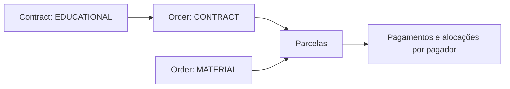

# Contratos — investigação do modelo de domínio

Refinamento: [decisões financeiras confirmadas](./FINANCIAL_DECISIONS.md). Pendências e
entregas futuras: [issue #115](https://github.com/josiasrfreitas/lazuli/issues/115).

Status: em discussão, sem decisão arquitetural aceita ou autorização de implementação.
Data: 2026-09-22.

Este documento acompanha a etapa de esclarecimento do design-flow. Registra o relato do
stakeholder, evidências do código e propostas separadamente; não substitui o brief ou os ADRs.

Diagrama complementar: [FINANCE_ER.md](./FINANCE_ER.md). Ele apresenta o modelo alvo e
identifica separadamente as propostas de cardinalidade e os campos ainda não implementados.

## Escopo já esclarecido

- Tabela de contratos, criação e conexão com a etapa 3 de Novo aluno.
- Nomes conceituais confirmados: `Contract`, inicialmente do tipo educacional (`EDUCATIONAL`),
  e `Order` para o compromisso financeiro. Um `Order` originado de contrato tem tipo
  `CONTRACT`; material tem tipo `MATERIAL`, sem entidade
  separada `MaterialSale`. Fatura e experiência consumer-facing não fazem parte deste épico.
- Complemento confirmado durante a IA: haverá também uma entidade `Material`, para outros
  propósitos e para fornecer dados ao financeiro. A venda continua representada por `Order`
  de tipo `MATERIAL`; o modelo financeiro discutido permanece. Campos, responsabilidades
  adicionais, relações e experiência de material ficam em aberto por pedido do usuário,
  até o esclarecimento de requisitos. Não inferir catálogo, estoque ou cardinalidades.
- Confirmado em 23/09/2026: o preço de venda do material é tabelado e será uma configuração
  global da escola por enquanto. A entidade Material continua pendente; não inferir regras
  de desconto, exceção, atualização de preços ou markup a partir dessa confirmação.
- Cada contrato tem exatamente um beneficiário. Essa decisão substitui a seleção múltipla
  discutida anteriormente; um pagador pode responder por vários contratos individuais.
- Fonte das partes confirmada na IA: `Contract` guarda `payerId` e `studentId`. Orders
  contratuais usam o `contractId` para obter essas partes, sem duplicá-las. Orders independentes,
  como material, guardam suas próprias referências. O módulo Finance resolve ambos os casos
  para os consumidores. Schema, restrições e migração ainda serão detalhados.
- Fluxo de pagador confirmado na IA: buscar e reutilizar um cadastro existente ou cadastrar
  um novo no próprio modal. Incluir CPF/RG opcional no pagador, conforme confirmação posterior.
  Seguir tipo de documento e número, como em Alunos; não exigir ambos os documentos.
  O schema atual tem apenas `Payer.taxId` opcional, sem tipo.
  A evolução deve preservar os dados existentes, sem presumir que todo `taxId` é CPF.
- Cadastro em lote fica fora desta vertical por decisão do usuário. Novo aluno cadastra
  uma pessoa por vez, com contrato individual opcional na etapa financeira.
- Análises de pacotes e futuras políticas de desconto podem agregar contratos pelo pagador.
  Políticas de bundle ficam fora desta vertical.
- Foco no compromisso financeiro. Anexo, geração de PDF e assinatura estão fora por enquanto.
- Refinamento na IA: o registro de rompimento ficará na futura página do contrato, em área
  menos exposta por ser uma ação destrutiva. Não construir esse fluxo na listagem atual;
  preservar as regras de desistência discutidas para orientar a entrega futura.
- A listagem consumirá o contrato genérico de filtros em desenvolvimento separado.
- Uma tela de Ajustes permitirá configurar as regras comerciais com acesso restrito a um
  novo papel `SYSTEM_ADMIN` (Administrador do sistema), nome adotado na conversa.
- Juros e multa seguem os percentuais definidos em Ajustes. O `SYSTEM_ADMIN` também define
  o teto da mensalidade e o desconto máximo em percentual. O piso é calculado a partir deles:
  teto de R$ 250 e limite de 20% resultam em R$ 200. O vendedor negocia o plano inteiro
  respeitando esse piso no valor final em dia, inclusive após desconto de pontualidade.
- Esclarecimento em 23/09/2026: o vendedor negocia mensalidade e desconto de pontualidade
  no contrato. A configuração define o limite mínimo da negociação; não fixa o percentual
  de pontualidade. A combinação negociada precisa respeitar o piso no valor final em dia.
  Juros e multa continuam seguindo Ajustes. Isso não cria um papel de acesso SELLER.
- Descontos comerciais pontuais na primeira mensalidade ou em quaisquer parcelas específicas
  ficam fora do escopo até haver necessidade concreta. O desconto de pontualidade permanece
  uma condição distinta, já prevista.
- Período e duração do contrato são definidos pelo usuário. Não automatizar enquadramento
  financeiro por semestre, data de prova, nível do aluno ou modalidade da turma.
- Refinamento confirmado em 23/09/2026: duração em meses inteiros e dia de vencimento fixo
  ao longo do plano. A entrada de vigência usa início e duração, com fim calculado;
  o principal é duração em meses × mensalidade nominal negociada. A primeira cobrança
  continua independente da vigência. O plano comum tem uma parcela por mês contratado;
  parcelamento especial redistribui o mesmo principal sem mudar a duração do serviço.
- Vencimento pode ser escolhido em qualquer dia do mês por contrato. Não há configuração
  global de vencimentos; a configuração global mencionada pelo usuário é o preço do material.
  Confirmado: se o dia escolhido não existir, usar o último dia daquele mês. Os vencimentos
  seguintes voltam ao dia original; não propagar o ajuste de fevereiro aos meses posteriores.
- O operador informa a data da primeira cobrança conforme o acordo. Entrada do aluno,
  fechamento do contrato e primeira cobrança são datas distintas. Não calcular uma primeira
  mensalidade proporcional a partir da entrada do aluno nem derivar a primeira cobrança do
  fechamento do contrato.
- Renovação, recorrência entre anos e facilitadores de rematrícula terão planejamento próprio;
  não fazem parte deste épico. Cada contrato registra o período efetivamente acordado.
- Na desistência de contrato totalmente quitado, encerrar sem multa adicional, reembolso ou
  crédito. Essa simplificação foi definida pelo usuário para o escopo atual.
- O fluxo comum usa período e mensalidade negociada dentro da faixa autorizada, aplicada ao
  plano inteiro. Pagamento em duas, três ou outras
  quantidades especiais de parcelas fica em uma expansão avançada do formulário.
- Permitir registro pontual do markup informado na venda de material, junto ao valor e ao
  recebimento. Não representar custo de aquisição nesta vertical. O módulo de despesas e
  sua integração com vendas serão planejados futuramente.
- Taxas, acréscimos e repasses de cartão ficam fora desta vertical por decisão do usuário.
  Serão tratados quando o sistema assumir a responsabilidade pelo billing. O escopo atual
  registra o material, seu valor, a forma de pagamento e a quitação.

## Relato de negócio

- Material é vendido à vista ou no cartão. A escola relata receber integralmente de imediato.
  O usuário esclareceu que as taxas do cartão são repassadas ao pagador, permitindo simplificar
  o fluxo. Em seguida, definiu que o tratamento dessas taxas pertence ao futuro billing.
- Mensalidade exemplificada em R$ 250, com R$ 230 se paga até o vencimento: desconto de
  pontualidade de 8%, configurado como taxa, não como quantia fixa.
- A faixa comercial é um intervalo de preço autorizado, não margem de lucro ou markup.
  O valor negociado vale para o plano inteiro; não negociar valores diferentes mês a mês.
- O desconto máximo da faixa é uma proporção do teto: `(250 - 200) / 250 = 20%`.
  Com teto de R$ 300 e o mesmo limite de 20%, o piso passa a R$ 240. Não manter o piso
  como valor independente da configuração percentual. O usuário confirmou que o piso vale
  para o valor efetivamente cobrado em dia; a combinação de descontos não pode ultrapassá-lo.
- Encargos confirmados pelo usuário: dois componentes cumulativos de juros simples, 1% ao dia
  e 2% por mês completo de atraso. Após pagamento parcial, a base passa ao saldo restante,
  conforme refinamento posterior; os valores citados são exemplos configuráveis. Não há capitalização nem
  proporcionalidade do componente mensal em frações de mês. Mês completo é contado pelo
  aniversário mensal do vencimento, conforme escolha explícita do usuário.
- Desistência gera multa sobre o valor nominal das parcelas vincendas, sem desconto de
  pontualidade: no exemplo, a base usa R$ 250 por parcela. O percentual da multa deve ser
  configurável; 20% é o exemplo informado, não uma constante fixa da regra.
- Compromisso normalmente anual, pago mensalmente; à vista ou em menos parcelas é possível.
- Turmas regulares seguem conteúdo e calendário comuns; a entrada costuma ser negociada até
  perto da primeira prova, considerando o nível e eventual recuperação com aulas extras.
  Turmas personalizadas permitem entrada em qualquer momento, com períodos de contrato de um
  ano conforme esclarecido pelo usuário. São informações de contexto,
  não novas validações automáticas de matrícula nesta vertical.
- O calendário de cobrança pode atravessar dezembro e chegar, por exemplo, a fevereiro,
  incluindo janeiro. Datas de entrada e negociação podem levar o aluno ao período acadêmico
  atual ou seguinte; não converter os meses citados em cortes fixos no sistema.
- Valores, condições e multa de desistência são individuais por contrato e beneficiário.
  Compartilhar pagador não une os compromissos nem transfere a multa entre alunos.
- Para a operação descrita, distinguir compromissos futuros de valores vencidos em atraso.
  Isso não estabelece uma conclusão jurídica ou de reconhecimento contábil de receita.

## Evidências atuais

| Elemento                    | Capacidade e limite observados                                                                                              |
| --------------------------- | --------------------------------------------------------------------------------------------------------------------------- |
| `Order`, `OrderBeneficiary` | Um pagador, vários alunos, um tipo e um principal agregado; sem preço ou período por beneficiário.                          |
| `Installment`               | Valor e vencimento, com ajustes e alocações; permite registrar o cronograma financeiro.                                     |
| `generateInstallments`      | Divide um principal em parcelas mensais; quantidade determina o comprimento do cronograma. Não modela a duração do serviço. |
| `FinanceSettings`           | Taxa mensal global de juros; sem condições comerciais preservadas por contrato.                                             |
| `InstallmentAdjustment`     | Juros, multa e desconto em centavos; registra um resultado, sem definir a política que o produz.                            |
| `deriveInstallmentLedger`   | Juros aparecem como prévia separada do saldo; cancelamento do pedido zera o saldo cobrável inclusive de parcelas vencidas.  |
| `deriveOrderLedger`         | Saldo inclui parcelas futuras; saldo zero resulta em `COMPLETED`, sem duração de serviço independente.                      |
| `ledger-read`               | Exclui pedidos cancelados; recebido mensal deriva de alocações, não de repasses líquidos de adquirente.                     |
| `PaymentEntry`              | Um valor de pagamento; sem decomposição de taxas ou liquidação da adquirente.                                               |

Fontes locais: `packages/db/prisma/schema.prisma`,
`packages/domain/src/installment-generation.ts`, `packages/domain/src/finance-ledger.ts`,
`packages/api/src/finance/internal/ledger-read.ts` e
`packages/api/src/finance/internal/installment-actions.ts`.

O código e o schema ainda permitem vários beneficiários por pedido. A regra individual foi
confirmada para o planejamento e atualizada no glossário; sua implementação deverá ajustar a
cardinalidade e a validação. Verificar eventuais registros existentes com vários beneficiários
antes de definir migração; não dividir ou reatribuir valores históricos automaticamente.

## Direção proposta, pendente de validação

Reaproveitar pagadores, beneficiários, parcelas, pagamentos, alocações e ajustes. Evoluir as
regras no domínio/API; uma adaptação apenas visual produziria divergências em saldo,
cancelamento, relatórios e recebimentos.

Separar os seguintes conceitos, sem decidir ainda a quantidade de tabelas:

1. **Contract:** um beneficiário, pagador, tipo, vigência acordada e condições comerciais
   aplicáveis. O tipo educacional define mensalidade, desistência e multa.
2. **Cronograma financeiro:** valores e vencimentos combinados, inclusive pagamentos antecipados
   ou concentrados em menos parcelas. Pode ser gerado desde o início.
3. **Cobrança e quitação:** valor base, descontos/encargos aplicados e pagamentos alocados.
4. **Order de material:** valor do material, forma de pagamento e quitação registrada.
   Incluir o registro pontual do markup informado, com proposta detalhada abaixo.
   Cálculo/cadastro de taxas, acréscimos do cartão e conciliação de repasses pertencem ao futuro
   billing. Não adicionar esses campos nem depender de extratos da adquirente nesta vertical.

O usuário definiu `Contract` como nome do acordo, com educacional como tipo. `Order` continua
como compromisso financeiro: o contrato origina o `Order` de tipo `CONTRACT`, enquanto material
é registrado diretamente como `Order` do tipo `MATERIAL`. A distinção permite reaproveitar
o motor financeiro sem atrelar toda cobrança à vigência de um contrato. A nomenclatura foi
atualizada no glossário; a estrutura física e as operações ainda serão detalhadas no plano.

Os tipos pertencem a níveis diferentes: `Contract` é `EDUCATIONAL`; o `Order` vinculado é
`CONTRACT`, sem repetir o subtipo educacional. No código atual, existe `OrderKind.TUITION`;
a passagem para o tipo `CONTRACT` pertence à futura implementação e exige tratar dados e
consumidores existentes. Não renomear registros históricos ou migrations aplicadas neste plano.

Confirmado em 23/09/2026: preservar no contrato o preço negociado e os percentuais de
pontualidade, juros e multa aplicáveis na contratação. Alterações futuras nos Ajustes valem
para novos contratos e não recalculam contratos anteriores.
O usuário definiu uma tela de Ajustes restrita a `SYSTEM_ADMIN`. Juros e multa seguem essa
configuração. O vendedor negocia o valor mensal do plano inteiro dentro da faixa autorizada.
Não há desconto comercial pontual por parcela. Validar a faixa e as condições no servidor,
sem confiar somente nas restrições do formulário.

Confirmado: `piso = teto × (1 - descontoMáximo)`, com percentual representado como fração
nessa fórmula. O piso limita o valor final em dia, após os descontos aplicáveis. Com teto
de R$ 250 e limite de 20%, negociar R$ 200 e aplicar outros 8% resultaria em R$ 184 e viola
o limite; R$ 225 com 8% resulta em R$ 207 e o respeita. O cálculo monetário e a validação
do piso precisam usar a mesma convenção de arredondamento.

A apresentação de negociação e pontualidade deve tornar o valor final explícito no formulário.
Preservar o nominal contratado; após pagamento parcial, juros usam o saldo restante. A multa
continua baseada no nominal futuro abrangido. Preservar também o desconto de pontualidade
e os limites aplicáveis no momento da contratação.
Cada regra precisa de taxa, base, condição de aplicação, periodicidade quando pertinente e
arredondamento definido. Taxa percentual e valor monetário efetivamente aplicado coexistem:
guardar o resultado em centavos permite explicar a quitação e preservar seu histórico.

Para o atraso confirmado, preservar separadamente a taxa diária e a mensal. Sem pagamentos
parciais, e usando as taxas de exemplo, com base original
`P`, dias de atraso `d` e meses completos de atraso `m`, os juros são
`P × (0,01 × d + 0,02 × m)`. `m` conta aniversários mensais completos do vencimento,
sem proporcionalidade e sem blocos fixos de 30 dias. Exemplo: vencimento em 10/02/2027,
primeiro incremento mensal em 10/03/2027 e segundo em 10/04/2027. Cada aniversário é
referenciado ao vencimento original; os juros não incidem sobre juros acumulados.
Na IA, qualquer dia foi permitido para o cronograma, com ajuste ao último dia nos meses curtos
e preservação do dia original. Essa mesma convenção foi confirmada para aniversários de juros.
Após pagamento parcial, juros incidem no saldo restante, sem capitalização. A fórmula acima
não pode ser aplicada ao original durante todo o período nesse caso; detalhar alocação e
períodos no planejamento técnico, conforme issue #115.

Recomendação para desistência: registrar um encerramento com data efetiva, preservar cobranças
anteriores devidas, encerrar cobranças futuras abrangidas e registrar a multa separadamente.
O estado do serviço e a situação financeira precisam poder divergir.

## Períodos escolhidos pelo usuário

Decisão de produto: o usuário define período e duração do contrato conforme o acordo com a
escola. O sistema não decide se a entrada cabe no semestre, se exige reposição pedagógica ou
se a cobrança deve terminar em dezembro. A decisão aceita 0005 já separa calendário acadêmico
e comercial; a 0009 separa matrícula operacional de progresso pedagógico.

Proposta de formulário:

- **Vigência:** início e duração em meses inteiros, com fim calculado, conforme refinamento
  confirmado na IA. Não manter início, fim e duração como três entradas independentes.
- **Mensalidade:** exibir a faixa autorizada e permitir negociar um valor mensal para o
  plano inteiro; total nominal = duração em meses × mensalidade nominal. Preservar o valor
  acordado. Em Ajustes, o `SYSTEM_ADMIN`
  informa teto e desconto máximo percentual; o formulário apresenta o piso derivado e o
  valor final em dia. A faixa é global para a escola, conforme confirmação do usuário.
  Essas configurações são pontos de partida; só modelar regras mais complexas quando
  surgirem requisitos concretos, sem antecipar segmentação por modalidade.
  Não disponibilizar desconto comercial avulso na primeira parcela ou nas seguintes.
- **Plano de pagamento:** primeira cobrança informada pelo operador e distribuição mensal
  como caminho comum, com calendário para revisão. A data segue o acordo, independentemente
  da entrada do aluno ou do fechamento do contrato. A expansão avançada permite outras
  quantidades de parcelas; altera a distribuição dos pagamentos, preservando período e valor
  do acordo. Não gerar pró-rata automático de entrada com base nos dias restantes do mês.
- **Contexto acadêmico:** quando disponível, mostrar turma e período para orientar a decisão
  humana, sem preencher ou bloquear automaticamente o calendário comercial com base neles.

Validação proposta: datas válidas, fim posterior ao início e coerência dos valores/parcelas.
Não impor dezembro como limite, omitir janeiro ou exigir que a última parcela coincida com
o fim do semestre. A relação entre a última parcela e o fim da vigência comercial ainda deve
ser apresentada claramente ao usuário, sem presumir que ambos significam a mesma coisa.

Lacuna atual: `deriveFirstDueDate` deriva o primeiro vencimento de `startDate` e `dueDay`,
sempre após `startDate`. O plano deve aceitar a primeira cobrança explicitamente acordada,
separada da vigência e do fechamento, sem reaproveitar um campo com dois significados. A entrada de vencimento
deverá aceitar qualquer dia do mês, conforme confirmado na IA; hoje o motor aceita apenas
5, 10, 15, 20 e 25. Para meses mais curtos, usar o último dia disponível, retornando ao dia
original nos seguintes, conforme confirmação da IA. Não recalcular cada mês a partir da data
ajustada do mês anterior.

## Proposta conceitual: contrato, mensalidade e material

O recorte abaixo descreve o compromisso financeiro da venda. Não representa a totalidade
do domínio de material: a entidade `Material` foi confirmada durante a IA e será detalhada
posteriormente. Sua existência não cria uma entidade `MaterialSale` nem substitui `Order`.
As propostas de campos e apresentação do material aguardam esse refinamento.

Os nomes `Contract` e `Order` foram definidos pelo usuário. A tabela descreve as responsabilidades
conceituais; cardinalidades detalhadas e persistência ainda serão fechadas no planejamento.

| Conceito             | Informação própria                                                                        | Relação proposta com o motor atual                                                                     |
| -------------------- | ----------------------------------------------------------------------------------------- | ------------------------------------------------------------------------------------------------------ |
| `Contract`           | Tipo `EDUCATIONAL`, aluno, pagador, vigência, mensalidade nominal e condições contratadas | Origina `Order` do tipo `CONTRACT`; vigência e preço mensal não são deduzidos das parcelas financeiras |
| `Order`              | Tipo, valor e plano; partes obtidas do contrato ou diretas em obrigações independentes    | `CONTRACT` para compromissos de contratos e `MATERIAL` para material, usando o mesmo motor financeiro  |
| Detalhes de material | Descrição do material/kit e markup informado                                              | Dados específicos de `Order` com tipo `MATERIAL`; não representam outra entidade de venda              |
| Parcela e quitação   | Valor, vencimento, ajustes e pagamentos alocados                                          | Reaproveitar `Installment`, `PaymentEntry` e `PaymentAllocation`                                       |

Os tipos `CONTRACT` e `MATERIAL` compartilham o motor de `Order`, com valores e regras
próprios. `Order` do tipo `CONTRACT` referencia o contrato que o originou. Um `Order` de
material pode opcionalmente referenciar o contrato que o contextualizou.
Recomenda-se que
material não entre no valor-base da multa de desistência nem receba automaticamente o
desconto de pontualidade da mensalidade. A localização da venda no formulário ainda está aberta.
O pagamento no cartão quita a obrigação de material com a escola; as parcelas na fatura do
cartão não se tornam cobranças mensais do aluno no Lazuli.

Para o registro pontual, propor descrição do material/kit, preço de venda e markup informado.
O pagamento mantém valor recebido, data e forma de pagamento. O usuário explicitamente excluiu
o registro de custo de aquisição: não adicionar esse campo, entidade, fluxo ou dependência.
Não exigir catálogo, estoque ou contas a pagar para registrar o recebimento.

Recomenda-se representar o markup como percentual informado e preservar esse percentual na
venda. Sob a definição de markup como acréscimo percentual sobre a base de aquisição, a parte
do preço atribuída ao markup pode ser calculada diretamente: `ganho = venda × m / (1 + m)`,
com `m` em fração. Venda de R$ 120 e markup de 20% resultam em ganho estimado de R$ 20.
Não aplicar 20% diretamente ao preço de venda: isso corresponderia a margem sobre venda.
Fonte dos conceitos: [Sebrae — markup e margem](https://blog.rn.sebrae.com.br/markup/).

O recebimento total continua registrado integralmente; o ganho estimado com base no markup
é uma leitura separada. Markup não informado significa ganho desconhecido, não que todo o
recebimento seja lucro. A unidade e apresentação do campo ainda podem ser confirmadas no brief.

Despesas, custo efetivo e apuração de lucro líquido pertencem ao módulo futuro. Nenhum custo
calculado a partir do markup será persistido como fato de aquisição ou lançado como despesa.
A futura apuração deverá distinguir essa estimativa dos custos efetivamente registrados.

### Desistência de contrato totalmente quitado — resolvido

O usuário definiu que, quando o compromisso estiver totalmente quitado, a desistência não
gera multa adicional, reembolso nem crédito. Registrar o encerramento e preservar os
pagamentos e a quitação, sem calcular devolução pelo período não estudado.

Exemplo: contrato de 12 meses a R$ 250/mês, pago em três vezes de R$ 1.000 e integralmente
quitado. Desistência após seis meses encerra o contrato; nenhum novo valor é cobrado ou
devolvido. A proposta anterior de calcular R$ 300 de multa e R$ 1.200 de crédito foi descartada.

O caso de contrato quitado não depende de implementar reembolsos para suportar o parcelamento
avançado. Para compromissos não quitados, permanece a regra de multa configurável sobre o
nominal das parcelas vincendas, com preservação das vencidas devidas.

### Entrada no meio do mês — resolvido

A entrada no meio do mês não cria uma regra de cobrança proporcional. O operador registra
a primeira cobrança acordada, separada da data de fechamento do contrato e da entrada do
aluno. Removida a proposta de escolher entre mensalidade integral ou pró-rata por data de entrada.

## Cenários que precisam fechar o modelo

- R$ 250 pagos por R$ 230 no prazo: desconto de 8% aplicado e saldo zero, inclusive se o boleto
  for conciliado depois do vencimento. Usar a data efetiva informada pelo operador, com autoria
  e data do registro, sem exigir comprovante nesta etapa.
- Pagamento parcial: pontualidade exige completar o valor com desconto até o vencimento.
  Juros após pagamento parcial incidem no saldo restante. Alocação e períodos de cálculo
  devem ser detalhados sem alterar essas decisões.
- Duas parcelas vencidas e seis futuras na desistência: a base nominal das seis futuras é
  R$ 1.500 e, com taxa configurada em 20%, a multa é R$ 300. Definir a data efetiva de corte
  e preservar as vencidas devidas; o desconto de pontualidade não reduz a base da multa.
- Material de R$ 600 pago no cartão: registrar quitação dos R$ 600 de material sem transformar
  o parcelamento do cartão em mensalidades devidas à escola. Taxas externas ficam fora do fluxo.

## Ajustes e papel privilegiado

Confirmado: haverá uma tela de Ajustes, acessada por `SYSTEM_ADMIN` (Administrador do sistema).
O percentual da multa de desistência, o teto da mensalidade e o desconto máximo percentual
serão configuráveis nessa tela; os demais campos serão delimitados no brief.

Proposta de permissões: o novo papel recebe acesso às operações de `ADMIN` e aos Ajustes;
`ADMIN` mantém o acesso operacional. O ator de vendas negocia o valor mensal do plano
dentro da faixa; não foi solicitado um novo papel `SELLER`. Proposta: essa atividade usa o
acesso operacional existente. Juros e multa vêm dos Ajustes, sem substituição no formulário.
Descontos comerciais pontuais por parcela ficam fora do escopo.

Evidência: atualmente só `ADMIN` e `TEACHER` são habilitados para autenticação; `SECRETARY`
e `FINANCE` existem no enum, mas não estão habilitados. O middleware usa listas explícitas,
sem herança automática de papéis. Introduzir o novo papel exigirá atualizar autenticação,
permissões da API, verificações de escopo, proteção das páginas e navegação de forma coerente.
Fontes: `packages/auth/src/staff-access.ts`, `packages/api/src/trpc/init.ts`,
`packages/api/src/trpc/rbac.ts` e `apps/web/src/components/app-shell/nav-items.ts`.
A decisão 0004 deixa o conjunto de papéis como escopo de produto, sem fixar essa lista.

O provisionamento inicial do papel e quem pode concedê-lo precisam ser definidos. Acesso aos
Ajustes deve ser verificado no servidor; a atribuição do novo papel não pode permitir que um
administrador operacional obtenha por conta própria os privilégios restritos.

## Cenário resolvido: alunos com o mesmo pagador

Dois irmãos têm contratos individuais vinculados ao mesmo pagador. Se um desistir, o
encerramento e a multa incidem somente sobre seu contrato; o contrato do outro continua.
O pagador permite consultar ou agregar os compromissos, sem exigir preço por beneficiário
dentro de um contrato coletivo. Cada aluno e contrato é cadastrado individualmente nesta vertical.

## Termos pesquisados para cartão

Referência para o futuro billing, fora do escopo e das dependências desta vertical.

- **MDR / taxa de desconto do lojista:** taxa cobrada do estabelecimento pela aceitação do
  cartão. Fonte: [Banco Central](https://bcb.gov.br/detalhenoticia/544/noticia).
- **Antecipação de recebíveis:** recebimento antes do prazo originalmente previsto, que pode
  ter custo próprio. Não presumir que todo pagamento no crédito liquide imediatamente.
- **Liquidação / repasse líquido:** recebimento pela escola, com valores, descontos e datas
  próprios. Fonte: [conceitos financeiros da Cielo](https://docs.cielo.com.br/extrato-webview/docs/conceitos-financeiros).

Quando o billing entrar em escopo, a adquirente e o extrato da escola poderão esclarecer as
taxas aplicáveis. Essa investigação não bloqueia o planejamento atual.

## Próximas decisões

Definir data de corte na desistência;
detalhar a relação entre `Contract` e `Order`;
fechar permissões e provisionamento do novo papel. A preservação das condições contratadas
após alterações nos Ajustes foi confirmada durante a IA.
Depois fechar o cadastro individual e retomar brief, IA e tarefas.

Atualização da fase 3: brief concluído e IA em andamento. O detalhamento da entidade `Material`,
de sua integração com a venda e da apresentação de material/markup aguarda os requisitos do
usuário; não bloqueia as decisões independentes do contrato educacional.
