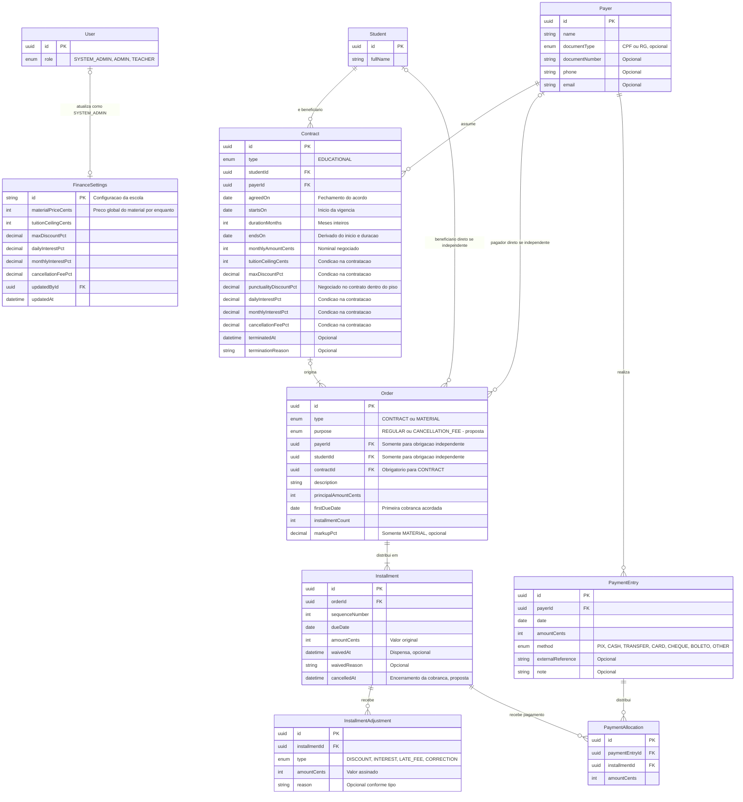

# Finance — modelo conceitual proposto

Refinamento: [decisões financeiras confirmadas](./FINANCIAL_DECISIONS.md). Pendências e
entregas futuras: [issue #115](https://github.com/josiasrfreitas/lazuli/issues/115).

Este é o modelo alvo em discussão, não o schema Prisma atual. Reúne as decisões registradas
em [DOMAIN_MODEL.md](./DOMAIN_MODEL.md) e propostas explícitas para completar as relações.
Valores monetários estão em centavos; percentuais usam escala percentual (`20` significa 20%).
Campos repetitivos de auditoria e exclusão lógica foram omitidos do desenho.

Atualização durante a IA: o usuário confirmou uma entidade `Material`, adicional ao `Order`
que representa sua venda. Ela terá outros propósitos e fornecerá dados ao financeiro.
O modelo financeiro abaixo permanece; a entidade `Material` e suas relações não estão
desenhadas porque seus requisitos foram explicitamente deixados em aberto. A ausência no
diagrama não significa que o material será modelado somente como campos do pedido.

O preço de venda do material foi confirmado como tabelado e global por enquanto em 23/09/2026.
O desenho o representa em FinanceSettings; `Order.principalAmountCents` continua representando
o valor do compromisso financeiro da venda. A confirmação não define markup, descontos,
exceções ou os demais campos/relações da entidade Material.

## Leitura das relações

- CPF/RG opcional do pagador é requisito confirmado durante a IA. O desenho usa tipo e número,
  seguindo Alunos, sem exigir ambos os documentos. No schema atual,
  `Payer` tem apenas `taxId` opcional; sua migração precisa preservar os valores sem inferir
  que todos são CPF.
- Cada `Contract` tem um pagador e um beneficiário. Ambos podem participar de vários contratos.
- Cada `Order` tem um pagador e um beneficiário efetivos. O tipo `CONTRACT` exige vínculo com
  `Contract` e obtém as partes dele, sem duplicar seus IDs no pedido. `MATERIAL` tem referências
  próprias e pode existir independentemente. Um eventual vínculo contextual de material com
  contrato não substitui suas partes nem aplica automaticamente regras de mensalidade.
- Proposta de cardinalidade: cada contrato origina um `Order` regular e pode originar outro
  para multa de desistência. Por isso o desenho permite vários pedidos por contrato.
- Cada pedido possui uma ou mais parcelas. Cobrança única é uma parcela.
- `PaymentEntry` registra quanto o pagador pagou. `PaymentAllocation` registra quanto desse
  pagamento quitou de cada parcela. Um pagamento pode atender vários pedidos do mesmo pagador,
  e uma parcela pode receber vários pagamentos.
- `FinanceSettings` é a configuração atual da escola. A linha com `User` representa o último
  editor; a permissão `SYSTEM_ADMIN` é uma regra da aplicação, não uma restrição da FK.

## Condições contratuais e recebimentos

Confirmado na IA: início e duração em meses inteiros definem a vigência; `endsOn` representa
o resultado calculado no desenho conceitual, não uma terceira entrada independente. A escolha
de persistir ou derivar esse resultado será detalhada no plano. Confirmado: início em
15/03/2026 por 12 meses encerra em 15/03/2027; diferenças de centavos vão à última parcela.
O principal regular é `durationMonths × monthlyAmountCents`. `installmentCount` descreve
a distribuição financeira e pode ser diferente da duração. O vencimento mantém dia fixo,
com primeira cobrança explícita. Qualquer dia do mês pode ser escolhido por contrato; não há
configuração global de dias permitidos. Se o dia não existir em um mês, o vencimento usa
o último dia disponível e os seguintes voltam ao dia original. Gerar cada vencimento a partir
do mês correspondente e do dia de referência, sem encadear os ajustes de meses anteriores.

Confirmado na IA: `Contract` guarda as condições utilizadas na contratação. Os campos repetidos
entre `FinanceSettings` e `Contract` preservam os termos acordados quando Ajustes mudar. O
desenho não cria FK de contrato para uma configuração mutável como fonte de taxas históricas.
Versionamento de condições, caso necessário, pode ser decidido posteriormente.

O teto e o desconto máximo produzem o piso: `teto × (1 - percentual / 100)`. O valor final
em dia, após os descontos aplicáveis, deve respeitar esse piso. A faixa é global para toda
a escola, conforme confirmação do usuário. As configurações são pontos de partida simples;
modelar regras mais complexas somente quando houver requisitos concretos, sem antecipar
segmentação por modalidade ou um motor de regras.

O vendedor negocia a mensalidade e a pontualidade no contrato, respeitando esse limite.
`punctualityDiscountPct` pertence às condições negociadas do Contract, não a uma taxa fixa
de FinanceSettings. Juros e multa seguem as configurações da escola. O contrato preserva
tanto os termos negociados quanto as condições configuradas aplicáveis na contratação.

O valor original da parcela, os ajustes e os pagamentos alocados são fatos financeiros.
Saldos, atraso, quitação e progresso são calculados a partir deles; não há uma tabela de
saldo ou fatura. Uma prévia de juros não pode ser somada novamente se já estiver representada
por ajuste aplicado. O fechamento dos cálculos precisará explicitar essa distinção.

O desconto de pontualidade é uma condição contratada; `InstallmentAdjustment.DISCOUNT` pode
registrar seu efeito na quitação. A existência desse tipo no motor não autoriza descontos
comerciais ad hoc por parcela no formulário desta vertical.

`LATE_FEE` já existe no motor para multa de atraso. Os 2% mensais definidos nesta descoberta
são juros simples por aniversário do vencimento, não essa multa. A multa de desistência é
outra origem de cobrança, representada pela proposta de `Order.purpose` abaixo.

## Localização de pagador e beneficiário — confirmada na IA

**Contract é a fonte das partes do acordo**, com `payerId` e `studentId` próprios. Orders
contratuais, incluindo multa, obtêm as partes pelo `contractId`. Pedidos independentes,
como venda de material, guardam suas próprias referências. A decisão evita duplicar os IDs
entre contrato e pedidos originados dele; não depende de um pedido principal para identificar
as partes do contrato.

O diagrama representa as referências diretas do Order como opcionais porque elas não são
usadas no ramo contratual. Isso não torna pagador ou beneficiário efetivos opcionais:

- `CONTRACT`: contrato obrigatório, referências diretas de pagador/aluno ausentes.
- `MATERIAL`: pagador/aluno diretos obrigatórios. Eventual vínculo contextual com contrato
  não muda a fonte das partes da venda; seu detalhamento continua adiado.

O módulo Finance resolve essas partes para consultas e operações financeiras, inclusive
validação de pagamentos do mesmo pagador. Não usar simplesmente uma preferência por IDs
diretos quando presentes: um pedido contratual com fontes conflitantes deve ser inválido.
A implementação deve impor os ramos válidos e entregar uma forma uniforme aos consumidores.
Restrições físicas, migração e tratamento dos tipos/dados existentes serão detalhados nas
tarefas técnicas. Não renomear ou reatribuir registros históricos automaticamente.

Mudança das partes do contrato não faz parte da edição geral desta vertical; uma futura
operação deve preservar a atribuição histórica de cobranças e pagamentos.

## Propostas que o desenho acrescenta

1. **Multa como outro Order do tipo CONTRACT:** `purpose = CANCELLATION_FEE` diferencia sua
   origem do pedido regular. Permite gerar uma parcela própria, manter o vínculo com o
   contrato e não alterar o principal histórico das mensalidades. Deve existir no máximo
   um pedido regular e um pedido de multa por encerramento, com proteção contra duplicidade.
   Essa representação ainda precisa ser validada; o escopo não prevê um motor genérico de
   finalidades ou um catálogo de novos tipos.
2. **Encerramento por parcela:** `Installment.cancelledAt` distingue cancelamento de obrigação
   futura de dispensa voluntária (`waivedAt`). O encerramento de `Contract` não zera
   automaticamente parcelas vencidas. A aplicação do corte e os pagamentos parciais ainda
   precisam de especificação. Contrato totalmente quitado encerra sem multa, crédito ou reembolso.
3. **Um beneficiário efetivo por Order:** substituir a cardinalidade múltipla atual por uma
   referência única: pelo Contract nos pedidos contratuais e direta nos independentes,
   conforme a decisão acima. A migração dos registros existentes ainda será avaliada.
4. **Parâmetros do plano no Order:** `firstDueDate` e `installmentCount` descrevem o plano
   acordado e usado pelo motor; as parcelas preservam o calendário efetivamente gerado.
   A primeira cobrança é independente de `agreedOn`, vigência e entrada do aluno.

## Invariantes a preservar

- Um `Order` de tipo `CONTRACT` obtém pagador e beneficiário exclusivamente do contrato.
- Cada alocação relaciona pagamento e parcela do mesmo pagador.
- A soma das alocações não excede o pagamento; eventual saldo não alocado permanece no pagamento.
- `(paymentEntryId, installmentId)` e `(orderId, sequenceNumber)` devem ser únicos.
- O plano inicial de parcelas soma o principal do pedido. Ajustes posteriores preservam
  o valor original e explicam as diferenças.
- Markup pertence somente a pedidos de material. Não há campo ou entidade de custo,
  despesas, taxas de cartão, estoque ou renovação neste recorte.
- A atualização de Ajustes vale para novas contratações e não altera condições ou valores
  de contratos já estabelecidos. A preservação dos termos por contrato foi confirmada na IA.

## Relação com a implementação atual

Já existem `Payer`, `Order`, `Installment`, `InstallmentAdjustment`, `PaymentEntry`,
`PaymentAllocation`, `FinanceSettings`, `Student` e `User`. O diagrama acrescenta `Contract`
e propõe mudanças de campos/relações nas entidades existentes.

O schema atual usa `OrderKind.TUITION`, permite múltiplos beneficiários via `OrderBeneficiary`
e tem somente juros mensais em `FinanceSettings`. Ainda não existem o tipo `CONTRACT`,
o papel `SYSTEM_ADMIN`, os dados de markup, a configuração comercial completa ou os campos
propostos de encerramento por parcela e finalidade do pedido. Nenhuma migration foi criada.

`SECRETARY` e `FINANCE` existem como papéis ainda desabilitados; foram omitidos do enum
resumido no desenho. Auditoria transversal e `GeneratedArtifact` também foram omitidos;
os artefatos existentes não introduzem anexo, PDF ou fatura no escopo desta vertical.
