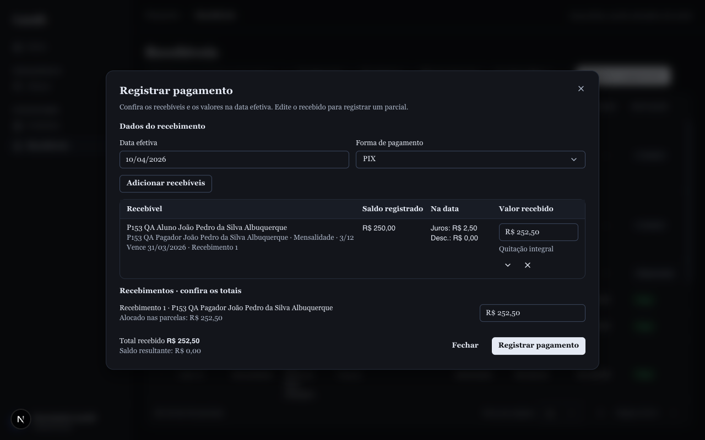
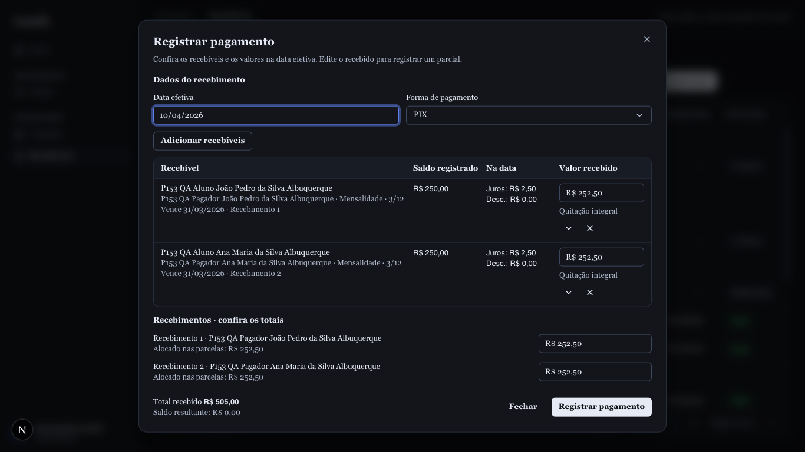
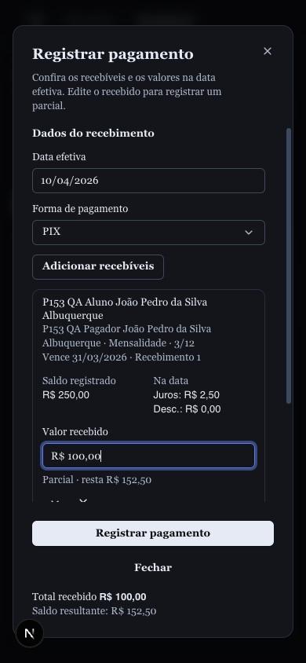

# #153 — Evidências de verificação

## Regras financeiras e persistência

- Exemplos independentes do plano: encargos de R$ 10,00 / R$ 30,40 / R$ 35,70;
  quitação final de R$ 735,70; pontualidade cumulativa e centavos residuais.
- Integração: prévia sem escrita, parciais sucessivos, transação revertida, lote
  rejeitado integralmente por prévia antiga, vários pagadores, recebimentos separados
  do mesmo pagador, mistura de Mensalidade e Material, concorrência e retry.
- Transporte pelo adaptador real: autorização, totais, serialização e resposta
  idêntica no retry. A asserção de igualdade expôs campos internos adicionais no
  replay; corrigida a resposta para preservar o contrato original.

## Navegador local

Dados fictícios identificados por `P153 QA`, sem pagamentos sobre os registros
preexistentes. Aplicação real com Postgres e sessão administrativa. As fixtures
foram removidas após a verificação, preservando os demais dados locais.

- 1280 × 800: tabela sem rolagem horizontal; uma parcela cabe no formulário;
  foco inicial na data, Tab para forma e Enter para enviar.
- 1366 × 768: tabela sem rolagem horizontal; nomes longos quebram;
  seleção de dois pagadores preservada na página seguinte com “2 fora da vista”;
  as duas parcelas e os dois recebimentos cabem sem rolagem no formulário.
- 390 × 844: formulário sem rolagem horizontal, corpo rolável e ações visíveis;
  parcial de R$ 100 sobre saldo de R$ 380 mostra R$ 280 restantes. Na captura
  final, R$ 250 + R$ 2,50 de juros − R$ 100 deixam R$ 152,50.
- Entrada principal: busca por pagador adiciona a parcela no mesmo formulário.
  O navegador expôs um `Label` sem `Field`; corrigido e coberto por renderização
  real da busca com seus providers, verificando a associação do rótulo ao campo.
- Lote de 25 parcelas em 1280 × 800: corpo rolável sem overflow horizontal;
  rodapé entre y=715 e y=751, dentro da viewport.
- Data inválida `32/13/2026`: Enter aponta o campo e não registra. Escape fecha.
- Confirmação com data efetiva passada: dois recebimentos de R$ 252,50,
  cada um com R$ 2,50 de juros, refletidos na listagem e no banco.
- Perda de resposta após commit simulada interceptando uma única chamada fetch:
  servidor grava, navegador recebe erro. O formulário preserva o rascunho e
  bloqueia edição; “Verificar registro” recupera o resultado. Consulta ao banco
  confirmou somente dois recebimentos para essa operação, sem duplicidade.

## Limites deliberados

O rascunho é preservado ao fechar/reabrir o formulário e após falhas durante a
sessão; recarregar a página descarta o rascunho local. Não foram implementados
estorno, negociação ou formas divididas. A API antiga de recebíveis independentes
preserva sua compatibilidade de sobra não alocada; o novo fluxo bloqueia excedente.
O endpoint antigo de lote continua bloqueando contratos: o lote novo usa a
confirmação com prévia e identidade de operação.

O protótipo local permanece preservado no stash indicado no plano e na branch
`prototype/registro-pagamentos-workshop`. O PR inclui o commit preexistente de
nomenclatura `TUITION` (`dbbd7d2`) e sua migration, além da migration aditiva desta
entrega. O rollback dessa nomenclatura exige tratamento próprio dos dados.

## Gates locais

Executados um por vez; Turbo com `--concurrency=1`:

- `pnpm format:check` e `git diff --check`.
- `pnpm lint --concurrency=1`, incluindo duplicação: sem erros.
- `pnpm typecheck --concurrency=1`.
- `pnpm test:quality:changed --base origin/main`: sem erros; avisos contextuais
  revisados (loops determinísticos e guardas de tipo).
- `pnpm exec turbo run test:scripts test:component-lines test:styles test --concurrency=1`;
  após o ajuste final da busca, `pnpm -F @lazuli/web test`: 163 testes passaram.
- Migrations e drift em banco temporário, seguidos de `test:integration`: 272 testes.
- Migrations e drift em outro banco temporário, seguidos de `test:transport`: 55 testes.
- `pnpm build --concurrency=1`: Next.js e Storybook concluídos. O target de worker
  permanece o placeholder preexistente; ele não é evidência de build do worker.

Não foi utilizado o placeholder `test:e2e` como evidência. Os testes de navegador
acima foram conduzidos no navegador do Orca. CI e revisão do PR são acompanhados
separadamente após a publicação.
