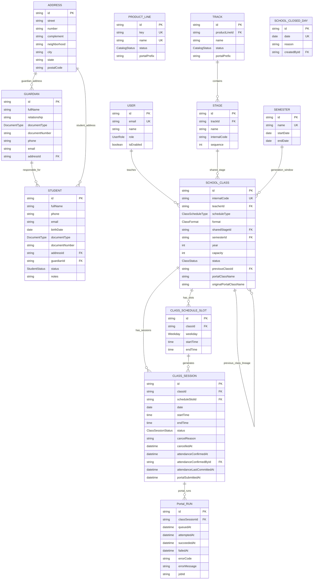
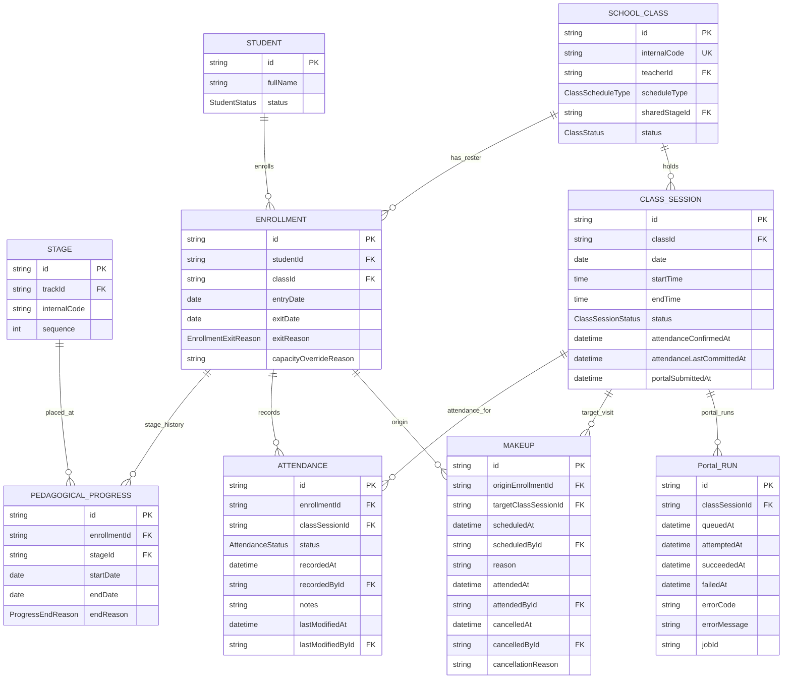
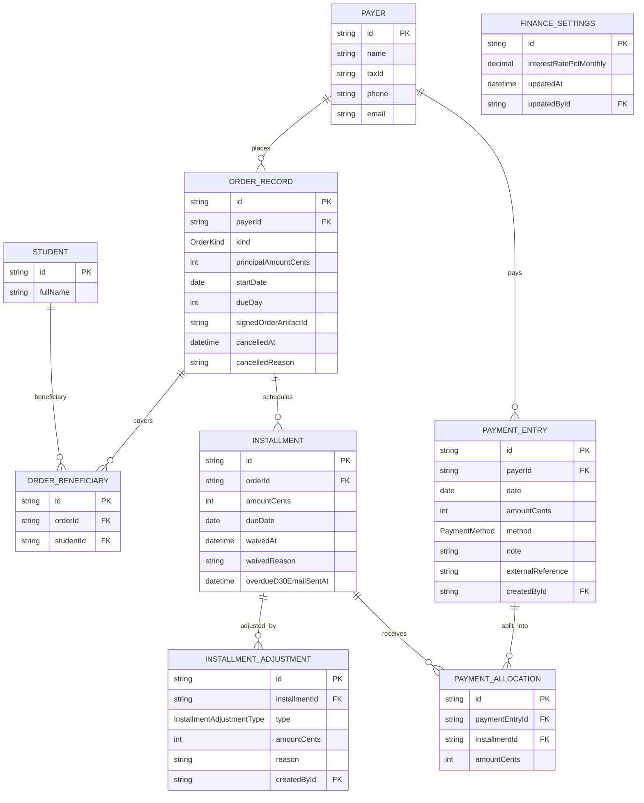
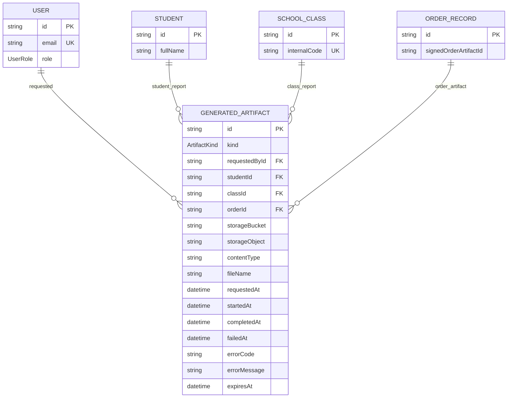

# Lazuli ERD

**Status:** derived from [TECHNICAL_SPEC.md](./TECHNICAL_SPEC.md) v0.2  
**Date:** 2026-06-18  
**Source of truth:** [PRD](./PRD.md), [decisions](./decisions.md), and [TECHNICAL_SPEC.md](./TECHNICAL_SPEC.md).

This ERD is split by module so it remains readable in Mermaid renderers. Entity names use uppercase snake case for Mermaid parser stability; for example `SCHOOL_CLASS` corresponds to the Prisma `Class` model and `ORDER_RECORD` corresponds to `Order`.

## Legend

- `PK` primary key.
- `FK` foreign key.
- `UK` unique key or unique-by-constraint.
- **UUIDEntity** — every domain entity in Sections 4.1–4.8 of [TECHNICAL_SPEC.md](./TECHNICAL_SPEC.md) carries `id` (uuid PK), `created_at`, `updated_at`, and nullable `deleted_at` ([D-0034](./decisions.md#d-0034-uuidentity-base-for-all-domain-tables)). These columns are omitted from diagram blocks for brevity; consult the spec for exact nullability and soft-delete rules.
- Optional fields are listed without a Mermaid comment for renderer compatibility; consult [TECHNICAL_SPEC.md](./TECHNICAL_SPEC.md) for exact nullability.
- Repetitive attribution FKs such as `createdById`, `updatedById`, `cancelledById`, and `lastModifiedById` all reference `USER.id` with `ON DELETE RESTRICT`; most are omitted from relationship lines to keep the diagrams readable.
- Better Auth adapter tables are intentionally omitted. Authentication joins to `USER` by email, and domain authorization uses `ctx.staffUser.id`.

## Academic Core

Key constraints from the spec:

- `GUARDIAN` replaces the former free-text `responsibleText` ([D-0033](./decisions.md#d-0033-structured-guardian-and-address-entities)). A minor `STUDENT` must have a `guardianId`; `STUDENT.guardianId` is many-to-one (siblings may share a guardian). The guardian is kept structurally separate from the finance `PAYER` — no FK between them.
- `STUDENT.addressId` and `GUARDIAN.addressId` are shareable FKs (`ON DELETE SET NULL`): a cohabiting student and guardian may point at the same `ADDRESS` row.
- `documentType` + `documentNumber` (on `STUDENT` and `GUARDIAN`) are paired: `documentNumber` set requires `documentType` set (`enum DocumentType { CPF, RG }`).
- `SCHOOL_CLASS.scheduleType = REGULAR` requires `sharedStageId` and `semesterId`.
- `SCHOOL_CLASS.scheduleType = PERSONALIZED` requires `sharedStageId = null` and `semesterId` (amended 2026-07-04 — both modalities share the same semester calendar for session generation; see [D-0008](./decisions.md#d-0008-rolling-enrollment-and-contract-periods)).
- Active classes have unique `portalClassName`.
- `SEMESTER` date ranges must not overlap.
- Generated sessions use partial unique indexes because `scheduleSlotId` is nullable.
- `Portal_RUN` records queue/attempt/outcome/error facts for a single `CLASS_SESSION`.
- A generated session date must map to exactly one `SEMESTER` before attendance can be confirmed or reports can be generated.

## Enrollment, Progress, Attendance

Key constraints from the spec:

- Active enrollment is derived from `exitDate IS NULL`; no stored enrollment status.
- Each active enrollment has exactly one active `PEDAGOGICAL_PROGRESS`; each closed enrollment has zero active progress.
- Progress windows for the same enrollment cannot overlap.
- REGULAR active progress must match `SCHOOL_CLASS.sharedStageId`.
- At most one active enrollment per `(student, track)` is allowed.
- `ATTENDANCE` rows are committed only when a session is confirmed; pre-confirm selections are client state only.
- `CLASS_SESSION.attendanceLastCommittedAt > portalSubmittedAt` derives Portal retry eligibility.
- `Portal_RUN` stores Portal queue/attempt/outcome/error facts; `CLASS_SESSION` keeps only the durable `portalSubmittedAt` success fact.
- Makeups do not affect the attendance percentage.

## Finance

Key constraints from the spec:

- All money is integer cents, BRL-only, `Cents` suffix.
- `ORDER_RECORD.kind` is required: `TUITION | ENROLLMENT_FEE | MATERIAL | OTHER`.
- `dueDay IN (5, 10, 15, 20, 25)`.
- Payment allocations are payer-scoped: allocated installments must belong to orders for the same payer as the payment entry.
- `currentExpectedCents >= 0` and `paidAmountCents <= currentExpectedCents` after adjustments.
- Cancelled orders and waived installments are non-collectible; their history remains visible.
- `overdueD30EmailSentAt` is a delivery idempotency fact, not a notification rule engine.
- `FINANCE_SETTINGS.interestRatePctMonthly` drives display-only interest preview; actual charged interest is an `INSTALLMENT_ADJUSTMENT`.

## Artifacts and Cross-Module Links

Artifact rules:

- Store GCS bucket/object keys, not public or signed URLs.
- Signed URLs are generated on demand.
- `ORDER_RECORD.signedOrderArtifactId` is a nullable UUID placeholder in the finance schema. The generated-artifact FK and `kind = SIGNED_ORDER_PDF` validation are deferred to the artifact workflow slice.
- Retention remains open; `expiresAt` stays nullable.

## Full Relationship Index

| From                  | To                       |        Cardinality | Meaning                                                  |
| --------------------- | ------------------------ | -----------------: | -------------------------------------------------------- |
| `USER`                | `SCHOOL_CLASS`           |          1 to many | Teacher owns classes.                                    |
| `GUARDIAN`            | `STUDENT`                | 1 to many optional | Contact responsável; siblings may share one guardian.    |
| `ADDRESS`             | `STUDENT`                | 1 to many optional | Student address (shareable row).                         |
| `ADDRESS`             | `GUARDIAN`               | 1 to many optional | Guardian address (may be the same row as the student's). |
| `PRODUCT_LINE`        | `TRACK`                  |          1 to many | Seeded product-line grouping.                            |
| `TRACK`               | `STAGE`                  |          1 to many | Course catalog path.                                     |
| `STAGE`               | `SCHOOL_CLASS`           | 1 to many optional | REGULAR shared class stage.                              |
| `SEMESTER`            | `SCHOOL_CLASS`           | 1 to many optional | Generation window for REGULAR and PERSONALIZED classes.  |
| `SCHOOL_CLASS`        | `SCHOOL_CLASS`           | 1 to many optional | Previous/next class lineage.                             |
| `SCHOOL_CLASS`        | `CLASS_SCHEDULE_SLOT`    |          1 to many | Weekly schedule slots.                                   |
| `CLASS_SCHEDULE_SLOT` | `CLASS_SESSION`          | 1 to many optional | Generated session source.                                |
| `SCHOOL_CLASS`        | `CLASS_SESSION`          |          1 to many | Sessions held by class.                                  |
| `STUDENT`             | `ENROLLMENT`             |          1 to many | Operational student-class link.                          |
| `SCHOOL_CLASS`        | `ENROLLMENT`             |          1 to many | Active/historical roster.                                |
| `ENROLLMENT`          | `PEDAGOGICAL_PROGRESS`   |          1 to many | Stage placement history.                                 |
| `STAGE`               | `PEDAGOGICAL_PROGRESS`   |          1 to many | Stage placement target.                                  |
| `ENROLLMENT`          | `ATTENDANCE`             |          1 to many | Committed attendance rows.                               |
| `CLASS_SESSION`       | `ATTENDANCE`             |          1 to many | Session attendance.                                      |
| `ENROLLMENT`          | `MAKEUP`                 |          1 to many | Origin enrollment for visiting student.                  |
| `CLASS_SESSION`       | `MAKEUP`                 |          1 to many | Target session for makeup visit.                         |
| `PAYER`               | `ORDER_RECORD`           |          1 to many | Billing party places orders.                             |
| `ORDER_RECORD`        | `ORDER_BENEFICIARY`      |          1 to many | Order covers students.                                   |
| `STUDENT`             | `ORDER_BENEFICIARY`      |          1 to many | Student is beneficiary.                                  |
| `ORDER_RECORD`        | `INSTALLMENT`            |          1 to many | Order payment schedule.                                  |
| `INSTALLMENT`         | `INSTALLMENT_ADJUSTMENT` |          1 to many | Signed adjustments.                                      |
| `PAYER`               | `PAYMENT_ENTRY`          |          1 to many | Money received from payer.                               |
| `PAYMENT_ENTRY`       | `PAYMENT_ALLOCATION`     |          1 to many | Entry split across installments.                         |
| `INSTALLMENT`         | `PAYMENT_ALLOCATION`     |          1 to many | Installment receives allocations.                        |
| `USER`                | `GENERATED_ARTIFACT`     | 1 to many optional | Requested by staff.                                      |
| `STUDENT`             | `GENERATED_ARTIFACT`     | 1 to many optional | Student-scoped artifact.                                 |
| `SCHOOL_CLASS`        | `GENERATED_ARTIFACT`     | 1 to many optional | Class-scoped artifact.                                   |
| `ORDER_RECORD`        | `GENERATED_ARTIFACT`     | 1 to many optional | Order-scoped artifact.                                   |

## Excluded From MVP ERD

- Better Auth adapter tables: owned by Better Auth, not the domain model; do not use UUIDEntity.
- `FinanceSettings`: singleton row (`id = "singleton"`), not a UUIDEntity; see [D-0034](./decisions.md#d-0034-uuidentity-base-for-all-domain-tables).
- `CollectionAttempt`: P1 (`S-FIN-4`), intentionally no P0 table.
- `doNotContact`: P1 (`S-NOT-4`), intentionally no P0 field.
- Leads/CRM, expenses, WhatsApp/Evolution, payment processing, Cora API import, substitute assignment, grades/assessments, and automated class-generation intelligence.
