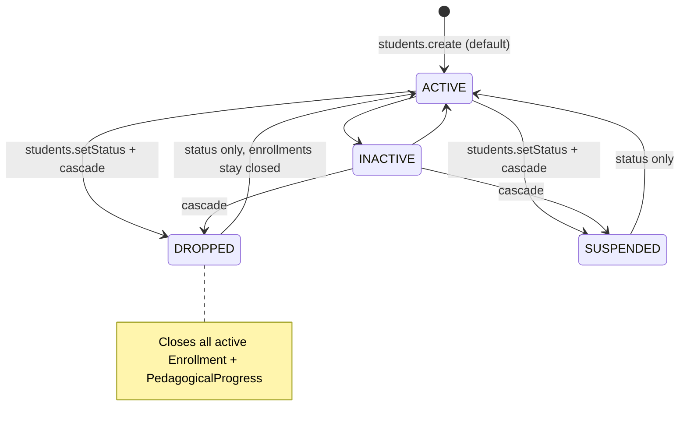
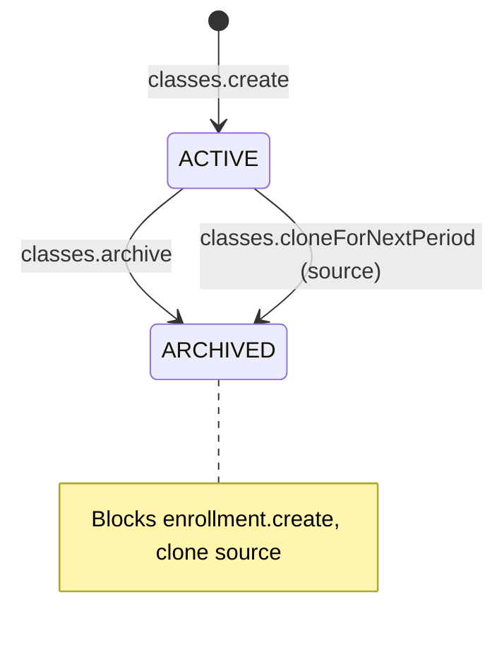
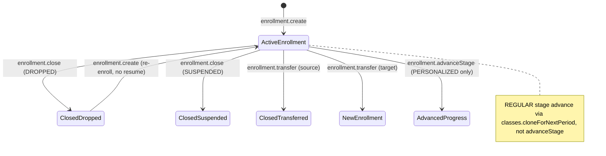
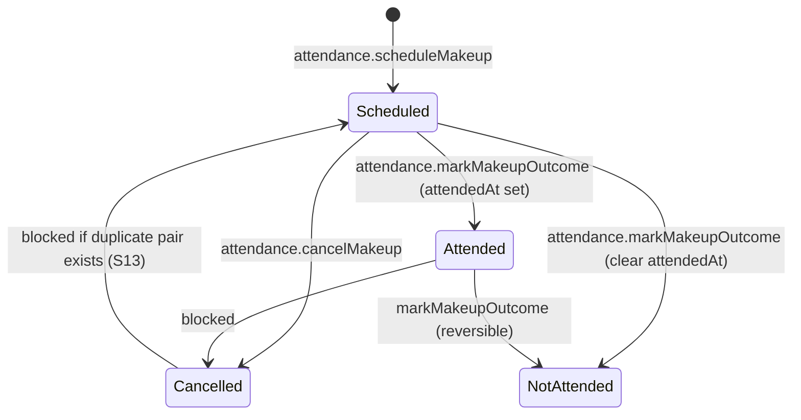
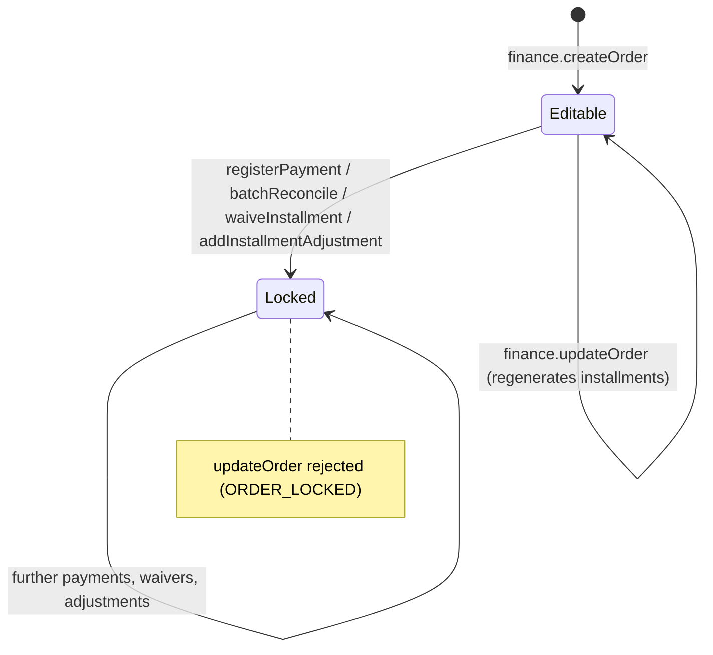
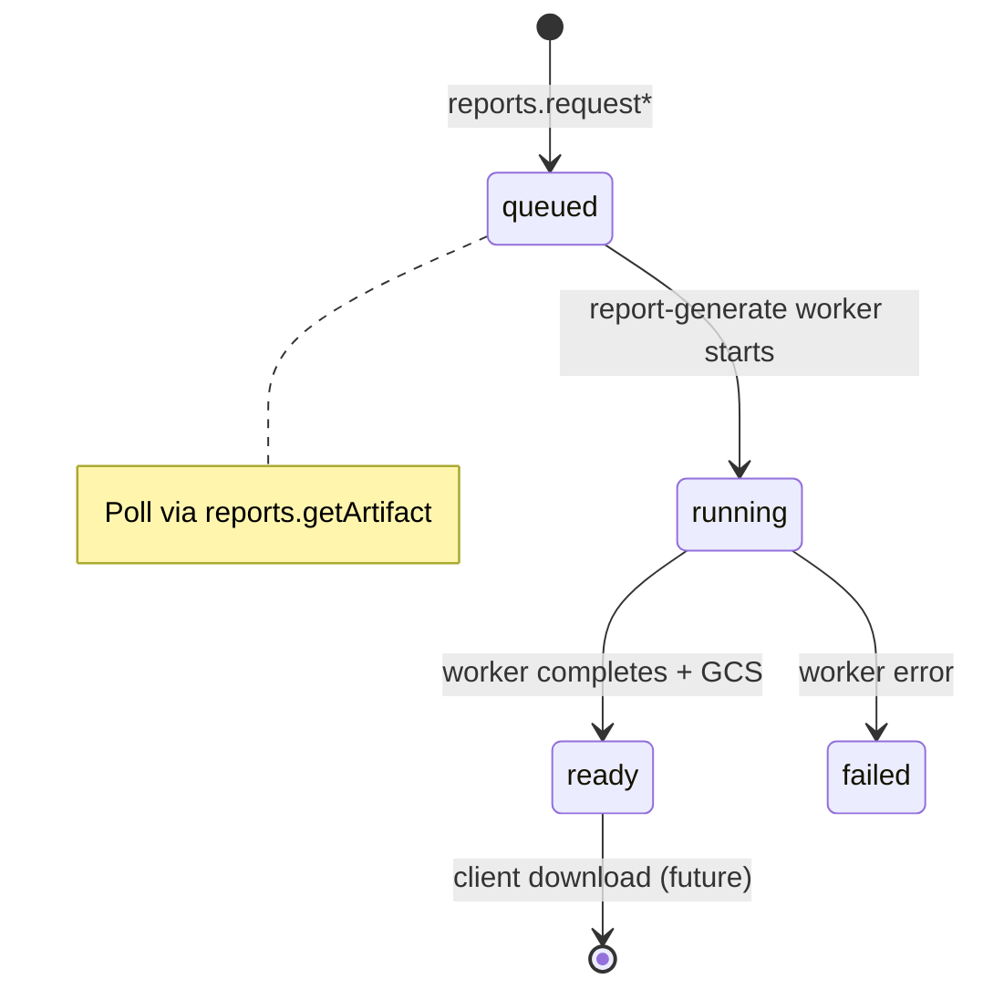
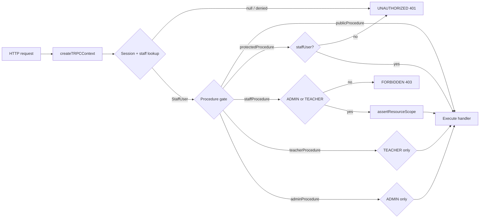

# Flow Control Graph — Lazuli tRPC API

Synthesized from **22 pair analyses** (44 endpoints, 2 per subagent). Each pair document lives under [`pairs/`](./pairs/) and was produced by reading handlers, validators, Prisma schema, domain logic, and existing tests — not docs alone.

## Methodology

1. Inventory all `appRouter` procedures (`packages/api/src/root.ts`).
2. Spawn one fresh subagent per **pair** of endpoints.
3. Each subagent maps scenarios (happy path, RBAC, validation, domain invariants, edge cases) and writes a pair file per [`ANALYSIS_PROMPT.md`](./ANALYSIS_PROMPT.md).
4. This document merges cross-endpoint edges and domain lifecycles into a single control-flow view.

## Endpoint inventory

| Router       | Procedure                     | Type     | Auth      | Pair doc                                                        |
| ------------ | ----------------------------- | -------- | --------- | --------------------------------------------------------------- |
| —            | `health`                      | query    | public    | [PAIR-01](./pairs/PAIR-01-health-me.md)                         |
| —            | `me`                          | query    | protected | [PAIR-01](./pairs/PAIR-01-health-me.md)                         |
| `students`   | `byId`                        | query    | admin     | [PAIR-02](./pairs/PAIR-02-students-read.md)                     |
| `students`   | `search`                      | query    | admin     | [PAIR-02](./pairs/PAIR-02-students-read.md)                     |
| `students`   | `create`                      | mutation | admin     | [PAIR-03](./pairs/PAIR-03-students-write.md)                    |
| `students`   | `updateContact`               | mutation | admin     | [PAIR-03](./pairs/PAIR-03-students-write.md)                    |
| `students`   | `updateNotes`                 | mutation | admin     | [PAIR-04](./pairs/PAIR-04-students-status.md)                   |
| `students`   | `setStatus`                   | mutation | admin     | [PAIR-04](./pairs/PAIR-04-students-status.md)                   |
| `classes`    | `create`                      | mutation | admin     | [PAIR-05](./pairs/PAIR-05-classes-create-archive.md)            |
| `classes`    | `archive`                     | mutation | admin     | [PAIR-05](./pairs/PAIR-05-classes-create-archive.md)            |
| `classes`    | `cloneForNextPeriod`          | mutation | admin     | [PAIR-06](./pairs/PAIR-06-classes-clone-generate.md)            |
| `classes`    | `generateSessions`            | mutation | admin     | [PAIR-06](./pairs/PAIR-06-classes-clone-generate.md)            |
| `calendar`   | `createSemester`              | mutation | admin     | [PAIR-07](./pairs/PAIR-07-calendar-semester-holidays.md)        |
| `calendar`   | `importBrazilFederalHolidays` | mutation | admin     | [PAIR-07](./pairs/PAIR-07-calendar-semester-holidays.md)        |
| `calendar`   | `addClosedDay`                | mutation | admin     | [PAIR-08](./pairs/PAIR-08-calendar-closed-days.md)              |
| `calendar`   | `removeClosedDay`             | mutation | admin     | [PAIR-08](./pairs/PAIR-08-calendar-closed-days.md)              |
| `enrollment` | `create`                      | mutation | admin     | [PAIR-09](./pairs/PAIR-09-enrollment-create-advance.md)         |
| `enrollment` | `advanceStage`                | mutation | admin     | [PAIR-09](./pairs/PAIR-09-enrollment-create-advance.md)         |
| `enrollment` | `close`                       | mutation | admin     | [PAIR-10](./pairs/PAIR-10-enrollment-close-transfer.md)         |
| `enrollment` | `transfer`                    | mutation | admin     | [PAIR-10](./pairs/PAIR-10-enrollment-close-transfer.md)         |
| `attendance` | `sessionRoster`               | query    | staff     | [PAIR-11](./pairs/PAIR-11-attendance-read.md)                   |
| `attendance` | `enrollmentSemesterPercent`   | query    | staff     | [PAIR-11](./pairs/PAIR-11-attendance-read.md)                   |
| `attendance` | `confirmSession`              | mutation | staff     | [PAIR-12](./pairs/PAIR-12-attendance-confirm-edit.md)           |
| `attendance` | `editSession`                 | mutation | staff     | [PAIR-12](./pairs/PAIR-12-attendance-confirm-edit.md)           |
| `attendance` | `scheduleMakeup`              | mutation | admin     | [PAIR-13](./pairs/PAIR-13-attendance-makeup-schedule-cancel.md) |
| `attendance` | `cancelMakeup`                | mutation | admin     | [PAIR-13](./pairs/PAIR-13-attendance-makeup-schedule-cancel.md) |
| `attendance` | `markMakeupOutcome`           | mutation | staff     | [PAIR-14](./pairs/PAIR-14-makeup-outcome-teacher-home.md)       |
| `dashboard`  | `teacherHome`                 | query    | teacher   | [PAIR-14](./pairs/PAIR-14-makeup-outcome-teacher-home.md)       |
| `finance`    | `createPayer`                 | mutation | admin     | [PAIR-15](./pairs/PAIR-15-finance-payer-order.md)               |
| `finance`    | `createOrder`                 | mutation | admin     | [PAIR-15](./pairs/PAIR-15-finance-payer-order.md)               |
| `finance`    | `updateOrder`                 | mutation | admin     | [PAIR-16](./pairs/PAIR-16-finance-order-payment.md)             |
| `finance`    | `registerPayment`             | mutation | admin     | [PAIR-16](./pairs/PAIR-16-finance-order-payment.md)             |
| `finance`    | `batchReconcile`              | mutation | admin     | [PAIR-17](./pairs/PAIR-17-finance-reconcile-waive.md)           |
| `finance`    | `waiveInstallment`            | mutation | admin     | [PAIR-17](./pairs/PAIR-17-finance-reconcile-waive.md)           |
| `finance`    | `addInstallmentAdjustment`    | mutation | admin     | [PAIR-18](./pairs/PAIR-18-finance-adjustment-snapshot.md)       |
| `finance`    | `receivablesSnapshot`         | query    | admin     | [PAIR-18](./pairs/PAIR-18-finance-adjustment-snapshot.md)       |
| `finance`    | `overdueList`                 | query    | admin     | [PAIR-19](./pairs/PAIR-19-finance-overdue-student-statement.md) |
| `reports`    | `requestStudentStatement`     | mutation | admin     | [PAIR-19](./pairs/PAIR-19-finance-overdue-student-statement.md) |
| `reports`    | `requestClassRoster`          | mutation | staff     | [PAIR-20](./pairs/PAIR-20-reports-roster-attendance.md)         |
| `reports`    | `requestAttendanceSummary`    | mutation | admin     | [PAIR-20](./pairs/PAIR-20-reports-roster-attendance.md)         |
| `reports`    | `requestOverdueCsv`           | mutation | admin     | [PAIR-21](./pairs/PAIR-21-reports-csv.md)                       |
| `reports`    | `requestMonthlyAccountantCsv` | mutation | admin     | [PAIR-21](./pairs/PAIR-21-reports-csv.md)                       |
| `reports`    | `getArtifact`                 | query    | staff     | [PAIR-22](./pairs/PAIR-22-artifact-admin-metrics.md)            |
| `dashboard`  | `adminMetrics`                | query    | admin     | [PAIR-22](./pairs/PAIR-22-artifact-admin-metrics.md)            |

> **Note:** `dashboard.adminMetrics` and `dashboard.teacherHome` are implemented on PR #41 (GRE-64) and may not be on `main` yet. Pair analyses document both current `main` and pending dashboard behavior.

---

## System-level control flow

High-level domains and the **primary** edges between them (happy-path school operations).

```mermaid
flowchart TB
  subgraph Auth["Auth layer"]
    health["health"]
    me["me"]
    health --> me
    me --> staffGate["staffProcedure / adminProcedure / teacherProcedure"]
  end

  subgraph Calendar["Calendar & time"]
    importH["importBrazilFederalHolidays"]
    addCD["addClosedDay"]
    remCD["removeClosedDay"]
    createSem["createSemester"]
    importH --> createSem
    addCD --> createSem
    remCD --> genSess
    createSem --> genSess["sessions-generate job"]
  end

  subgraph Classes["Classes"]
    classCreate["classes.create"]
    classArchive["classes.archive"]
    classClone["classes.cloneForNextPeriod"]
    genSessAPI["classes.generateSessions"]
    classCreate --> genSessAPI
    classClone --> classArchive
    classClone --> genSessAPI
    genSessAPI --> genSess
    createSem --> genSess
  end

  subgraph Students["Students"]
    stCreate["students.create"]
    stSearch["students.search"]
    stById["students.byId"]
    stStatus["students.setStatus"]
    stSearch --> stById
    stCreate --> stById
  end

  subgraph Enrollment["Enrollment"]
    enrCreate["enrollment.create"]
    enrAdvance["enrollment.advanceStage"]
    enrClose["enrollment.close"]
    enrTransfer["enrollment.transfer"]
    stCreate --> enrCreate
    classCreate --> enrCreate
    enrCreate --> enrAdvance
    enrCreate --> enrClose
    enrCreate --> enrTransfer
    stStatus -->|"DROPPED/SUSPENDED cascade"| enrClose
  end

  subgraph Attendance["Attendance (daily)"]
    tHome["dashboard.teacherHome"]
    roster["attendance.sessionRoster"]
    confirm["attendance.confirmSession"]
    edit["attendance.editSession"]
    percent["attendance.enrollmentSemesterPercent"]
    schedMU["attendance.scheduleMakeup"]
    markMU["attendance.markMakeupOutcome"]
    cancelMU["attendance.cancelMakeup"]
    genSess --> roster
    enrCreate --> roster
    tHome --> roster
    roster --> confirm
    confirm --> edit
    confirm --> percent
    edit --> percent
    schedMU --> roster
    roster --> markMU
    schedMU --> cancelMU
  end

  subgraph Finance["Finance"]
    payer["finance.createPayer"]
    order["finance.createOrder"]
    updOrder["finance.updateOrder"]
    pay["finance.registerPayment"]
    recon["finance.batchReconcile"]
    waive["finance.waiveInstallment"]
    adj["finance.addInstallmentAdjustment"]
    snap["finance.receivablesSnapshot"]
    overdue["finance.overdueList"]
    payer --> order
    order --> updOrder
    order --> pay
    order --> recon
    order --> waive
    order --> adj
    pay --> snap
    waive --> snap
    adj --> snap
    snap --> overdue
  end

  subgraph Reports["Reports (async)"]
    reqStmt["requestStudentStatement"]
    reqRoster["requestClassRoster"]
    reqAtt["requestAttendanceSummary"]
    reqOD["requestOverdueCsv"]
    reqAcct["requestMonthlyAccountantCsv"]
    getArt["reports.getArtifact"]
    rptJob["report-generate job"]
    overdue --> reqStmt
    overdue --> reqOD
    reqStmt --> rptJob
    reqRoster --> rptJob
    reqAtt --> rptJob
    reqOD --> rptJob
    reqAcct --> rptJob
    rptJob --> getArt
  end

  subgraph Ops["Operations dashboard"]
    adminM["dashboard.adminMetrics"]
    adminM --> roster
    adminM --> confirm
  end

  staffGate --> Calendar
  staffGate --> Classes
  staffGate --> Students
  staffGate --> Enrollment
  staffGate --> Attendance
  staffGate --> Finance
  staffGate --> Reports
  staffGate --> Ops
```



---

## Entity lifecycle state machines

### Student (`StudentStatus`)

No enforced transition matrix in code — all 16 combinations accepted. **Only** `DROPPED` and `SUSPENDED` trigger side effects (close active enrollments + pedagogical progress).



### Class (`ClassStatus`)



### Enrollment + progress



### ClassSession (attendance commit)

```mermaid
stateDiagram-v2
  [*] --> SCHEDULED: sessions-generate worker
  SCHEDULED --> CONFIRMED: attendance.confirmSession
  CONFIRMED --> CONFIRMED: attendance.editSession (row updates)
  SCHEDULED --> CANCELLED: calendar closed-day (stub / GRE-27)
  note right of CONFIRMED: attendanceConfirmedAt set; teacher same-day edit window
```

### Makeup



### Order / installment (financial lock)



### GeneratedArtifact (reports)



---

## Critical operational paths

### Path A — Period setup (admin)

```text
importBrazilFederalHolidays → createSemester → [sessions-generate]
  → classes.create → classes.generateSessions (per class)
  → optional: addClosedDay / removeClosedDay (+ manual regenerate)
```

### Path B — Student onboarding

```text
students.search? → students.create → students.byId
  → enrollment.create → finance.createOrder? (orderPromptRequired flag only)
```

### Path C — Teacher daily attendance

```text
dashboard.teacherHome → attendance.sessionRoster
  → attendance.confirmSession → [Portal worker]
  → attendance.editSession? (same-day corrections)
```

### Path D — Makeup coordination

```text
attendance.scheduleMakeup (admin)
  → attendance.sessionRoster (target day)
  → attendance.markMakeupOutcome (teacher)
  OR attendance.cancelMakeup (admin)
```

### Path E — Finance collection

```text
finance.createOrder → finance.overdueList / finance.receivablesSnapshot
  → finance.registerPayment | finance.batchReconcile | finance.waiveInstallment
  → finance.addInstallmentAdjustment? (before lock)
```

### Path F — Report export

```text
reports.request* → report-generate job → reports.getArtifact (poll until ready/failed)
```

---

## Auth control plane



**RBAC matrix vs procedure gates:** Several routers list `scoped` access for TEACHER in the matrix, but individual procedures use `adminProcedure` (students, calendar, enrollment, most finance). TEACHER effectively reaches attendance (scoped), class roster reports (own class), and dashboard.teacherHome.

---

## Async job boundaries

| Job                 | Enqueued by                                           | API writes                            | Worker responsibility                                  |
| ------------------- | ----------------------------------------------------- | ------------------------------------- | ------------------------------------------------------ |
| `sessions-generate` | `calendar.createSemester`, `classes.generateSessions` | None (`ClassSession`)                 | Generate sessions for ACTIVE classes; skip closed days |
| `report-generate`   | All `reports.request*` mutations                      | `GeneratedArtifact` row               | Build PDF/CSV, update artifact timestamps/GCS          |
| Portal submit       | Not a tRPC endpoint                                   | Set by `confirmSession`/`editSession` | Best-effort Portal push (worker-handlers)              |

API success on `generateSessions` does **not** guarantee sessions exist synchronously — only that the job was enqueued.

---

## Known gaps (from pair analysis)

| Area      | Gap                                                                                                      |
| --------- | -------------------------------------------------------------------------------------------------------- |
| Calendar  | `addClosedDay` session cancellation stubbed (GRE-27); `removeClosedDay` does not auto-enqueue regenerate |
| Reports   | `requestMonthlyAccountantCsv` discards `year`/`month` input at router                                    |
| Reports   | `semesterId` on roster/attendance summary requests not passed to artifact                                |
| Reports   | Worker stub (GRE-53) — artifacts stay `queued`/`running` without GCS                                     |
| Finance   | `registerPayment` does not reject cancelled orders                                                       |
| Students  | No duplicate detection on document/phone/email                                                           |
| Makeup    | Duplicate `(origin, target)` blocks re-schedule even after cancel                                        |
| Dashboard | GRE-64 not merged to `main` at time of analysis                                                          |

---

## Pair analysis index

| Pair                                                            | Endpoints                                      | Scenarios (approx.) |
| --------------------------------------------------------------- | ---------------------------------------------- | ------------------- |
| [PAIR-01](./pairs/PAIR-01-health-me.md)                         | health, me                                     | 14                  |
| [PAIR-02](./pairs/PAIR-02-students-read.md)                     | students.byId, search                          | 33                  |
| [PAIR-03](./pairs/PAIR-03-students-write.md)                    | students.create, updateContact                 | 39                  |
| [PAIR-04](./pairs/PAIR-04-students-status.md)                   | students.updateNotes, setStatus                | 20+                 |
| [PAIR-05](./pairs/PAIR-05-classes-create-archive.md)            | classes.create, archive                        | 25+                 |
| [PAIR-06](./pairs/PAIR-06-classes-clone-generate.md)            | classes.clone, generateSessions                | 20+                 |
| [PAIR-07](./pairs/PAIR-07-calendar-semester-holidays.md)        | createSemester, importHolidays                 | 18+                 |
| [PAIR-08](./pairs/PAIR-08-calendar-closed-days.md)              | addClosedDay, removeClosedDay                  | 15+                 |
| [PAIR-09](./pairs/PAIR-09-enrollment-create-advance.md)         | enrollment.create, advanceStage                | 33                  |
| [PAIR-10](./pairs/PAIR-10-enrollment-close-transfer.md)         | enrollment.close, transfer                     | 20+                 |
| [PAIR-11](./pairs/PAIR-11-attendance-read.md)                   | sessionRoster, enrollmentSemesterPercent       | 25+                 |
| [PAIR-12](./pairs/PAIR-12-attendance-confirm-edit.md)           | confirmSession, editSession                    | 20+                 |
| [PAIR-13](./pairs/PAIR-13-attendance-makeup-schedule-cancel.md) | scheduleMakeup, cancelMakeup                   | 18+                 |
| [PAIR-14](./pairs/PAIR-14-makeup-outcome-teacher-home.md)       | markMakeupOutcome, teacherHome                 | 15+                 |
| [PAIR-15](./pairs/PAIR-15-finance-payer-order.md)               | createPayer, createOrder                       | 33                  |
| [PAIR-16](./pairs/PAIR-16-finance-order-payment.md)             | updateOrder, registerPayment                   | 25+                 |
| [PAIR-17](./pairs/PAIR-17-finance-reconcile-waive.md)           | batchReconcile, waiveInstallment               | 20+                 |
| [PAIR-18](./pairs/PAIR-18-finance-adjustment-snapshot.md)       | addInstallmentAdjustment, receivablesSnapshot  | 20+                 |
| [PAIR-19](./pairs/PAIR-19-finance-overdue-student-statement.md) | overdueList, requestStudentStatement           | 18+                 |
| [PAIR-20](./pairs/PAIR-20-reports-roster-attendance.md)         | requestClassRoster, requestAttendanceSummary   | 15+                 |
| [PAIR-21](./pairs/PAIR-21-reports-csv.md)                       | requestOverdueCsv, requestMonthlyAccountantCsv | 12+                 |
| [PAIR-22](./pairs/PAIR-22-artifact-admin-metrics.md)            | getArtifact, adminMetrics                      | 15+                 |

---

## Regenerating

To re-run analysis for changed endpoints:

1. Update the endpoint pair assignment in a task prompt.
2. Point subagents at [`ANALYSIS_PROMPT.md`](./ANALYSIS_PROMPT.md).
3. Merge new pair files into this document's edges and state machines.
