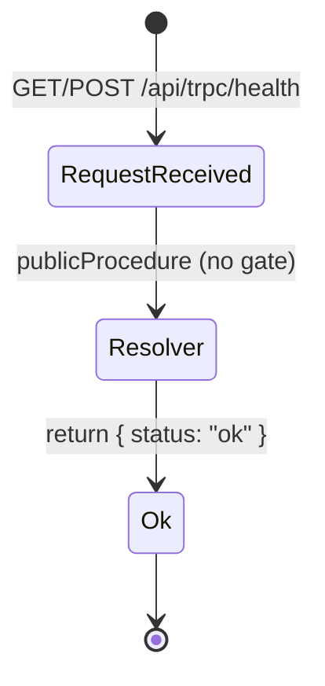
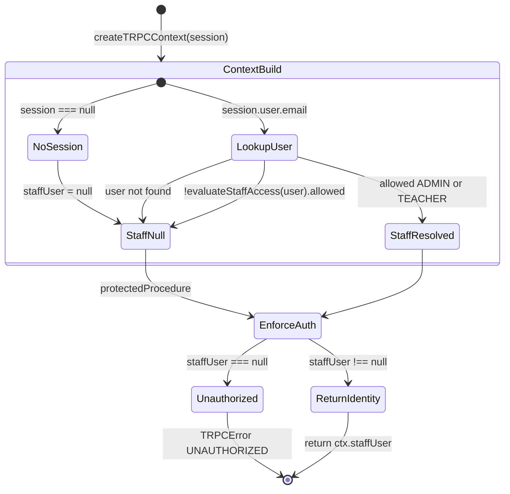

# PAIR-01: `health` + `me`

Root-level tRPC queries that establish API liveness and authenticated staff identity. Neither procedure accepts input or mutates state.

---

## `health`

- **Type:** query
- **Auth:** publicProcedure
- **Input schema:** none (no `.input()`)
- **Entities touched:** none (static response; no Prisma access)

### State preconditions

- None. Callable with `ctx.staffUser === null` or any authenticated context.
- No database rows required.

### Scenarios

| ID  | Scenario                         | Given (state)                                                                                                     | Input  | Expected outcome   | HTTP/tRPC error (if any) | Post-state |
| --- | -------------------------------- | ----------------------------------------------------------------------------------------------------------------- | ------ | ------------------ | ------------------------ | ---------- |
| S1  | Anonymous liveness check         | No Better Auth session; `createTRPCContext({ session: null })`                                                    | (none) | `{ status: "ok" }` | — (HTTP 200)             | unchanged  |
| S2  | Authenticated ADMIN              | Enabled `User` with `role: ADMIN`; valid session                                                                  | (none) | `{ status: "ok" }` | — (HTTP 200)             | unchanged  |
| S3  | Authenticated TEACHER            | Enabled `User` with `role: TEACHER`; valid session                                                                | (none) | `{ status: "ok" }` | — (HTTP 200)             | unchanged  |
| S4  | Session present but staff denied | Valid Better Auth session for unknown/disabled/non-enabled-role email (`staffUser` resolves to `null` in context) | (none) | `{ status: "ok" }` | — (HTTP 200)             | unchanged  |
| S5  | Direct caller, null staff        | Test/direct `createCaller({ staffUser: null })`                                                                   | (none) | `{ status: "ok" }` | —                        | unchanged  |

Notes:

- `publicProcedure` applies only `timingMiddleware` (dev-only artificial delay + stdout timing log); no auth middleware.
- Auth state does not affect the response shape or success path.

### State transitions (flow nodes)

No persistent state is read or written. Every path terminates at the same static payload.

### Outbound edges

| Target                        | Condition                                                     |
| ----------------------------- | ------------------------------------------------------------- |
| Client bootstrap / monitoring | Probe API reachability before login or data fetch             |
| Any authenticated flow        | Optional pre-check; does not establish session or `staffUser` |

### Evidence

- `packages/api/src/root.ts` — procedure definition
- `packages/api/src/trpc/init.ts` — `publicProcedure`, `timingMiddleware`
- `packages/api/test/router.test.ts` — S1/S5 (anonymous caller returns ok)

---

## `me`

- **Type:** query
- **Auth:** protectedProcedure (`timingMiddleware` → `enforceStaffAuth`)
- **Input schema:** none (no `.input()`)
- **Entities touched:** `User` (read-only, during context build — not in the resolver itself)
  - Fields used: `id`, `email`, `role`, `isEnabled`
  - Lookup: `db.user.findUnique({ where: { email } })` in `resolveStaffUser`
  - Access gate: `evaluateStaffAccess(user)` from `@lazuli/auth`

### State preconditions

**Production path** (`createTRPCContext` → HTTP route):

1. For success: Better Auth session with `user.email` matching a `User` row where:
   - `isEnabled === true`
   - `role ∈ { ADMIN, TEACHER }` (only roles in `ENABLED_ROLES`)
2. For rejection: any condition that yields `ctx.staffUser === null`:
   - No session
   - Email not found in `User`
   - `isEnabled === false`
   - `role` is `SECRETARY` or `FINANCE` (role not enabled for MVP access)

**Direct caller path** (tests): `staffUser` injected into context bypasses DB resolution; `enforceStaffAuth` only checks non-null.

### Scenarios

| ID  | Scenario                       | Given (state)                                                                           | Input  | Expected outcome                                                                   | HTTP/tRPC error (if any)              | Post-state |
| --- | ------------------------------ | --------------------------------------------------------------------------------------- | ------ | ---------------------------------------------------------------------------------- | ------------------------------------- | ---------- |
| S1  | Happy path — ADMIN             | Enabled `User` (`role: ADMIN`); session email matches                                   | (none) | `StaffUser` `{ id, email, role: "ADMIN", isEnabled: true }` where `id === User.id` | — (HTTP 200)                          | unchanged  |
| S2  | Happy path — TEACHER           | Enabled `User` (`role: TEACHER`); session email matches                                 | (none) | `StaffUser` `{ id, email, role: "TEACHER", isEnabled: true }`                      | — (HTTP 200)                          | unchanged  |
| S3  | Unauthenticated                | `session: null` → `ctx.staffUser: null`                                                 | (none) | rejected at `enforceStaffAuth`                                                     | `TRPCError` `UNAUTHORIZED` (HTTP 401) | unchanged  |
| S4  | Unknown email                  | Session with email not in `User` table                                                  | (none) | `staffUser` null → rejected                                                        | `UNAUTHORIZED` (HTTP 401)             | unchanged  |
| S5  | Disabled user                  | `User` exists, `isEnabled: false`, valid session                                        | (none) | `evaluateStaffAccess` denies → `staffUser` null → rejected                         | `UNAUTHORIZED` (HTTP 401)             | unchanged  |
| S6  | SECRETARY role                 | `User` with `role: SECRETARY`, `isEnabled: true`, valid session                         | (none) | `ROLE_NOT_ENABLED` → `staffUser` null → rejected                                   | `UNAUTHORIZED` (HTTP 401)             | unchanged  |
| S7  | FINANCE role                   | `User` with `role: FINANCE`, `isEnabled: true`, valid session                           | (none) | `ROLE_NOT_ENABLED` → `staffUser` null → rejected                                   | `UNAUTHORIZED` (HTTP 401)             | unchanged  |
| S8  | Direct caller — injected staff | Test seam: `createCaller({ staffUser: ADMIN_FIXTURE })` without HTTP/context resolution | (none) | Returns injected `StaffUser` verbatim                                              | —                                     | unchanged  |
| S9  | Direct caller — null staff     | Test seam: `createCaller({ staffUser: null })`                                          | (none) | rejected at `enforceStaffAuth`                                                     | `UNAUTHORIZED`                        | unchanged  |

Notes:

- `protectedProcedure` does **not** apply role gates (`adminProcedure` / `teacherProcedure` / `staffProcedure`). ADMIN and TEACHER are treated identically; denied roles never reach the resolver because context resolution nulls `staffUser`.
- Denied staff (S4–S7) surface as `UNAUTHORIZED`, not `FORBIDDEN`. `FORBIDDEN` is reserved for role gates on higher procedures (see `rbac-http.test.ts` pattern for `adminProcedure`).
- Resolver is a pure pass-through: `({ ctx }) => ctx.staffUser` — no second DB read, no validation beyond middleware.
- S8 documents a test-only bypass: injecting a non-enabled role directly into context would succeed at `me` but cannot occur via the production HTTP path.

### State transitions (flow nodes)

No DB writes. Identity is resolved once per request in context; `me` echoes the result.

### Outbound edges

| Target                                                             | Condition                                                                                                                       |
| ------------------------------------------------------------------ | ------------------------------------------------------------------------------------------------------------------------------- |
| Role-aware UI routing                                              | Client reads `StaffUser.role` to choose ADMIN vs TEACHER surfaces                                                               |
| `staffProcedure` / `adminProcedure` / `teacherProcedure` endpoints | Successful `me` implies caller can reach `protectedProcedure` descendants; further `FORBIDDEN` depends on per-router role gates |
| Better Auth session lifecycle                                      | Preceded by magic link / Google login (`createAuth` + `evaluateStaffAccess` at session create)                                  |
| `createTRPCContext`                                                | Required on every HTTP request before any protected query                                                                       |

### Evidence

- `packages/api/src/root.ts` — `me` definition
- `packages/api/src/trpc/init.ts` — `protectedProcedure`, `enforceStaffAuth`
- `packages/api/src/trpc/context.ts` — `createTRPCContext`, `resolveStaffUser`, `StaffUser` type
- `packages/auth/src/staff-access.ts` — `evaluateStaffAccess`, `ENABLED_ROLES`, denial reasons
- `packages/auth/src/auth.ts` — `StaffSession` shape, session-create gate
- `apps/web/src/app/api/trpc/[trpc]/route.ts` — HTTP entry: session → `createTRPCContext`
- `packages/api/test/router.test.ts` — S8/S9 (direct caller happy + unauthenticated reject)
- `packages/api/test/db/context.test.ts` — S1/S2/S3/S4/S5/S6/S7 (DB-backed context resolution + `me` integration)
- `packages/api/test/behavior/rbac-http.test.ts` — HTTP 401 pattern for anonymous callers on gated procedures (same adapter as production)
- `packages/api/test/support.ts` — `ADMIN_FIXTURE`, `TEACHER_FIXTURE`, `assertUnauthorized` helper pattern

DB validation: not run in this analysis; scenarios S1–S7 are covered by `packages/api/test/db/context.test.ts`.

---

## Cross-endpoint edges (this pair only)

| From                | To                                                               | Condition                                                                                                       |
| ------------------- | ---------------------------------------------------------------- | --------------------------------------------------------------------------------------------------------------- |
| `health`            | `me`                                                             | Client may probe liveness (`health`) then fetch identity (`me`) after login; no server-side dependency          |
| `me`                | `staffProcedure` / `adminProcedure` / `teacherProcedure` routers | `me` success confirms `protectedProcedure` gate passed; downstream endpoints add role-specific `FORBIDDEN`      |
| Better Auth login   | `me`                                                             | Valid session required; `createAuth` blocks login for same denial reasons as `resolveStaffUser`                 |
| `createTRPCContext` | `me`                                                             | Always runs first on HTTP; populates or nulls `staffUser` before procedure middleware                           |
| `me`                | Client RBAC matrix                                               | Returned `StaffUser.role` drives which routers the UI exposes (§5.2 matrix enforced server-side on each router) |
