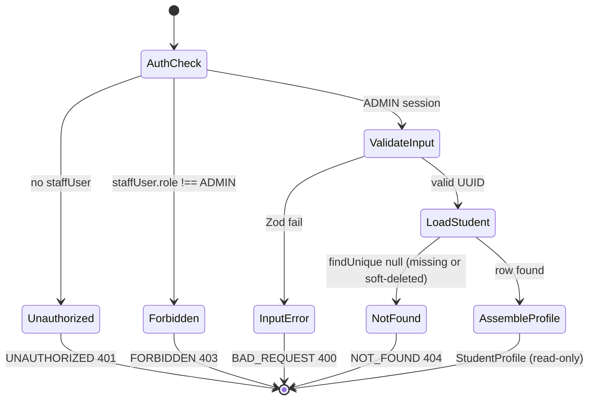
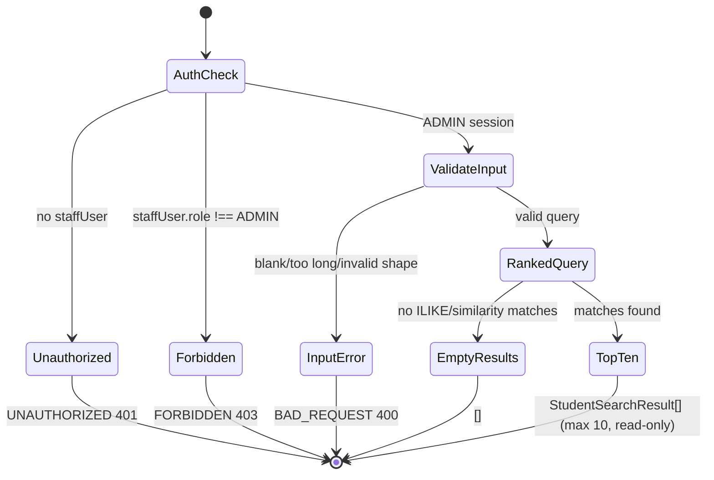

# PAIR-02 — Students read (`byId`, `search`)

Read-only student lookup pair for the flow-control graph. Both procedures are `adminProcedure` queries with no DB writes.

---

## `students.byId`

- **Type:** query
- **Auth:** `adminProcedure` (authenticated enabled staff with role `ADMIN` only; `TEACHER`/`SECRETARY`/`FINANCE` → `FORBIDDEN`; no session → `UNAUTHORIZED`)
- **Input schema:** `studentIdInputSchema` — `{ id: string }` (strict object; `id` must be a valid UUID)
- **Entities touched:** `Student` (read: `id`, `fullName`, `phone`, `email`, `birthDate`, `documentType`, `documentNumber`, `status`, `notes`, `deletedAt` via soft-delete filter); `Address` (via `Student.addressId`); `Guardian` + nested `Address` (via `Student.guardianId`). No writes.

### State preconditions

- Caller is an enabled staff user with role `ADMIN`.
- Target `Student` row exists with `deleted_at IS NULL` (Prisma soft-delete extension auto-filters `findUnique`).
- Related `Address` / `Guardian` rows may be null; when present they are included regardless of student `status` (`ACTIVE`, `INACTIVE`, `DROPPED`, `SUSPENDED`).

### Scenarios

| ID  | Scenario                                        | Given (state)                                                        | Input                            | Expected outcome                                                                                                                                                                                                              | HTTP/tRPC error (if any)                           | Post-state            |
| --- | ----------------------------------------------- | -------------------------------------------------------------------- | -------------------------------- | ----------------------------------------------------------------------------------------------------------------------------------------------------------------------------------------------------------------------------- | -------------------------------------------------- | --------------------- |
| B1  | Happy path — profile aggregate                  | Active student with contact fields, optional address/guardian, notes | Valid `id`                       | `StudentProfile`: `id`, `contact` (incl. `status`), `address`, `guardian`, `notes`, `whatsAppUrl`; `classes: []`, `attendanceSummary: { semesters: [] }`, `finance: { openOrders: [], installments: [], paymentHistory: [] }` | —                                                  | Unchanged (read-only) |
| B2  | Happy path — adult with address, no guardian    | Student created with address, adult `birthDate`, no guardian         | Valid `id`                       | `guardian: null`; address fields populated; `contact.documentType`/`documentNumber` echoed                                                                                                                                    | —                                                  | Unchanged             |
| B3  | Happy path — minor with shared guardian address | Minor student; guardian `useStudentAddress: true` on create          | Valid `id`                       | `guardian` populated; `address.id === guardian.address.id`                                                                                                                                                                    | —                                                  | Unchanged             |
| B4  | Happy path — reflects contact/notes updates     | Student after `students.updateContact` + `students.updateNotes`      | Valid `id`                       | Profile shows updated `contact`, `address`, `guardian`, `notes`                                                                                                                                                               | —                                                  | Unchanged             |
| B5  | Happy path — reflects status lifecycle          | Student after `students.setStatus` (e.g. `DROPPED`)                  | Valid `id`                       | `contact.status` matches DB status                                                                                                                                                                                            | —                                                  | Unchanged             |
| B6  | Derived `whatsAppUrl` from phone                | Student with formatted BR phone (e.g. `(82) 99999-0000`)             | Valid `id`                       | `whatsAppUrl: "https://wa.me/5582999990000"` (`toWhatsAppUrl` adds country code `55`, strips non-digits)                                                                                                                      | —                                                  | Unchanged             |
| B7  | No phone → no WhatsApp link                     | Student with `phone: null`                                           | Valid `id`                       | `whatsAppUrl: null`                                                                                                                                                                                                           | —                                                  | Unchanged             |
| B8  | `birthDate` serialization                       | Student with `birthDate` set                                         | Valid `id`                       | `contact.birthDate` as `YYYY-MM-DD` string (UTC date slice)                                                                                                                                                                   | —                                                  | Unchanged             |
| B9  | Student not found                               | No row for `id`, or row soft-deleted (`deleted_at` set)              | Valid UUID                       | —                                                                                                                                                                                                                             | `NOT_FOUND` / HTTP 404 — `"Aluno nao encontrado."` | Unchanged             |
| B10 | RBAC — anonymous                                | `ctx.staffUser === null`                                             | Any valid-shaped input           | —                                                                                                                                                                                                                             | `UNAUTHORIZED` / HTTP 401                          | Unchanged             |
| B11 | RBAC — non-admin staff                          | Enabled `TEACHER`, `SECRETARY`, or `FINANCE` session                 | Any valid-shaped input           | —                                                                                                                                                                                                                             | `FORBIDDEN` / HTTP 403                             | Unchanged             |
| B12 | Validation — invalid UUID                       | —                                                                    | `{ id: "not-a-uuid" }`           | —                                                                                                                                                                                                                             | `BAD_REQUEST` / HTTP 400 (Zod flatten on `id`)     | Unchanged             |
| B13 | Validation — missing/extra fields               | —                                                                    | `{}` or `{ id, extra }`          | —                                                                                                                                                                                                                             | `BAD_REQUEST` / HTTP 400 (strict schema)           | Unchanged             |
| B14 | HTTP boundary — admin read                      | Student created via HTTP `students.create`                           | GET `students.byId` with session | HTTP 200; JSON profile with `contact.fullName`, `whatsAppUrl`                                                                                                                                                                 | —                                                  | Unchanged             |

### State transitions (flow nodes)

### Outbound edges

| Target                   | Condition                                                                         |
| ------------------------ | --------------------------------------------------------------------------------- |
| `students.updateContact` | Admin edits contact from profile detail                                           |
| `students.updateNotes`   | Admin edits notes from profile detail                                             |
| `students.setStatus`     | Admin changes lifecycle status from profile                                       |
| `enrollment.*`           | Profile UI navigates to enrollments (future: `classes` section populated)         |
| `finance.*`              | Profile UI navigates to orders/installments (future: `finance` section populated) |

Requires prior: `students.create` or DB seed to obtain `id`; often reached from `students.search` result selection.

### Evidence

- `packages/api/src/students/router.ts` — procedure wiring
- `packages/api/src/students/data.ts` — `readStudentProfile`
- `packages/api/src/students/profile.ts` — `toStudentProfile`, response shape
- `packages/api/src/students/errors.ts` — `STUDENT_NOT_FOUND_MESSAGE`
- `packages/api/src/trpc/init.ts` — `adminProcedure` gate
- `packages/validators/src/student.ts` — `studentIdInputSchema`
- `packages/db/prisma/schema.prisma` — `Student`, `Guardian`, `Address` models
- `packages/db/src/soft-delete.ts` — `findUnique` filters `deletedAt: null`
- `packages/domain/src/whatsapp-url.ts` — `toWhatsAppUrl`
- `packages/api/test/db/students.test.ts` — B1–B4, B6–B7
- `packages/api/test/db/students-status.test.ts` — B5
- `packages/api/test/behavior/students-http.test.ts` — B14
- `packages/api/test/rbac.test.ts` — adminProcedure gate pattern (B10–B11)

**DB validation:** Not run in this analysis (scenarios derived from source + existing tests).

---

## `students.search`

- **Type:** query
- **Auth:** `adminProcedure` (same gate as `byId`)
- **Input schema:** `studentSearchInputSchema` — `{ query: string }` (strict); `query` trimmed, min length 1 (`"Campo obrigatorio."`), max length 80
- **Entities touched:** `Student` (read via raw SQL: `id`, `full_name`, `status`, `phone`, `document_number`, `email`; only rows with `deleted_at IS NULL`). Uses PostgreSQL `pg_trgm` (`similarity`, GIN indexes on name/document/phone/email). No writes.

### State preconditions

- Caller is enabled staff with role `ADMIN`.
- PostgreSQL `pg_trgm` extension available (indexes on `Student` name/document/phone/email).
- Zero or more non-deleted `Student` rows may match; search is global (single-school, no tenant/teacher scope).

### Scenarios

| ID  | Scenario                          | Given (state)                                                                                  | Input                       | Expected outcome                                                                         | HTTP/tRPC error (if any)               | Post-state |
| --- | --------------------------------- | ---------------------------------------------------------------------------------------------- | --------------------------- | ---------------------------------------------------------------------------------------- | -------------------------------------- | ---------- |
| S1  | Name prefix match (rank 500)      | Student whose `full_name` starts with query token                                              | `{ query: token }`          | Match in results; highest rank when name starts with query                               | —                                      | Unchanged  |
| S2  | Name word-prefix match (rank 500) | Student whose `full_name` contains ` query` + token (space before token)                       | `{ query: token }`          | Match; rank 500                                                                          | —                                      | Unchanged  |
| S3  | Name substring match (rank 400)   | Student whose `full_name` contains token mid-word                                              | `{ query: token }`          | Match; rank 400; ordered below rank-500 matches                                          | —                                      | Unchanged  |
| S4  | Document partial match (rank 300) | Student with `document_number` containing query                                                | `{ query: fragment }`       | Match; rank 300                                                                          | —                                      | Unchanged  |
| S5  | Phone partial match (rank 200)    | Student with `phone` containing query                                                          | `{ query: fragment }`       | Match; rank 200                                                                          | —                                      | Unchanged  |
| S6  | Email partial match (rank 100)    | Student with `email` containing query                                                          | `{ query: fragment }`       | Match; rank 100                                                                          | —                                      | Unchanged  |
| S7  | Fuzzy trigram match               | Student where `similarity(field, query) > 0.1` on name/document/phone/email but no `ILIKE` hit | `{ query: near-miss }`      | Match via similarity branch; rank = `GREATEST(similarity(...))`                          | —                                      | Unchanged  |
| S8  | No matches                        | No non-deleted student matches ILIKE or similarity threshold                                   | `{ query: "zzznomatch" }`   | `[]`                                                                                     | —                                      | Unchanged  |
| S9  | Result cap                        | >10 matching non-deleted students                                                              | `{ query: broad }`          | At most 10 results (`LIMIT 10`)                                                          | —                                      | Unchanged  |
| S10 | Excludes soft-deleted             | Matching student with `deleted_at` set                                                         | `{ query: match }`          | Soft-deleted row omitted (`WHERE deleted_at IS NULL`)                                    | —                                      | Unchanged  |
| S11 | Ranking tie-break                 | Multiple matches with equal rank                                                               | `{ query }`                 | `ORDER BY rank DESC, full_name ASC, id ASC`                                              | —                                      | Unchanged  |
| S12 | Global scope                      | Students across all classes/teachers                                                           | `{ query }`                 | No teacher/ownership filter (intentional single-school global search)                    | —                                      | Unchanged  |
| S13 | Response shape                    | Any matches                                                                                    | `{ query }`                 | Array of `{ id, fullName, status, phone }` (no `email`, `documentNumber`, rank stripped) | —                                      | Unchanged  |
| S14 | Validation — blank query          | —                                                                                              | `{ query: "   " }`          | —                                                                                        | `BAD_REQUEST` — `"Campo obrigatorio."` | Unchanged  |
| S15 | Validation — empty query          | —                                                                                              | `{ query: "" }`             | —                                                                                        | `BAD_REQUEST` — `"Campo obrigatorio."` | Unchanged  |
| S16 | Validation — query too long       | —                                                                                              | `{ query: "a".repeat(81) }` | —                                                                                        | `BAD_REQUEST` (Zod max 80)             | Unchanged  |
| S17 | Validation — missing/extra fields | —                                                                                              | `{}` or `{ query, extra }`  | —                                                                                        | `BAD_REQUEST` (strict schema)          | Unchanged  |
| S18 | RBAC — anonymous                  | `ctx.staffUser === null`                                                                       | Any valid input             | —                                                                                        | `UNAUTHORIZED` / HTTP 401              | Unchanged  |
| S19 | RBAC — non-admin staff            | Enabled `TEACHER`, `SECRETARY`, or `FINANCE`                                                   | Any valid input             | —                                                                                        | `FORBIDDEN` / HTTP 403                 | Unchanged  |

### State transitions (flow nodes)

### Outbound edges

| Target              | Condition                                      |
| ------------------- | ---------------------------------------------- |
| `students.byId`     | User selects a search hit to open full profile |
| `students.create`   | No results → admin may create new student      |
| `enrollment.create` | Admin enrolls student found via search         |

Requires prior: at least one `Student` row (from seed or `students.create`) for non-empty results.

### Evidence

- `packages/api/src/students/router.ts` — procedure wiring
- `packages/api/src/students/data.ts` — `searchStudents` raw SQL + ranking
- `packages/validators/src/student.ts` — `studentSearchInputSchema`, `SEARCH_QUERY_MAX_LENGTH = 80`
- `packages/db/prisma/schema.prisma` — `Student` model + GIN trigram indexes
- `packages/api/test/db/students-search.test.ts` — S1–S6, S11 (rank order), S14
- `packages/api/test/rbac.test.ts` — adminProcedure gate pattern (S18–S19)
- `packages/api/src/trpc/rbac.ts` — `ROLE_MATRIX` lists `students: "scoped"` for `TEACHER` at router level, but procedure gate is `adminProcedure` (implementation vs matrix note)

**DB validation:** Not run in this analysis (scenarios derived from source + `students-search.test.ts`).

---

## Cross-endpoint edges (this pair only)

| From                     | To                       | Condition                                                   |
| ------------------------ | ------------------------ | ----------------------------------------------------------- |
| `students.search`        | `students.byId`          | Admin picks a search result (`id`) to load full profile     |
| `students.create`        | `students.byId`          | After create, admin reads new student by returned `id`      |
| `students.updateContact` | `students.byId`          | Re-read profile to confirm contact/address/guardian changes |
| `students.updateNotes`   | `students.byId`          | Re-read profile to confirm notes                            |
| `students.setStatus`     | `students.byId`          | Re-read profile to confirm `contact.status`                 |
| `students.byId`          | `students.updateContact` | Profile detail → edit contact                               |
| `students.byId`          | `students.updateNotes`   | Profile detail → edit notes                                 |
| `students.byId`          | `students.setStatus`     | Profile detail → change status                              |
| `students.search`        | `students.create`        | Empty or unsatisfactory search → create new student         |
