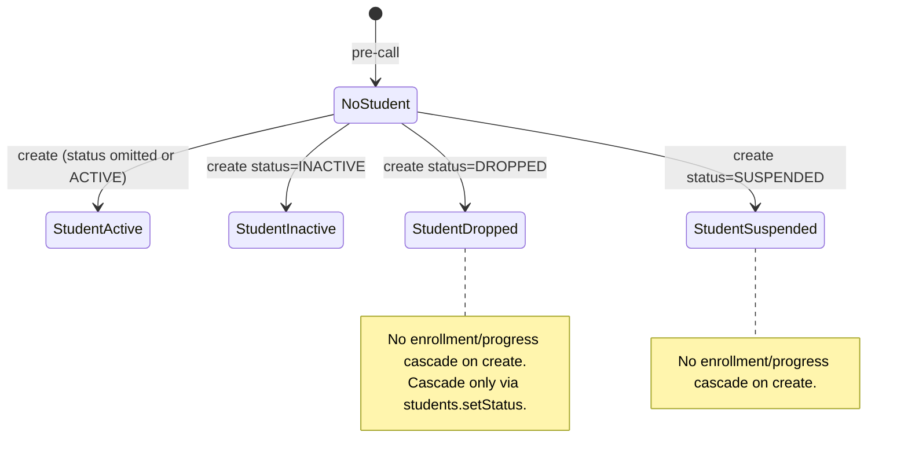
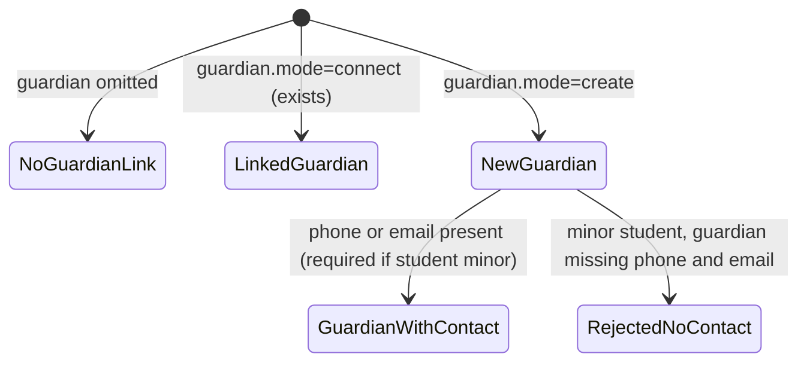
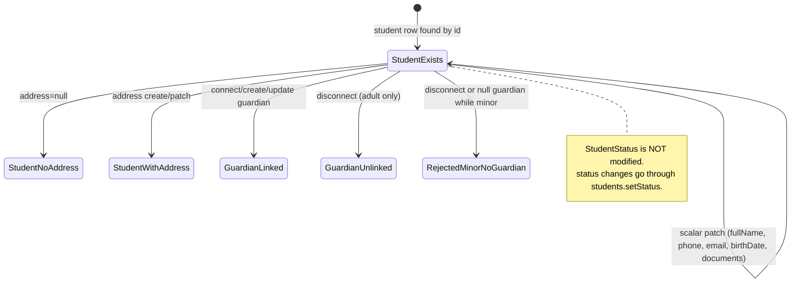
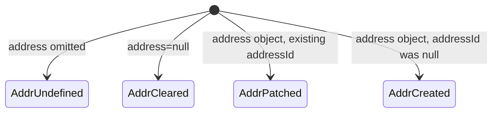

# PAIR-03 — Students write mutations

Analysis of `students.create` and `students.updateContact` only.

---

## `students.create`

- **Type:** mutation
- **Auth:** `adminProcedure` (requires authenticated, enabled staff with role `ADMIN`; TEACHER/SECRETARY/FINANCE denied with `FORBIDDEN`, anonymous with `UNAUTHORIZED`)
- **Input schema:** `studentCreateInputSchema`
  - `fullName`: required, trimmed, min 1 (`"Campo obrigatorio."`)
  - `phone`, `email`, `notes`: optional; if present, trimmed non-empty
  - `birthDate`: optional/nullish, coerced date (`"Data invalida."` on failure)
  - `documentType`: `"CPF" | "RG"` optional/nullish
  - `documentNumber`: optional/nullish; if set, `documentType` required (`"Informe o tipo do documento quando preencher o numero."`)
  - `status`: optional `StudentStatus` enum (`ACTIVE | INACTIVE | DROPPED | SUSPENDED`); defaults to `ACTIVE` in resolver when omitted
  - `address`: optional/nullish strict object (street, number, complement, neighborhood, city, state, postalCode — each optional but non-empty if present)
  - `guardian`: optional discriminated union:
    - `{ mode: "connect", id: uuid }`
    - `{ mode: "create", input: guardianCreateInputSchema, useStudentAddress?: boolean }`
- **Entities touched:**
  - `Address` (create, optional)
  - `Guardian` (create or connect, optional)
  - `Student` (create): `fullName`, `phone`, `email`, `birthDate`, `documentType`, `documentNumber`, `addressId`, `guardianId`, `status`, `notes`

### State preconditions

- Caller is authenticated ADMIN staff (`ctx.staffUser.role === "ADMIN"`).
- If `guardian.mode === "connect"`, referenced `Guardian` row must exist.
- No pre-existing `Student` row required (creates new).
- No uniqueness constraints on student contact fields at DB level (duplicates allowed).

### Scenarios

| ID    | Scenario                                                | Given (state)                                                 | Input                                                                                                | Expected outcome                               | HTTP/tRPC error (if any)                                                                  | Post-state                                                                                            |
| ----- | ------------------------------------------------------- | ------------------------------------------------------------- | ---------------------------------------------------------------------------------------------------- | ---------------------------------------------- | ----------------------------------------------------------------------------------------- | ----------------------------------------------------------------------------------------------------- |
| C-S1  | Happy path — adult with address                         | ADMIN caller, empty DB for student                            | `fullName`, `phone`, `email`, `birthDate` (adult), `documentType`+`documentNumber`, `address` object | `{ id }` returned; student + address persisted | —                                                                                         | `Student.status = ACTIVE` (default); `Address` linked; `guardianId = null`                            |
| C-S2  | Happy path — minimal adult                              | ADMIN caller                                                  | `{ fullName }` only                                                                                  | `{ id }` returned                              | —                                                                                         | `Student` with defaults: `status=ACTIVE`, nullable fields null                                        |
| C-S3  | Happy path — minor with nested guardian sharing address | ADMIN caller                                                  | Minor `birthDate`, `address`, `guardian.mode=create`, `useStudentAddress=true`, guardian has `phone` | `{ id }` returned                              | —                                                                                         | Student minor linked to new guardian; guardian `addressId === student.addressId`                      |
| C-S4  | Happy path — minor with separate guardian address       | ADMIN caller                                                  | Minor `birthDate`, `guardian.mode=create` with guardian `address` and `phone`                        | `{ id }` returned                              | —                                                                                         | Student + guardian each with own address                                                              |
| C-S5  | Happy path — connect existing guardian                  | ADMIN caller; guardian G exists with phone/email              | Minor `birthDate`, `guardian.mode=connect`, `guardian.id=G.id`                                       | `{ id }` returned                              | —                                                                                         | `Student.guardianId = G.id`                                                                           |
| C-S6  | Explicit status on create                               | ADMIN caller                                                  | `{ fullName, status: "INACTIVE" }` (or `DROPPED`, `SUSPENDED`)                                       | `{ id }` returned                              | —                                                                                         | `Student.status` set to input value; **no** enrollment/progress cascade (cascade is `setStatus` only) |
| C-S7  | RBAC — TEACHER denied                                   | TEACHER caller                                                | any valid input                                                                                      | Rejected at gate                               | `FORBIDDEN` (403)                                                                         | No DB writes                                                                                          |
| C-S8  | RBAC — anonymous denied                                 | No session                                                    | any input                                                                                            | Rejected at gate                               | `UNAUTHORIZED` (401)                                                                      | No DB writes                                                                                          |
| C-S9  | Validation — missing fullName                           | ADMIN caller                                                  | `{ fullName: "" }` or whitespace                                                                     | Rejected at input parse                        | `BAD_REQUEST` (Zod: `"Campo obrigatorio."`)                                               | No DB writes                                                                                          |
| C-S10 | Validation — document number without type               | ADMIN caller                                                  | `{ fullName, documentNumber: "123" }` without `documentType`                                         | Rejected at input parse                        | `BAD_REQUEST` (Zod: `"Informe o tipo do documento quando preencher o numero."`)           | No DB writes                                                                                          |
| C-S11 | Validation — invalid birthDate                          | ADMIN caller                                                  | `{ fullName, birthDate: "not-a-date" }`                                                              | Rejected at input parse                        | `BAD_REQUEST` (Zod: `"Data invalida."`)                                                   | No DB writes                                                                                          |
| C-S12 | Validation — invalid guardian connect UUID              | ADMIN caller                                                  | `{ fullName, guardian: { mode: "connect", id: "bad" } }`                                             | Rejected at input parse                        | `BAD_REQUEST` (Zod UUID)                                                                  | No DB writes                                                                                          |
| C-S13 | Domain — minor without guardian                         | ADMIN caller                                                  | Minor `birthDate`, no `guardian`                                                                     | Rejected in resolver                           | `BAD_REQUEST`: `"Responsavel obrigatorio para alunos menores de idade."`                  | Transaction rolled back; no student                                                                   |
| C-S14 | Domain — minor guardian without contact                 | ADMIN caller                                                  | Minor `birthDate`, `guardian.mode=create` with `fullName`+`relationship` only (no phone/email)       | Rejected in resolver                           | `BAD_REQUEST`: `"Informe telefone ou email do responsavel para alunos menores de idade."` | Transaction rolled back                                                                               |
| C-S15 | Domain — connect non-existent guardian                  | ADMIN caller                                                  | Minor `birthDate`, `guardian.mode=connect`, random UUID                                              | Rejected in resolver                           | `NOT_FOUND`: `"Responsavel nao encontrado."`                                              | Transaction rolled back                                                                               |
| C-S16 | Domain — minor with connected guardian lacking contact  | ADMIN caller; guardian G exists with `phone=null, email=null` | Minor `birthDate`, connect G                                                                         | Rejected in resolver                           | `BAD_REQUEST`: `"Informe telefone ou email do responsavel para alunos menores de idade."` | Transaction rolled back                                                                               |
| C-S17 | Adult — no guardian required                            | ADMIN caller                                                  | Adult `birthDate` or null `birthDate`, no guardian                                                   | `{ id }` returned                              | —                                                                                         | `guardianId = null`                                                                                   |
| C-S18 | Duplicate contact data allowed                          | ADMIN caller; student S1 exists with CPF X                    | Create S2 with same `documentNumber`                                                                 | `{ id }` returned (new UUID)                   | —                                                                                         | Two students share document number (no DB unique constraint)                                          |
| C-S19 | Null birthDate treated as adult                         | ADMIN caller                                                  | `{ fullName }` (no birthDate)                                                                        | `{ id }` returned                              | —                                                                                         | Not minor; guardian rules skipped                                                                     |

### State transitions (flow nodes)

Guardian subgraph (within create transaction):

### Outbound edges

| Target                   | Condition                                                |
| ------------------------ | -------------------------------------------------------- |
| `students.byId`          | Read back created profile aggregate                      |
| `students.search`        | New student appears in search (if not soft-deleted)      |
| `students.updateContact` | Follow-up contact edits                                  |
| `students.updateNotes`   | Separate notes mutation                                  |
| `students.setStatus`     | Status changes + lifecycle cascade for DROPPED/SUSPENDED |
| `enrollment.create`      | Requires existing student id                             |
| Finance/order flows      | Student as beneficiary (downstream domains)              |

### Evidence

- `packages/api/src/students/router.ts` — procedure wiring, `$transaction`
- `packages/api/src/students/data.ts` — `createStudent`, guardian/address orchestration, defaults
- `packages/api/src/students/related-records.ts` — guardian connect/create, address create
- `packages/api/src/students/date-rules.ts` — `isMinorInSaoPaulo`
- `packages/api/src/students/errors.ts` — error codes/messages
- `packages/validators/src/student.ts` — input schemas, validation messages
- `packages/db/prisma/schema.prisma` — `Student`, `Guardian`, `Address`, `StudentStatus` enum (no unique on student document)
- `packages/api/src/trpc/init.ts` — `adminProcedure` gate
- Tests:
  - `packages/api/test/db/students.test.ts` — C-S1, C-S3, C-S13, C-S14
  - `packages/api/test/db/students-search.test.ts` — additional create fixtures
  - `packages/api/test/behavior/students-http.test.ts` — HTTP create path (C-S2 variant)

---

## `students.updateContact`

- **Type:** mutation
- **Auth:** `adminProcedure` (same as create)
- **Input schema:** `studentUpdateContactProcedureInputSchema`
  - `id`: UUID (student id)
  - `input`: `studentUpdateContactInputSchema` (all fields optional/patch semantics):
    - `fullName`, `phone`, `email`, `birthDate`, `documentType`, `documentNumber` — same constraints as create but optional
    - `address`: optional/nullish; `undefined` = no change, `null` = clear link, object = upsert/patch
    - `guardian`: optional discriminated union:
      - `{ mode: "connect", id: uuid }`
      - `{ mode: "disconnect" }`
      - `{ mode: "create", input, useStudentAddress? }`
      - `{ mode: "update", input, useStudentAddress? }`
  - **Does not accept** `status` or `notes` (separate procedures)
- **Entities touched:**
  - `Student` (update): provided scalar fields + `addressId` + `guardianId`
  - `Address` (create or update in place)
  - `Guardian` (create, update in place, connect, or disconnect)

### State preconditions

- Caller is authenticated ADMIN.
- `Student` row with `id` must exist (`loadStudentForUpdate` does **not** filter `deletedAt`).
- If `guardian.mode === "connect"`, referenced guardian must exist.
- If `guardian.mode === "update"`, student must already have `guardianId !== null`.
- After patch, effective birth date + guardian must satisfy minor rules.

### Scenarios

| ID    | Scenario                                              | Given (state)                                        | Input                                                                                                                                | Expected outcome                         | HTTP/tRPC error (if any)                                                                  | Post-state                                                                                                                     |
| ----- | ----------------------------------------------------- | ---------------------------------------------------- | ------------------------------------------------------------------------------------------------------------------------------------ | ---------------------------------------- | ----------------------------------------------------------------------------------------- | ------------------------------------------------------------------------------------------------------------------------------ |
| U-S1  | Happy path — patch contact, address, guardian         | ADMIN; minor student S with address A and guardian G | `{ id: S, input: { fullName, phone, address: { street }, guardian: { mode: "update", input: { fullName, relationship, email } } } }` | `{ id: S.id }`                           | —                                                                                         | Student scalars updated; address A patched in place; guardian G updated; guardian address unchanged unless `useStudentAddress` |
| U-S2  | Happy path — partial patch                            | ADMIN; student S exists                              | `{ id: S, input: { phone: "..." } }`                                                                                                 | `{ id }`                                 | —                                                                                         | Only `phone` changed; other fields untouched                                                                                   |
| U-S3  | Clear address                                         | ADMIN; student with `addressId` set                  | `{ id, input: { address: null } }`                                                                                                   | `{ id }`                                 | —                                                                                         | `Student.addressId = null` (address row orphaned)                                                                              |
| U-S4  | Create address when none exists                       | ADMIN; student with `addressId = null`               | `{ id, input: { address: { street, city, state } } }`                                                                                | `{ id }`                                 | —                                                                                         | New address created and linked                                                                                                 |
| U-S5  | Guardian disconnect on adult                          | ADMIN; adult student with guardian                   | `{ id, input: { guardian: { mode: "disconnect" } } }`                                                                                | `{ id }`                                 | —                                                                                         | `Student.guardianId = null`                                                                                                    |
| U-S6  | Guardian connect swap                                 | ADMIN; student S; guardian G2 exists with contact    | `{ id, input: { guardian: { mode: "connect", id: G2.id } } }`                                                                        | `{ id }`                                 | —                                                                                         | `Student.guardianId = G2.id`                                                                                                   |
| U-S7  | Guardian create replacement                           | ADMIN; student S (any guardian state)                | `{ id, input: { guardian: { mode: "create", input: { fullName, phone } } } }`                                                        | `{ id }`                                 | —                                                                                         | New guardian created and linked                                                                                                |
| U-S8  | RBAC — TEACHER denied                                 | TEACHER caller; student exists                       | any                                                                                                                                  | Rejected at gate                         | `FORBIDDEN` (403)                                                                         | No changes                                                                                                                     |
| U-S9  | RBAC — anonymous denied                               | No session                                           | any                                                                                                                                  | Rejected at gate                         | `UNAUTHORIZED` (401)                                                                      | No changes                                                                                                                     |
| U-S10 | Not found — invalid student id                        | ADMIN; no student                                    | `{ id: random UUID, input: {} }`                                                                                                     | Rejected                                 | `NOT_FOUND`: `"Aluno nao encontrado."`                                                    | No changes                                                                                                                     |
| U-S11 | Not found — guardian update without existing guardian | ADMIN; student with `guardianId = null`              | `{ id, input: { guardian: { mode: "update", input: { fullName: "X" } } } }`                                                          | Rejected                                 | `NOT_FOUND`: `"Responsavel nao encontrado."`                                              | No changes                                                                                                                     |
| U-S12 | Not found — connect missing guardian                  | ADMIN; student exists                                | `{ id, input: { guardian: { mode: "connect", id: random UUID } } }`                                                                  | Rejected                                 | `NOT_FOUND`: `"Responsavel nao encontrado."`                                              | No changes                                                                                                                     |
| U-S13 | Domain — disconnect guardian on minor                 | ADMIN; minor student with guardian                   | `{ id, input: { guardian: { mode: "disconnect" } } }`                                                                                | Rejected                                 | `BAD_REQUEST`: `"Responsavel obrigatorio para alunos menores de idade."`                  | No changes                                                                                                                     |
| U-S14 | Domain — birthDate patch makes minor without guardian | ADMIN; adult student, no guardian                    | `{ id, input: { birthDate: minorDate } }`                                                                                            | Rejected                                 | `BAD_REQUEST`: `"Responsavel obrigatorio para alunos menores de idade."`                  | No changes                                                                                                                     |
| U-S15 | Domain — minor guardian loses contact                 | ADMIN; minor with guardian (phone only)              | `{ id, input: { guardian: { mode: "update", input: { phone: null, email: null } } } }`                                               | Rejected                                 | `BAD_REQUEST`: `"Informe telefone ou email do responsavel para alunos menores de idade."` | No changes                                                                                                                     |
| U-S16 | Validation — empty fullName patch                     | ADMIN; student exists                                | `{ id, input: { fullName: "  " } }`                                                                                                  | Rejected at parse                        | `BAD_REQUEST` (Zod)                                                                       | No changes                                                                                                                     |
| U-S17 | Validation — document number without type             | ADMIN; student exists                                | `{ id, input: { documentNumber: "123" } }`                                                                                           | Rejected at parse                        | `BAD_REQUEST` (Zod)                                                                       | No changes                                                                                                                     |
| U-S18 | Soft-deleted student still updatable                  | ADMIN; student with `deletedAt` set                  | valid patch                                                                                                                          | `{ id }` (no deletedAt filter in loader) | —                                                                                         | Student updated despite soft delete                                                                                            |
| U-S19 | Status unchanged                                      | ADMIN; student `status=DROPPED`                      | contact patch only                                                                                                                   | `{ id }`                                 | —                                                                                         | `Student.status` remains `DROPPED` (status not in schema)                                                                      |
| U-S20 | Duplicate document on update                          | ADMIN; two students; patch S2 to S1's documentNumber | `{ id: S2, input: { documentNumber: same as S1 } }`                                                                                  | `{ id }`                                 | —                                                                                         | Allowed (no unique constraint)                                                                                                 |

### State transitions (flow nodes)

Address resolution:

### Outbound edges

| Target                        | Condition                                                        |
| ----------------------------- | ---------------------------------------------------------------- |
| `students.byId`               | Verify updated profile aggregate                                 |
| `students.search`             | Updated fields affect search ranking                             |
| `students.updateNotes`        | Complementary write (notes not in this mutation)                 |
| `students.setStatus`          | Only path to change `StudentStatus` or trigger lifecycle cascade |
| Downstream enrollment/finance | Contact data consumed but not modified here                      |

### Evidence

- `packages/api/src/students/router.ts` — procedure + transaction
- `packages/api/src/students/data.ts` — `updateStudentContact`, `loadStudentForUpdate`, patch builders
- `packages/api/src/students/related-records.ts` — address upsert, guardian disconnect/connect/create/update
- `packages/validators/src/student.ts` — update schemas
- `packages/db/prisma/schema.prisma` — models (no student document uniqueness)
- Tests:
  - `packages/api/test/db/students.test.ts` — U-S1 (update contact/address/guardian)
  - No dedicated tests for U-S3–U-S7, U-S10–U-S15, U-S18 (inferred from source)

---

## Cross-endpoint edges (this pair only)

| From                     | To                       | Condition                                                                                                               |
| ------------------------ | ------------------------ | ----------------------------------------------------------------------------------------------------------------------- |
| `students.create`        | `students.byId`          | After create, read profile by returned `id`                                                                             |
| `students.create`        | `students.updateContact` | Typical follow-up to amend contact/guardian/address                                                                     |
| `students.create`        | `students.setStatus`     | Initial status may be set on create, but lifecycle cascade (DROPPED/SUSPENDED closing enrollments) requires `setStatus` |
| `students.updateContact` | `students.byId`          | Verify patch via profile read                                                                                           |
| `students.updateContact` | `students.setStatus`     | Status changes are out of scope for `updateContact`                                                                     |
| `students.create`        | `students.search`        | Created student indexed for discovery (excludes `deleted_at IS NOT NULL` in search query only)                          |
| `students.updateContact` | `students.search`        | Patched name/phone/email/document affect search results                                                                 |
| `students.create`        | `enrollment.create`      | Student must exist before enrollment                                                                                    |
| `students.create`        | `students.updateNotes`   | Notes can be set on create input or via separate mutation                                                               |

---

## DB validation

Not run in this analysis session. Scenarios C-S1–C-S14 and U-S1 are covered by existing `pnpm test:db` tests in `packages/api/test/db/students.test.ts`.
