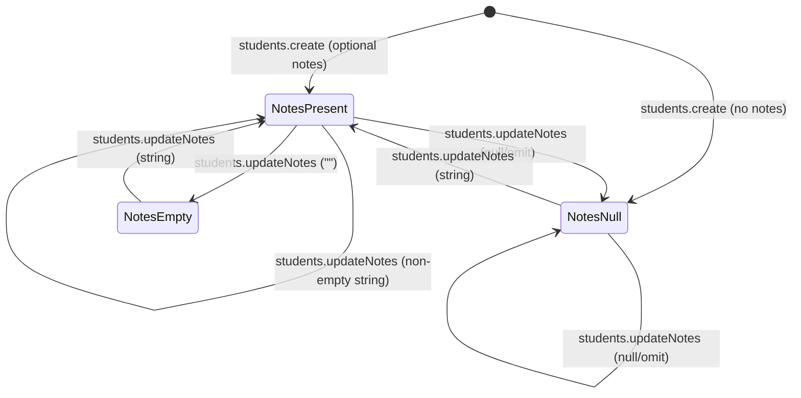
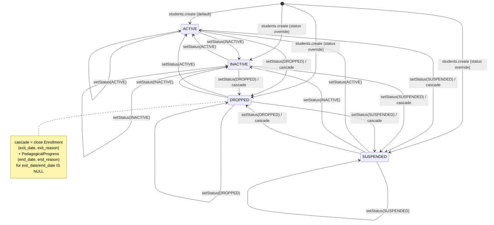

# PAIR-04 — `students.updateNotes` + `students.setStatus`

## `students.updateNotes`

- **Type:** mutation
- **Auth:** `adminProcedure` (authenticated, enabled staff with role `ADMIN` only)
- **Input schema:** `{ id: uuid, notes?: string | null }` — `notes` is optional/nullable; when present it is trimmed (`z.string().trim().nullish()`). No minimum length on `notes` (unlike `optionalText` elsewhere).
- **Entities touched:** `Student.notes` only

### State preconditions

- Caller must be an enabled staff user with role `ADMIN`.
- Target `Student` row must exist (implicit via Prisma `update`; no explicit pre-check).
- No precondition on `Student.status`, enrollments, or `deletedAt` (soft-delete middleware filters reads only; `update` is not filtered).

### Scenarios

| ID  | Scenario               | Given (state)                                | Input                                    | Expected outcome                                   | HTTP/tRPC error (if any)          | Post-state                                                          |
| --- | ---------------------- | -------------------------------------------- | ---------------------------------------- | -------------------------------------------------- | --------------------------------- | ------------------------------------------------------------------- |
| S1  | Happy path — set notes | Student exists, any status                   | `{ id, notes: "Prefere WhatsApp." }`     | Success; returns `{ id }`                          | —                                 | `Student.notes` = given string                                      |
| S2  | Clear notes            | Student with `notes` set                     | `{ id, notes: null }` or `{ id }` (omit) | Success                                            | —                                 | `Student.notes` = `null`                                            |
| S3  | Empty string           | Student exists                               | `{ id, notes: "" }`                      | Success                                            | —                                 | `Student.notes` = `""` (empty string is valid; not coerced to null) |
| S4  | Whitespace-only        | Student exists                               | `{ id, notes: "   " }`                   | Success after trim                                 | —                                 | `Student.notes` = `""`                                              |
| S5  | RBAC — unauthenticated | No `staffUser` in context                    | valid input                              | Rejected                                           | `UNAUTHORIZED` (401)              | Unchanged                                                           |
| S6  | RBAC — non-admin       | `TEACHER` / `FINANCE` staff                  | valid input                              | Rejected                                           | `FORBIDDEN` (403)                 | Unchanged                                                           |
| S7  | Validation — bad id    | —                                            | `{ id: "not-a-uuid", notes: "x" }`       | Rejected                                           | `BAD_REQUEST` + Zod flatten       | Unchanged                                                           |
| S8  | Student not found      | No matching `Student.id`                     | `{ id: random uuid, notes: "x" }`        | Prisma `P2025` bubbles up (no `NOT_FOUND` wrapper) | `INTERNAL_SERVER_ERROR` (typical) | Unchanged                                                           |
| S9  | Soft-deleted student   | `Student.deletedAt` set                      | valid `id`                               | Likely succeeds (update not soft-delete-filtered)  | —                                 | `notes` updated on deleted row                                      |
| S10 | Status-independent     | Student `DROPPED` / `SUSPENDED` / `INACTIVE` | valid notes                              | Success                                            | —                                 | Only `notes` changes; `status` and enrollments untouched            |

### State transitions (flow nodes)

`updateNotes` does not participate in `StudentStatus` transitions. It only mutates free-text `notes`.

### Outbound edges

| Target          | Condition                                                   |
| --------------- | ----------------------------------------------------------- |
| `students.byId` | Read back `profile.notes` after update                      |
| (none)          | Does not enqueue jobs, close enrollments, or change billing |

### Evidence

- `packages/api/src/students/router.ts` (procedure wiring)
- `packages/validators/src/student.ts` (`studentUpdateNotesInputSchema`)
- `packages/db/prisma/schema.prisma` (`Student.notes`, `StudentStatus` enum)
- `packages/api/test/db/students.test.ts` (happy path in contact-update test)
- `packages/api/src/trpc/init.ts` (`adminProcedure` RBAC)
- `packages/db/src/soft-delete.ts` (read-only `deletedAt` filter)

---

## `students.setStatus`

- **Type:** mutation
- **Auth:** `adminProcedure` (authenticated, enabled staff with role `ADMIN` only)
- **Input schema:** `{ id: uuid, status: StudentStatus }` where `StudentStatus ∈ { ACTIVE, INACTIVE, DROPPED, SUSPENDED }` (`studentStatusSchema`).
- **Entities touched:**
  - `Student.status` (always)
  - `Enrollment.exitDate`, `Enrollment.exitReason` (when new status is `DROPPED` or `SUSPENDED`, for rows with `exit_date IS NULL`)
  - `PedagogicalProgress.endDate`, `PedagogicalProgress.endReason` (same cascade, for progress tied to closed enrollments)

### State preconditions

- Caller must be an enabled, `ADMIN` staff user.
- Target student must exist and be visible to reads (`findUnique` applies soft-delete filter → soft-deleted students count as not found).
- **No enforced source-status precondition** — any current `Student.status` may transition to any enum value (no transition matrix in application code).
- Cascade preconditions (when setting `DROPPED` / `SUSPENDED`):
  - `Enrollment` table must exist (otherwise cascade skipped silently).
  - Active enrollments = `exit_date IS NULL` for the student.
  - `PedagogicalProgress` table must exist and at least one enrollment was closed in this call (otherwise progress update skipped).

### Scenarios

| ID  | Scenario                       | Given (state)                                            | Input                                                                | Expected outcome                 | HTTP/tRPC error (if any)                | Post-state                                                                                                                                |
| --- | ------------------------------ | -------------------------------------------------------- | -------------------------------------------------------------------- | -------------------------------- | --------------------------------------- | ----------------------------------------------------------------------------------------------------------------------------------------- |
| S1  | Happy path — drop              | Student `ACTIVE`, optional active enrollment/progress    | `{ id, status: "DROPPED" }`                                          | Success `{ id }`                 | —                                       | `status=DROPPED`; active enrollments `exitDate=today(SP)`, `exitReason=DROPPED`; active progress `endDate=today(SP)`, `endReason=DROPPED` |
| S2  | Happy path — suspend           | Student `ACTIVE`, active + already-closed lifecycle rows | `{ id, status: "SUSPENDED" }`                                        | Success                          | —                                       | `status=SUSPENDED`; only **active** enrollments/progress closed with `SUSPENDED`; already-closed rows unchanged                           |
| S3  | Status-only — inactive         | Any status, any enrollments                              | `{ id, status: "INACTIVE" }`                                         | Success                          | —                                       | `status=INACTIVE` only; enrollments/progress untouched                                                                                    |
| S4  | Status-only — reactivate       | Student `DROPPED`/`SUSPENDED`/`INACTIVE`                 | `{ id, status: "ACTIVE" }`                                           | Success                          | —                                       | `status=ACTIVE` only; **does not** reopen closed enrollments/progress                                                                     |
| S5  | Idempotent same closing status | Student already `DROPPED`, all enrollments closed        | `{ id, status: "DROPPED" }`                                          | Success                          | —                                       | `status` unchanged; cascade UPDATE matches 0 active rows                                                                                  |
| S6  | No enrollments                 | Student exists, no `Enrollment` rows                     | `{ id, status: "SUSPENDED" }`                                        | Success                          | —                                       | `status=SUSPENDED` only                                                                                                                   |
| S7  | RBAC — unauthenticated         | —                                                        | valid input                                                          | Rejected                         | `UNAUTHORIZED` (401)                    | Unchanged                                                                                                                                 |
| S8  | RBAC — non-admin               | `TEACHER` staff                                          | valid input                                                          | Rejected                         | `FORBIDDEN` (403)                       | Unchanged                                                                                                                                 |
| S9  | Validation — bad id            | —                                                        | `{ id: "x", status: "ACTIVE" }`                                      | Rejected                         | `BAD_REQUEST` + Zod flatten             | Unchanged                                                                                                                                 |
| S10 | Validation — bad status        | Student exists                                           | `{ id, status: "LEAD" }`                                             | Rejected                         | `BAD_REQUEST` + Zod flatten             | Unchanged                                                                                                                                 |
| S11 | Student not found              | Unknown uuid                                             | `{ id: random uuid, status: "ACTIVE" }`                              | Rejected                         | `NOT_FOUND` — `"Aluno nao encontrado."` | Unchanged                                                                                                                                 |
| S12 | Soft-deleted student           | `Student.deletedAt` set                                  | valid `id`                                                           | Rejected (read filter hides row) | `NOT_FOUND`                             | Unchanged                                                                                                                                 |
| S13 | Cross closing reasons          | Student `ACTIVE`, active enrollment                      | `{ id, status: "SUSPENDED" }` then later `{ id, status: "DROPPED" }` | Both succeed                     | —                                       | Final `status=DROPPED`; rows already closed keep first reason unless still active                                                         |

### StudentStatus transition matrix (complete)

Application code enforces **no invalid transitions**. All 16 directed transitions are accepted if the student exists and input validates.

| From \ To     | ACTIVE                             | INACTIVE                    | DROPPED                                                                                                                       | SUSPENDED                                                                   |
| ------------- | ---------------------------------- | --------------------------- | ----------------------------------------------------------------------------------------------------------------------------- | --------------------------------------------------------------------------- |
| **ACTIVE**    | ✅ status only                     | ✅ status only              | ✅ status + cascade close active enrollment/progress (`exitReason`/`endReason` = `DROPPED`, date = today `America/Sao_Paulo`) | ✅ status + cascade (`… = SUSPENDED`)                                       |
| **INACTIVE**  | ✅ status only                     | ✅ status only (idempotent) | ✅ status + cascade                                                                                                           | ✅ status + cascade                                                         |
| **DROPPED**   | ✅ status only (no auto re-enroll) | ✅ status only              | ✅ status + cascade on any still-active rows                                                                                  | ✅ status + cascade on any still-active rows                                |
| **SUSPENDED** | ✅ status only (no auto re-enroll) | ✅ status only              | ✅ status + cascade on any still-active rows                                                                                  | ✅ status + cascade on any still-active rows (idempotent if already closed) |

**Invalid transitions (application layer):** none — no `BAD_REQUEST` for disallowed from→to pairs.

**Invalid transitions (deferred DB invariant, not app-enforced):** `TECHNICAL_SPEC` describes a deferrable trigger: a `DROPPED` or `SUSPENDED` student should not retain active enrollments/progress **after** the transaction. `setStatus` satisfies this for the closing statuses via cascade; setting `ACTIVE`/`INACTIVE` while active enrollments exist is **allowed** today.

**Product-intent gaps (not code rejections):**

- `ACTIVE` / `INACTIVE` from `DROPPED`/`SUSPENDED` does not reopen academic lifecycle — staff must `enrollment.create` (re-enroll) separately.
- No billing mutation on any status change (per D-0024).
- No audit trail / reason capture for `DROPPED` (deferred per PRD).

### State transitions (flow nodes)

### Outbound edges

| Target                         | Condition                                                                                                |
| ------------------------------ | -------------------------------------------------------------------------------------------------------- |
| `students.byId`                | Verify `contact.status` after change                                                                     |
| `enrollment.create`            | Required to return a dropped/suspended student to active rosters (status `ACTIVE` alone is insufficient) |
| `enrollment.close`             | Alternative per-enrollment close (`DROPPED`/`SUSPENDED`) without changing `Student.status`               |
| Attendance / dashboard queries | Student removed from active denominators when enrollments closed via `SUSPENDED`/`DROPPED` cascade       |
| (none)                         | No Hatchet jobs, no automatic billing/installment changes                                                |

### Evidence

- `packages/api/src/students/router.ts`
- `packages/api/src/students/status.ts` (`setStudentStatus`, `closeActiveAcademicLifecycleRows`)
- `packages/api/src/students/date-rules.ts` (`todayDateOnlyInSaoPaulo`)
- `packages/api/src/students/errors.ts` (`STUDENT_NOT_FOUND_MESSAGE`)
- `packages/validators/src/student.ts` (`studentSetStatusInputSchema`, `studentStatusSchema`)
- `packages/db/prisma/schema.prisma` (`enum StudentStatus`, `Student.status` default `ACTIVE`)
- `packages/api/test/db/students-status.test.ts` (drop, suspend cascade, closed-row preservation)
- `packages/api/src/enrollment/close.ts` (documents inverse: per-enrollment close without `Student.status`)
- `docs/MVP/decisions.md` D-0024 (status semantics, suspension cascade, no billing)
- `docs/MVP/TECHNICAL_SPEC.md` §4.2 (deferrable trigger note)

### DB validation

Not run in this analysis session. Existing coverage: `packages/api/test/db/students-status.test.ts` (3 database tests).

---

## Cross-endpoint edges (this pair only)

| From                                         | To                                               | Condition                                                                                    |
| -------------------------------------------- | ------------------------------------------------ | -------------------------------------------------------------------------------------------- |
| `students.setStatus` (`DROPPED`/`SUSPENDED`) | `Enrollment` + `PedagogicalProgress` row updates | Inline cascade in same transaction; not a separate tRPC call                                 |
| `students.setStatus` (`ACTIVE`/`INACTIVE`)   | `students.byId`                                  | Status field changes; enrollments unchanged                                                  |
| `students.setStatus` (`DROPPED`/`SUSPENDED`) | `enrollment.create`                              | Staff re-enrolls later; no `resume` enrollment state in MVP                                  |
| `enrollment.close`                           | `students.setStatus`                             | Independent paths — enrollment close does not set `Student.status`; student-level close does |
| `students.updateNotes`                       | `students.byId`                                  | Read `profile.notes`                                                                         |
| `students.create`                            | `students.setStatus`                             | Initial `status` may be set at create or changed later via `setStatus`                       |
| `students.updateNotes`                       | `students.setStatus`                             | Orthogonal — notes updates do not affect status transitions                                  |
