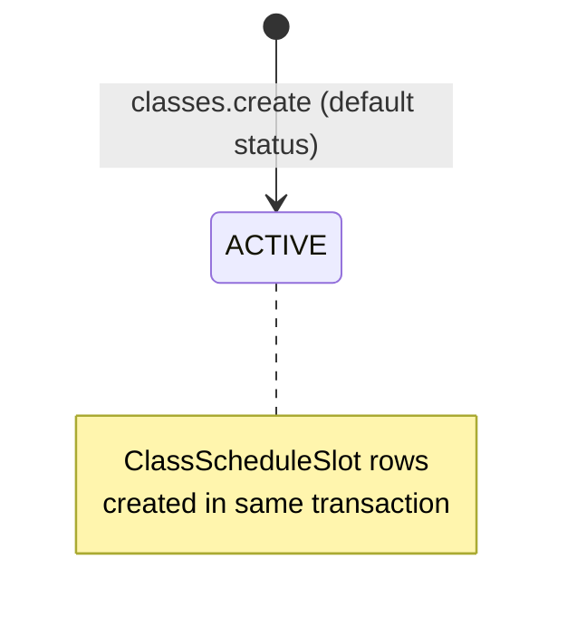
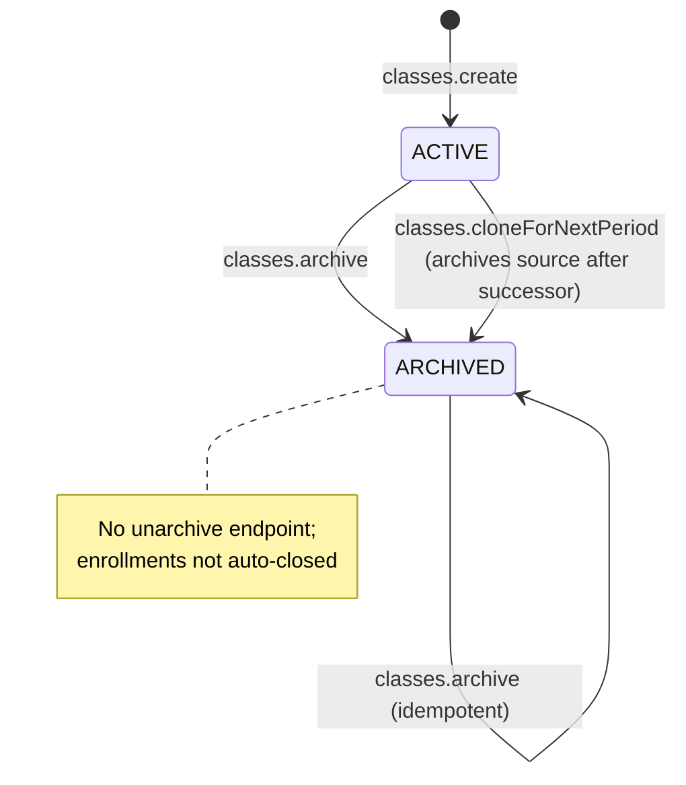

# PAIR-05 — `classes.create` + `classes.archive`

## `classes.create`

- **Type:** mutation
- **Auth:** `adminProcedure` (authenticated, enabled staff with role `ADMIN` only)
- **Input schema:** `classCreateInputSchema` — strict object:
  - `internalCode`: trimmed non-empty string (unique in DB)
  - `teacherId`: UUID
  - `scheduleType`: `REGULAR` | `PERSONALIZED`
  - `format`: `IN_PERSON` | `ONLINE`
  - `sharedStageId`: UUID, required for `REGULAR`, forbidden for `PERSONALIZED`
  - `semesterId`: UUID, required for both schedule types
  - `year`: int 2000–2100
  - `capacity`: int ≥ 1
  - `portalClassName`: trimmed non-empty string, required for `PERSONALIZED`, forbidden for `REGULAR`
  - `slots`: array min 1 of `{ weekday, startTime, endTime }` where times are `HH:mm` and `startTime < endTime`
- **Entities touched:**
  - `Class` — `internalCode`, `teacherId`, `scheduleType`, `format`, `sharedStageId`, `semesterId`, `year`, `capacity`, `portalClassName`, `originalPortalClassName`, `status` (default `ACTIVE`)
  - `ClassScheduleSlot` — one row per input slot (`weekday`, `startTime`, `endTime`)

### State preconditions

- Caller must be an enabled staff user with role `ADMIN`.
- **Teacher:** `User` row with `id = teacherId`, `role = TEACHER`, `isEnabled = true`.
- **Semester:** row must exist (`semesterId`).
- **REGULAR only:**
  - `Stage` row must exist (`sharedStageId`).
  - Parent `Track.status` must not be `LEGACY`.
  - No active class (`status = ACTIVE`, `deletedAt IS NULL`) may already use the generated `portalClassName` (collision loop up to 50 sequences).
- **PERSONALIZED only:**
  - No active class may already use the supplied `portalClassName`.
- **Both:** `internalCode` must be globally unique (DB `@unique`; no app-level pre-check).
- No precondition on existing classes for the teacher/stage/semester beyond portal-name uniqueness.

### Scenarios

| ID  | Scenario                                      | Given (state)                                                     | Input                                                     | Expected outcome                                                                          | HTTP/tRPC error (if any)                                                      | Post-state                                                           |
| --- | --------------------------------------------- | ----------------------------------------------------------------- | --------------------------------------------------------- | ----------------------------------------------------------------------------------------- | ----------------------------------------------------------------------------- | -------------------------------------------------------------------- |
| S1  | Happy path — regular                          | Active teacher, active track/stage, semester, no portal collision | REGULAR payload with `sharedStageId`, `semesterId`, slots | Success; `ClassSummary` with `status=ACTIVE`, auto `portalClassName`, `sharedStageId` set | —                                                                             | `Class` + `ClassScheduleSlot` rows created                           |
| S2  | Happy path — personalized                     | Active teacher, semester, unique manual portal name               | PERSONALIZED with `portalClassName`, no `sharedStageId`   | Success; `sharedStageId=null`, manual `portalClassName`                                   | —                                                                             | `Class` + slots created                                              |
| S3  | Portal name sequence bump                     | REGULAR; active class already holds base portal name              | Same stage/semester/slots as existing                     | Success; name gets `-2` (or next free sequence) suffix                                    | —                                                                             | Second active class with distinct `portalClassName`                  |
| S4  | RBAC — unauthenticated                        | No `staffUser`                                                    | valid input                                               | Rejected                                                                                  | `UNAUTHORIZED` (401)                                                          | Unchanged                                                            |
| S5  | RBAC — non-admin                              | `TEACHER` / `FINANCE` staff                                       | valid input                                               | Rejected                                                                                  | `FORBIDDEN` (403)                                                             | Unchanged                                                            |
| S6  | Validation — bad teacher UUID                 | —                                                                 | `teacherId: "x"`                                          | Rejected                                                                                  | `BAD_REQUEST` + Zod flatten                                                   | Unchanged                                                            |
| S7  | Validation — empty slots                      | —                                                                 | `slots: []`                                               | Rejected                                                                                  | `BAD_REQUEST` — `"Informe ao menos um horario."`                              | Unchanged                                                            |
| S8  | Validation — invalid time range               | —                                                                 | `startTime >= endTime` on a slot                          | Rejected                                                                                  | `BAD_REQUEST` — start must precede end                                        | Unchanged                                                            |
| S9  | Validation — REGULAR missing stage            | —                                                                 | `scheduleType: REGULAR` without `sharedStageId`           | Rejected                                                                                  | `BAD_REQUEST` — `"Turma regular exige etapa compartilhada."`                  | Unchanged                                                            |
| S10 | Validation — REGULAR with manual portal name  | —                                                                 | `scheduleType: REGULAR` + `portalClassName`               | Rejected                                                                                  | `BAD_REQUEST` — regular rejects manual portal name                            | Unchanged                                                            |
| S11 | Validation — PERSONALIZED missing portal name | —                                                                 | `scheduleType: PERSONALIZED` without `portalClassName`    | Rejected                                                                                  | `BAD_REQUEST` — personalized requires portal name                             | Unchanged                                                            |
| S12 | Validation — PERSONALIZED with shared stage   | —                                                                 | `scheduleType: PERSONALIZED` + `sharedStageId`            | Rejected                                                                                  | `BAD_REQUEST` — personalized cannot have shared stage                         | Unchanged                                                            |
| S13 | Teacher invalid                               | User missing, wrong role, or `isEnabled=false`                    | valid otherwise                                           | Rejected                                                                                  | `BAD_REQUEST` — `"Professor invalido ou inativo."`                            | Unchanged                                                            |
| S14 | Stage not found                               | Unknown `sharedStageId` (REGULAR)                                 | valid REGULAR input                                       | Rejected                                                                                  | `NOT_FOUND` — `"Etapa nao encontrada."`                                       | Unchanged                                                            |
| S15 | Legacy track                                  | Stage exists but `Track.status = LEGACY`                          | valid REGULAR input                                       | Rejected                                                                                  | `BAD_REQUEST` — `"Nao e possivel criar turma em trilha legada."`              | Unchanged                                                            |
| S16 | Semester not found                            | Unknown `semesterId`                                              | valid input                                               | Rejected                                                                                  | `NOT_FOUND` — `"Semestre nao encontrado."`                                    | Unchanged                                                            |
| S17 | Portal name collision — personalized          | Active class with same `portalClassName`                          | PERSONALIZED duplicate name                               | Rejected                                                                                  | `BAD_REQUEST` — `"Nao foi possivel gerar um nome Portal unico para a turma."` | Unchanged                                                            |
| S18 | Portal name collision — regular exhausted     | 50 active REGULAR classes block all sequences                     | identical REGULAR fingerprint                             | Rejected                                                                                  | `BAD_REQUEST` — same collision message                                        | Unchanged                                                            |
| S19 | Duplicate internal code                       | Class with same `internalCode` exists                             | duplicate `internalCode`                                  | Prisma unique violation (no app wrapper)                                                  | `INTERNAL_SERVER_ERROR` (typical)                                             | Unchanged                                                            |
| S20 | Archived class frees portal name              | Only ARCHIVED class holds portal name                             | PERSONALIZED reuses that name                             | Success                                                                                   | —                                                                             | New ACTIVE class reuses name (collision checks `status=ACTIVE` only) |

### State transitions (flow nodes)

`create` always lands in `ACTIVE`. It does not transition existing classes.

### Outbound edges

| Target                       | Condition                                                              |
| ---------------------------- | ---------------------------------------------------------------------- |
| `classes.generateSessions`   | Class exists; enqueues `sessions-generate` job (no inline sessions)    |
| `classes.cloneForNextPeriod` | Source must be `ACTIVE` (clone archives source after successor create) |
| `enrollment.create`          | Requires target class `ACTIVE` (rejected if archived)                  |
| Attendance / makeup routers  | Depend on class + sessions existing (downstream of session generation) |

### Evidence

- `packages/api/src/classes/router.ts` (procedure wiring, `$transaction`)
- `packages/api/src/classes/data.ts` (`createClass`, `createRegularClass`, `createPersonalizedClass`, `buildClassCreateData`)
- `packages/api/src/classes/guards.ts` (`assertTeacherIsActive`, `loadActiveStage`, `loadSemester`)
- `packages/api/src/classes/portal-name.ts` (`resolveRegularPortalClassName`, `assertActivePortalClassNameAvailable`)
- `packages/api/src/classes/errors.ts`
- `packages/validators/src/class.ts` (`classCreateInputSchema`, schedule-type refinements)
- `packages/db/prisma/schema.prisma` (`enum ClassStatus`, `model Class`, `model ClassScheduleSlot`)
- `packages/api/test/db/classes.test.ts` (regular + personalized create)
- `packages/api/test/behavior/classes-http.test.ts` (HTTP create happy path)
- `packages/api/src/trpc/init.ts` (`adminProcedure` RBAC)

---

## `classes.archive`

- **Type:** mutation
- **Auth:** `adminProcedure` (authenticated, enabled staff with role `ADMIN` only)
- **Input schema:** `classArchiveInputSchema` = `{ id: uuid }`
- **Entities touched:** `Class.status` only (`ACTIVE` → `ARCHIVED`)

### State preconditions

- Caller must be an enabled staff user with role `ADMIN`.
- Target `Class` must exist and be visible to reads (soft-delete middleware filters `deletedAt`; soft-deleted class → not found).
- **No precondition on current enrollments, sessions, or teacher** — archive does not cascade-close related rows.
- Idempotent when class is already `ARCHIVED`.

### Scenarios

| ID  | Scenario                       | Given (state)                          | Input                                   | Expected outcome                               | HTTP/tRPC error (if any)                                      | Post-state                                                                                      |
| --- | ------------------------------ | -------------------------------------- | --------------------------------------- | ---------------------------------------------- | ------------------------------------------------------------- | ----------------------------------------------------------------------------------------------- |
| S1  | Happy path — archive active    | Class `ACTIVE`                         | `{ id }`                                | Success; `ClassSummary` with `status=ARCHIVED` | —                                                             | `Class.status=ARCHIVED`                                                                         |
| S2  | Idempotent — already archived  | Class `ARCHIVED`                       | `{ id }`                                | Success; returns existing summary unchanged    | —                                                             | Still `ARCHIVED` (no extra update)                                                              |
| S3  | RBAC — unauthenticated         | No `staffUser`                         | valid `id`                              | Rejected                                       | `UNAUTHORIZED` (401)                                          | Unchanged                                                                                       |
| S4  | RBAC — non-admin               | `TEACHER` staff                        | valid `id`                              | Rejected                                       | `FORBIDDEN` (403)                                             | Unchanged                                                                                       |
| S5  | Validation — bad id            | —                                      | `{ id: "not-a-uuid" }`                  | Rejected                                       | `BAD_REQUEST` + Zod flatten                                   | Unchanged                                                                                       |
| S6  | Class not found                | Unknown uuid                           | `{ id: random uuid }`                   | Rejected                                       | `NOT_FOUND` — `"Turma nao encontrada."`                       | Unchanged                                                                                       |
| S7  | Soft-deleted class             | `Class.deletedAt` set                  | valid `id`                              | Rejected (read filter hides row)               | `NOT_FOUND` — `"Turma nao encontrada."`                       | Unchanged                                                                                       |
| S8  | Enrollments unchanged          | Class `ACTIVE` with active enrollments | `{ id }`                                | Success                                        | —                                                             | `status=ARCHIVED`; enrollments/sessions untouched                                               |
| S9  | Portal name released for reuse | Class archived                         | —                                       | —                                              | —                                                             | `portalClassName` no longer blocks new ACTIVE classes (collision query filters `status=ACTIVE`) |
| S10 | Blocks clone as source         | Class `ARCHIVED`                       | `classes.cloneForNextPeriod` on same id | Rejected by clone (not archive)                | `BAD_REQUEST` — `"Somente turmas ativas podem ser clonadas."` | Unchanged                                                                                       |

### ClassStatus transition matrix

Application code enforces only two stored values. `archive` is the explicit `ACTIVE → ARCHIVED` transition; there is **no** `classes.unarchive` or restore procedure.

| From \ To    | ACTIVE                                                                 | ARCHIVED                                 |
| ------------ | ---------------------------------------------------------------------- | ---------------------------------------- |
| **ACTIVE**   | ✅ no-op via `archive` (idempotent if already archived path not taken) | ✅ `classes.archive`                     |
| **ARCHIVED** | ❌ no API restore                                                      | ✅ `classes.archive` (idempotent return) |

**Invalid transitions (application layer):** `ARCHIVED → ACTIVE` — not implemented.

### State transitions (flow nodes)

### Outbound edges

| Target                       | Condition                                                                      |
| ---------------------------- | ------------------------------------------------------------------------------ |
| `enrollment.create`          | Blocked on archived class — `"Turma arquivada nao aceita novas matriculas."`   |
| `classes.cloneForNextPeriod` | Source must be `ACTIVE`; archive prevents cloning                              |
| `classes.generateSessions`   | Class existence check only (no `ACTIVE` gate in `assertGenerationScopeExists`) |
| Portal name allocation       | Archived names become available for new ACTIVE classes                         |
| (none)                       | No Hatchet jobs, no enrollment/session cascade in `archive` itself             |

### Evidence

- `packages/api/src/classes/router.ts`
- `packages/api/src/classes/data.ts` (`archiveClass`, `classSummarySelect`)
- `packages/api/src/classes/errors.ts` (`CLASS_NOT_FOUND_MESSAGE`)
- `packages/validators/src/class.ts` (`classArchiveInputSchema`)
- `packages/db/prisma/schema.prisma` (`enum ClassStatus { ACTIVE ARCHIVED }`, `Class.status` default `ACTIVE`)
- `packages/db/src/soft-delete.ts` (read filter on `deletedAt`)
- `packages/api/src/classes/clone.ts` (calls `archiveClass` on source; requires `ACTIVE` source)
- `packages/api/src/enrollment/data.ts` (`CLASS_ARCHIVED_MESSAGE` guard)
- `packages/api/test/db/classes.test.ts` (`archives a class`)
- `packages/api/src/trpc/init.ts` (`adminProcedure` RBAC)

### DB validation

Not run in this analysis session. Existing coverage: `packages/api/test/db/classes.test.ts` (create regular/personalized, archive); `packages/api/test/behavior/classes-http.test.ts` (create over HTTP).

---

## Cross-endpoint edges (this pair only)

| From                         | To                           | Condition                                                        |
| ---------------------------- | ---------------------------- | ---------------------------------------------------------------- |
| `classes.create`             | `classes.generateSessions`   | New `ACTIVE` class is valid generation scope (`classId`)         |
| `classes.create`             | `classes.cloneForNextPeriod` | New class is `ACTIVE` and can serve as clone source              |
| `classes.create`             | `enrollment.create`          | New `ACTIVE` class accepts enrollments                           |
| `classes.archive`            | `enrollment.create`          | Archived class rejects new enrollments                           |
| `classes.archive`            | `classes.cloneForNextPeriod` | Archived source rejected (`CLASS_NOT_ACTIVE_MESSAGE`)            |
| `classes.archive`            | `classes.create`             | Frees `portalClassName` for reuse on new ACTIVE classes          |
| `classes.cloneForNextPeriod` | `classes.archive`            | Clone transaction archives source via same `archiveClass` helper |
| `classes.create`             | `classes.archive`            | Typical lifecycle: create then archive when period ends          |
