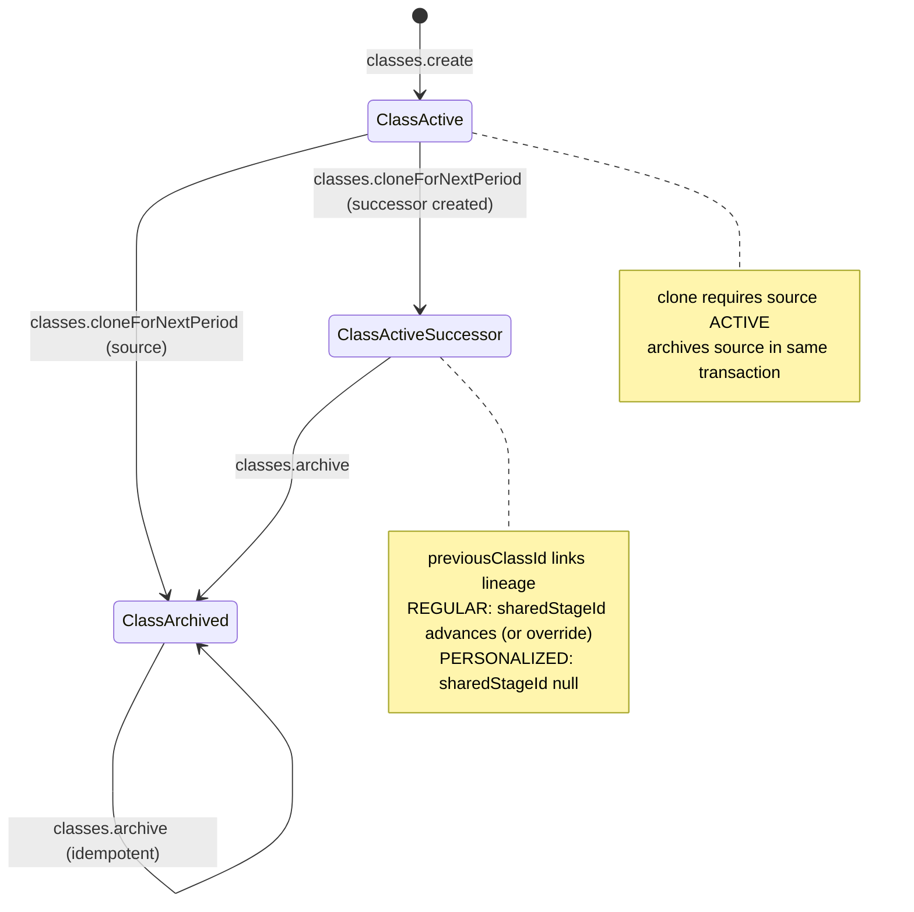
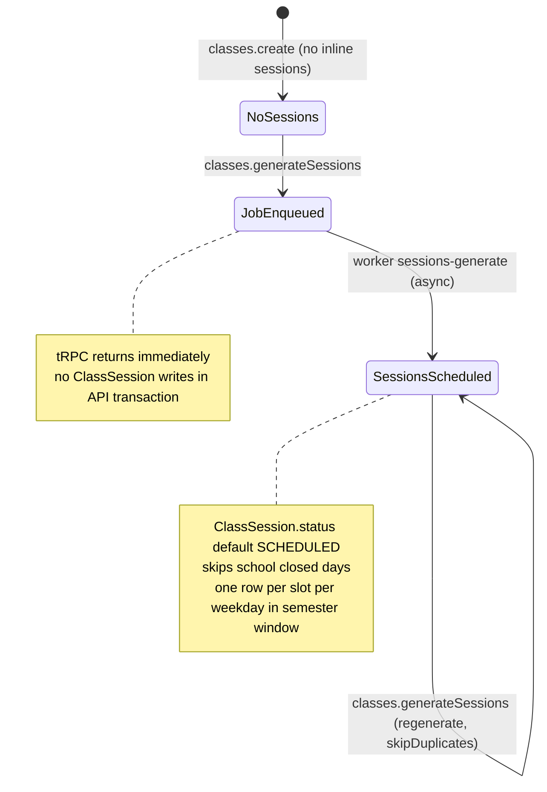

# PAIR-06 — `classes.cloneForNextPeriod` + `classes.generateSessions`

## `classes.cloneForNextPeriod`

- **Type:** mutation
- **Auth:** `adminProcedure` (authenticated, enabled staff with role `ADMIN` only)
- **Input schema:** `{ id: uuid, internalCode: requiredText, semesterId: uuid, year: int 2000–2100, sharedStageId?: uuid, portalClassName?: requiredText }` (`classCloneForNextPeriodInputSchema`). No XOR rule between optional fields; modality-specific requirements enforced in service layer.
- **Entities touched:**
  - `Class` — source: `status` → `ARCHIVED`; successor: new row (`internalCode`, `teacherId`, `scheduleType`, `format`, `sharedStageId`, `semesterId`, `year`, `capacity`, `previousClassId`, `portalClassName`, `originalPortalClassName`, default `status=ACTIVE`)
  - `ClassScheduleSlot` — copied from source non-deleted slots into successor (`weekday`, `startTime`, `endTime`)

### State preconditions

- Caller must be an enabled staff user with role `ADMIN`.
- Source `Class` must exist (soft-delete read filter applies → deleted rows count as not found).
- Source `Class.status` must be `ACTIVE`.
- Source teacher (`Class.teacherId`) must reference an enabled `User` with role `TEACHER`.
- Target `Semester` must exist.
- **REGULAR source:**
  - Source must have `sharedStage` loaded with track stages (non-deleted, ordered by `sequence`), unless `sharedStageId` override is supplied.
  - Unless `sharedStageId` override is supplied, track must have a next stage after the source stage (`findNextStageInTrack`); otherwise end-of-track rejection.
  - Successor stage (auto or override) must exist and belong to a non-`LEGACY` track (`loadActiveStage`).
  - Portal name is auto-derived from successor stage + copied slots + semester name + year; an unused `portalClassName` among ACTIVE classes must exist (up to 50 sequence attempts).
- **PERSONALIZED source:**
  - `portalClassName` input is **required**; must not collide with an existing ACTIVE class portal name.
  - Successor `sharedStageId` is always `null`.
- Successor `internalCode` must be globally unique (DB `@unique`; no app-level pre-check).

### Scenarios

| ID  | Scenario                            | Given (state)                                                                    | Input                                                                    | Expected outcome                     | HTTP/tRPC error (if any)                                                      | Post-state                                                                                                                                                   |
| --- | ----------------------------------- | -------------------------------------------------------------------------------- | ------------------------------------------------------------------------ | ------------------------------------ | ----------------------------------------------------------------------------- | ------------------------------------------------------------------------------------------------------------------------------------------------------------ |
| S1  | Happy path — REGULAR auto-advance   | ACTIVE REGULAR class on stage seq 1, teacher active, next stage + semester exist | `{ id, internalCode, semesterId: nextSemester, year }`                   | Success `{ source, successor }`      | —                                                                             | Source `ARCHIVED`; successor `ACTIVE`, `previousClassId=source.id`, `sharedStageId=next stage`, slots copied, portal name regenerated for new stage/semester |
| S2  | Happy path — REGULAR stage override | ACTIVE REGULAR class                                                             | `{ …, sharedStageId: validStageId }`                                     | Success                              | —                                                                             | Successor uses override stage instead of auto next                                                                                                           |
| S3  | Happy path — PERSONALIZED           | ACTIVE PERSONALIZED class, teacher active                                        | `{ …, portalClassName: unique }`                                         | Success                              | —                                                                             | Successor `sharedStageId=null`, manual portal name set                                                                                                       |
| S4  | RBAC — unauthenticated              | No `staffUser`                                                                   | valid input                                                              | Rejected                             | `UNAUTHORIZED` (401)                                                          | Unchanged                                                                                                                                                    |
| S5  | RBAC — non-admin                    | `TEACHER` / `FINANCE` staff                                                      | valid input                                                              | Rejected                             | `FORBIDDEN` (403)                                                             | Unchanged                                                                                                                                                    |
| S6  | Validation — bad id                 | —                                                                                | `{ id: "not-uuid", … }`                                                  | Rejected                             | `BAD_REQUEST` + Zod flatten                                                   | Unchanged                                                                                                                                                    |
| S7  | Validation — empty internalCode     | —                                                                                | `{ internalCode: "  ", … }`                                              | Rejected                             | `BAD_REQUEST` — `"Campo obrigatorio."`                                        | Unchanged                                                                                                                                                    |
| S8  | Source not found                    | Unknown / soft-deleted class id                                                  | valid input                                                              | Rejected                             | `NOT_FOUND` — `"Turma nao encontrada."`                                       | Unchanged                                                                                                                                                    |
| S9  | Source already archived             | `Class.status=ARCHIVED`                                                          | valid input                                                              | Rejected                             | `BAD_REQUEST` — `"Somente turmas ativas podem ser clonadas."`                 | Unchanged                                                                                                                                                    |
| S10 | Teacher invalid                     | Teacher missing, disabled, or non-TEACHER role                                   | valid input                                                              | Rejected                             | `BAD_REQUEST` — `"Professor invalido ou inativo."`                            | Unchanged                                                                                                                                                    |
| S11 | Semester not found                  | Unknown `semesterId`                                                             | valid input                                                              | Rejected                             | `NOT_FOUND` — `"Semestre nao encontrado."`                                    | Unchanged                                                                                                                                                    |
| S12 | End of track                        | REGULAR on last stage in track, no override                                      | valid input                                                              | Rejected                             | `BAD_REQUEST` — `"Fim da trilha: nao ha proxima etapa."`                      | Unchanged                                                                                                                                                    |
| S13 | Source missing shared stage         | REGULAR with `sharedStageId=null` on row, no override                            | valid input                                                              | Rejected                             | `BAD_REQUEST` — `"Etapa nao encontrada."`                                     | Unchanged                                                                                                                                                    |
| S14 | Legacy track successor              | Override or auto-next stage on `LEGACY` track                                    | valid input                                                              | Rejected                             | `BAD_REQUEST` — `"Nao e possivel criar turma em trilha legada."`              | Unchanged                                                                                                                                                    |
| S15 | Stage override not found            | Invalid `sharedStageId`                                                          | `{ …, sharedStageId: random uuid }`                                      | Rejected                             | `NOT_FOUND` — `"Etapa nao encontrada."`                                       | Unchanged                                                                                                                                                    |
| S16 | PERSONALIZED missing portal name    | ACTIVE PERSONALIZED source                                                       | omit `portalClassName`                                                   | Rejected                             | `BAD_REQUEST` — `"Turma personalizada exige nome Portal manual ao clonar."`   | Unchanged                                                                                                                                                    |
| S17 | Portal name collision               | ACTIVE class already uses candidate portal name                                  | PERSONALIZED with colliding name, or REGULAR when 50 sequences exhausted | Rejected                             | `BAD_REQUEST` — `"Nao foi possivel gerar um nome Portal unico para a turma."` | Unchanged                                                                                                                                                    |
| S18 | Duplicate internalCode              | Successor code already exists                                                    | `{ internalCode: existing, … }`                                          | Prisma unique violation              | `INTERNAL_SERVER_ERROR` (typical `P2002`)                                     | Transaction rolls back; source stays `ACTIVE`                                                                                                                |
| S19 | Idempotent archive side effect      | Source already `ARCHIVED`                                                        | —                                                                        | Rejected at S9 before `archiveClass` | —                                                                             | N/A                                                                                                                                                          |

### State transitions (flow nodes)

### Outbound edges

| Target                      | Condition                                                                                                                      |
| --------------------------- | ------------------------------------------------------------------------------------------------------------------------------ |
| `classes.generateSessions`  | Successor is `ACTIVE` but has **no** `ClassSession` rows until generation is enqueued separately (clone does not auto-enqueue) |
| `classes.create`            | Alternative path to new class without archiving source or advancing stage                                                      |
| `classes.archive`           | Independent archive of any class (clone already archives source)                                                               |
| `enrollment.create`         | Staff enroll students into successor class for next period                                                                     |
| Hatchet `sessions-generate` | **Not** triggered by clone; only via explicit `generateSessions` or `calendar.createSemester`                                  |

### Evidence

- `packages/api/src/classes/router.ts` (procedure wiring, transaction)
- `packages/api/src/classes/clone.ts` (clone logic, stage resolution, portal name)
- `packages/api/src/classes/data.ts` (`archiveClass`, `classSummarySelect`)
- `packages/api/src/classes/guards.ts` (`assertTeacherIsActive`, `loadActiveStage`, `loadSemester`)
- `packages/api/src/classes/portal-name.ts` (collision checks, REGULAR name generation)
- `packages/api/src/classes/errors.ts`
- `packages/validators/src/class.ts` (`classCloneForNextPeriodInputSchema`)
- `packages/domain/src/stage-sequence.ts` (`findNextStageInTrack`)
- `packages/db/prisma/schema.prisma` (`Class`, `ClassScheduleSlot`, `ClassStatus`, unique `internalCode`)
- `packages/api/test/db/classes.test.ts` (`cloneRegularClass`)
- `packages/api/test/behavior/classes-http.test.ts` (`cloneClassOverHttp`)
- `packages/api/src/trpc/init.ts` (`adminProcedure`)

---

## `classes.generateSessions`

- **Type:** mutation
- **Auth:** `adminProcedure` (authenticated, enabled staff with role `ADMIN` only)
- **Input schema:** `{ classId?: uuid, semesterId?: uuid }` — **exactly one** required (`classGenerateSessionsInputSchema`: `"Informe uma turma ou um semestre."`). Job contract re-validates with `"Informe classId ou semesterId, nunca ambos."`.
- **Entities touched:** **None inline.** Validates scope existence in a DB transaction, then enqueues Hatchet workflow. `ClassSession` rows are created asynchronously by the worker (`generateClassSessions` in `@lazuli/worker-handlers`).

### State preconditions

- Caller must be an enabled staff user with role `ADMIN`.
- Exactly one of `classId` or `semesterId` must be provided (Zod XOR).
- If `classId`: target `Class` row must exist (existence only — **no** `status` check at API layer).
- If `semesterId`: target `Semester` row must exist.
- **Worker preconditions (async, not enforced by tRPC):** matched classes must be `ACTIVE`, `deletedAt IS NULL`, with non-deleted `ClassScheduleSlot` rows and a bound `Semester` window.

### Scenarios

| ID  | Scenario                        | Given (state)                           | Input                         | Expected outcome                                                | HTTP/tRPC error (if any)                              | Post-state                                                                                        |
| --- | ------------------------------- | --------------------------------------- | ----------------------------- | --------------------------------------------------------------- | ----------------------------------------------------- | ------------------------------------------------------------------------------------------------- |
| S1  | Happy path — single class       | ACTIVE class with slots, semester bound | `{ classId }`                 | Success `{ workflowName: "sessions-generate", jobId, payload }` | —                                                     | **No** `ClassSession` rows in request thread (`sessionCount=0` until worker runs)                 |
| S2  | Happy path — semester scope     | Semester with ACTIVE classes            | `{ semesterId }`              | Success; payload `{ semesterId }`                               | —                                                     | Enqueues bulk generation for all ACTIVE classes in semester (worker-side filter)                  |
| S3  | RBAC — unauthenticated          | No `staffUser`                          | valid input                   | Rejected                                                        | `UNAUTHORIZED` (401)                                  | Unchanged                                                                                         |
| S4  | RBAC — non-admin                | `TEACHER` staff                         | valid input                   | Rejected                                                        | `FORBIDDEN` (403)                                     | Unchanged                                                                                         |
| S5  | Validation — neither scope      | —                                       | `{}`                          | Rejected                                                        | `BAD_REQUEST` — `"Informe uma turma ou um semestre."` | Unchanged                                                                                         |
| S6  | Validation — both scopes        | —                                       | `{ classId, semesterId }`     | Rejected at API Zod                                             | `BAD_REQUEST` (API message)                           | Unchanged                                                                                         |
| S7  | Validation — bad uuid           | —                                       | `{ classId: "x" }`            | Rejected                                                        | `BAD_REQUEST` + Zod flatten                           | Unchanged                                                                                         |
| S8  | Class not found                 | Unknown `classId`                       | `{ classId: random uuid }`    | Rejected                                                        | `NOT_FOUND` — `"Turma nao encontrada."`               | Unchanged                                                                                         |
| S9  | Semester not found              | Unknown `semesterId`                    | `{ semesterId: random uuid }` | Rejected                                                        | `NOT_FOUND` — `"Semestre nao encontrado."`            | Unchanged                                                                                         |
| S10 | ARCHIVED class                  | `Class.status=ARCHIVED` but row exists  | `{ classId }`                 | **API succeeds** (existence check only)                         | —                                                     | Worker matches 0 classes → `sessionsCreated=0`                                                    |
| S11 | Class without slots             | ACTIVE class, no schedule slots         | `{ classId }`                 | API succeeds                                                    | —                                                     | Worker plans 0 rows                                                                               |
| S12 | Local dev fallback              | No `ctx.sessionGenerationQueue`         | `{ classId }`                 | Success with synthetic `jobId` (`sessions-generate:{id}`)       | —                                                     | No real Hatchet dispatch; contract shape preserved                                                |
| S13 | Regenerate / idempotent enqueue | Class already has sessions              | `{ classId }`                 | API succeeds                                                    | —                                                     | Worker uses `createMany({ skipDuplicates: true })` — duplicate `(class, slot, date)` rows skipped |

### State transitions (flow nodes)

### Outbound edges

| Target                               | Condition                                                                         |
| ------------------------------------ | --------------------------------------------------------------------------------- |
| Hatchet `sessions-generate` workflow | Always enqueued on success                                                        |
| `generateClassSessions` (worker)     | Creates `ClassSession` rows for `ACTIVE` classes in scope                         |
| Attendance / portal flows            | Sessions must exist before teachers submit attendance to Portal                   |
| `calendar.createSemester`            | Parallel enqueue path with `{ semesterId }` after semester creation               |
| `calendar.removeClosedDay`           | Spec: closed-day reopen may call same regenerate path (not in this pair's router) |

### Evidence

- `packages/api/src/classes/router.ts` (`generateSessions`, `assertGenerationScopeExists`)
- `packages/api/src/classes/data.ts` (`assertGenerationScopeExists`, scope existence checks)
- `packages/validators/src/class.ts` (`classGenerateSessionsInputSchema`)
- `packages/job-contracts/src/index.ts` (`SESSIONS_GENERATE_WORKFLOW`, `enqueueSessionsGenerate`, payload XOR)
- `packages/worker-handlers/src/index.ts` (`generateClassSessions`, `ACTIVE` filter, `createMany`)
- `packages/api/test/db/classes.test.ts` (`generateSessionsAsync`)
- `packages/api/test/db/session-generation-queue-support.ts` (`recordingSessionsGenerateQueue`)
- `packages/api/test/behavior/classes-http.test.ts` (`generateSessionsOverHttp`)
- `packages/job-contracts/test/sessions-generate.test.ts` (contract XOR, enqueue shape)
- `packages/api/src/calendar/router.ts` (semester-scoped enqueue on `createSemester`)
- `docs/MVP/TECHNICAL_SPEC.md` §6.2 (async-only session generation)

### DB validation

Not run in this analysis session. Existing coverage: `packages/api/test/db/classes.test.ts` (clone + class-scoped generate), `packages/api/test/behavior/classes-http.test.ts` (HTTP adapter parity).

---

## Cross-endpoint edges (this pair only)

| From                                      | To                             | Condition                                                                                                                                                                                      |
| ----------------------------------------- | ------------------------------ | ---------------------------------------------------------------------------------------------------------------------------------------------------------------------------------------------- |
| `classes.cloneForNextPeriod`              | `classes.generateSessions`     | Successor class is created `ACTIVE` with slots but **no sessions**; staff must call `generateSessions({ classId: successor.id })` (or semester-scoped) before attendance calendar is populated |
| `classes.cloneForNextPeriod`              | `classes.archive`              | Clone archives source inline; separate archive of source is idempotent no-op                                                                                                                   |
| `classes.cloneForNextPeriod`              | `enrollment.create`            | New period rosters require enrollment into successor (clone does not migrate enrollments)                                                                                                      |
| `classes.generateSessions`                | Hatchet `sessions-generate`    | Every successful call enqueues workflow; API never writes `ClassSession`                                                                                                                       |
| `classes.generateSessions` (`classId`)    | Worker session rows            | Worker only processes `ACTIVE`, non-deleted classes — archived/exists-only classId yields zero sessions despite API success                                                                    |
| `classes.generateSessions` (`semesterId`) | All ACTIVE classes in semester | Same worker path as `calendar.createSemester` post-hook                                                                                                                                        |
| `classes.create`                          | `classes.generateSessions`     | New class has slots but no sessions until generation enqueued                                                                                                                                  |
| `classes.cloneForNextPeriod`              | `classes.create`               | Both produce new `ACTIVE` classes; clone additionally archives source and advances REGULAR stage                                                                                               |
