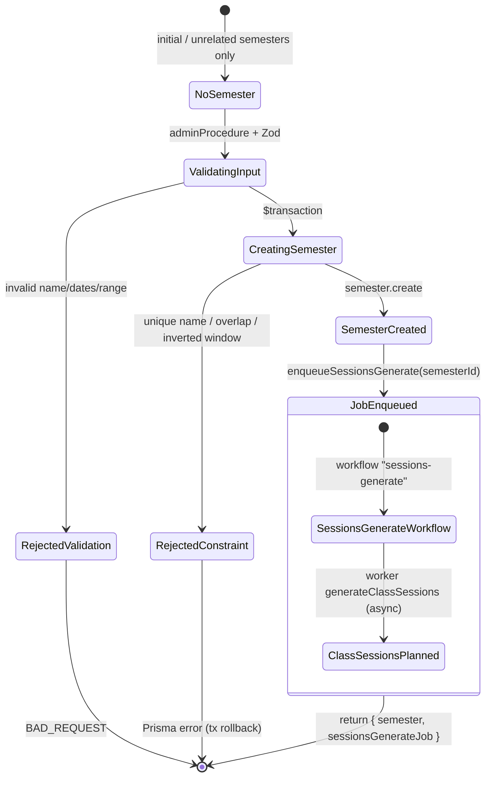
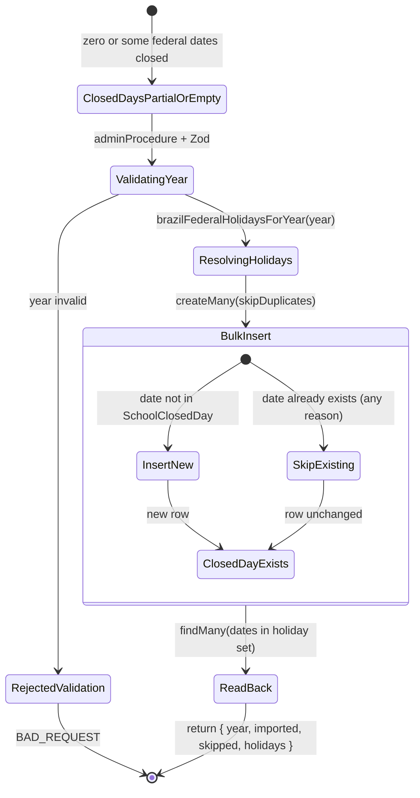

# PAIR-07 — `calendar.createSemester` + `calendar.importBrazilFederalHolidays`

Calendar setup mutations for academic period windows and bulk federal holiday import. Both are ADMIN-only and write calendar entities used downstream by class session generation and attendance bucketing.

---

## `calendar.createSemester`

- **Type:** mutation
- **Auth:** `adminProcedure` (authenticated, enabled staff with role `ADMIN` only)
- **Input schema:** `{ name: string (trim, min 1), startDate: YYYY-MM-DD, endDate: YYYY-MM-DD }` — strict object; `calendarDateSchema` rejects malformed or impossible dates; `superRefine` rejects `startDate > endDate` with message on `endDate`.
- **Entities touched:**
  - `Semester` — insert: `name`, `startDate`, `endDate` (plus server defaults `id`, `createdAt`, `updatedAt`)
  - (async, post-commit) Hatchet/local queue payload referencing `semesterId` — not a Prisma write

### State preconditions

- Caller must be an enabled staff user with role `ADMIN`.
- No existing `Semester` row required (creates a new row).
- For success at the DB layer:
  - `name` must be unique among live semesters (`Semester_name_key`).
  - Date window must satisfy `Semester_start_not_after_end_check` (also enforced in Zod).
  - Window must not overlap any other live semester (`Semester_no_overlap_excl` exclusion constraint on inclusive `daterange`).
- No requirement that `SchoolClosedDay` rows exist first; closed days are applied later during session generation.

### Scenarios

| ID  | Scenario                    | Given (state)                                                                     | Input                                                        | Expected outcome                                                                                                                             | HTTP/tRPC error (if any)                                                | Post-state                                                             |
| --- | --------------------------- | --------------------------------------------------------------------------------- | ------------------------------------------------------------ | -------------------------------------------------------------------------------------------------------------------------------------------- | ----------------------------------------------------------------------- | ---------------------------------------------------------------------- |
| S1  | Happy path                  | No conflicting semester; ADMIN caller                                             | `{ name, startDate, endDate }` valid, `startDate <= endDate` | `{ semester: { id, name, startDate, endDate }, sessionsGenerateJob: { workflowName: "sessions-generate", jobId, payload: { semesterId } } }` | — (HTTP 200)                                                            | New `Semester` row; `sessions-generate` enqueued with new `semesterId` |
| S2  | Same-day window             | No overlap conflict                                                               | `startDate === endDate` (valid calendar day)                 | Success (Zod allows equality)                                                                                                                | —                                                                       | Single-day semester created                                            |
| S3  | RBAC — unauthenticated      | `staffUser: null`                                                                 | valid input                                                  | Rejected at `enforceStaffAuth`                                                                                                               | `UNAUTHORIZED` (401)                                                    | Unchanged                                                              |
| S4  | RBAC — TEACHER              | Enabled `TEACHER` (matrix: `calendar: scoped`, but procedure is `adminProcedure`) | valid input                                                  | Rejected at role gate                                                                                                                        | `FORBIDDEN` (403)                                                       | Unchanged                                                              |
| S5  | Validation — empty name     | —                                                                                 | `{ name: "" }` or whitespace-only after trim                 | Rejected                                                                                                                                     | `BAD_REQUEST` + Zod flatten                                             | Unchanged                                                              |
| S6  | Validation — bad date       | —                                                                                 | `{ startDate: "2098-02-30" }` or non-`YYYY-MM-DD`            | Rejected                                                                                                                                     | `BAD_REQUEST`                                                           | Unchanged                                                              |
| S7  | Validation — inverted range | —                                                                                 | `startDate > endDate`                                        | Rejected; issue on `endDate`                                                                                                                 | `BAD_REQUEST` ("Data inicial deve ser anterior ou igual a data final.") | Unchanged                                                              |
| S8  | Duplicate name              | Existing semester with same `name`                                                | same `name`, any dates                                       | Prisma unique violation bubbles up                                                                                                           | `INTERNAL_SERVER_ERROR` (typical; no domain wrapper)                    | Unchanged (transaction rolls back)                                     |
| S9  | Overlapping window          | Existing semester with overlapping `[startDate, endDate]`                         | non-overlapping name but overlapping dates                   | Prisma exclusion violation                                                                                                                   | `INTERNAL_SERVER_ERROR` (constraint `Semester_no_overlap_excl`)         | Unchanged (transaction rolls back)                                     |
| S10 | Adjacent semester           | Existing semester ending 2098-06-30                                               | new semester starting 2098-07-01                             | Success                                                                                                                                      | —                                                                       | Second non-overlapping semester created                                |
| S11 | Job enqueue after commit    | Semester insert succeeds                                                          | valid input                                                  | Semester persisted even if queue fails later                                                                                                 | Depends on queue impl; local queue always resolves                      | `Semester` row exists; enqueue runs **outside** `$transaction`         |

Notes:

- Resolver order: `$transaction(createSemester)` → `enqueueSessionsGenerate({ semesterId })`. DB commit precedes job enqueue; enqueue failure does not roll back the semester.
- Returned dates are normalized to `YYYY-MM-DD` strings via UTC midnight parsing (`dateOnlyToDate` / `dateToDateOnly`).
- Soft-deleted semesters (`deletedAt` set) do not participate in overlap exclusion (partial index); app code does not set `deletedAt` on create.
- TEACHER has router matrix access `scoped` for `calendar`, but all calendar procedures use `adminProcedure`, so TEACHER is denied at the procedure gate (S4).

### State transitions (flow nodes)

Persistent write: `Semester` row. Async side effect: `sessions-generate` job (ClassSession rows when worker runs).

### Outbound edges

| Target                                          | Condition                                                                                                    |
| ----------------------------------------------- | ------------------------------------------------------------------------------------------------------------ |
| `sessions-generate` job (Hatchet / local queue) | Always after successful create; payload `{ semesterId }`                                                     |
| `classes.create` / existing `Class.semesterId`  | New semester becomes link target for REGULAR and PERSONALIZED classes                                        |
| `classes.generateSessions({ semesterId })`      | Manual re-trigger of same workflow scope                                                                     |
| `worker-handlers.generateClassSessions`         | Consumes job; generates `ClassSession` rows for ACTIVE classes bound to semester, skipping `SchoolClosedDay` |
| `attendance.enrollmentSemesterPercent`          | Reads sessions bucketed by semester window                                                                   |
| `domain.resolveSemesterForDate`                 | Session dates must map to exactly one semester for attendance/report guards                                  |

### Evidence

- `packages/api/src/calendar/router.ts` — procedure wiring, transaction + enqueue order
- `packages/api/src/calendar/data.ts` — `createSemester`, date normalization
- `packages/validators/src/calendar.ts` — `createSemesterInputSchema`
- `packages/db/prisma/schema.prisma` — `Semester` model (`name` unique, date fields)
- `packages/db/prisma/migrations/20260702232823_gre_22_semester_no_overlap/migration.sql` — overlap + order constraints
- `packages/db/test/db/semester-schema.test.ts` — S8/S9/S10 constraint behavior (schema-level)
- `packages/job-contracts/src/index.ts` — `enqueueSessionsGenerate`, `sessionsGeneratePayloadSchema`
- `packages/api/test/db/calendar.test.ts` — S1 job enqueue (`createSemesterEnqueuesGeneration`)
- `packages/api/test/behavior/calendar-http.test.ts` — S1 HTTP happy path (`createSemesterOverHttp`)
- `packages/api/test/db/calendar-test-support.ts` — ADMIN/TEACHER fixtures, queue recording
- `packages/api/src/trpc/init.ts` — `adminProcedure`
- `docs/MVP/TECHNICAL_SPEC.md` — S-CAL-4, `sessions-generate` trigger on semester creation

DB validation: not run in this analysis; S1 covered by `packages/api/test/db/calendar.test.ts` and `packages/api/test/behavior/calendar-http.test.ts`.

---

## `calendar.importBrazilFederalHolidays`

- **Type:** mutation
- **Auth:** `adminProcedure` (authenticated, enabled staff with role `ADMIN` only)
- **Input schema:** `{ year: number }` — integer, `2000 <= year <= 2100` (`calendarYearSchema`); strict object.
- **Entities touched:**
  - `SchoolClosedDay` — bulk insert via `createMany` (`date`, `reason`, `createdById`); read-back via `findMany`
  - `User` — not written; `ctx.staffUser.id` stored as `createdById` on new rows

### State preconditions

- Caller must be an enabled staff user with role `ADMIN`.
- No prior closed days required; idempotent against existing dates.
- Domain produces exactly **9** fixed-date national holidays for the requested year (`brazilFederalHolidaysForYear`); no movable/religious holidays (Carnaval, Good Friday, Corpus Christi excluded).
- Existing `SchoolClosedDay` on the same `date` (unique) causes that row to be skipped (`skipDuplicates: true`); existing `reason` is **not** overwritten.

### Scenarios

| ID  | Scenario                       | Given (state)                                             | Input                                | Expected outcome                                                             | HTTP/tRPC error (if any)        | Post-state                                                                             |
| --- | ------------------------------ | --------------------------------------------------------- | ------------------------------------ | ---------------------------------------------------------------------------- | ------------------------------- | -------------------------------------------------------------------------------------- |
| S1  | Happy path — first import      | No closed days for target year dates                      | `{ year: Y }`                        | `{ year: Y, imported: 9, skipped: 0, holidays: [9 rows sorted by date] }`    | — (HTTP 200)                    | 9 `SchoolClosedDay` rows with federal reasons; `createdById = admin id`                |
| S2  | Idempotent re-import           | All 9 dates already exist with same reasons               | `{ year: Y }` again                  | `{ imported: 0, skipped: 9, holidays.length: 9 }`                            | —                               | Rows unchanged                                                                         |
| S3  | Preserve custom reason         | `SchoolClosedDay` exists on e.g. Jan 1 with custom reason | `{ year: Y }`                        | `{ imported: 8, skipped: 1 }`; Jan 1 keeps custom reason in `holidays` array | —                               | 8 new rows; pre-existing row untouched                                                 |
| S4  | RBAC — unauthenticated         | `staffUser: null`                                         | `{ year: Y }`                        | Rejected                                                                     | `UNAUTHORIZED` (401)            | Unchanged                                                                              |
| S5  | RBAC — TEACHER                 | Enabled `TEACHER`                                         | `{ year: Y }`                        | Rejected                                                                     | `FORBIDDEN` (403)               | Unchanged                                                                              |
| S6  | Validation — year out of range | —                                                         | `{ year: 1999 }` or `{ year: 2101 }` | Rejected                                                                     | `BAD_REQUEST` ("Ano invalido.") | Unchanged                                                                              |
| S7  | Validation — non-integer year  | —                                                         | `{ year: 2026.5 }`                   | Rejected                                                                     | `BAD_REQUEST`                   | Unchanged                                                                              |
| S8  | Validation — wrong type        | —                                                         | `{ year: "2026" }`                   | Rejected                                                                     | `BAD_REQUEST`                   | Unchanged                                                                              |
| S9  | Partial overlap                | Some federal dates already closed (any reason)            | `{ year: Y }`                        | `imported + skipped === 9`; existing dates skipped                           | —                               | Only missing dates inserted                                                            |
| S10 | No job side effects            | Any state                                                 | valid import                         | Success; no session regeneration enqueue                                     | —                               | Closed days only; `regenerateRequired` N/A (unlike `addClosedDay` / `removeClosedDay`) |

Notes:

- Entire operation runs inside one `$transaction` (router-level).
- `holidays` in the response is always the **current DB state** for the 9 domain dates (post-import), not only newly inserted rows.
- Federal reasons are Portuguese labels from domain constants (e.g. `"Confraternizacao Universal"`, `"Tiradentes"`).
- Import does **not** call `cancelFutureSessionsForClosedDate` or enqueue regeneration (contrast `calendar.addClosedDay`).

### State transitions (flow nodes)

No status field on `SchoolClosedDay`; state is presence/absence of a row per unique `date`.

### Outbound edges

| Target                                                                       | Condition                                                                                                    |
| ---------------------------------------------------------------------------- | ------------------------------------------------------------------------------------------------------------ |
| `worker-handlers.generateClassSessions`                                      | Indirect — closed dates skipped when sessions are generated/regenerated for a semester window                |
| `calendar.addClosedDay` / `calendar.removeClosedDay`                         | Same `SchoolClosedDay` table; manual add can override reason before/after import (import preserves existing) |
| `classes.generateSessions` / `calendar.createSemester` → `sessions-generate` | Session generation honors imported closed days if import precedes generation                                 |
| (none)                                                                       | Does not enqueue jobs or cancel sessions                                                                     |

### Evidence

- `packages/api/src/calendar/router.ts` — procedure wiring, `$transaction`
- `packages/api/src/calendar/data.ts` — `importBrazilFederalHolidays`, `createMany` + `findMany`
- `packages/validators/src/calendar.ts` — `importBrazilFederalHolidaysInputSchema`, `calendarYearSchema`
- `packages/domain/src/brazil-federal-holidays.ts` — 9 fixed holidays
- `packages/domain/test/brazil-federal-holidays.test.ts` — holiday list + excluded movable holidays
- `packages/db/prisma/schema.prisma` — `SchoolClosedDay` (`date` unique, `reason`, `createdById`)
- `packages/api/test/db/calendar.test.ts` — S1/S2/S3 (`importHolidaysIdempotently`, `preserveCustomReasonDuringImport`)
- `packages/api/test/behavior/calendar-http.test.ts` — S1/S4/S5 HTTP (`importHolidaysOverHttp`, `rejectNonAdmins`)
- `packages/api/test/db/calendar-test-support.ts` — fixtures, HTTP adapter
- `docs/MVP/TECHNICAL_SPEC.md` — S-CAL-1 federal holiday bulk import

DB validation: not run in this analysis; S1–S3 covered by `packages/api/test/db/calendar.test.ts`; S4–S5 by `packages/api/test/behavior/calendar-http.test.ts`.

---

## Cross-endpoint edges (this pair only)

| From                                   | To                                               | Condition                                                                                                                                                    |
| -------------------------------------- | ------------------------------------------------ | ------------------------------------------------------------------------------------------------------------------------------------------------------------ |
| `calendar.importBrazilFederalHolidays` | `calendar.createSemester` → `sessions-generate`  | Import closed days **before** semester create + session generation so worker skips federal dates in the semester window (ordering recommended, not enforced) |
| `calendar.createSemester`              | `sessions-generate` job                          | Always enqueued on successful create                                                                                                                         |
| `calendar.importBrazilFederalHolidays` | `sessions-generate` / `classes.generateSessions` | No direct trigger; regeneration only if staff later calls `classes.generateSessions` or reopens closed days via `removeClosedDay`                            |
| `calendar.importBrazilFederalHolidays` | `calendar.addClosedDay`                          | Manual closed day on same date blocks import insert for that date (`skipDuplicates`); import never overwrites manual reason                                  |
| `calendar.createSemester`              | `classes.create`                                 | New semester `id` available as `semesterId` when provisioning classes for the period                                                                         |
| Both procedures                        | `adminProcedure` gate                            | Same RBAC: ADMIN only; TEACHER denied despite `calendar: scoped` matrix entry                                                                                |
