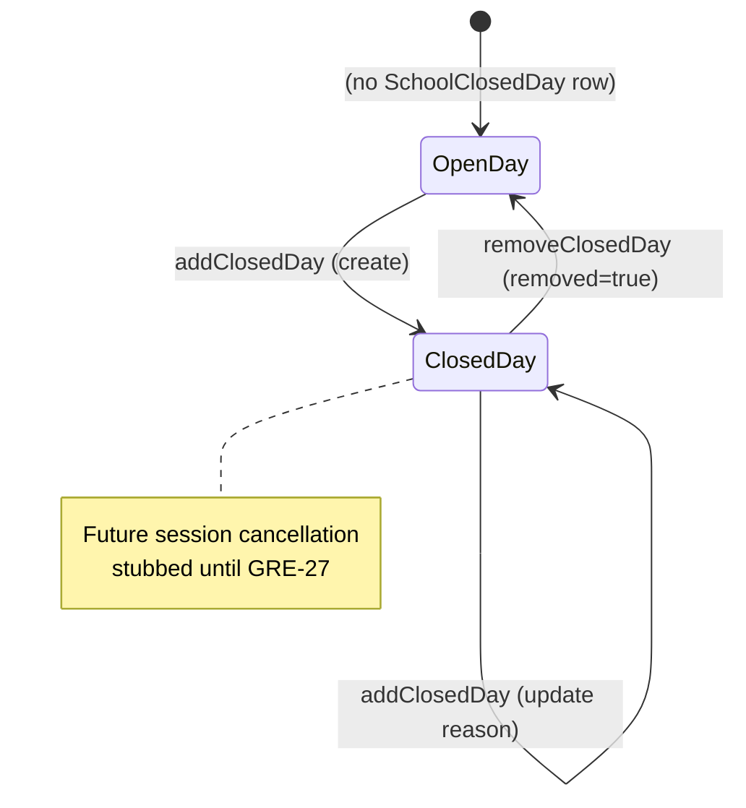
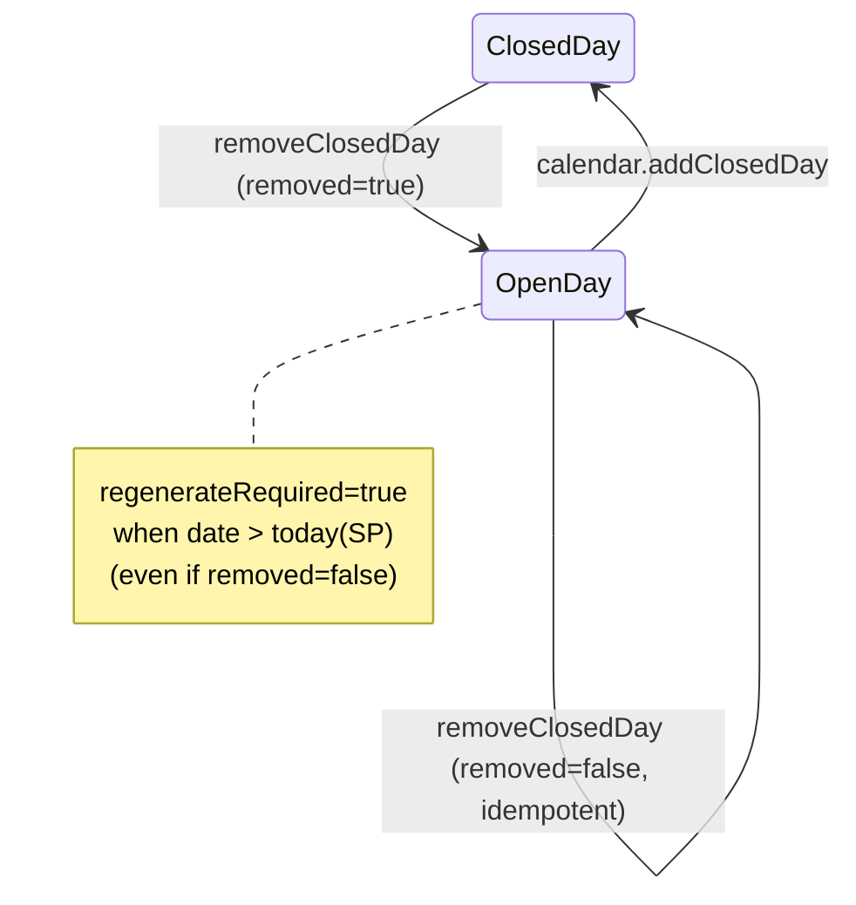

# PAIR-08 — `calendar.addClosedDay` + `calendar.removeClosedDay`

## `calendar.addClosedDay`

- **Type:** mutation
- **Auth:** `adminProcedure` (authenticated, enabled staff with role `ADMIN` only)
- **Input schema:** `{ date: calendarDateSchema, reason: closedDayReasonSchema }` — strict object, no extra keys.
  - `date`: string matching `YYYY-MM-DD`, must be a real calendar date (UTC component check via `isRealDateOnly`).
  - `reason`: trimmed string, min 1 (`"Campo obrigatorio."`), max 160 chars.
- **Entities touched:**
  - `SchoolClosedDay.date`, `SchoolClosedDay.reason`, `SchoolClosedDay.createdById` (set on **create** only from `ctx.staffUser.id`)
  - `SchoolClosedDay.updatedAt` (implicit on update)
  - **Deferred (GRE-27):** future `ClassSession` rows would be cancelled here; not implemented yet.

### State preconditions

- Caller must be an enabled staff user with role `ADMIN`.
- No semester, class, or session preconditions — a closed day may be added for any valid date.
- If a row already exists for `date` (visible row with `deletedAt IS NULL`), the call **updates** rather than failing.
- `createdById` must reference an existing `User` on create (FK enforced; router passes valid admin id).

### Scenarios

| ID  | Scenario                        | Given (state)                                           | Input                                     | Expected outcome                                                                                                       | HTTP/tRPC error (if any)                         | Post-state                                                                                                     |
| --- | ------------------------------- | ------------------------------------------------------- | ----------------------------------------- | ---------------------------------------------------------------------------------------------------------------------- | ------------------------------------------------ | -------------------------------------------------------------------------------------------------------------- |
| S1  | Happy path — create             | No `SchoolClosedDay` for date                           | `{ date, reason }`                        | Success; `{ created: true, updated: false, closedDay, cancelledSessions: 0, warnings: [], regenerateRequired: false }` | —                                                | New row with `date`, `reason`, `createdById = admin`                                                           |
| S2  | Upsert — update reason          | Row exists for date (e.g. federal import)               | Same `date`, new `reason`                 | Success; `{ created: false, updated: true }`; `closedDay.reason` updated                                               | —                                                | `reason` changed; `createdById` **unchanged**                                                                  |
| S3  | Future date (side-effect shape) | No row; date > today (`America/Sao_Paulo`)              | `{ date: future, reason }`                | Success; stable stub shape: `cancelledSessions: 0`, `warnings: []`, `regenerateRequired: false`                        | —                                                | Row created; **no** session rows mutated today (GRE-27 stub)                                                   |
| S4  | Past / today date               | Any                                                     | valid input                               | Success; same zero side-effect shape as S3                                                                             | —                                                | Row created/updated; PRD: past edits do not retroactively delete attendance/sessions                           |
| S5  | RBAC — unauthenticated          | No `staffUser`                                          | valid input                               | Rejected                                                                                                               | `UNAUTHORIZED` (401)                             | Unchanged                                                                                                      |
| S6  | RBAC — non-admin                | `TEACHER` / `FINANCE` staff                             | valid input                               | Rejected                                                                                                               | `FORBIDDEN` (403)                                | Unchanged                                                                                                      |
| S7  | Validation — bad date format    | —                                                       | `{ date: "14-07-2026", reason: "x" }`     | Rejected                                                                                                               | `BAD_REQUEST` + Zod flatten (`"Data invalida."`) | Unchanged                                                                                                      |
| S8  | Validation — impossible date    | —                                                       | `{ date: "2026-02-30", reason: "x" }`     | Rejected                                                                                                               | `BAD_REQUEST` + Zod flatten                      | Unchanged                                                                                                      |
| S9  | Validation — empty reason       | —                                                       | `{ date, reason: "" }` or whitespace-only | Rejected                                                                                                               | `BAD_REQUEST` (`"Campo obrigatorio."`)           | Unchanged                                                                                                      |
| S10 | Validation — reason too long    | —                                                       | `reason` > 160 chars                      | Rejected                                                                                                               | `BAD_REQUEST` (max length)                       | Unchanged                                                                                                      |
| S11 | Validation — extra keys         | —                                                       | `{ date, reason, foo: 1 }`                | Rejected                                                                                                               | `BAD_REQUEST` (strict schema)                    | Unchanged                                                                                                      |
| S12 | Soft-deleted row same date      | Row with same `date` but `deletedAt` set (hypothetical) | valid input                               | `findUnique` misses soft-deleted row → `create` likely fails                                                           | `INTERNAL_SERVER_ERROR` (unique on `date`)       | Unchanged or partial — **not covered by tests**; hard `delete` in `removeClosedDay` avoids this in normal flow |

### State transitions (flow nodes)

### Outbound edges

| Target                                 | Condition                                                                                                                                        |
| -------------------------------------- | ------------------------------------------------------------------------------------------------------------------------------------------------ |
| `calendar.removeClosedDay`             | Admin re-opens the same date                                                                                                                     |
| `calendar.importBrazilFederalHolidays` | May pre-seed dates; `addClosedDay` can override `reason` via upsert                                                                              |
| `sessions-generate` (Hatchet)          | Indirect: new closed days are skipped on **future** generation (`loadClosedDates` in worker); does not auto-enqueue from this procedure          |
| `classes.generateSessions`             | Client/UI should regenerate after reopen (`removeClosedDay.regenerateRequired`); not triggered by `addClosedDay`                                 |
| `ClassSession` cancellation            | **Spec/PRD (S-CAL-1):** future `SCHEDULED` sessions on closed date → `CANCELLED`; **not implemented** in `cancelFutureSessionsForClosedDate` yet |

### Evidence

- `packages/api/src/calendar/router.ts` (procedure wiring, transaction, `createdById` from context)
- `packages/api/src/calendar/data.ts` (`addClosedDay`, `cancelFutureSessionsForClosedDate` stub, `isFutureDate`)
- `packages/validators/src/calendar.ts` (`addClosedDayInputSchema`, `calendarDateSchema`, `closedDayReasonSchema`)
- `packages/db/prisma/schema.prisma` (`SchoolClosedDay` model, unique `date`, optional `createdById`)
- `packages/api/test/db/calendar.test.ts` (`updateExistingClosedDayReason`, `addFutureClosedDayWithStableSideEffectShape`)
- `packages/db/test/db/school-closed-day-schema.test.ts` (unique date, FK on `createdById`)
- `packages/api/src/trpc/init.ts` (`adminProcedure`)
- `packages/worker-handlers/src/index.ts` (`loadClosedDates` — generation skips closed days)
- `docs/MVP/PRD.md` S-CAL-1 (intended future cancellation + reopen regeneration)
- `docs/MVP/TECHNICAL_SPEC.md` §4.4 rules (lines 687–689)

### DB validation

Not run in this analysis session. Existing coverage: `packages/api/test/db/calendar.test.ts` (2 tests for `addClosedDay`).

---

## `calendar.removeClosedDay`

- **Type:** mutation
- **Auth:** `adminProcedure` (authenticated, enabled staff with role `ADMIN` only)
- **Input schema:** `{ date: calendarDateSchema }` — strict object.
- **Entities touched:**
  - `SchoolClosedDay` — **hard** `delete` by unique `date` (not soft-delete)
  - **Deferred:** regeneration of missing `ClassSession` rows is signaled via `regenerateRequired` but not executed in this procedure.

### State preconditions

- Caller must be an enabled staff user with role `ADMIN`.
- No requirement that a row exists — missing row is a successful idempotent no-op (`removed: false`).
- No session or semester preconditions.

### Scenarios

| ID  | Scenario                       | Given (state)                 | Input                  | Expected outcome                               | HTTP/tRPC error (if any)    | Post-state                                                   |
| --- | ------------------------------ | ----------------------------- | ---------------------- | ---------------------------------------------- | --------------------------- | ------------------------------------------------------------ |
| S1  | Happy path — remove existing   | Row for date                  | `{ date }`             | `{ removed: true, regenerateRequired }`        | —                           | Row deleted (hard delete)                                    |
| S2  | Idempotent — already open      | No row for date               | `{ date }`             | `{ removed: false, regenerateRequired }`       | —                           | Unchanged                                                    |
| S3  | Idempotent — double remove     | Row removed in prior call     | Same `{ date }` again  | Second call `{ removed: false, … }`            | —                           | Still absent                                                 |
| S4  | Future date flag               | Row exists; date > today (SP) | `{ date: future }`     | `regenerateRequired: true`                     | —                           | Row deleted; client should trigger session regeneration      |
| S5  | Past / today date flag         | Row exists; date ≤ today (SP) | `{ date: past/today }` | `regenerateRequired: false`                    | —                           | Row deleted; PRD: no retroactive session recreation required |
| S6  | Remove never-added future date | No row; future date           | `{ date: future }`     | `{ removed: false, regenerateRequired: true }` | —                           | Unchanged (flag still set for UI consistency)                |
| S7  | RBAC — unauthenticated         | No `staffUser`                | valid input            | Rejected                                       | `UNAUTHORIZED` (401)        | Unchanged                                                    |
| S8  | RBAC — non-admin               | `TEACHER` staff               | valid input            | Rejected                                       | `FORBIDDEN` (403)           | Unchanged                                                    |
| S9  | Validation — bad date          | —                             | invalid `date`         | Rejected                                       | `BAD_REQUEST` + Zod flatten | Unchanged                                                    |
| S10 | Validation — extra keys        | —                             | `{ date, extra: 1 }`   | Rejected                                       | `BAD_REQUEST` (strict)      | Unchanged                                                    |

### State transitions (flow nodes)

### Outbound edges

| Target                                           | Condition                                                                                                                                                     |
| ------------------------------------------------ | ------------------------------------------------------------------------------------------------------------------------------------------------------------- |
| `calendar.addClosedDay`                          | Re-close the same date                                                                                                                                        |
| `classes.generateSessions` / `sessions-generate` | **Spec/PRD:** when `regenerateRequired: true`, staff or UI should enqueue regeneration for affected semester(s); procedure does **not** enqueue automatically |
| `calendar.createSemester`                        | Independent; new semesters skip closed dates during generation                                                                                                |
| `ClassSession` rows                              | **Spec:** reopen regenerates missing `SCHEDULED` sessions idempotently — **not implemented** in this mutation                                                 |

### Evidence

- `packages/api/src/calendar/router.ts`
- `packages/api/src/calendar/data.ts` (`removeClosedDay`, `isFutureDate`, `todayInSaoPaulo`)
- `packages/validators/src/calendar.ts` (`removeClosedDayInputSchema`)
- `packages/api/test/db/calendar.test.ts` (`removeClosedDayIdempotently`)
- `docs/MVP/PRD.md` S-CAL-1 (re-open → regenerate)
- `docs/MVP/TECHNICAL_SPEC.md` §6.2 `sessions-generate` trigger (3): closed-day reopen

### DB validation

Not run in this analysis session. Existing coverage: `packages/api/test/db/calendar.test.ts` (1 test for `removeClosedDay`).

---

## Cross-endpoint edges (this pair only)

| From                                   | To                                  | Condition                                                                                                |
| -------------------------------------- | ----------------------------------- | -------------------------------------------------------------------------------------------------------- |
| `calendar.importBrazilFederalHolidays` | `calendar.addClosedDay`             | Import may create rows first; manual add upserts `reason` for same `date`                                |
| `calendar.addClosedDay`                | `calendar.removeClosedDay`          | Inverse pair on same `date`                                                                              |
| `calendar.addClosedDay`                | `sessions-generate` (via worker)    | Generation reads closed dates and skips them; add does not enqueue                                       |
| `calendar.removeClosedDay`             | `classes.generateSessions`          | When `regenerateRequired: true`, UI/staff should enqueue `sessions-generate` (not wired in router today) |
| `calendar.createSemester`              | `sessions-generate`                 | Orthogonal lifecycle; shares calendar domain and closed-day skip logic in worker                         |
| `calendar.addClosedDay` (future, spec) | `ClassSession` status → `CANCELLED` | Intended in `cancelFutureSessionsForClosedDate`; **stub returns 0** until GRE-27                         |
