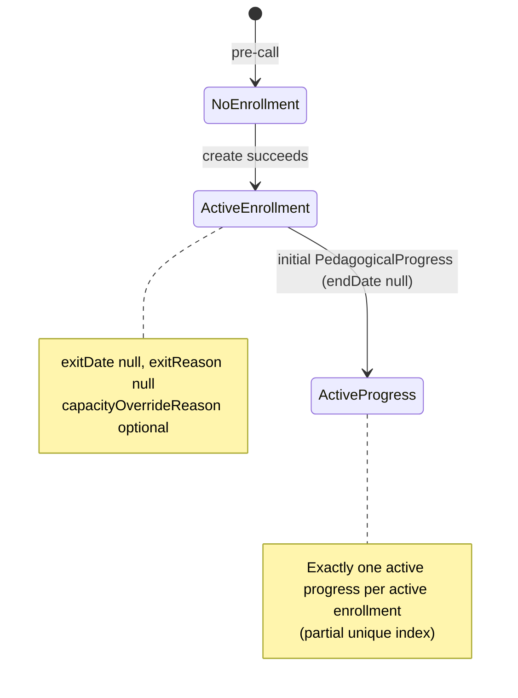
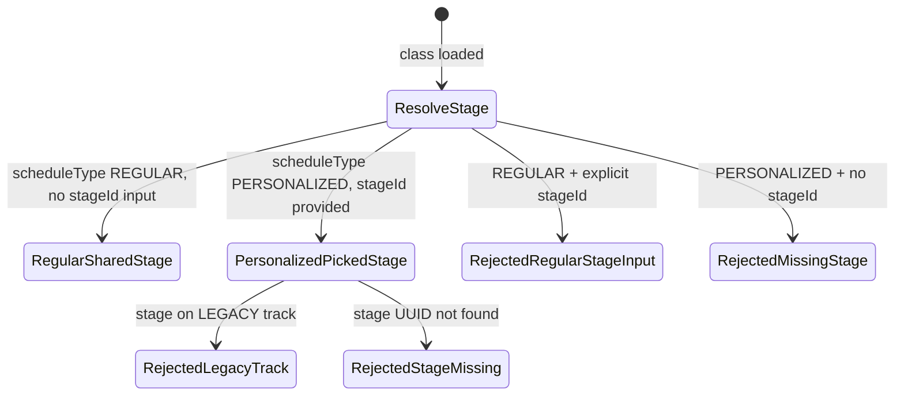
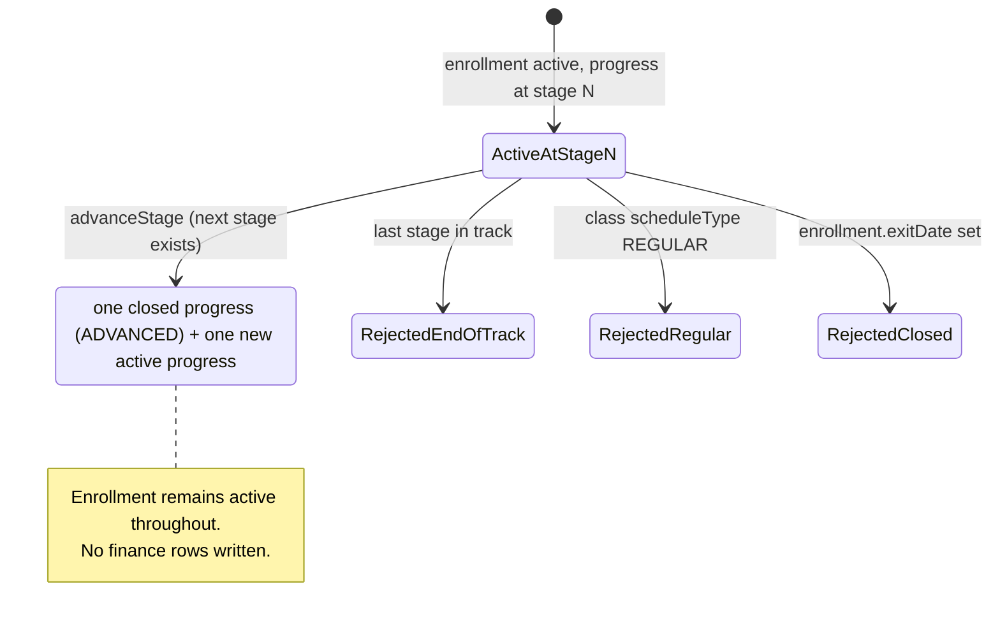
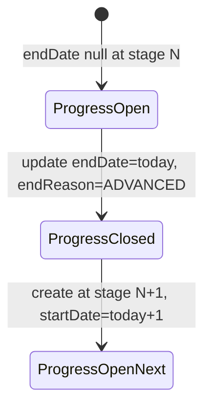

# PAIR-09 — Enrollment create & advance stage

Analysis of `enrollment.create` and `enrollment.advanceStage` only.

---

## `enrollment.create`

- **Type:** mutation
- **Auth:** `adminProcedure` (requires authenticated, enabled staff with role `ADMIN`; TEACHER/SECRETARY/FINANCE denied with `FORBIDDEN`, anonymous with `UNAUTHORIZED`)
- **Input schema:** `enrollmentCreateInputSchema` (strict)
  - `studentId`: required UUID (`"Identificador de aluno invalido."`)
  - `classId`: required UUID (`"Identificador de turma invalido."`)
  - `entryDate`: optional, coerced date-only (`dateOnlyInputSchema`; `"Data invalida."` on failure); defaults to today in `America/Sao_Paulo` when omitted
  - `stageId`: optional UUID (`"Identificador de etapa invalido."`); REGULAR/PERSONALIZED rules enforced in service layer, not Zod
  - `capacityOverrideReason`: optional trimmed non-empty string (`"Motivo de excecao de capacidade nao pode ser vazio."`)
- **Entities touched:**
  - `Enrollment` (create): `studentId`, `classId`, `entryDate`, optional `capacityOverrideReason`; `exitDate`/`exitReason` remain null
  - `PedagogicalProgress` (create): `enrollmentId`, `stageId`, `startDate` (= `entryDate`); `endDate`/`endReason` remain null
  - Read-only lookups: `Student`, `Class`, `Stage`, `Track` (via `loadActiveStage`)

### State preconditions

- Caller is authenticated ADMIN staff.
- `Student` row exists with `status = ACTIVE` (not `INACTIVE`, `DROPPED`, or `SUSPENDED`).
- `Class` row exists with `status = ACTIVE` (not `ARCHIVED`).
- No other active enrollment for the same `(studentId, classId)` (`exitDate IS NULL`).
- Active enrollment count for `classId` is below `Class.capacity`, **or** `capacityOverrideReason` is provided (app layer + DB trigger both enforce).
- Stage resolution depends on `Class.scheduleType`:
  - **REGULAR:** `Class.sharedStageId` must be set (DB CHECK guarantees this); caller must **not** pass `stageId`.
  - **PERSONALIZED:** caller must pass `stageId`; referenced `Stage` must exist, not be on a `LEGACY` track (`loadActiveStage`).
- Transaction wraps insert so the one-active-progress partial unique index holds.

### Scenarios

| ID     | Scenario                                | Given (state)                                                                        | Input                                          | Expected outcome                                         | HTTP/tRPC error (if any)                                                         | Post-state                                                                                                          |
| ------ | --------------------------------------- | ------------------------------------------------------------------------------------ | ---------------------------------------------- | -------------------------------------------------------- | -------------------------------------------------------------------------------- | ------------------------------------------------------------------------------------------------------------------- |
| EC-S1  | Happy path — REGULAR                    | ADMIN; ACTIVE student; ACTIVE REGULAR class with `sharedStageId`; capacity available | `{ studentId, classId }` (no `stageId`)        | `{ enrollment, progress, orderPromptRequired: true }`    | —                                                                                | `Enrollment` active; one `PedagogicalProgress` at class shared stage; `progress.startDate === enrollment.entryDate` |
| EC-S2  | Happy path — PERSONALIZED               | ADMIN; ACTIVE student; ACTIVE PERSONALIZED class; valid non-legacy stage             | `{ studentId, classId, stageId }`              | Same shape as EC-S1                                      | —                                                                                | Active progress at operator-picked `stageId`                                                                        |
| EC-S3  | Default entry date                      | ADMIN; fixtures as EC-S2; omit `entryDate`                                           | `{ studentId, classId, stageId }`              | `{ enrollment.entryDate }` = today (São Paulo date-only) | —                                                                                | Progress `startDate` matches entry date                                                                             |
| EC-S4  | Explicit entry date                     | ADMIN; fixtures as EC-S2                                                             | `{ ..., entryDate: "2026-03-01" }`             | Enrollment + progress start on given date                | —                                                                                | Both rows share the same start date                                                                                 |
| EC-S5  | Capacity override                       | ADMIN; class at capacity (active count = capacity)                                   | Second enrollment without override             | Rejected                                                 | `BAD_REQUEST`: `"Turma sem vagas: informe um motivo para exceder a capacidade."` | No new rows                                                                                                         |
| EC-S6  | Capacity override allowed               | ADMIN; class at capacity                                                             | Third enrollment with `capacityOverrideReason` | Success                                                  | —                                                                                | `Enrollment.capacityOverrideReason` persisted; class over capacity                                                  |
| EC-S7  | RBAC — TEACHER denied                   | TEACHER caller                                                                       | any input                                      | Rejected at gate                                         | `FORBIDDEN` (403)                                                                | No DB writes                                                                                                        |
| EC-S8  | RBAC — anonymous denied                 | No session                                                                           | any input                                      | Rejected at gate                                         | `UNAUTHORIZED` (401)                                                             | No DB writes                                                                                                        |
| EC-S9  | Validation — invalid UUIDs              | ADMIN caller                                                                         | non-UUID `studentId`/`classId`/`stageId`       | Rejected at input parse                                  | `BAD_REQUEST` (Zod UUID messages)                                                | No DB writes                                                                                                        |
| EC-S10 | Validation — empty override reason      | ADMIN caller                                                                         | `capacityOverrideReason: "   "`                | Rejected at input parse                                  | `BAD_REQUEST` (Zod trim/min)                                                     | No DB writes                                                                                                        |
| EC-S11 | Validation — unknown keys               | ADMIN caller                                                                         | extra fields on input                          | Rejected at input parse                                  | `BAD_REQUEST` (strict schema)                                                    | No DB writes                                                                                                        |
| EC-S12 | Domain — student not found              | ADMIN; random `studentId`                                                            | valid class                                    | Rejected in service                                      | `NOT_FOUND`: `"Aluno nao encontrado."`                                           | Transaction rolled back                                                                                             |
| EC-S13 | Domain — student not ACTIVE             | ADMIN; student `status = DROPPED` (or INACTIVE/SUSPENDED)                            | valid class + stage                            | Rejected in service                                      | `BAD_REQUEST`: `"Somente alunos ativos podem ser matriculados."`                 | No enrollment                                                                                                       |
| EC-S14 | Domain — class not found                | ADMIN; random `classId`                                                              | valid student                                  | Rejected in service                                      | `NOT_FOUND`: `"Turma nao encontrada."`                                           | Transaction rolled back                                                                                             |
| EC-S15 | Domain — archived class                 | ADMIN; class `status = ARCHIVED`                                                     | valid student + stage                          | Rejected in service                                      | `BAD_REQUEST`: `"Turma arquivada nao aceita novas matriculas."`                  | No enrollment (DB trigger would also block)                                                                         |
| EC-S16 | Domain — duplicate active enrollment    | ADMIN; student already actively enrolled in class                                    | same `studentId` + `classId` again             | Rejected in service                                      | `BAD_REQUEST`: `"Aluno ja possui matricula ativa nesta turma."`                  | Single active enrollment unchanged                                                                                  |
| EC-S17 | Domain — PERSONALIZED missing stage     | ADMIN; PERSONALIZED class                                                            | `{ studentId, classId }` without `stageId`     | Rejected in service                                      | `BAD_REQUEST`: `"Turma personalizada exige etapa inicial."`                      | No enrollment                                                                                                       |
| EC-S18 | Domain — REGULAR rejects explicit stage | ADMIN; REGULAR class                                                                 | `{ studentId, classId, stageId }`              | Rejected in service                                      | `BAD_REQUEST`: `"Turma regular define a etapa automaticamente."`                 | No enrollment                                                                                                       |
| EC-S19 | Domain — stage not found                | ADMIN; PERSONALIZED class                                                            | random `stageId` UUID                          | Rejected via `loadActiveStage`                           | `NOT_FOUND`: `"Etapa nao encontrada."`                                           | No enrollment                                                                                                       |
| EC-S20 | Domain — legacy track stage             | ADMIN; PERSONALIZED class; stage on `Track.status = LEGACY`                          | `{ ..., stageId }`                             | Rejected via `loadActiveStage`                           | `BAD_REQUEST`: `"Nao e possivel criar turma em trilha legada."`                  | No enrollment (DB progress trigger also blocks legacy track without override flag)                                  |
| EC-S21 | Re-enroll after close                   | ADMIN; prior enrollment in same class closed (`exitDate` set)                        | `{ studentId, classId, stageId }`              | Success (no duplicate guard on closed rows)              | —                                                                                | New active enrollment + progress; old enrollment remains closed                                                     |

### State transitions (flow nodes)

Stage resolution subgraph:

### Outbound edges

| Target                                  | Condition                                                                         |
| --------------------------------------- | --------------------------------------------------------------------------------- |
| Finance order prompt (S-FIN-1, Phase 2) | Response flag `orderPromptRequired: true`; enrollment does not write billing rows |
| `enrollment.advanceStage`               | PERSONALIZED enrollment with a next stage in the same track                       |
| `classes.cloneForNextPeriod`            | REGULAR enrollment advances via class clone, not `advanceStage`                   |
| `enrollment.transfer`                   | Move active enrollment to another class                                           |
| `enrollment.close`                      | Drop or suspend active enrollment                                                 |
| Attendance flows                        | Active enrollment required for session attendance rows                            |
| `enrollment.create` (re-enroll)         | After `enrollment.close` or `students.setStatus` recovery + re-enrollment         |

### Evidence

- `packages/api/src/enrollment/router.ts` — procedure wiring, `$transaction`
- `packages/api/src/enrollment/data.ts` — `createEnrollment`, `openEnrollmentAtStage`, guards
- `packages/api/src/enrollment/errors.ts` — error messages
- `packages/api/src/classes/guards.ts` — `loadActiveStage` (LEGACY track, stage existence)
- `packages/validators/src/enrollment.ts` — `enrollmentCreateInputSchema`
- `packages/db/prisma/schema.prisma` — `Enrollment`, `PedagogicalProgress`, enums `EnrollmentExitReason`, `ProgressEndReason`
- `packages/db/prisma/migrations/20260703160000_gre_26_enrollment_progress/migration.sql` — one-active-progress unique index, capacity/archived/legacy/overlap triggers
- Tests:
  - `packages/api/test/db/enrollment.test.ts` — EC-S1–S6, S13, S15–S17, S3 (entry date default)
  - `packages/api/test/enrollment.test.ts` — EC-S7–S8 (RBAC), EC-S9–S10 (Zod)
  - `packages/api/test/behavior/enrollment-http.test.ts` — HTTP happy path (EC-S2 variant)
  - `packages/db/test/db/enrollment-progress-schema.test.ts` — DB constraint invariants (capacity, archived, legacy, overlap, regular stage match)

### DB validation

Not run in this analysis session. Existing coverage: `pnpm test:db` filters `packages/api/test/db/enrollment.test.ts`, `enrollment-advance.test.ts`; `packages/db/test/db/enrollment-progress-schema.test.ts` for constraint-level checks.

---

## `enrollment.advanceStage`

- **Type:** mutation
- **Auth:** `adminProcedure` (same gate as `enrollment.create`)
- **Input schema:** `enrollmentAdvanceStageInputSchema` (strict)
  - `enrollmentId`: required UUID (`"Identificador de matricula invalido."`)
- **Entities touched:**
  - `PedagogicalProgress` (update): active row — `endDate` = today (São Paulo date-only), `endReason = ADVANCED`
  - `PedagogicalProgress` (create): new row — `stageId` = next stage in same track, `startDate` = close date + 1 day
  - `Enrollment` (read only): must remain active (`exitDate` null); not updated on success
  - Read-only: `Class.scheduleType`, `Stage`/`Track.stages` (ordered by `sequence`, excluding soft-deleted stages)

### State preconditions

- Caller is authenticated ADMIN staff.
- `Enrollment` exists and is active (`exitDate IS NULL`).
- Parent `Class.scheduleType = PERSONALIZED` (REGULAR enrollments advance via `classes.cloneForNextPeriod`, not this procedure).
- Exactly one active `PedagogicalProgress` for the enrollment (`endDate IS NULL`, `deletedAt IS NULL`).
- Current stage has a successor in the same `Track` (`findNextStageInTrack` by `sequence + 1`; deleted stages excluded from loaded list).
- Close-then-create ordering respects the partial unique index and the no-overlap exclusion constraint (close today, start next stage tomorrow).

### Scenarios

| ID     | Scenario                    | Given (state)                                                                                            | Input                            | Expected outcome                                                                    | HTTP/tRPC error (if any)                                                                                                           | Post-state                                                                                                 |
| ------ | --------------------------- | -------------------------------------------------------------------------------------------------------- | -------------------------------- | ----------------------------------------------------------------------------------- | ---------------------------------------------------------------------------------------------------------------------------------- | ---------------------------------------------------------------------------------------------------------- |
| EA-S1  | Happy path                  | ADMIN; active PERSONALIZED enrollment at stage N (not last in track)                                     | `{ enrollmentId }`               | `{ enrollmentId, previousProgress, progress }` with `progress.stageId` = next stage | —                                                                                                                                  | Prior progress closed (`endReason = ADVANCED`); new active progress at next stage; enrollment still active |
| EA-S2  | End of track                | ADMIN; enrollment at last stage in track                                                                 | `{ enrollmentId }`               | Rejected                                                                            | `BAD_REQUEST`: `"Fim da trilha: nao ha proxima etapa."`                                                                            | Progress unchanged                                                                                         |
| EA-S3  | REGULAR enrollment rejected | ADMIN; active REGULAR enrollment (stage = class shared stage)                                            | `{ enrollmentId }`               | Rejected before progress mutation                                                   | `BAD_REQUEST`: `"Apenas turmas personalizadas avancam de etapa individualmente; turmas regulares avancam pela clonagem de turma."` | No progress change                                                                                         |
| EA-S4  | Closed enrollment           | ADMIN; enrollment with `exitDate` set                                                                    | `{ enrollmentId }`               | Rejected                                                                            | `BAD_REQUEST`: `"Somente matriculas ativas podem avancar de etapa."`                                                               | No progress change                                                                                         |
| EA-S5  | Enrollment not found        | ADMIN; random UUID                                                                                       | `{ enrollmentId }`               | Rejected                                                                            | `NOT_FOUND`: `"Matricula nao encontrada."`                                                                                         | No DB writes                                                                                               |
| EA-S6  | RBAC — TEACHER denied       | TEACHER caller                                                                                           | `{ enrollmentId }`               | Rejected at gate                                                                    | `FORBIDDEN` (403)                                                                                                                  | No DB writes                                                                                               |
| EA-S7  | RBAC — anonymous denied     | No session                                                                                               | `{ enrollmentId }`               | Rejected at gate                                                                    | `UNAUTHORIZED` (401)                                                                                                               | No DB writes                                                                                               |
| EA-S8  | Validation — invalid UUID   | ADMIN caller                                                                                             | `{ enrollmentId: "not-a-uuid" }` | Rejected at input parse                                                             | `BAD_REQUEST` (Zod)                                                                                                                | No DB writes                                                                                               |
| EA-S9  | Validation — unknown keys   | ADMIN caller                                                                                             | `{ enrollmentId, stageId }`      | Rejected at input parse                                                             | `BAD_REQUEST` (strict schema)                                                                                                      | No DB writes                                                                                               |
| EA-S10 | Missing active progress     | ADMIN; active PERSONALIZED enrollment with zero active progress rows (data corruption / invariant break) | `{ enrollmentId }`               | Rejected in service                                                                 | `BAD_REQUEST`: `"Matricula ativa sem etapa ativa."`                                                                                | No progress change                                                                                         |
| EA-S11 | Multi-step advance          | ADMIN; enrollment at first stage                                                                         | Call twice sequentially          | First call → stage 2; second call → stage 3 or EA-S2 if only two stages             | —                                                                                                                                  | Two closed progress rows; one active at latest reachable stage                                             |
| EA-S12 | Date boundary               | ADMIN; happy-path fixtures; run on calendar day D                                                        | `{ enrollmentId }`               | Close date = D (São Paulo); new `startDate` = D+1                                   | —                                                                                                                                  | Non-overlapping progress windows (exclusion constraint safe)                                               |

### State transitions (flow nodes)

Progress record lifecycle within one advance call:

### Outbound edges

| Target                             | Condition                                                              |
| ---------------------------------- | ---------------------------------------------------------------------- |
| `enrollment.advanceStage` (repeat) | Still on PERSONALIZED class and not at last stage                      |
| `enrollment.close`                 | Staff drops/suspends after advance                                     |
| `enrollment.transfer`              | Move to another class (carries current stage forward for PERSONALIZED) |
| Attendance / makeup flows          | Active enrollment + current stage context for roster                   |
| `classes.cloneForNextPeriod`       | REGULAR counterpart — bulk advance via new-period class clone          |
| Finance (Phase 2)                  | No billing side effect on advance (pure academic move)                 |

### Evidence

- `packages/api/src/enrollment/router.ts` — procedure wiring
- `packages/api/src/enrollment/advance.ts` — `advanceStage`, close-then-open progress
- `packages/api/src/enrollment/data.ts` — shared selects, `EnrollmentDatabase` type
- `packages/api/src/enrollment/errors.ts` — error messages (re-exports `END_OF_TRACK_MESSAGE` from classes)
- `packages/domain/src/stage-sequence.ts` — `findNextStageInTrack`
- `packages/validators/src/enrollment.ts` — `enrollmentAdvanceStageInputSchema`
- `packages/db/prisma/schema.prisma` — `PedagogicalProgress`, `ProgressEndReason.ADVANCED`
- `packages/db/prisma/migrations/20260703160000_gre_26_enrollment_progress/migration.sql` — overlap exclusion, regular-stage-match trigger (explains REGULAR rejection before DB would fail)
- Tests:
  - `packages/api/test/db/enrollment-advance.test.ts` — EA-S1–S5
  - `packages/api/test/enrollment.test.ts` — EA-S6–S7 (RBAC), EA-S8–S9 (Zod)
  - `packages/api/test/behavior/enrollment-advance-http.test.ts` — HTTP happy path (EA-S1)
  - `packages/domain/test/stage-sequence.test.ts` — next-stage domain logic

### DB validation

Not run in this analysis session. Existing coverage: `packages/api/test/db/enrollment-advance.test.ts`; schema tests in `packages/db/test/db/enrollment-progress-schema.test.ts`.

---

## Cross-endpoint edges (this pair only)

| From                            | To                                         | Condition                                                                                        |
| ------------------------------- | ------------------------------------------ | ------------------------------------------------------------------------------------------------ |
| `students.create`               | `enrollment.create`                        | Student row must exist                                                                           |
| `students.setStatus` (`ACTIVE`) | `enrollment.create`                        | Only `Student.status = ACTIVE` students can enroll (reactivation alone does not restore rosters) |
| `classes.create`                | `enrollment.create`                        | Target class must be `ACTIVE`; REGULAR classes supply `sharedStageId`                            |
| `classes.archive`               | `enrollment.create`                        | Archived class rejected (`CLASS_ARCHIVED_MESSAGE`)                                               |
| `enrollment.create`             | `enrollment.advanceStage`                  | PERSONALIZED enrollment with active progress at non-terminal stage                               |
| `enrollment.create` (REGULAR)   | `classes.cloneForNextPeriod`               | REGULAR stage advance path; `advanceStage` explicitly rejected                                   |
| `enrollment.advanceStage`       | `enrollment.advanceStage`                  | Chain until end of track (EA-S11)                                                                |
| `enrollment.create`             | `enrollment.transfer` / `enrollment.close` | Active enrollment is prerequisite for lifecycle mutations                                        |
| `enrollment.create`             | Finance order prompt                       | `orderPromptRequired: true` in response; no finance write in MVP enrollment layer                |
| `enrollment.advanceStage`       | Attendance domain                          | Enrollment stays active; stage context updates for downstream attendance eligibility             |
