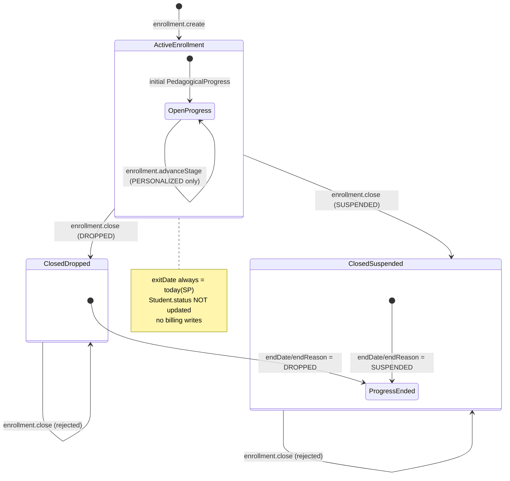
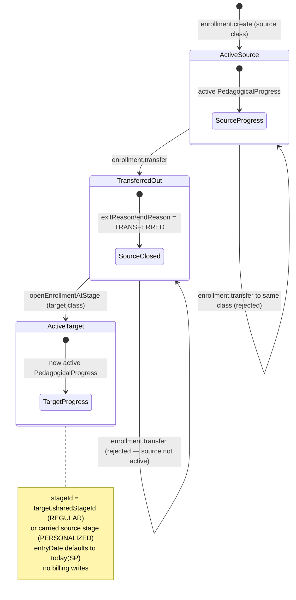

# PAIR-10 — `enrollment.close` + `enrollment.transfer`

## `enrollment.close`

- **Type:** mutation
- **Auth:** `adminProcedure` (authenticated, enabled staff with role `ADMIN` only)
- **Input schema:** `{ enrollmentId: uuid, reason: "DROPPED" | "SUSPENDED" }` — strict object; `TRANSFERRED` and other exit reasons are rejected at validation (`enrollmentCloseInputSchema`).
- **Entities touched:**
  - `Enrollment.exitDate`, `Enrollment.exitReason` (set to today `America/Sao_Paulo` and input reason)
  - `PedagogicalProgress.endDate`, `PedagogicalProgress.endReason` (all rows with `endDate IS NULL` for the enrollment, same date/reason)

### State preconditions

- Caller must be an enabled staff user with role `ADMIN`.
- Target `Enrollment` row must exist.
- Enrollment must be **active** (`exitDate IS NULL`); already-closed enrollments are rejected.
- No precondition on `Student.status` — close does not read or mutate it.
- No precondition on target class `status` — closing is allowed even if the class is archived (only the enrollment row is loaded, not the class).
- No billing precondition — procedure writes no finance rows (spec §5.3).

### Scenarios

| ID  | Scenario                        | Given (state)                                                           | Input                                               | Expected outcome                                                                | HTTP/tRPC error (if any)                    | Post-state                                                                                                                               |
| --- | ------------------------------- | ----------------------------------------------------------------------- | --------------------------------------------------- | ------------------------------------------------------------------------------- | ------------------------------------------- | ---------------------------------------------------------------------------------------------------------------------------------------- |
| S1  | Happy path — drop               | Active enrollment + active progress (PERSONALIZED or REGULAR)           | `{ enrollmentId, reason: "DROPPED" }`               | Success; returns `{ enrollmentId, exitDate: today(SP), exitReason: "DROPPED" }` | —                                           | `Enrollment.exitDate=today(SP)`, `exitReason=DROPPED`; all active progress closed with matching `endDate`/`endReason`; no new enrollment |
| S2  | Happy path — pause              | Active enrollment + active progress                                     | `{ enrollmentId, reason: "SUSPENDED" }`             | Success; `exitReason: "SUSPENDED"`                                              | —                                           | Same as S1 with `SUSPENDED`                                                                                                              |
| S3  | Already closed                  | Enrollment with `exitDate` set                                          | valid input                                         | Rejected                                                                        | `BAD_REQUEST` — `"Matricula ja encerrada."` | Unchanged                                                                                                                                |
| S4  | Not found                       | No matching enrollment id                                               | `{ enrollmentId: random uuid, reason: "DROPPED" }`  | Rejected                                                                        | `NOT_FOUND` — `"Matricula nao encontrada."` | Unchanged                                                                                                                                |
| S5  | RBAC — unauthenticated          | No staff session                                                        | valid input                                         | Rejected                                                                        | `UNAUTHORIZED` (401)                        | Unchanged                                                                                                                                |
| S6  | RBAC — non-admin                | `TEACHER` staff                                                         | valid input                                         | Rejected                                                                        | `FORBIDDEN` (403)                           | Unchanged                                                                                                                                |
| S7  | Validation — bad enrollment id  | —                                                                       | `{ enrollmentId: "not-a-uuid", reason: "DROPPED" }` | Rejected                                                                        | `BAD_REQUEST` + Zod flatten                 | Unchanged                                                                                                                                |
| S8  | Validation — unsupported reason | —                                                                       | `{ enrollmentId, reason: "TRANSFERRED" }`           | Rejected at Zod                                                                 | `BAD_REQUEST` + Zod flatten                 | Unchanged                                                                                                                                |
| S9  | Validation — missing reason     | —                                                                       | `{ enrollmentId }`                                  | Rejected at Zod                                                                 | `BAD_REQUEST` + Zod flatten                 | Unchanged                                                                                                                                |
| S10 | No active progress              | Active enrollment but no progress with `endDate IS NULL` (data anomaly) | valid input                                         | Success (progress `updateMany` affects 0 rows)                                  | —                                           | Enrollment still closed; no active progress remains                                                                                      |
| S11 | Student status unchanged        | Student `ACTIVE`/`DROPPED`/etc., single enrollment                      | drop or suspend                                     | Success                                                                         | —                                           | `Student.status` untouched (staff use `students.setStatus` separately)                                                                   |
| S12 | Idempotent re-close             | After S1                                                                | second close with different reason                  | Rejected (S3)                                                                   | `BAD_REQUEST` — `"Matricula ja encerrada."` | First close preserved                                                                                                                    |
| S13 | HTTP boundary                   | Same as S1 via tRPC HTTP                                                | POST `enrollment.close` as ADMIN                    | 200 + persisted close                                                           | —                                           | Same post-state as S1                                                                                                                    |

### State transitions (flow nodes)

### Outbound edges

| Target                      | Condition                                                                                             |
| --------------------------- | ----------------------------------------------------------------------------------------------------- |
| `enrollment.create`         | Re-enroll same student after drop/pause (no auto-resume)                                              |
| `students.setStatus`        | Independent path — staff may set student-level `DROPPED`/`SUSPENDED` without using `enrollment.close` |
| Attendance / roster queries | Student drops off future rosters for the closed enrollment's class via `exitDate` window              |
| (none)                      | No Hatchet jobs; no finance/order mutation; no `Student.status` cascade                               |

### Evidence

- `packages/api/src/enrollment/router.ts` (procedure wiring, `$transaction`)
- `packages/api/src/enrollment/close.ts` (`closeEnrollment`)
- `packages/api/src/enrollment/data.ts` (`loadActiveEnrollment`, `closeActiveEnrollment`)
- `packages/api/src/enrollment/errors.ts` (message constants)
- `packages/validators/src/enrollment.ts` (`enrollmentCloseInputSchema`)
- `packages/api/src/students/date-rules.ts` (`todayDateOnlyInSaoPaulo`)
- `packages/db/prisma/schema.prisma` (`Enrollment`, `PedagogicalProgress`, `EnrollmentExitReason`, `ProgressEndReason`)
- `packages/api/test/db/enrollment-lifecycle.test.ts` (drop, pause, not found, already closed)
- `packages/api/test/behavior/enrollment-lifecycle-http.test.ts` (HTTP close)
- `packages/api/test/enrollment.test.ts` (RBAC gate, close input schema)
- `docs/MVP/PRD.md` S-ENR-3 (product intent; billing prompt deferred)

---

## `enrollment.transfer`

- **Type:** mutation
- **Auth:** `adminProcedure` (authenticated, enabled staff with role `ADMIN` only)
- **Input schema:** `{ enrollmentId: uuid, targetClassId: uuid, entryDate?: date-only, capacityOverrideReason?: non-empty trimmed string }` — strict object; target stage is **not** in input (derived server-side).
- **Entities touched:**
  - **Source** `Enrollment.exitDate`, `Enrollment.exitReason` (`TRANSFERRED`, date = `entryDate`)
  - **Source** `PedagogicalProgress.endDate`, `PedagogicalProgress.endReason` (active rows → `TRANSFERRED`, same date)
  - **Target** new `Enrollment` row (`studentId`, `classId`, `entryDate`, optional `capacityOverrideReason`)
  - **Target** new `PedagogicalProgress` row (active, `startDate = entryDate`, `stageId` derived)

### State preconditions

- Caller must be an enabled staff user with role `ADMIN`.
- Source enrollment must exist and be active (`exitDate IS NULL`).
- Target class must exist and have `status = ACTIVE` (archived rejected).
- `targetClassId !== source.classId`.
- Student must **not** already have an active enrollment in the target class (`exitDate IS NULL` on same `studentId` + `classId`).
- Target class must have capacity headroom **or** caller supplies `capacityOverrideReason`.
- Stage resolution:
  - Target `REGULAR`: uses target `sharedStageId` (DB CHECK ensures non-null).
  - Target `PERSONALIZED`: carries source's active progress `stageId` (requires exactly one active progress on source).
- **No** `Student.status` check (unlike `enrollment.create`) — transfer does not call `assertStudentIsEnrollable`.
- Runs atomically: source closes before target opens (same transaction) to satisfy one-active-enrollment-per-class partial unique index.

### Scenarios

| ID  | Scenario                                      | Given (state)                                                   | Input                                | Expected outcome                                                                | HTTP/tRPC error (if any)                                                          | Post-state                                                                                                             |
| --- | --------------------------------------------- | --------------------------------------------------------------- | ------------------------------------ | ------------------------------------------------------------------------------- | --------------------------------------------------------------------------------- | ---------------------------------------------------------------------------------------------------------------------- |
| S1  | REGULAR → REGULAR                             | Active REGULAR enrollment at stage A; target REGULAR at stage B | `{ enrollmentId, targetClassId }`    | Success; returns `{ source: { enrollmentId, exitDate }, enrollment, progress }` | —                                                                                 | Source closed `TRANSFERRED`; new active enrollment on target; progress at target `sharedStageId` (stage B)             |
| S2  | PERSONALIZED → PERSONALIZED                   | Active PERSONALIZED at stage X                                  | `{ enrollmentId, targetClassId }`    | Success                                                                         | —                                                                                 | Source closed `TRANSFERRED`; new enrollment; progress **carries** stage X                                              |
| S3  | Same class                                    | Active enrollment in class C                                    | `{ enrollmentId, targetClassId: C }` | Rejected                                                                        | `BAD_REQUEST` — `"A turma de destino deve ser diferente da turma atual."`         | Unchanged                                                                                                              |
| S4  | Archived target                               | Target class `ARCHIVED`                                         | valid transfer                       | Rejected                                                                        | `BAD_REQUEST` — `"Turma arquivada nao aceita novas matriculas."`                  | Unchanged                                                                                                              |
| S5  | Closed source                                 | Source already closed (e.g. prior `enrollment.close`)           | valid transfer                       | Rejected                                                                        | `BAD_REQUEST` — `"Matricula ja encerrada."`                                       | Unchanged                                                                                                              |
| S6  | Missing target class                          | Random `targetClassId`                                          | valid source                         | Rejected                                                                        | `NOT_FOUND` — `"Turma nao encontrada."`                                           | Unchanged                                                                                                              |
| S7  | Source not found                              | Random `enrollmentId`                                           | valid target                         | Rejected                                                                        | `NOT_FOUND` — `"Matricula nao encontrada."`                                       | Unchanged                                                                                                              |
| S8  | Capacity full                                 | Target at capacity, no override                                 | transfer without override            | Rejected                                                                        | `BAD_REQUEST` — `"Turma sem vagas: informe um motivo para exceder a capacidade."` | Unchanged                                                                                                              |
| S9  | Capacity override                             | Target full                                                     | `{ …, capacityOverrideReason: "…" }` | Success                                                                         | —                                                                                 | New enrollment stores override reason; student on target roster                                                        |
| S10 | Duplicate active on target                    | Student already has active enrollment in target class           | valid transfer                       | Rejected                                                                        | `BAD_REQUEST` — `"Aluno ja possui matricula ativa nesta turma."`                  | Unchanged (inferred from `assertNoDuplicateActiveEnrollment`; no dedicated db test)                                    |
| S11 | Missing active progress (PERSONALIZED target) | Active enrollment with no progress `endDate IS NULL`            | transfer to PERSONALIZED             | Rejected                                                                        | `BAD_REQUEST` — `"Matricula ativa sem etapa ativa."`                              | Unchanged (inferred; guard in `resolveTargetStageId`)                                                                  |
| S12 | Custom entry date                             | Active enrollment                                               | `{ …, entryDate: "2026-03-15" }`     | Success                                                                         | —                                                                                 | Source `exitDate` and new `entryDate`/`startDate` = given date (inferred; not db-tested)                               |
| S13 | RBAC — unauthenticated                        | —                                                               | valid input                          | Rejected                                                                        | `UNAUTHORIZED` (401)                                                              | Unchanged                                                                                                              |
| S14 | RBAC — non-admin                              | `TEACHER` staff                                                 | valid input                          | Rejected                                                                        | `FORBIDDEN` (403)                                                                 | Unchanged                                                                                                              |
| S15 | Validation — bad ids                          | —                                                               | non-UUID ids                         | Rejected                                                                        | `BAD_REQUEST` + Zod flatten                                                       | Unchanged                                                                                                              |
| S16 | Validation — empty override                   | —                                                               | `capacityOverrideReason: "   "`      | Rejected at Zod                                                                 | `BAD_REQUEST` + Zod flatten                                                       | Unchanged                                                                                                              |
| S17 | Validation — unknown keys                     | —                                                               | extra `stageId` field                | Rejected at Zod (strict)                                                        | `BAD_REQUEST` + Zod flatten                                                       | Unchanged                                                                                                              |
| S18 | Past attendance preserved                     | Source enrollment with historical attendance rows               | successful transfer                  | Success                                                                         | —                                                                                 | Past `Attendance` rows remain on source enrollment; student absent from old class future rosters via enrollment window |
| S19 | HTTP boundary                                 | REGULAR → REGULAR                                               | POST `enrollment.transfer` as ADMIN  | 200 + both sides persisted                                                      | —                                                                                 | Same post-state as S1                                                                                                  |

### State transitions (flow nodes)

### Outbound edges

| Target                      | Condition                                                                      |
| --------------------------- | ------------------------------------------------------------------------------ |
| `enrollment.advanceStage`   | Continues on new enrollment if target is PERSONALIZED                          |
| `enrollment.close`          | Can drop/suspend the new enrollment independently                              |
| `enrollment.create`         | Alternative to transfer when history split is not needed                       |
| Attendance / roster queries | Old class future sessions exclude student; new class includes from `entryDate` |
| (none)                      | No Hatchet jobs; no finance rows; no `Student.status` change                   |

### Evidence

- `packages/api/src/enrollment/router.ts`
- `packages/api/src/enrollment/transfer.ts` (`transferEnrollment`, `resolveTargetStageId`, `moveEnrollment`)
- `packages/api/src/enrollment/data.ts` (`loadActiveEnrollment`, `loadEnrollableClass`, `assertNoDuplicateActiveEnrollment`, `assertCapacity`, `closeActiveEnrollment`, `openEnrollmentAtStage`)
- `packages/api/src/enrollment/errors.ts`
- `packages/validators/src/enrollment.ts` (`enrollmentTransferInputSchema`)
- `packages/api/src/students/date-rules.ts`
- `packages/db/prisma/schema.prisma` (`Enrollment`, `PedagogicalProgress`, `Class.scheduleType`, `Class.sharedStageId`, `Class.capacity`)
- `packages/api/test/db/enrollment-lifecycle.test.ts` (regular transfer, personalized carry, same class, archived target, closed source, missing target, capacity + override)
- `packages/api/test/behavior/enrollment-lifecycle-http.test.ts` (HTTP transfer)
- `packages/api/test/enrollment.test.ts` (RBAC gate, transfer input schema)
- `docs/MVP/PRD.md` S-ENR-2

### DB validation

Not run in this analysis session. Existing coverage: 4 db tests for `enrollment.close`, 7 for `enrollment.transfer`, 2 HTTP behavior tests in `enrollment-lifecycle-http.test.ts`.

---

## Cross-endpoint edges (this pair only)

| From                  | To                        | Condition                                                                                                                 |
| --------------------- | ------------------------- | ------------------------------------------------------------------------------------------------------------------------- |
| `enrollment.create`   | `enrollment.close`        | Requires prior active enrollment                                                                                          |
| `enrollment.create`   | `enrollment.transfer`     | Requires prior active enrollment as transfer source                                                                       |
| `enrollment.close`    | `enrollment.transfer`     | Closed source blocks transfer (`"Matricula ja encerrada."`)                                                               |
| `enrollment.transfer` | `enrollment.close`        | New target enrollment can be dropped/suspended independently                                                              |
| `enrollment.transfer` | `enrollment.advanceStage` | PERSONALIZED target enrollment eligible for stage advance                                                                 |
| `enrollment.close`    | `students.setStatus`      | Orthogonal — close does not set `Student.status`; `setStatus(DROPPED/SUSPENDED)` closes **all** active enrollments inline |
| `enrollment.transfer` | `enrollment.create`       | Both open enrollments; transfer preserves history by closing source with `TRANSFERRED`                                    |
| `enrollment.close`    | `enrollment.create`       | After drop/pause, staff re-enrolls via create (no resume primitive)                                                       |
| `classes.archive`     | `enrollment.transfer`     | Archived target rejected; source class archive status not checked on close                                                |
