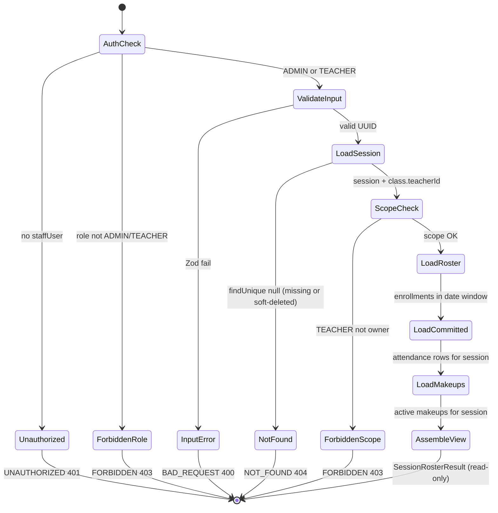
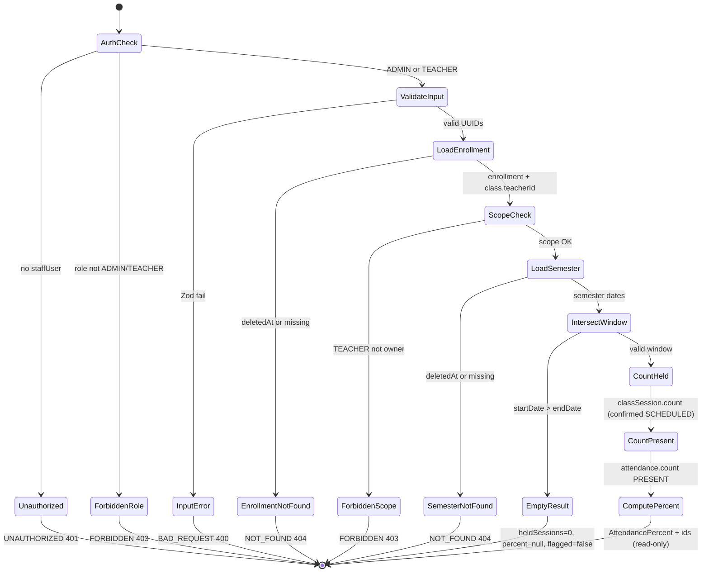

# PAIR-11 — Attendance read (`sessionRoster`, `enrollmentSemesterPercent`)

Read-only attendance pair for the flow-control graph. Both procedures are `staffProcedure` queries with no DB writes; teacher access is narrowed to owned classes via `assertResourceScope`.

---

## `attendance.sessionRoster`

- **Type:** query
- **Auth:** `staffProcedure` (authenticated enabled staff with role `ADMIN` or `TEACHER`; `SECRETARY`/`FINANCE` → `FORBIDDEN`; no session → `UNAUTHORIZED`). After load, `assertResourceScope` requires `Class.teacherId === ctx.staffUser.id` for `TEACHER`; `ADMIN` bypasses.
- **Input schema:** `attendanceSessionRosterInputSchema` — `{ sessionId: string }` (strict); `sessionId` must be a valid UUID (`"Identificador de sessao invalido."`)
- **Entities touched:**
  - `ClassSession` (read: `id`, `classId`, `date`, `startTime`, `endTime`, `status`, `attendanceConfirmedAt`, `attendanceConfirmedById`; via `loadSessionWithClass`; soft-delete filter applies)
  - `Class` (read: `teacherId` for RBAC)
  - `Enrollment` + nested `Student` (read: roster members where `entryDate <= session.date` and (`exitDate` is null or `exitDate >= session.date`); ordered by `student.fullName` asc)
  - `Attendance` (read: `enrollmentId`, `status` for committed rows on this session)
  - `Makeup` + nested `Enrollment`/`Student`/`Class` (read: active visitors where `targetClassSessionId = sessionId` and `cancelledAt IS NULL`; ordered by visitor name asc). No writes.

### State preconditions

- Caller is an enabled staff user with role `ADMIN` or `TEACHER`.
- Target `ClassSession` exists with `deleted_at IS NULL` (Prisma soft-delete extension on `findUnique`).
- Session’s `Class` row exists (FK); `Class.teacherId` resolves RBAC.
- Zero or more `Enrollment` rows may match the session-date window for `session.classId`; makeup visitors are optional.
- `Attendance` rows may exist only after `attendance.confirmSession`; before confirm, `committedStatus` is `null` for all roster entries.
- `Makeup` rows targeting the session may exist (scheduled by `attendance.scheduleMakeup`); cancelled makeups (`cancelledAt` set) are excluded from the visitor list.

### Scenarios

| ID  | Scenario                                            | Given (state)                                                                      | Input                                             | Expected outcome                                                                                                                                                | HTTP/tRPC error (if any)                            | Post-state                              |
| --- | --------------------------------------------------- | ---------------------------------------------------------------------------------- | ------------------------------------------------- | --------------------------------------------------------------------------------------------------------------------------------------------------------------- | --------------------------------------------------- | --------------------------------------- |
| R1  | Happy path — roster ordering, defaults              | Session with 2+ in-window enrollments (Ana, Bruno)                                 | Valid `sessionId`                                 | `entries` ordered by `studentFullName` asc; each entry has `defaultStatus: "PRESENT"`, `committedStatus: null`; `makeupVisitors: []`; `session.classId` matches | —                                                   | Unchanged (read-only)                   |
| R2  | Window containment — late joiner excluded           | Enrollment with `entryDate` after session `date`                                   | Valid `sessionId`                                 | Only enrollments whose window contains session date appear in `entries`                                                                                         | —                                                   | Unchanged                               |
| R3  | Class scope — other class excluded                  | Enrollments on a different `classId`                                               | Valid `sessionId`                                 | Only enrollments for session’s class                                                                                                                            | —                                                   | Unchanged                               |
| R4  | Empty roster                                        | Session with no in-window enrollments                                              | Valid `sessionId`                                 | `entries: []`; session metadata still returned                                                                                                                  | —                                                   | Unchanged                               |
| R5  | Untaken flag — past unconfirmed                     | `SCHEDULED` session whose SP end instant has passed; `attendanceConfirmedAt: null` | Valid `sessionId`                                 | `session.untaken: true`, `attendanceConfirmedAt: null`                                                                                                          | —                                                   | Unchanged                               |
| R6  | Untaken cleared after confirm                       | Same session after `attendance.confirmSession`                                     | Valid `sessionId`                                 | `session.untaken: false`, `attendanceConfirmedAt` set; `entries[0].committedStatus: "PRESENT"` when confirm used `rows: []`                                     | —                                                   | Unchanged (read reflects prior confirm) |
| R7  | Committed ABSENT reflected                          | Session confirmed with explicit `ABSENT` row for an enrollment                     | Valid `sessionId`                                 | Matching entry `committedStatus: "ABSENT"`                                                                                                                      | —                                                   | Unchanged                               |
| R8  | Makeup visitor — SCHEDULED                          | Active makeup targeting a future session                                           | Valid `sessionId`                                 | `makeupVisitors[0]`: `originClassInternalCode`, `status: "SCHEDULED"`, `attendedAt: null`; visitor not in `entries`                                             | —                                                   | Unchanged                               |
| R9  | Makeup visitor — NO_SHOW                            | Past session end, makeup with no `attendedAt`                                      | Valid `sessionId`                                 | `makeupVisitors[0].status: "NO_SHOW"`                                                                                                                           | —                                                   | Unchanged                               |
| R10 | Makeup visitor — ATTENDED                           | Makeup with `attendedAt` set                                                       | Valid `sessionId`                                 | `makeupVisitors[0].status: "ATTENDED"`                                                                                                                          | —                                                   | Unchanged                               |
| R11 | Cancelled makeup hidden                             | Makeup with `cancelledAt` set                                                      | Valid `sessionId`                                 | `makeupVisitors: []`                                                                                                                                            | —                                                   | Unchanged                               |
| R12 | Visitor separation from confirm count               | One roster member + one makeup visitor                                             | Valid `sessionId` then `confirmSession`           | `entries.length === 1`, `makeupVisitors.length === 1`; confirm `rosterCount === 1` (visitors excluded)                                                          | —                                                   | Confirm is separate mutation            |
| R13 | Cancelled session — not untaken                     | `ClassSession.status: "CANCELLED"`                                                 | Valid `sessionId`                                 | `session.untaken: false` (domain: cancelled sessions never untaken)                                                                                             | —                                                   | Unchanged                               |
| R14 | Cancelled target session — makeup CANCELLED display | Makeup on cancelled target session (still in DB if not cancelled itself)           | Valid `sessionId`                                 | Visitor `status: "CANCELLED"` via `targetSessionCancelled` (domain precedence)                                                                                  | —                                                   | Unchanged                               |
| R15 | Session not found                                   | No row for `sessionId`, or soft-deleted session                                    | Valid UUID                                        | —                                                                                                                                                               | `NOT_FOUND` / HTTP 404 — `"Sessao nao encontrada."` | Unchanged                               |
| R16 | RBAC — anonymous                                    | `ctx.staffUser === null`                                                           | Any valid-shaped input                            | —                                                                                                                                                               | `UNAUTHORIZED` / HTTP 401                           | Unchanged                               |
| R17 | RBAC — non-staff roles                              | Enabled `SECRETARY` or `FINANCE`                                                   | Any valid input                                   | —                                                                                                                                                               | `FORBIDDEN` / HTTP 403 (staffProcedure gate)        | Unchanged                               |
| R18 | RBAC — other teacher                                | Session owned by teacher A; caller is teacher B                                    | Valid `sessionId`                                 | —                                                                                                                                                               | `FORBIDDEN` / HTTP 403 (`assertResourceScope`)      | Unchanged                               |
| R19 | RBAC — owning teacher                               | Session owned by caller teacher                                                    | Valid `sessionId`                                 | Full roster payload                                                                                                                                             | —                                                   | Unchanged                               |
| R20 | RBAC — admin                                        | Any session                                                                        | Valid `sessionId`                                 | Full roster payload (admin bypasses scope)                                                                                                                      | —                                                   | Unchanged                               |
| R21 | Validation — invalid UUID                           | —                                                                                  | `{ sessionId: "not-a-uuid" }`                     | —                                                                                                                                                               | `BAD_REQUEST` / HTTP 400 (Zod on `sessionId`)       | Unchanged                               |
| R22 | Validation — missing/extra fields                   | —                                                                                  | `{}` or `{ sessionId, extra }`                    | —                                                                                                                                                               | `BAD_REQUEST` / HTTP 400 (strict schema)            | Unchanged                               |
| R23 | HTTP boundary                                       | Seeded session + enrollment                                                        | GET `attendance.sessionRoster` with admin session | HTTP 200; JSON with `entries.length >= 1`                                                                                                                       | —                                                   | Unchanged                               |

### State transitions (flow nodes)

### Outbound edges

| Target                                 | Condition                                                                                                     |
| -------------------------------------- | ------------------------------------------------------------------------------------------------------------- |
| `attendance.confirmSession`            | Teacher takes attendance on unconfirmed session (`session.untaken` or pre-end); uses `entries[].enrollmentId` |
| `attendance.editSession`               | After confirm, teacher/admin edits committed rows                                                             |
| `attendance.markMakeupOutcome`         | Teacher records visitor show-up (`makeupVisitors[].makeupId`)                                                 |
| `attendance.enrollmentSemesterPercent` | Profile/report UI may link roster member `enrollmentId` to semester stats (different procedure)               |

Requires prior: `ClassSession` row (from session generation or seed); enrollments via `enrollment.create`; makeups via `attendance.scheduleMakeup` (admin).

### Evidence

- `packages/api/src/attendance/router.ts` — procedure wiring
- `packages/api/src/attendance/roster.ts` — `readSessionRoster`, response types
- `packages/api/src/attendance/data.ts` — `loadSessionWithClass`, `loadActiveRoster`, `loadSessionMakeups`
- `packages/api/src/attendance/errors.ts` — `SESSION_NOT_FOUND_MESSAGE`
- `packages/api/src/trpc/init.ts` — `staffProcedure`
- `packages/api/src/trpc/rbac.ts` — `assertResourceScope`
- `packages/validators/src/attendance.ts` — `attendanceSessionRosterInputSchema`
- `packages/domain/src/session-status.ts` — `isSessionUntaken`
- `packages/domain/src/makeup-status.ts` — `deriveMakeupDisplayStatus`
- `packages/db/prisma/schema.prisma` — `ClassSession`, `Enrollment`, `Attendance`, `Makeup`
- `packages/db/src/soft-delete.ts` — read ops auto-filter `deletedAt: null`
- `packages/api/test/db/attendance-roster.test.ts` — R1–R6, R15, R18–R20
- `packages/api/test/db/makeup-roster.test.ts` — R8–R12, R14 pattern
- `packages/api/test/behavior/attendance-http.test.ts` — R23

**DB validation:** Not run in this analysis (scenarios derived from source + existing tests).

---

## `attendance.enrollmentSemesterPercent`

- **Type:** query
- **Auth:** `staffProcedure` (same gate as `sessionRoster`); `assertResourceScope` on `enrollment.class.teacherId` after enrollment load.
- **Input schema:** `attendanceEnrollmentSemesterPercentInputSchema` — `{ enrollmentId: string, semesterId: string }` (strict); both must be valid UUIDs (`"Identificador de matricula invalido."` / `"Identificador de semestre invalido."`)
- **Entities touched:**
  - `Enrollment` (read: `id`, `classId`, `entryDate`, `exitDate`, `class.teacherId`; `deletedAt: null` explicit)
  - `Semester` (read: `id`, `startDate`, `endDate`; `deletedAt: null` explicit)
  - `ClassSession` (read/count: held sessions — `status: "SCHEDULED"`, `attendanceConfirmedAt` not null, `date` within intersection window, `deletedAt: null`)
  - `Attendance` (read/count: `status: "PRESENT"` rows for enrollment on held sessions in window, `deletedAt: null`). No writes.

### State preconditions

- Caller is enabled staff with role `ADMIN` or `TEACHER`.
- Target `Enrollment` exists with `deleted_at IS NULL`.
- Target `Semester` exists with `deleted_at IS NULL`.
- Effective window = `[max(entryDate, semester.startDate), min(exitDate ?? semester.endDate, semester.endDate)]`; if `start > end`, no sessions count (empty denominator).
- Held session definition: non-cancelled (`SCHEDULED`), attendance confirmed, session `date` in effective window, same `classId` as enrollment.
- Makeups do not affect `heldSessions` or `presentCount` (excluded by query shape; makeup attendance on target session is not counted for origin enrollment).

### Scenarios

| ID  | Scenario                                  | Given (state)                                                                                                                                                                              | Input                                    | Expected outcome                                                                                                         | HTTP/tRPC error (if any)                               | Post-state            |
| --- | ----------------------------------------- | ------------------------------------------------------------------------------------------------------------------------------------------------------------------------------------------ | ---------------------------------------- | ------------------------------------------------------------------------------------------------------------------------ | ------------------------------------------------------ | --------------------- |
| P1  | Happy path — formula                      | Enrollment + semester with overlapping window; 3 confirmed held sessions; 2 `PRESENT`, 1 `ABSENT` for enrollment; excludes unconfirmed, cancelled, out-of-window sessions and makeup facts | Valid `enrollmentId`, `semesterId`       | `{ enrollmentId, semesterId, heldSessions: 3, presentCount: 2, percent: 2/3, flagged: true }` (flag when percent < 0.75) | —                                                      | Unchanged (read-only) |
| P2  | Empty denominator — no held sessions      | Enrollment in semester window but no confirmed sessions                                                                                                                                    | Valid ids                                | `{ heldSessions: 0, presentCount: 0, percent: null, flagged: false }` ("sem dados")                                      | —                                                      | Unchanged             |
| P3  | Non-overlapping window                    | Enrollment window disjoint from semester (e.g. `entryDate` after semester `endDate`)                                                                                                       | Valid ids                                | Same as P2 — early return before counts (`intersectWindows === null`)                                                    | —                                                      | Unchanged             |
| P4  | Excludes unconfirmed sessions             | `ClassSession` in window without `attendanceConfirmedAt`                                                                                                                                   | Valid ids                                | Session omitted from `heldSessions`                                                                                      | —                                                      | Unchanged             |
| P5  | Excludes cancelled sessions               | `ClassSession.status: "CANCELLED"` in window                                                                                                                                               | Valid ids                                | Session omitted from `heldSessions`                                                                                      | —                                                      | Unchanged             |
| P6  | Excludes out-of-window confirmed sessions | Confirmed sessions before `entryDate` or after semester `endDate`                                                                                                                          | Valid ids                                | Those sessions not counted                                                                                               | —                                                      | Unchanged             |
| P7  | Makeup attendance excluded                | Makeup with `attendedAt` on a held session for same enrollment                                                                                                                             | Valid ids                                | Does not increment `presentCount` or `heldSessions` for origin enrollment percent                                        | —                                                      | Unchanged             |
| P8  | Enrollment not found                      | Missing or soft-deleted enrollment                                                                                                                                                         | Valid `enrollmentId`, valid `semesterId` | —                                                                                                                        | `NOT_FOUND` / HTTP 404 — `"Matricula nao encontrada."` | Unchanged             |
| P9  | Semester not found                        | Missing or soft-deleted semester                                                                                                                                                           | Valid ids                                | —                                                                                                                        | `NOT_FOUND` / HTTP 404 — `"Semestre nao encontrado."`  | Unchanged             |
| P10 | RBAC — anonymous                          | `ctx.staffUser === null`                                                                                                                                                                   | Any valid input                          | —                                                                                                                        | `UNAUTHORIZED` / HTTP 401                              | Unchanged             |
| P11 | RBAC — non-staff roles                    | `SECRETARY` or `FINANCE`                                                                                                                                                                   | Any valid input                          | —                                                                                                                        | `FORBIDDEN` / HTTP 403                                 | Unchanged             |
| P12 | RBAC — other teacher                      | Enrollment on class owned by teacher A; caller teacher B                                                                                                                                   | Valid ids                                | —                                                                                                                        | `FORBIDDEN` / HTTP 403                                 | Unchanged             |
| P13 | RBAC — owning teacher                     | Enrollment on caller’s class                                                                                                                                                               | Valid ids                                | Percent payload                                                                                                          | —                                                      | Unchanged             |
| P14 | Validation — invalid UUIDs                | —                                                                                                                                                                                          | Non-UUID `enrollmentId` or `semesterId`  | —                                                                                                                        | `BAD_REQUEST` / HTTP 400                               | Unchanged             |
| P15 | Validation — missing/extra fields         | —                                                                                                                                                                                          | `{}` or extra keys                       | —                                                                                                                        | `BAD_REQUEST` / HTTP 400 (strict)                      | Unchanged             |
| P16 | HTTP boundary                             | One confirmed session, one present                                                                                                                                                         | GET with admin session                   | HTTP 200; `heldSessions: 1`, `presentCount: 1`, `percent: 1`                                                             | —                                                      | Unchanged             |
| P17 | HTTP boundary — forbidden scope           | Other teacher                                                                                                                                                                              | GET                                      | HTTP 403                                                                                                                 | Unchanged                                              |

### State transitions (flow nodes)

### Outbound edges

| Target                                       | Condition                                            |
| -------------------------------------------- | ---------------------------------------------------- |
| `students.byId` (future `attendanceSummary`) | Student profile displays per-semester percent        |
| Reports / coordinator dashboards             | `flagged: true` when percent < 75% (S-REP-4, D-0029) |

Requires prior: `Enrollment` + `Semester`; confirmed sessions via `attendance.confirmSession` (or direct DB seed) to populate non-zero denominator.

### Evidence

- `packages/api/src/attendance/router.ts` — procedure wiring
- `packages/api/src/attendance/percent.ts` — `readEnrollmentSemesterPercent`, window intersection, counts
- `packages/api/src/attendance/errors.ts` — `ENROLLMENT_NOT_FOUND_MESSAGE`, `SEMESTER_NOT_FOUND_MESSAGE`
- `packages/validators/src/attendance.ts` — `attendanceEnrollmentSemesterPercentInputSchema`
- `packages/domain/src/attendance-percent.ts` — `computeAttendancePercent` (75% flag threshold)
- `packages/api/test/db/attendance-percent.test.ts` — P1–P3, P12
- `packages/api/test/behavior/attendance-http.test.ts` — P16–P17
- `packages/domain/test/attendance-percent.test.ts` — domain formula edge cases

**DB validation:** Not run in this analysis (scenarios derived from source + existing tests).

---

## Cross-endpoint edges (this pair only)

| From                        | To                                     | Condition                                                                                         |
| --------------------------- | -------------------------------------- | ------------------------------------------------------------------------------------------------- |
| `attendance.sessionRoster`  | `attendance.confirmSession`            | Teacher loads roster then commits attendance (`entries[].enrollmentId`, `defaultStatus: PRESENT`) |
| `attendance.confirmSession` | `attendance.sessionRoster`             | Re-read to see `committedStatus` and `session.untaken: false`                                     |
| `attendance.confirmSession` | `attendance.enrollmentSemesterPercent` | Confirmed sessions enter `heldSessions`; present rows enter `presentCount`                        |
| `attendance.sessionRoster`  | `attendance.markMakeupOutcome`         | Roster shows `makeupVisitors`; teacher records outcome                                            |
| `attendance.scheduleMakeup` | `attendance.sessionRoster`             | Admin schedules visitor; roster `makeupVisitors` populated                                        |
| `attendance.sessionRoster`  | `attendance.enrollmentSemesterPercent` | UI may use roster `enrollmentId` with class `semesterId` for stats (no direct API link)           |
| `enrollment.create`         | `attendance.sessionRoster`             | New in-window enrollment appears in `entries`                                                     |
| `calendar.createSemester`   | `attendance.enrollmentSemesterPercent` | Semester window bounds session counting                                                           |
