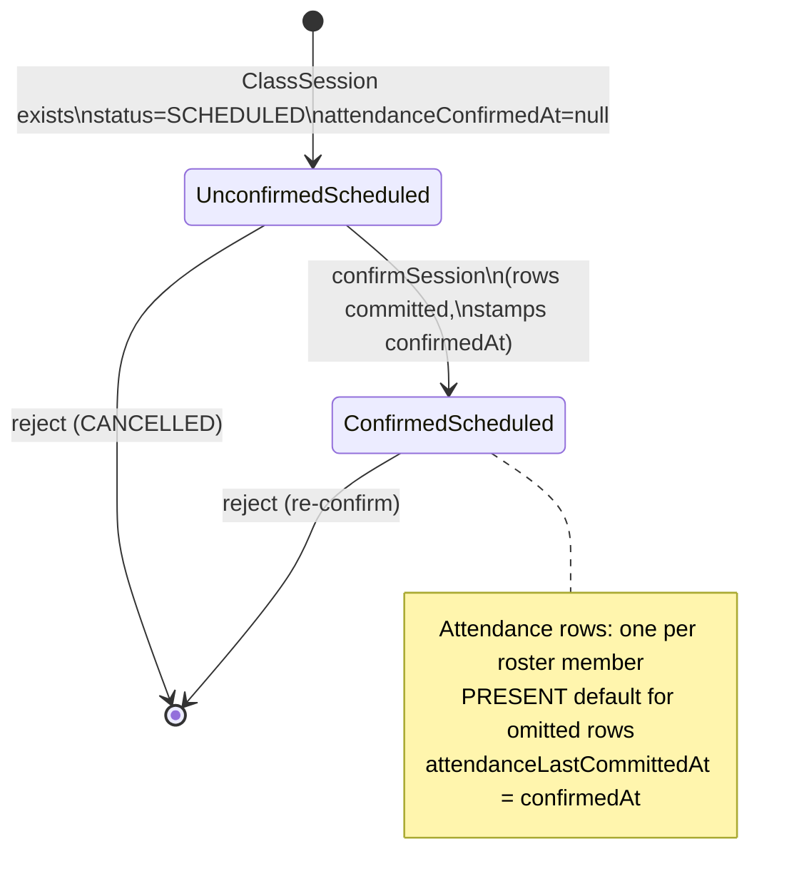
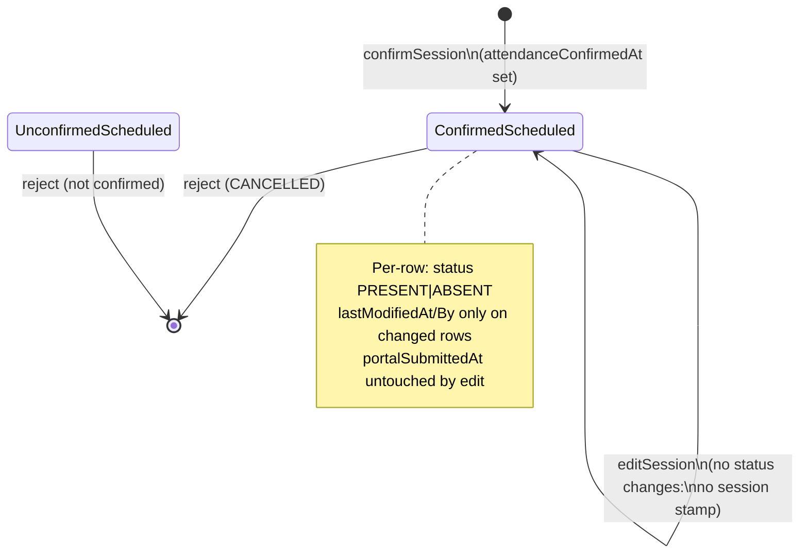

# PAIR-12 — `attendance.confirmSession` + `attendance.editSession`

## `attendance.confirmSession`

- **Type:** mutation
- **Auth:** `staffProcedure` (authenticated, enabled staff with role `ADMIN` or `TEACHER`; resource scope enforced in service)
- **Input schema:** `attendanceConfirmSessionInputSchema` — strict object:
  - `sessionId`: UUID
  - `rows`: array of `{ enrollmentId: uuid, status: "PRESENT" | "ABSENT" }` (may be empty; no minimum)
- **Entities touched:**
  - `Attendance` — bulk `createMany`: one row per active-roster enrollment (`enrollmentId`, `classSessionId`, `status`, `recordedById`)
  - `ClassSession` — `attendanceConfirmedAt`, `attendanceConfirmedById`, `attendanceLastCommittedAt` (all set to `now` on success)

### State preconditions

- Caller must be an enabled staff user with role `ADMIN` or `TEACHER`.
- **Resource scope:** `ADMIN` any class; `TEACHER` only when `session.class.teacherId === staffUser.id`.
- **Write window:** `ADMIN` any calendar date; `TEACHER` only when `now` is the same São Paulo calendar day as `session.date`.
- **Session:** `ClassSession` row must exist (`deletedAt` not filtered in attendance loader — missing id → not found).
- **Session status:** `status !== CANCELLED` (`ClassSessionStatus`: `SCHEDULED` or `CANCELLED`).
- **Not yet confirmed:** `attendanceConfirmedAt IS NULL`.
- **Roster:** active enrollments for `session.classId` where `entryDate <= session.date` and (`exitDate IS NULL` OR `exitDate >= session.date`); may be empty.
- **No server-side draft:** zero `Attendance` rows for the session before call (enforced by unique index + confirm guard, not a separate pre-check).

### Scenarios

| ID  | Scenario                                 | Given (state)                                                | Input                                               | Expected outcome                                                                           | HTTP/tRPC error (if any)                                                     | Post-state                                                          |
| --- | ---------------------------------------- | ------------------------------------------------------------ | --------------------------------------------------- | ------------------------------------------------------------------------------------------ | ---------------------------------------------------------------------------- | ------------------------------------------------------------------- |
| S1  | Happy path — mixed statuses              | SCHEDULED session, unconfirmed, 2 in-window enrollments      | `rows` with one `ABSENT`, other omitted             | Success; `rosterCount=2`, `presentCount=1`, `absentCount=1`; all rows committed atomically | —                                                                            | `Attendance` ×2; `attendanceConfirmedAt/By/LastCommittedAt` stamped |
| S2  | Happy path — all present default         | SCHEDULED, unconfirmed, enrollments on roster                | `rows: []`                                          | Success; every roster member `PRESENT`                                                     | —                                                                            | All `PRESENT`; session confirmed                                    |
| S3  | Happy path — empty roster                | SCHEDULED, unconfirmed, no in-window enrollments             | `rows: []`                                          | Success; `rosterCount=0`, counts zero                                                      | —                                                                            | No attendance rows; session still confirmed                         |
| S4  | RBAC — unauthenticated                   | No `staffUser`                                               | valid input                                         | Rejected                                                                                   | `UNAUTHORIZED` (401)                                                         | Unchanged                                                           |
| S5  | RBAC — non-staff role                    | `FINANCE` / `SECRETARY` (not in `staffProcedure`)            | valid input                                         | Rejected                                                                                   | `FORBIDDEN` (403)                                                            | Unchanged                                                           |
| S6  | RBAC — other teacher                     | Session owned by teacher A                                   | teacher B, same SP day                              | Rejected                                                                                   | `FORBIDDEN` (403)                                                            | No attendance rows                                                  |
| S7  | RBAC — owning teacher same day           | Session owned by teacher                                     | owning teacher, `now` same SP day as `session.date` | Success                                                                                    | —                                                                            | Confirmed                                                           |
| S8  | Write window — teacher next SP day       | Owning teacher, unconfirmed session                          | owning teacher, `now` on next SP calendar day       | Rejected                                                                                   | `FORBIDDEN` (403)                                                            | No attendance rows                                                  |
| S9  | Write window — admin past session        | Past session date                                            | `ADMIN` any `now`                                   | Success                                                                                    | —                                                                            | Confirmed (admin bypasses day window)                               |
| S10 | Validation — bad session UUID            | —                                                            | `sessionId: "x"`                                    | Rejected                                                                                   | `BAD_REQUEST` — `"Identificador de sessao invalido."`                        | Unchanged                                                           |
| S11 | Validation — bad enrollment UUID         | —                                                            | `enrollmentId: "x"` in row                          | Rejected                                                                                   | `BAD_REQUEST` — `"Identificador de matricula invalido."`                     | Unchanged                                                           |
| S12 | Validation — invalid status              | —                                                            | `status` not in enum                                | Rejected                                                                                   | `BAD_REQUEST` (Zod enum)                                                     | Unchanged                                                           |
| S13 | Session not found                        | Unknown `sessionId`                                          | valid shape                                         | Rejected                                                                                   | `NOT_FOUND` — `"Sessao nao encontrada."`                                     | Unchanged                                                           |
| S14 | Already confirmed                        | `attendanceConfirmedAt` set                                  | any `rows`                                          | Rejected                                                                                   | `BAD_REQUEST` — `"Chamada desta sessao ja foi confirmada."`                  | Unchanged                                                           |
| S15 | Cancelled session                        | `status = CANCELLED`                                         | any `rows`                                          | Rejected                                                                                   | `BAD_REQUEST` — `"Sessao cancelada nao aceita chamada."`                     | Unchanged                                                           |
| S16 | Off-roster enrollment                    | Enrollment `entryDate > session.date` (not on roster)        | row for that enrollment                             | Rejected                                                                                   | `BAD_REQUEST` — `"Matricula nao pertence a lista de presenca desta sessao."` | No rows committed                                                   |
| S17 | Duplicate row                            | Same `enrollmentId` twice in `rows`                          | duplicate entries                                   | Rejected                                                                                   | `BAD_REQUEST` — `"Matricula repetida na chamada."`                           | Unchanged                                                           |
| S18 | Enrollment window — late joiner excluded | Student enrolled after session date                          | `rows: []`                                          | Success; only in-window members committed                                                  | —                                                                            | Late joiner has no row; `rosterCount` excludes them                 |
| S19 | Roster count invariant violation         | `createMany` count ≠ roster length (data/constraint anomaly) | valid input                                         | Rejected                                                                                   | `BAD_REQUEST` — `"Divergencia na contagem da lista de presenca."`            | Transaction rolls back                                              |

### State transitions (flow nodes)

`confirmSession` does not change `ClassSession.status` (stays `SCHEDULED`). It only sets attendance confirmation timestamps and creates `Attendance` rows.

### Outbound edges

| Target                                 | Condition                                                                                                                    |
| -------------------------------------- | ---------------------------------------------------------------------------------------------------------------------------- |
| `attendance.editSession`               | Session must be confirmed (`attendanceConfirmedAt` set) before edits                                                         |
| `attendance.enrollmentSemesterPercent` | Reads committed `Attendance` rows for held-session percent                                                                   |
| `attendance.sessionRoster`             | Typical UI precursor (read roster before confirm); not required by API                                                       |
| Portal worker (Hatchet)                | Downstream; sets `portalSubmittedAt`; edits after submit use `attendanceLastCommittedAt > portalSubmittedAt` as retry signal |

### Evidence

- `packages/api/src/attendance/router.ts` (procedure wiring, `$transaction`)
- `packages/api/src/attendance/confirm.ts`
- `packages/api/src/attendance/rows.ts` (`buildRequestedStatuses`)
- `packages/api/src/attendance/access.ts` (`assertAttendanceWriteWindow`)
- `packages/api/src/attendance/data.ts` (`loadSessionWithClass`, `loadActiveRoster`)
- `packages/api/src/attendance/errors.ts`
- `packages/api/src/trpc/rbac.ts` (`assertResourceScope`)
- `packages/api/src/trpc/init.ts` (`staffProcedure`, `protectedProcedure`)
- `packages/validators/src/attendance.ts` (`attendanceConfirmSessionInputSchema`, `attendanceStatusSchema`)
- `packages/db/prisma/schema.prisma` (`enum ClassSessionStatus`, `enum AttendanceStatus`, `ClassSession`, `Attendance`)
- `packages/api/test/db/attendance-confirm.test.ts`
- `packages/api/test/behavior/attendance-http.test.ts` (HTTP confirm happy path + forbidden scope)

---

## `attendance.editSession`

- **Type:** mutation
- **Auth:** `staffProcedure` (same as confirm; resource scope + write window in service)
- **Input schema:** `attendanceEditSessionInputSchema` — strict object:
  - `sessionId`: UUID
  - `rows`: array min 1 of `{ enrollmentId: uuid, status: "PRESENT" | "ABSENT" }` (explicit changes only; unchanged enrollments may be omitted)
- **Entities touched:**
  - `Attendance` — `updateMany` per changed row: `status`, `lastModifiedAt`, `lastModifiedById` (only when status differs from committed)
  - `ClassSession` — `attendanceLastCommittedAt` updated to `now` **only when** at least one row changed; `attendanceConfirmedAt/By` unchanged

### State preconditions

- Same caller, resource scope, and write-window rules as `confirmSession`.
- **Session:** must exist.
- **Session status:** `status !== CANCELLED`.
- **Must be confirmed:** `attendanceConfirmedAt IS NOT NULL`.
- **Committed rows:** existing `Attendance` row count for session must equal current active-roster count (roster-count invariant).
- **Input:** at least one row in `rows`; each `enrollmentId` must be on the session roster; no duplicate `enrollmentId` in payload.

### Scenarios

| ID  | Scenario                                  | Given (state)                                                                    | Input                                                                            | Expected outcome                                                                                                        | HTTP/tRPC error (if any)                                                     | Post-state                                                                  |
| --- | ----------------------------------------- | -------------------------------------------------------------------------------- | -------------------------------------------------------------------------------- | ----------------------------------------------------------------------------------------------------------------------- | ---------------------------------------------------------------------------- | --------------------------------------------------------------------------- |
| S1  | Happy path — owning teacher same day      | Confirmed session; teacher owns class; same SP day                               | rows changing one enrollment `ABSENT→PRESENT` (+ unchanged row with same status) | Success; `changedCount=1`; counts reflect new statuses; `latestCommittedAt=now`                                         | —                                                                            | Changed row stamped `lastModifiedAt/By`; `attendanceLastCommittedAt` bumped |
| S2  | Happy path — admin past edit after Portal | Confirmed + `portalSubmittedAt` set; admin                                       | edit past SP day changing one status                                             | Success; `changedCount=1`; `attendanceLastCommittedAt > portalSubmittedAt`                                              | —                                                                            | Portal retry predicate satisfied                                            |
| S3  | No-op — same status                       | Confirmed; row already `PRESENT`                                                 | row requesting `PRESENT` again                                                   | Success; `changedCount=0`; `latestCommittedAt` unchanged (prior `attendanceLastCommittedAt` or `attendanceConfirmedAt`) | —                                                                            | No row stamps; session `attendanceLastCommittedAt` unchanged                |
| S4  | RBAC — unauthenticated                    | No `staffUser`                                                                   | valid input                                                                      | Rejected                                                                                                                | `UNAUTHORIZED` (401)                                                         | Unchanged                                                                   |
| S5  | RBAC — non-staff role                     | `FINANCE` / `SECRETARY`                                                          | valid input                                                                      | Rejected                                                                                                                | `FORBIDDEN` (403)                                                            | Unchanged                                                                   |
| S6  | RBAC — other teacher                      | Confirmed session owned by teacher A                                             | teacher B, same SP day                                                           | Rejected                                                                                                                | `FORBIDDEN` (403)                                                            | Rows unchanged                                                              |
| S7  | Write window — teacher next SP day        | Confirmed; owning teacher                                                        | `now` next SP calendar day                                                       | Rejected                                                                                                                | `FORBIDDEN` (403)                                                            | Row status/modification stamps unchanged                                    |
| S8  | Write window — admin past                 | Confirmed past session                                                           | `ADMIN` any `now`                                                                | Success                                                                                                                 | —                                                                            | Edit applied                                                                |
| S9  | Validation — empty rows                   | —                                                                                | `rows: []`                                                                       | Rejected                                                                                                                | `BAD_REQUEST` — `"Informe ao menos uma alteracao."`                          | Unchanged                                                                   |
| S10 | Validation — bad UUIDs / status           | —                                                                                | invalid ids or status                                                            | Rejected                                                                                                                | `BAD_REQUEST` (Zod)                                                          | Unchanged                                                                   |
| S11 | Session not found                         | Unknown `sessionId`                                                              | valid shape                                                                      | Rejected                                                                                                                | `NOT_FOUND` — `"Sessao nao encontrada."`                                     | Unchanged                                                                   |
| S12 | Not confirmed                             | `attendanceConfirmedAt IS NULL`                                                  | ≥1 row                                                                           | Rejected                                                                                                                | `BAD_REQUEST` — `"Chamada desta sessao ainda nao foi confirmada."`           | Unchanged                                                                   |
| S13 | Cancelled session                         | `status = CANCELLED` (even if timestamps set)                                    | ≥1 row                                                                           | Rejected                                                                                                                | `BAD_REQUEST` — `"Sessao cancelada nao aceita chamada."`                     | Unchanged                                                                   |
| S14 | Off-roster enrollment                     | Enrollment not in session roster window                                          | row for off-roster id                                                            | Rejected                                                                                                                | `BAD_REQUEST` — `"Matricula nao pertence a lista de presenca desta sessao."` | Unchanged                                                                   |
| S15 | Duplicate row                             | Same `enrollmentId` twice                                                        | duplicate entries                                                                | Rejected                                                                                                                | `BAD_REQUEST` — `"Matricula repetida na chamada."`                           | Unchanged                                                                   |
| S16 | Roster count mismatch                     | Committed attendance rows ≠ current roster size (e.g. roster grew after confirm) | valid rows                                                                       | Rejected                                                                                                                | `BAD_REQUEST` — `"Divergencia na contagem da lista de presenca."`            | Unchanged                                                                   |

### State transitions (flow nodes)

`editSession` never clears `attendanceConfirmedAt` and never creates new `Attendance` rows — only updates existing committed rows.

### Outbound edges

| Target                                 | Condition                                                             |
| -------------------------------------- | --------------------------------------------------------------------- |
| `attendance.enrollmentSemesterPercent` | Recomputed from updated `Attendance` statuses                         |
| Portal worker (Hatchet)                | `attendanceLastCommittedAt > portalSubmittedAt` signals resubmit need |
| `attendance.confirmSession`            | Blocked once confirmed (`ALREADY_CONFIRMED_MESSAGE`)                  |

### Evidence

- `packages/api/src/attendance/router.ts`
- `packages/api/src/attendance/edit.ts`
- `packages/api/src/attendance/rows.ts`
- `packages/api/src/attendance/access.ts`
- `packages/api/src/attendance/data.ts`
- `packages/api/src/attendance/errors.ts`
- `packages/validators/src/attendance.ts` (`attendanceEditSessionInputSchema`)
- `packages/db/prisma/schema.prisma` (`enum AttendanceStatus`, `ClassSession`, `Attendance`)
- `packages/api/test/db/attendance-edit.test.ts`
- `packages/api/test/behavior/attendance-http.test.ts` (HTTP edit + forbidden teacher window)

DB validation: not run in this analysis (tests above are the evidence source).

---

## Cross-endpoint edges (this pair only)

| From                        | To                                     | Condition                                                                                                 |
| --------------------------- | -------------------------------------- | --------------------------------------------------------------------------------------------------------- |
| `attendance.confirmSession` | `attendance.editSession`               | Confirm must succeed first (`attendanceConfirmedAt` non-null)                                             |
| `attendance.confirmSession` | `attendance.confirmSession`            | Re-confirm blocked (`ALREADY_CONFIRMED_MESSAGE`)                                                          |
| `attendance.sessionRoster`  | `attendance.confirmSession`            | UI flow: load roster then submit; API does not enforce ordering                                           |
| `attendance.confirmSession` | `attendance.enrollmentSemesterPercent` | Percent reads committed attendance after confirm                                                          |
| `attendance.editSession`    | `attendance.enrollmentSemesterPercent` | Percent reflects post-edit statuses                                                                       |
| `attendance.editSession`    | Portal submit worker                   | Edit after `portalSubmittedAt` leaves `attendanceLastCommittedAt > portalSubmittedAt` for retry detection |
| `attendance.confirmSession` | `attendance.editSession`               | Teacher same-day window applies to both; admin bypasses on both                                           |
