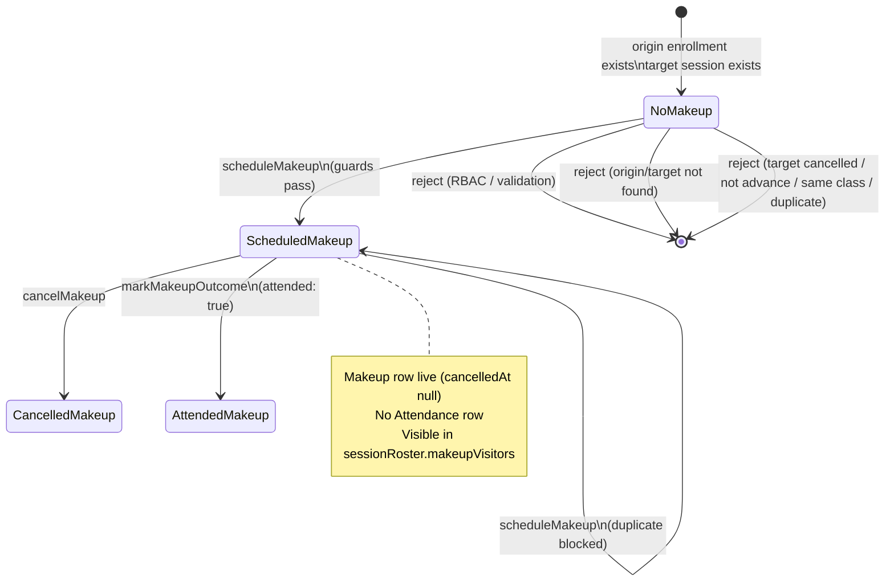
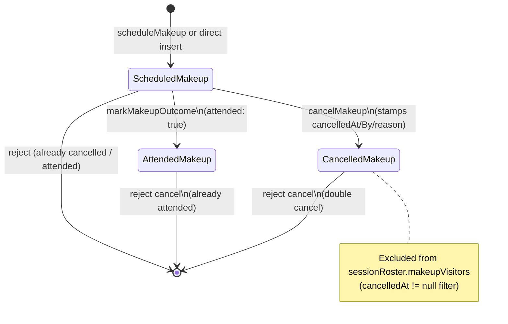

# PAIR-13 — `attendance.scheduleMakeup` + `attendance.cancelMakeup`

## `attendance.scheduleMakeup`

- **Type:** mutation
- **Auth:** `adminProcedure` (authenticated, enabled staff with role `ADMIN` only)
- **Input schema:** `makeupScheduleInputSchema` — strict object:
  - `originEnrollmentId`: UUID (origin/home enrollment)
  - `targetClassSessionId`: UUID (future target session)
  - `reason`: optional trimmed string min 1 — required override when origin and target share the same `classId`
- **Entities touched:**
  - `Makeup` — `create`: `originEnrollmentId`, `targetClassSessionId`, `scheduledById`, `reason` (nullable); `scheduledAt` defaults to `now`
  - Read-only: `Enrollment` (origin lookup), `ClassSession` + `Class` (target lookup)

### State preconditions

- Caller must be an enabled staff user with role `ADMIN`.
- **Origin enrollment:** `Enrollment` row must exist (any class/status; no active-window check).
- **Target session:** `ClassSession` row must exist.
- **Target session status:** `status !== CANCELLED` (`ClassSessionStatus`: `SCHEDULED` or `CANCELLED`).
- **Advance date:** target session `date` must be strictly after the current São Paulo calendar day (`isAtLeastTomorrowInSaoPaulo`).
- **Distinct class (unless override):** if `origin.classId === target.classId`, caller must supply non-empty `reason`.
- **No duplicate:** no existing `Makeup` row with the same `(originEnrollmentId, targetClassSessionId)` pair (application guard; partial unique index on live rows is DB backstop).
- **No attendance row created** — makeup scheduling does not write `Attendance`.

### Scenarios

| ID  | Scenario                                | Given (state)                                                                  | Input                                                               | Expected outcome                                    | HTTP/tRPC error (if any)                                                                                | Post-state                                           |
| --- | --------------------------------------- | ------------------------------------------------------------------------------ | ------------------------------------------------------------------- | --------------------------------------------------- | ------------------------------------------------------------------------------------------------------- | ---------------------------------------------------- |
| S1  | Happy path — cross-class future session | Valid origin enrollment; target session in another class, `date` ≥ tomorrow SP | `originEnrollmentId`, `targetClassSessionId` (no `reason`)          | Success; returns `makeupId`, ids, `scheduledAt`     | —                                                                                                       | `Makeup` row; `scheduledById` = admin; `reason` null |
| S2  | Happy path — same-class with override   | Origin and target share `classId`; target date ≥ tomorrow SP                   | same ids + `reason: "aula extra"`                                   | Success                                             | —                                                                                                       | `Makeup` row; `reason` stored                        |
| S3  | RBAC — unauthenticated                  | No `staffUser`                                                                 | valid input                                                         | Rejected                                            | `UNAUTHORIZED` (401)                                                                                    | Unchanged                                            |
| S4  | RBAC — teacher / non-admin              | `TEACHER` (or any non-`ADMIN` staff role)                                      | valid input                                                         | Rejected                                            | `FORBIDDEN` (403)                                                                                       | Unchanged                                            |
| S5  | Validation — bad UUIDs                  | —                                                                              | invalid `originEnrollmentId`, `targetClassSessionId`, or extra keys | Rejected                                            | `BAD_REQUEST` (Zod)                                                                                     | Unchanged                                            |
| S6  | Validation — empty override reason      | Same-class target                                                              | `reason: ""` or whitespace-only                                     | Rejected                                            | `BAD_REQUEST` (Zod min length)                                                                          | Unchanged                                            |
| S7  | Origin not found                        | Unknown `originEnrollmentId`                                                   | valid target                                                        | Rejected                                            | `NOT_FOUND` — `"Matricula de origem nao encontrada."`                                                   | Unchanged                                            |
| S8  | Target session not found                | Unknown `targetClassSessionId`                                                 | valid origin                                                        | Rejected                                            | `NOT_FOUND` — `"Sessao nao encontrada."`                                                                | Unchanged                                            |
| S9  | Target in past / today                  | Target session `date` ≤ current SP calendar day                                | valid ids                                                           | Rejected                                            | `BAD_REQUEST` — `"Reposicao precisa ser agendada com antecedencia (a partir de amanha)."`               | Unchanged                                            |
| S10 | Target session cancelled                | Target `status = CANCELLED`                                                    | valid ids                                                           | Rejected                                            | `BAD_REQUEST` — `"Nao e possivel usar uma sessao cancelada como destino de reposicao."`                 | Unchanged                                            |
| S11 | Same class without reason               | Origin and target same `classId`                                               | no `reason`                                                         | Rejected                                            | `BAD_REQUEST` — `"A turma de destino e igual a de origem; informe um motivo para registrar a excecao."` | Unchanged                                            |
| S12 | Duplicate makeup                        | Live `Makeup` already links same origin + target session                       | repeat schedule                                                     | Rejected                                            | `BAD_REQUEST` — `"Ja existe uma reposicao para esta matricula nesta sessao."`                           | Unchanged                                            |
| S13 | Edge — duplicate after cancel           | Prior makeup for same pair with `cancelledAt` set                              | schedule again                                                      | Rejected (app guard matches any row, not only live) | `BAD_REQUEST` — duplicate message                                                                       | Unchanged unless guard/index behavior changes        |
| S14 | Edge — target tomorrow boundary         | Target `date` = tomorrow SP; `now` = today SP                                  | valid cross-class input                                             | Success                                             | —                                                                                                       | `Makeup` created                                     |

### State transitions (flow nodes)

Scheduling creates a live makeup (`cancelledAt` null, `attendedAt` null). It does not change `ClassSession.status` or any `Enrollment` fields.

### Outbound edges

| Target                                 | Condition                                                      |
| -------------------------------------- | -------------------------------------------------------------- |
| `attendance.sessionRoster`             | Live makeup appears in `makeupVisitors` for target session     |
| `attendance.markMakeupOutcome`         | Teacher/admin records visitor attendance on target session day |
| `attendance.cancelMakeup`              | Admin cancels before outcome is marked attended                |
| `attendance.enrollmentSemesterPercent` | Unaffected — makeups never write `Attendance`                  |

### Evidence

- `packages/api/src/attendance/router.ts` (procedure wiring, `$transaction`)
- `packages/api/src/attendance/makeup-schedule.ts`
- `packages/api/src/attendance/makeup-data.ts` (`loadOriginEnrollment`, `makeupExists`)
- `packages/api/src/attendance/makeup-errors.ts`
- `packages/api/src/attendance/data.ts` (`loadSessionWithClass`)
- `packages/api/src/trpc/init.ts` (`adminProcedure`)
- `packages/validators/src/makeup.ts` (`makeupScheduleInputSchema`)
- `packages/domain/src/session-time.ts` (`isAtLeastTomorrowInSaoPaulo`)
- `packages/db/prisma/schema.prisma` (`Makeup`, `ClassSessionStatus`)
- `packages/api/test/db/makeup-schedule.test.ts`

---

## `attendance.cancelMakeup`

- **Type:** mutation
- **Auth:** `adminProcedure` (authenticated, enabled staff with role `ADMIN` only)
- **Input schema:** `makeupCancelInputSchema` — strict object:
  - `makeupId`: UUID
  - `reason`: trimmed string min 1 (required cancellation reason)
- **Entities touched:**
  - `Makeup` — `update`: `cancelledAt` (server `now`), `cancelledById`, `cancellationReason`
  - Read-only: `Makeup` + nested `ClassSession`/`Class` (load for guards)

### State preconditions

- Caller must be an enabled staff user with role `ADMIN`.
- **Makeup:** row must exist.
- **Not already cancelled:** `cancelledAt IS NULL`.
- **Not attended:** `attendedAt IS NULL` (cancel-after-attended requires a separate correction flow per §4.6).
- **No target-session guard:** target session date, status, and confirmation state are not checked at cancel time.

### Scenarios

| ID  | Scenario                        | Given (state)                                                 | Input                           | Expected outcome                           | HTTP/tRPC error (if any)                                                           | Post-state                                                   |
| --- | ------------------------------- | ------------------------------------------------------------- | ------------------------------- | ------------------------------------------ | ---------------------------------------------------------------------------------- | ------------------------------------------------------------ |
| S1  | Happy path                      | Live scheduled makeup (`cancelledAt` null, `attendedAt` null) | `makeupId`, non-empty `reason`  | Success; returns `makeupId`, `cancelledAt` | —                                                                                  | `cancelledAt`, `cancelledById`, `cancellationReason` stamped |
| S2  | RBAC — unauthenticated          | No `staffUser`                                                | valid input                     | Rejected                                   | `UNAUTHORIZED` (401)                                                               | Unchanged                                                    |
| S3  | RBAC — teacher / non-admin      | `TEACHER` (or any non-`ADMIN` staff role)                     | valid input                     | Rejected                                   | `FORBIDDEN` (403)                                                                  | Unchanged                                                    |
| S4  | Validation — bad makeup UUID    | —                                                             | `makeupId: "x"`                 | Rejected                                   | `BAD_REQUEST` — `"Identificador de reposicao invalido."`                           | Unchanged                                                    |
| S5  | Validation — empty reason       | —                                                             | `reason: ""` or whitespace-only | Rejected                                   | `BAD_REQUEST` — `"Motivo do cancelamento nao pode ser vazio."`                     | Unchanged                                                    |
| S6  | Makeup not found                | Unknown `makeupId`                                            | valid shape                     | Rejected                                   | `NOT_FOUND` — `"Reposicao nao encontrada."`                                        | Unchanged                                                    |
| S7  | Already cancelled               | `cancelledAt` set                                             | valid input                     | Rejected                                   | `BAD_REQUEST` — `"Reposicao ja esta cancelada."`                                   | Unchanged                                                    |
| S8  | Already attended                | `attendedAt` set (outcome marked)                             | valid input                     | Rejected                                   | `BAD_REQUEST` — `"Reposicao ja tem presenca registrada e nao pode ser cancelada."` | Unchanged                                                    |
| S9  | Edge — past/future target       | Makeup targets past or far-future session                     | valid input                     | Success (no date guard)                    | —                                                                                  | Cancelled; visitor hidden from roster                        |
| S10 | Edge — cancelled target session | Target session `status = CANCELLED`                           | valid input                     | Success (no session-status guard)          | —                                                                                  | Cancelled                                                    |

### State transitions (flow nodes)

Cancel is a soft lifecycle transition on `Makeup`; it does not delete the row or touch `Attendance`.

### Outbound edges

| Target                         | Condition                                                                                        |
| ------------------------------ | ------------------------------------------------------------------------------------------------ |
| `attendance.sessionRoster`     | Cancelled makeup no longer in `makeupVisitors`                                                   |
| `attendance.markMakeupOutcome` | Blocked once cancelled (`MAKEUP_ALREADY_CANCELLED_MESSAGE`)                                      |
| `attendance.scheduleMakeup`    | Re-scheduling same origin+target may still be blocked if cancelled row remains (duplicate guard) |

### Evidence

- `packages/api/src/attendance/router.ts`
- `packages/api/src/attendance/makeup-cancel.ts`
- `packages/api/src/attendance/makeup-data.ts` (`loadMakeupWithTarget`)
- `packages/api/src/attendance/makeup-errors.ts`
- `packages/api/src/attendance/data.ts` (`loadSessionMakeups` — `cancelledAt: null` filter)
- `packages/api/src/trpc/init.ts` (`adminProcedure`)
- `packages/validators/src/makeup.ts` (`makeupCancelInputSchema`)
- `packages/db/prisma/schema.prisma` (`Makeup`)
- `packages/api/test/db/makeup-cancel.test.ts`
- `packages/api/test/db/makeup-roster.test.ts` (`registerCancelledHiddenTest` — cancelled visitor hidden)

DB validation: not run in this analysis (tests above are the evidence source).

---

## Cross-endpoint edges (this pair only)

| From                                 | To                             | Condition                                                                  |
| ------------------------------------ | ------------------------------ | -------------------------------------------------------------------------- |
| `attendance.scheduleMakeup`          | `attendance.sessionRoster`     | Live makeup populates `makeupVisitors` on target session                   |
| `attendance.scheduleMakeup`          | `attendance.markMakeupOutcome` | Outcome recorded after visitor appears on target roster                    |
| `attendance.scheduleMakeup`          | `attendance.cancelMakeup`      | Admin cancels a scheduled (not yet attended) makeup                        |
| `attendance.cancelMakeup`            | `attendance.sessionRoster`     | Visitor removed from `makeupVisitors` once `cancelledAt` set               |
| `attendance.cancelMakeup`            | `attendance.markMakeupOutcome` | Cancelled makeup cannot be marked                                          |
| `attendance.markMakeupOutcome`       | `attendance.cancelMakeup`      | Attended makeup (`attendedAt` set) cannot be cancelled                     |
| `attendance.scheduleMakeup`          | `attendance.scheduleMakeup`    | Duplicate origin+target blocked; may persist even after prior cancel (S13) |
| `enrollment.create` (or seed)        | `attendance.scheduleMakeup`    | Origin enrollment must exist                                               |
| `classes.generateSessions` (or seed) | `attendance.scheduleMakeup`    | Target `ClassSession` must exist and pass advance/cancelled guards         |
