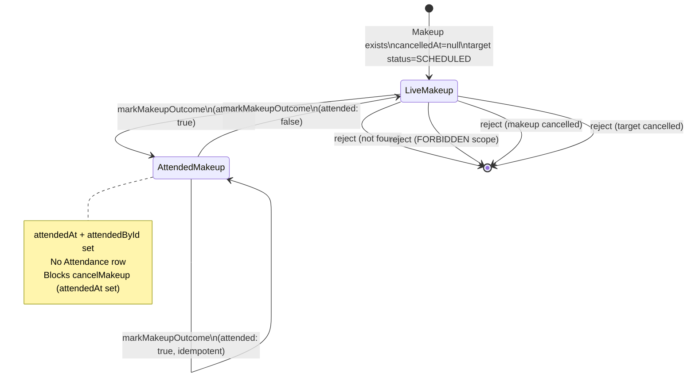
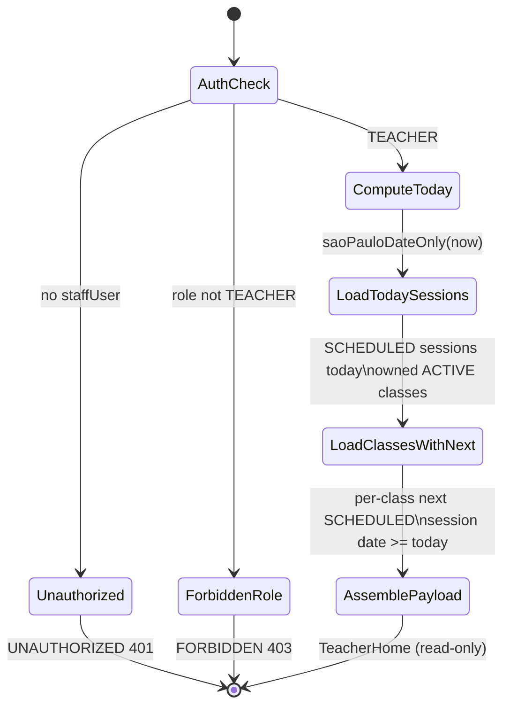

# PAIR-14 — `attendance.markMakeupOutcome` + `dashboard.teacherHome`

Makeup outcome mutation (teacher/admin) paired with the teacher landing query (teacher-only). `markMakeupOutcome` is on `main`; `dashboard.teacherHome` ships in GRE-64 / PR #41 (not yet merged to `main` at analysis time).

---

## `attendance.markMakeupOutcome`

- **Type:** mutation
- **Auth:** `staffProcedure` (authenticated, enabled staff with role `ADMIN` or `TEACHER`; resource scope enforced in service)
- **Input schema:** `makeupOutcomeInputSchema` — strict object:
  - `makeupId`: UUID (`"Identificador de reposicao invalido."`)
  - `attended`: boolean — `true` stamps attendance; `false` clears stamps (reversible)
- **Entities touched:**
  - `Makeup` — `update`: `attendedAt` (set to `now` when `attended: true`, else `null`), `attendedById` (set to `staffUser.id` when attended, else `null`)
  - Read-only: `Makeup` + nested `ClassSession` + `Class` (via `loadMakeupWithTarget` for scope and markability guards)
  - **Never writes** `Attendance` — makeups do not affect semester %

### State preconditions

- Caller is an enabled staff user with role `ADMIN` or `TEACHER`.
- **Resource scope:** `ADMIN` any makeup; `TEACHER` only when `makeup.targetClassSession.class.teacherId === staffUser.id` (target session owner, not origin class owner).
- **Makeup exists:** `Makeup` row for `makeupId` (no soft-delete filter on lookup — missing id → not found).
- **Makeup live:** `cancelledAt IS NULL`.
- **Target session not cancelled:** `targetClassSession.status !== CANCELLED`.
- No write-window or same-day restriction (unlike `confirmSession` / `editSession`); admin may mark any time.

### Scenarios

| ID  | Scenario                          | Given (state)                                                     | Input                                | Expected outcome                                              | HTTP/tRPC error (if any)                                                                | Post-state                                                                             |
| --- | --------------------------------- | ----------------------------------------------------------------- | ------------------------------------ | ------------------------------------------------------------- | --------------------------------------------------------------------------------------- | -------------------------------------------------------------------------------------- |
| S1  | Happy path — mark attended        | Live makeup; target session `SCHEDULED`; caller owns target class | `{ makeupId, attended: true }`       | Success; `{ makeupId, attended: true, attendedAt: Date }`     | —                                                                                       | `attendedAt` set; `attendedById` = caller                                              |
| S2  | Happy path — clear / reverse      | Makeup previously marked attended                                 | `{ makeupId, attended: false }`      | Success; `attendedAt: null` in response                       | —                                                                                       | `attendedAt` and `attendedById` cleared                                                |
| S3  | Idempotent re-mark attended       | Already attended makeup                                           | `{ makeupId, attended: true }` again | Success; stamps refreshed (`attendedAt` updated to new `now`) | —                                                                                       | Stamps overwritten                                                                     |
| S4  | RBAC — unauthenticated            | No `staffUser`                                                    | valid input                          | Rejected                                                      | `UNAUTHORIZED` (401)                                                                    | Unchanged                                                                              |
| S5  | RBAC — non-staff role             | `SECRETARY` / `FINANCE`                                           | valid input                          | Rejected                                                      | `FORBIDDEN` (403) (`staffProcedure`)                                                    | Unchanged                                                                              |
| S6  | RBAC — other teacher              | Target session owned by teacher A; caller teacher B               | `{ attended: true }`                 | Rejected                                                      | `FORBIDDEN` (403) (`assertResourceScope`)                                               | Unchanged                                                                              |
| S7  | RBAC — owning teacher             | Target owned by caller                                            | `{ attended: true }`                 | Success                                                       | —                                                                                       | Stamps set                                                                             |
| S8  | RBAC — admin any class            | Target owned by any teacher                                       | `{ attended: true }`                 | Success (admin bypasses scope)                                | —                                                                                       | Stamps set                                                                             |
| S9  | Validation — bad makeup UUID      | —                                                                 | `makeupId: "x"`                      | Rejected                                                      | `BAD_REQUEST` (Zod UUID)                                                                | Unchanged                                                                              |
| S10 | Validation — missing/extra fields | —                                                                 | `{}` or extra keys                   | Rejected                                                      | `BAD_REQUEST` (strict schema)                                                           | Unchanged                                                                              |
| S11 | Makeup not found                  | Unknown `makeupId`                                                | valid shape                          | Rejected                                                      | `NOT_FOUND` — `"Reposicao nao encontrada."`                                             | Unchanged                                                                              |
| S12 | Cancelled makeup                  | `cancelledAt` set                                                 | `{ attended: true }`                 | Rejected                                                      | `BAD_REQUEST` — `"Reposicao ja esta cancelada."`                                        | Unchanged                                                                              |
| S13 | Cancelled target session          | Target `status = CANCELLED`                                       | `{ attended: true }`                 | Rejected                                                      | `BAD_REQUEST` — `"Nao e possivel usar uma sessao cancelada como destino de reposicao."` | Unchanged                                                                              |
| S14 | No Attendance side effect         | Live makeup on target session                                     | `{ attended: true }`                 | Success                                                       | —                                                                                       | Zero `Attendance` rows for `(originEnrollmentId, targetClassSessionId)`                |
| S15 | Display status after mark         | Past target session end; marked attended                          | `{ attended: true }`                 | Success                                                       | —                                                                                       | `sessionRoster.makeupVisitors[].status` → `ATTENDED` (via `deriveMakeupDisplayStatus`) |
| S16 | Display status after clear        | Past target session end; cleared                                  | `{ attended: false }`                | Success                                                       | —                                                                                       | Visitor status derives `NO_SHOW` after session end                                     |

### State transitions (flow nodes)

Outcome is stored on `Makeup` only. `ClassSession` and origin `Enrollment` are unchanged. Derived display status (`SCHEDULED` / `ATTENDED` / `NO_SHOW` / `CANCELLED`) is computed at read time in `sessionRoster`.

### Outbound edges

| Target                                 | Condition                                                                          |
| -------------------------------------- | ---------------------------------------------------------------------------------- |
| `attendance.sessionRoster`             | Re-read target session; `makeupVisitors[].status` and `attendedAt` reflect outcome |
| `attendance.cancelMakeup`              | Blocked once `attendedAt` is set (`MAKEUP_ALREADY_ATTENDED_MESSAGE`)               |
| `attendance.enrollmentSemesterPercent` | Unaffected — no `Attendance` rows created                                          |

Requires prior: `attendance.scheduleMakeup` (or direct `Makeup` seed) linking origin enrollment to target session.

### Evidence

- `packages/api/src/attendance/router.ts` (procedure wiring, `$transaction`)
- `packages/api/src/attendance/makeup-outcome.ts`
- `packages/api/src/attendance/makeup-data.ts` (`loadMakeupWithTarget`)
- `packages/api/src/attendance/makeup-errors.ts`
- `packages/api/src/trpc/init.ts` (`staffProcedure`)
- `packages/api/src/trpc/rbac.ts` (`assertResourceScope`)
- `packages/validators/src/makeup.ts` (`makeupOutcomeInputSchema`)
- `packages/domain/src/makeup-status.ts` (`deriveMakeupDisplayStatus`)
- `packages/db/prisma/schema.prisma` (`Makeup`, `ClassSession`)
- `packages/api/test/db/makeup-outcome.test.ts` — S1, S2, S6, S12, S13, S14

**DB validation:** Not run in this analysis (scenarios derived from source + existing tests).

---

## `dashboard.teacherHome`

- **Type:** query
- **Auth:** `teacherProcedure` (authenticated, enabled staff with role `TEACHER` only; `ADMIN` explicitly rejected with `FORBIDDEN`)
- **Input schema:** none (no input; `ctx.now` optional for deterministic clock in tests)
- **Entities touched:**
  - `ClassSession` (read): today's sessions and per-class next session — fields `id`, `date`, `startTime`, `endTime`, `attendanceConfirmedAt`, nested `class.id`, `class.internalCode`, `class.portalClassName`
  - `Class` (read): `ACTIVE` classes where `teacherId = ctx.staffUser.id`, ordered by `internalCode`
  - No writes

### State preconditions

- Caller is an enabled staff user with role `TEACHER` (not `ADMIN`, not deferred roles).
- **Implicit scope:** all queries filter `class.teacherId === staffUser.id`; other teachers' classes/sessions never appear.
- **Today's sessions:** `ClassSession.date = today` (`America/Sao_Paulo` calendar day from `saoPauloDateOnly(now)`), `status = SCHEDULED`, parent `Class.status = ACTIVE`.
- **Next session per class:** for each owned `ACTIVE` class, earliest `SCHEDULED` session with `date >= today` (includes today's session when one exists).
- Cancelled sessions (`status = CANCELLED`) are excluded from both lists.
- Archived/inactive classes (`Class.status !== ACTIVE`) are excluded.

### Scenarios

| ID  | Scenario                            | Given (state)                                                                                                                        | Input                                            | Expected outcome                                                                                                                                                                              | HTTP/tRPC error (if any)               | Post-state            |
| --- | ----------------------------------- | ------------------------------------------------------------------------------------------------------------------------------------ | ------------------------------------------------ | --------------------------------------------------------------------------------------------------------------------------------------------------------------------------------------------- | -------------------------------------- | --------------------- |
| T1  | Happy path — today + next per class | Teacher owns 2 `ACTIVE` classes; one has session today; other has next session on a future date; another teacher has a session today | (none)                                           | `{ today: "YYYY-MM-DD" }`; `todaySessions` = owned today session only; `nextSessionsByClass` lists both owned classes with correct `nextSession` (today's session counts as next for class A) | —                                      | Unchanged (read-only) |
| T2  | Empty today                         | No owned sessions on today's SP date                                                                                                 | (none)                                           | `todaySessions: []`; `nextSessionsByClass` still lists owned classes                                                                                                                          | —                                      | Unchanged             |
| T3  | No upcoming sessions                | Owned `ACTIVE` class with no `SCHEDULED` session on/after today                                                                      | (none)                                           | Class row in `nextSessionsByClass` with `nextSession: null`                                                                                                                                   | —                                      | Unchanged             |
| T4  | Cancelled session excluded          | Owned class; today's session `CANCELLED`                                                                                             | (none)                                           | Session omitted from `todaySessions` and from next-session pick                                                                                                                               | —                                      | Unchanged             |
| T5  | Other teacher isolation             | Session today on class owned by another teacher                                                                                      | (none)                                           | Not in `todaySessions`; other teacher's class not in `nextSessionsByClass`                                                                                                                    | —                                      | Unchanged             |
| T6  | Confirmed vs unconfirmed today      | Today's session with or without `attendanceConfirmedAt`                                                                              | (none)                                           | Session included either way; `attendanceConfirmedAt` echoed in summary (UI may link to attendance)                                                                                            | —                                      | Unchanged             |
| T7  | RBAC — unauthenticated              | No `staffUser`                                                                                                                       | (none)                                           | Rejected                                                                                                                                                                                      | `UNAUTHORIZED` (401)                   | Unchanged             |
| T8  | RBAC — admin denied                 | `ADMIN` caller                                                                                                                       | (none)                                           | Rejected                                                                                                                                                                                      | `FORBIDDEN` (403) (`teacherProcedure`) | Unchanged             |
| T9  | RBAC — non-staff roles              | `SECRETARY` / `FINANCE`                                                                                                              | (none)                                           | Rejected                                                                                                                                                                                      | `FORBIDDEN` (403)                      | Unchanged             |
| T10 | Ordering — today by start time      | Multiple owned sessions today                                                                                                        | (none)                                           | `todaySessions` ordered by `startTime` asc, then `class.internalCode` asc                                                                                                                     | —                                      | Unchanged             |
| T11 | Ordering — classes                  | Multiple owned classes                                                                                                               | (none)                                           | `nextSessionsByClass` ordered by `internalCode` asc                                                                                                                                           | —                                      | Unchanged             |
| T12 | HTTP boundary                       | Seeded owned class + today session                                                                                                   | GET `dashboard.teacherHome` with teacher session | HTTP 200; `todaySessions[0].classId` matches owned class                                                                                                                                      | —                                      | Unchanged             |
| T13 | SP date boundary                    | `now` on a fixed instant; session on that SP calendar date                                                                           | (none)                                           | `today` matches `saoPauloDateOnly(now)`                                                                                                                                                       | —                                      | Unchanged             |

**Note:** Unlike `attendance.sessionRoster`, `DashboardSessionSummary` does not expose a derived `untaken` flag. Clients can infer untaken from `attendanceConfirmedAt === null` + session end time, or call `sessionRoster` for full attendance state including `makeupVisitors`.

### State transitions (flow nodes)

Read-only aggregation; no DB mutations. Session confirmation state is reflected but not changed.

### Outbound edges

| Target                         | Condition                                                                  |
| ------------------------------ | -------------------------------------------------------------------------- |
| `attendance.sessionRoster`     | Teacher taps today's session → load roster + `makeupVisitors`              |
| `attendance.confirmSession`    | Unconfirmed today session (`attendanceConfirmedAt` null) → take attendance |
| `attendance.editSession`       | Confirmed today session → same-day teacher edit                            |
| `attendance.markMakeupOutcome` | Today session roster shows visitors → record show-up                       |
| `dashboard.adminMetrics`       | Admin counterpart (teacher cannot call)                                    |

Requires prior: `Class` rows with `teacherId`; `ClassSession` rows from session generation (`classes.generateSessions` / seed).

### Evidence

- `packages/api/src/dashboard/router.ts` (GRE-64 / PR #41)
- `packages/api/src/dashboard/data.ts` (`readTeacherHome`, `DashboardSessionSummary`, `TeacherHome`)
- `packages/api/src/root.ts` (`dashboard: dashboardRouter`)
- `packages/api/src/trpc/init.ts` (`teacherProcedure`)
- `packages/api/src/trpc/rbac.ts` (`ROLE_MATRIX`: `dashboard` scoped for `TEACHER`)
- `packages/domain` — `saoPauloDateOnly`, `isSessionUntaken` (used in admin metrics, not teacher home payload)
- `docs/MVP/PRD.md` S-DASH-3
- `docs/MVP/TECHNICAL_SPEC.md` §5.2, §8
- `packages/api/test/db/dashboard.test.ts` — T1, T8 (`returnOwnedTeacherHome`, `enforceDashboardRoles`)
- `packages/api/test/behavior/dashboard-http.test.ts` — T12
- `packages/api/test/db/dashboard-test-support.ts`

**Implementation status:** Source lives on branch `josiasdev1/gre-64-dashboard-router-api-admin-metrics-teacher-home` (PR #41); not present on `main` at analysis time.

**DB validation:** Not run in this analysis (scenarios derived from GRE-64 source + tests).

---

## Cross-endpoint edges (this pair only)

| From                           | To                             | Condition                                                                                     |
| ------------------------------ | ------------------------------ | --------------------------------------------------------------------------------------------- |
| `dashboard.teacherHome`        | `attendance.sessionRoster`     | Teacher selects a `todaySessions[].sessionId` (or `nextSession.sessionId`) to open attendance |
| `dashboard.teacherHome`        | `attendance.confirmSession`    | Today's session has `attendanceConfirmedAt: null` → teacher takes roster attendance           |
| `dashboard.teacherHome`        | `attendance.markMakeupOutcome` | Teacher opens today's roster; `makeupVisitors` on that session → mark visitor outcome         |
| `attendance.sessionRoster`     | `attendance.markMakeupOutcome` | Roster exposes `makeupVisitors[].makeupId` for the outcome mutation                           |
| `attendance.markMakeupOutcome` | `attendance.sessionRoster`     | Re-read roster; visitor `status` / `attendedAt` updated                                       |
| `attendance.scheduleMakeup`    | `dashboard.teacherHome`        | Scheduled visitor appears indirectly when target session is in `todaySessions`                |
| `attendance.scheduleMakeup`    | `attendance.markMakeupOutcome` | Live makeup must exist before outcome can be recorded                                         |
| `classes.generateSessions`     | `dashboard.teacherHome`        | Populates `ClassSession` rows that drive today/next lists                                     |
