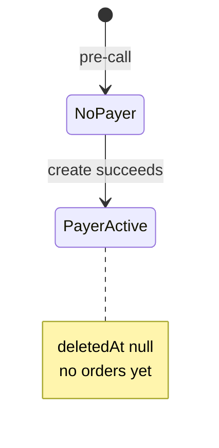
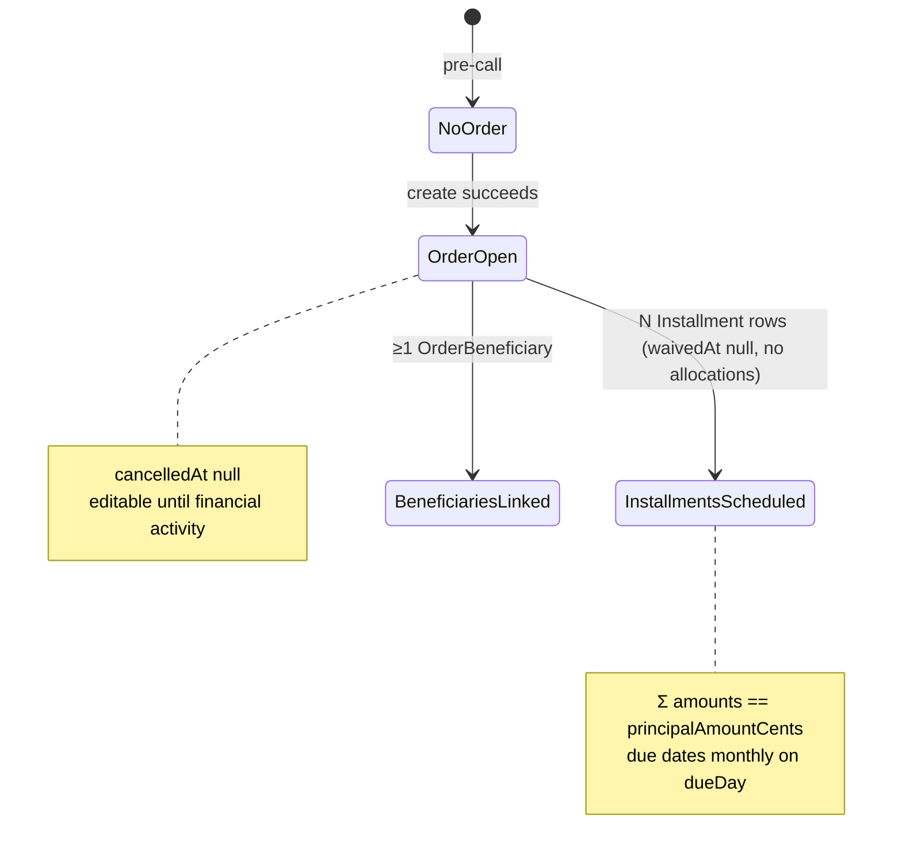
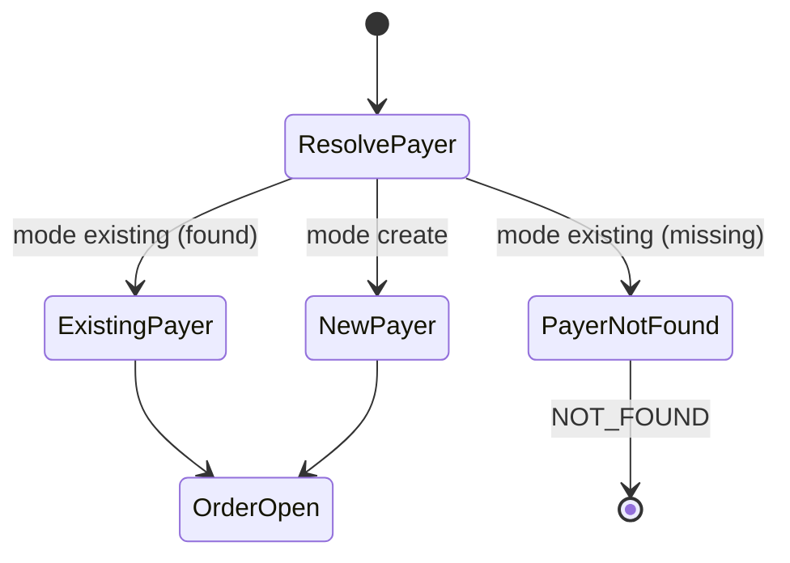
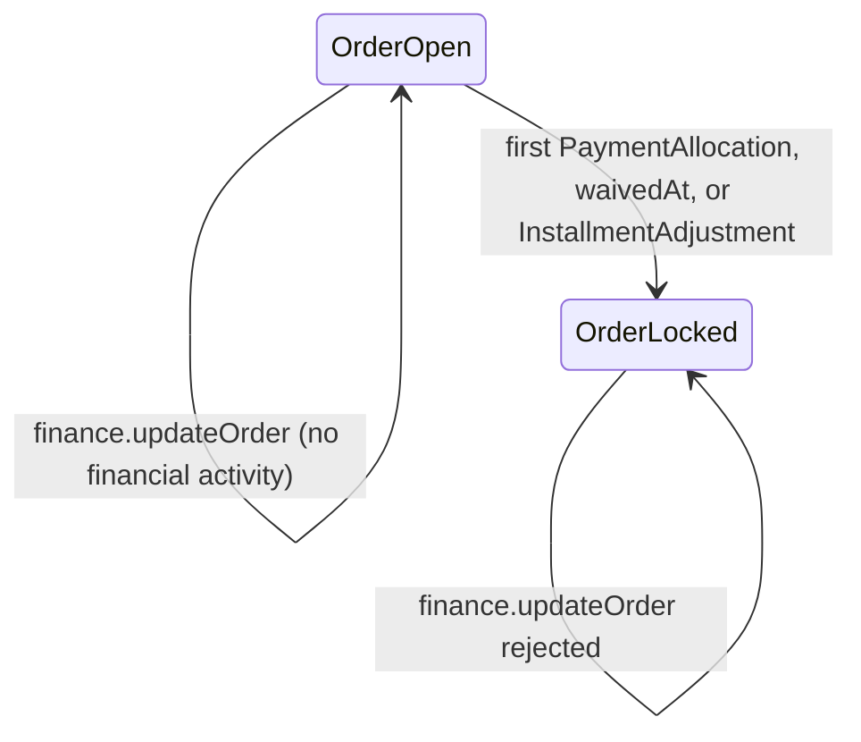

# PAIR-15 — Finance payer & order create

Analysis of `finance.createPayer` and `finance.createOrder` only.

---

## `finance.createPayer`

- **Type:** mutation
- **Auth:** `adminProcedure` (requires authenticated, enabled staff with role `ADMIN`; TEACHER/SECRETARY/FINANCE denied with `FORBIDDEN`, anonymous with `UNAUTHORIZED`)
- **Input schema:** `payerCreateProcedureInputSchema` (strict)
  - `name`: required, trimmed, min 1 (`"Campo obrigatorio."`)
  - `taxId`, `phone`, `email`: optional/nullish; if present, trimmed non-empty
- **Entities touched:**
  - `Payer` (create): `name`, `taxId`, `phone`, `email`, `createdById`, `updatedById` (staff user); `deletedAt` remains null

### State preconditions

- Caller is authenticated ADMIN staff (`ctx.staffUser.role === "ADMIN"`).
- Referenced `User` row for `staffUserId` should exist (FK `onDelete: Restrict` on `createdById`/`updatedById`).
- No pre-existing payer required; no uniqueness constraints on `name` or `taxId`.

### Scenarios

| ID    | Scenario                            | Given (state)                                | Input                                 | Expected outcome                    | HTTP/tRPC error (if any)                        | Post-state                                             |
| ----- | ----------------------------------- | -------------------------------------------- | ------------------------------------- | ----------------------------------- | ----------------------------------------------- | ------------------------------------------------------ |
| P-S1  | Happy path — name only              | ADMIN caller                                 | `{ name: "João Silva" }`              | Full `Payer` row returned with UUID | —                                               | `Payer` persisted; optional fields null                |
| P-S2  | Happy path — full contact           | ADMIN caller                                 | `name`, `taxId`, `phone`, `email`     | Full `Payer` returned               | —                                               | All contact fields persisted                           |
| P-S3  | RBAC — TEACHER denied               | TEACHER caller                               | any valid input                       | Rejected at gate                    | `FORBIDDEN` (403)                               | No DB writes                                           |
| P-S4  | RBAC — FINANCE denied               | FINANCE caller                               | any valid input                       | Rejected at gate                    | `FORBIDDEN` (403)                               | No DB writes                                           |
| P-S5  | RBAC — anonymous denied             | No session                                   | any input                             | Rejected at gate                    | `UNAUTHORIZED` (401)                            | No DB writes                                           |
| P-S6  | Validation — missing name           | ADMIN caller                                 | `{ name: "" }` or whitespace          | Rejected at input parse             | `BAD_REQUEST` (Zod: `"Campo obrigatorio."`)     | No DB writes                                           |
| P-S7  | Validation — empty optional contact | ADMIN caller                                 | `{ name: "X", email: "  " }`          | Rejected at input parse             | `BAD_REQUEST` (Zod trim/min on optional fields) | No DB writes                                           |
| P-S8  | Validation — unknown keys           | ADMIN caller                                 | extra fields on input                 | Rejected at input parse             | `BAD_REQUEST` (strict schema)                   | No DB writes                                           |
| P-S9  | Duplicate taxId allowed             | ADMIN caller; payer with same `taxId` exists | create second payer with same `taxId` | Success (new UUID)                  | —                                               | Two payers may share `taxId` (no DB unique constraint) |
| P-S10 | Soft-deleted payer unaffected       | ADMIN caller                                 | create new payer                      | Success                             | —                                               | New payer independent of any `deletedAt` rows          |

### State transitions (flow nodes)

### Outbound edges

| Target                         | Condition                                                                                        |
| ------------------------------ | ------------------------------------------------------------------------------------------------ |
| `finance.createOrder`          | Reference payer via `payer: { mode: "existing", payerId }`                                       |
| `finance.registerPayment`      | Requires existing `payerId`                                                                      |
| `finance.receivablesSnapshot`  | New payer appears once linked to orders/installments                                             |
| `finance.createOrder` (inline) | `createOrder` with `payer.mode = "create"` calls internal `createPayer` instead of this endpoint |

### Evidence

- `packages/api/src/receivables/router.ts` — procedure wiring, `$transaction`
- `packages/api/src/receivables/internal/payers.ts` — `createPayer` insert
- `packages/api/src/receivables/index.ts` — module surface
- `packages/validators/src/finance.ts` — `payerCreateProcedureInputSchema`
- `packages/db/prisma/schema.prisma` — `Payer` model (soft-delete column, no unique on taxId)
- `packages/api/src/trpc/init.ts` — `adminProcedure` gate
- Tests:
  - `packages/api/test/db/finance-orders.test.ts` — P-S2 variant (`creates a payer with optional contact fields`)

---

## `finance.createOrder`

- **Type:** mutation
- **Auth:** `adminProcedure` (same as `createPayer`)
- **Input schema:** `financeCreateOrderInputSchema` (strict)
  - Commercial fields (`orderCommercialFieldsSchema`):
    - `kind`: `TUITION | ENROLLMENT_FEE | MATERIAL | OTHER`
    - `beneficiaryStudentIds`: array of UUIDs, min 1 (`"Informe ao menos um beneficiario."`)
    - `principalAmountCents`: positive integer (`"Valor principal deve ser maior que zero."`)
    - `installmentCount`: integer ≥ 1 (`"Informe ao menos uma parcela."`)
    - `startDate`: coerced date-only (`dateOnlyInputSchema`; `"Data invalida."` on failure)
    - `dueDay`: literal union `{5, 10, 15, 20, 25}`
    - `signedOrderArtifactId`: optional UUID (no existence check in service layer)
  - `payer`: discriminated union (`financePayerInputSchema`)
    - `{ mode: "existing", payerId: uuid }`
    - `{ mode: "create", name, taxId?, phone?, email? }` (same shape as `payerCreateProcedureInputSchema` + `mode`)
- **Entities touched:**
  - `Payer` (read or create via `resolvePayerId`)
  - `Student` (read-only existence check)
  - `Order` (create): `payerId`, `kind`, `principalAmountCents`, `startDate`, `dueDay`, `signedOrderArtifactId`, `createdById`, `updatedById`; `cancelledAt` null
  - `OrderBeneficiary` (create, one per beneficiary student id): `orderId`, `studentId`, audit fields
  - `Installment` (create, N = `installmentCount`): `orderId`, `amountCents`, `dueDate`, audit fields; `waivedAt` null

### State preconditions

- Caller is authenticated ADMIN staff.
- Payer resolution:
  - `mode: "existing"` → `Payer` row with given `payerId` must exist (soft-delete not filtered).
  - `mode: "create"` → no payer pre-existence required; payer created in same transaction.
- Every distinct id in `beneficiaryStudentIds` must match an existing `Student` row (existence only; **no** `status` or `deletedAt` filter).
- Domain installment generation (`generateInstallments`) requires positive principal, count ≥ 1, valid due day — mirrored by Zod so invalid combinations fail at parse time before service layer.

### Scenarios

| ID    | Scenario                                         | Given (state)                         | Input                                                                                          | Expected outcome                                                                                        | HTTP/tRPC error (if any)                                          | Post-state                                                                                |
| ----- | ------------------------------------------------ | ------------------------------------- | ---------------------------------------------------------------------------------------------- | ------------------------------------------------------------------------------------------------------- | ----------------------------------------------------------------- | ----------------------------------------------------------------------------------------- |
| O-S1  | Happy path — existing payer                      | ADMIN; payer P; student S             | `{ ...commercial, payer: { mode: "existing", payerId: P.id }, beneficiaryStudentIds: [S.id] }` | `OrderScheduleResult`: order + N installments + beneficiaries                                           | —                                                                 | `Σ installment.amountCents === principalAmountCents`; installments follow D-0011 schedule |
| O-S2  | Happy path — inline payer                        | ADMIN; student S                      | `payer: { mode: "create", name: "..." }`, valid commercial fields                              | Same result shape; new payer id on order                                                                | —                                                                 | New `Payer` + order + schedule atomically committed                                       |
| O-S3  | Happy path — multiple beneficiaries              | ADMIN; payer P; students S1, S2       | `beneficiaryStudentIds: [S1.id, S2.id]`                                                        | Two `OrderBeneficiary` rows                                                                             | —                                                                 | Single order bills one payer, links two students                                          |
| O-S4  | Happy path — all order kinds                     | ADMIN; fixtures                       | `kind` each of `TUITION`, `ENROLLMENT_FEE`, `MATERIAL`, `OTHER`                                | Success                                                                                                 | —                                                                 | `Order.kind` set accordingly                                                              |
| O-S5  | Happy path — optional artifact id                | ADMIN; fixtures                       | `signedOrderArtifactId: <uuid>`                                                                | Success                                                                                                 | —                                                                 | UUID stored; artifact row existence not validated                                         |
| O-S6  | Installment math — remainder on last             | ADMIN; fixtures                       | e.g. `principalAmountCents: 100_000`, `installmentCount: 3`                                    | Amounts `[33333, 33333, 33334]`                                                                         | —                                                                 | Last installment absorbs remainder                                                        |
| O-S7  | Due-date derivation (D-0011)                     | ADMIN; fixtures                       | `startDate` before/on/after `dueDay` in month                                                  | First due = next calendar occurrence of `dueDay` strictly after `startDate` (or next month if on/after) | —                                                                 | Monthly due dates on chosen day (clamped to month length)                                 |
| O-S8  | RBAC — TEACHER denied                            | TEACHER caller                        | any valid input                                                                                | Rejected at gate                                                                                        | `FORBIDDEN` (403)                                                 | No DB writes                                                                              |
| O-S9  | RBAC — anonymous denied                          | No session                            | any valid input                                                                                | Rejected at gate                                                                                        | `UNAUTHORIZED` (401)                                              | No DB writes                                                                              |
| O-S10 | Validation — empty beneficiaries                 | ADMIN caller                          | `beneficiaryStudentIds: []`                                                                    | Rejected at input parse                                                                                 | `BAD_REQUEST` (Zod min)                                           | No DB writes                                                                              |
| O-S11 | Validation — invalid student UUID                | ADMIN caller                          | non-UUID in `beneficiaryStudentIds`                                                            | Rejected at input parse                                                                                 | `BAD_REQUEST` (Zod UUID)                                          | No DB writes                                                                              |
| O-S12 | Validation — non-positive principal              | ADMIN caller                          | `principalAmountCents: 0` or negative                                                          | Rejected at input parse                                                                                 | `BAD_REQUEST` (Zod positive)                                      | No DB writes                                                                              |
| O-S13 | Validation — zero installments                   | ADMIN caller                          | `installmentCount: 0`                                                                          | Rejected at input parse                                                                                 | `BAD_REQUEST` (Zod min)                                           | No DB writes                                                                              |
| O-S14 | Validation — invalid dueDay                      | ADMIN caller                          | `dueDay: 7`                                                                                    | Rejected at input parse                                                                                 | `BAD_REQUEST` (Zod union)                                         | No DB writes                                                                              |
| O-S15 | Validation — invalid payer mode / missing fields | ADMIN caller                          | `{ payer: { mode: "existing" } }` or create mode without `name`                                | Rejected at input parse                                                                                 | `BAD_REQUEST` (Zod discriminated union)                           | No DB writes                                                                              |
| O-S16 | Validation — invalid startDate                   | ADMIN caller                          | `startDate: "not-a-date"`                                                                      | Rejected at input parse                                                                                 | `BAD_REQUEST` (Zod: `"Data invalida."`)                           | No DB writes                                                                              |
| O-S17 | Domain — payer not found                         | ADMIN; student S                      | `payer: { mode: "existing", payerId: <missing uuid> }`                                         | Rejected in service                                                                                     | `NOT_FOUND`: `"Pagador nao encontrado."`                          | Transaction rolled back                                                                   |
| O-S18 | Domain — student not found                       | ADMIN; payer P                        | `beneficiaryStudentIds: [<missing uuid>]`                                                      | Rejected in service                                                                                     | `NOT_FOUND`: `"Aluno nao encontrado."`                            | Transaction rolled back; inline payer also rolled back if mode create                     |
| O-S19 | Domain — partial student match                   | ADMIN; payer P; only S1 exists        | `beneficiaryStudentIds: [S1.id, S2.id]` (S2 missing)                                           | Rejected in service                                                                                     | `NOT_FOUND`: `"Aluno nao encontrado."`                            | No order                                                                                  |
| O-S20 | Edge — duplicate beneficiary ids in input        | ADMIN; payer P; student S             | `beneficiaryStudentIds: [S.id, S.id]`                                                          | Likely rejected at DB                                                                                   | `INTERNAL_SERVER_ERROR` (Prisma unique on `[orderId, studentId]`) | Transaction rolled back if second insert fails                                            |
| O-S21 | Edge — soft-deleted student still linkable       | ADMIN; student S with `deletedAt` set | valid order input referencing S                                                                | Success (current code)                                                                                  | —                                                                 | `OrderBeneficiary` links to soft-deleted student (no filter)                              |
| O-S22 | Edge — inactive/dropped student                  | ADMIN; student `status != ACTIVE`     | valid order input                                                                              | Success (current code)                                                                                  | —                                                                 | Order created; no student status gate (unlike enrollment)                                 |
| O-S23 | HTTP boundary                                    | ADMIN via fetch adapter               | same as O-S1                                                                                   | 200 + serialized `OrderScheduleResult`                                                                  | —                                                                 | Same post-state as O-S1                                                                   |

### State transitions (flow nodes)

Payer resolution subgraph (within same transaction):

Post-create lock boundary (downstream, not on create):

### Outbound edges

| Target                             | Condition                                                                                                   |
| ---------------------------------- | ----------------------------------------------------------------------------------------------------------- |
| `finance.updateOrder`              | Edit commercial fields while order has no allocations, waivers, or adjustments                              |
| `finance.registerPayment`          | Uses `order.payerId` and installment ids from result                                                        |
| `finance.batchReconcile`           | Uses installment ids across payer's orders                                                                  |
| `finance.waiveInstallment`         | Targets installments on created order                                                                       |
| `finance.addInstallmentAdjustment` | Targets installments on created order                                                                       |
| `finance.receivablesSnapshot`      | Order/installments appear in derived ledger                                                                 |
| `finance.overdueList`              | Installments may appear once past due (derived at read time)                                                |
| Enrollment UI order prompt         | `enrollment.create` returns `orderPromptRequired: true` when student lacks open order (separate read logic) |

### Evidence

- `packages/api/src/receivables/router.ts` — procedure wiring, `$transaction`
- `packages/api/src/receivables/internal/orders.ts` — `createOrder`, `resolvePayerId`, `assertBeneficiaryStudentsExist`, `persistOrderSchedule`
- `packages/api/src/receivables/internal/payers.ts` — inline payer create
- `packages/api/src/receivables/internal/shared.ts` — error messages, date helpers
- `packages/domain/src/installment-generation.ts` — `generateInstallments`, `deriveFirstDueDate`, remainder split
- `packages/validators/src/finance.ts` — `financeCreateOrderInputSchema`, `financePayerInputSchema`
- `packages/db/prisma/schema.prisma` — `Order`, `OrderBeneficiary`, `Installment`, `OrderKind`; `@@unique([orderId, studentId])` on beneficiaries
- Tests:
  - `packages/api/test/db/finance-orders.test.ts` — O-S1, O-S2, O-S17, O-S18, installment sum/dates
  - `packages/api/test/behavior/finance-orders-http.test.ts` — O-S23
  - `packages/domain/test/installment-generation.test.ts` — O-S6, O-S7 domain math
  - `packages/api/test/db/receivables-module.test.ts` — module-level create → snapshot flow (uses `receivables().createOrder`)
- DB validation: not run in this analysis (tests above are the referenced coverage).

---

## Cross-endpoint edges (this pair only)

| From                         | To                               | Condition                                                                            |
| ---------------------------- | -------------------------------- | ------------------------------------------------------------------------------------ |
| `finance.createPayer`        | `finance.createOrder`            | Order references existing payer by `payerId`                                         |
| `finance.createOrder`        | `finance.createPayer` (internal) | `payer.mode === "create"` invokes same `createPayer` helper inside order transaction |
| `finance.createPayer`        | `finance.registerPayment`        | Standalone payer creation enables later payment entry against `payerId`              |
| `finance.createOrder`        | `finance.updateOrder`            | Order remains editable until financial activity                                      |
| `finance.createOrder`        | `finance.registerPayment`        | Returns installment ids for allocation                                               |
| `students.create` (external) | `finance.createOrder`            | Beneficiary students must exist (any status in current implementation)               |
| `finance.createOrder`        | `finance.receivablesSnapshot`    | Created installments contribute to derived receivables board                         |
