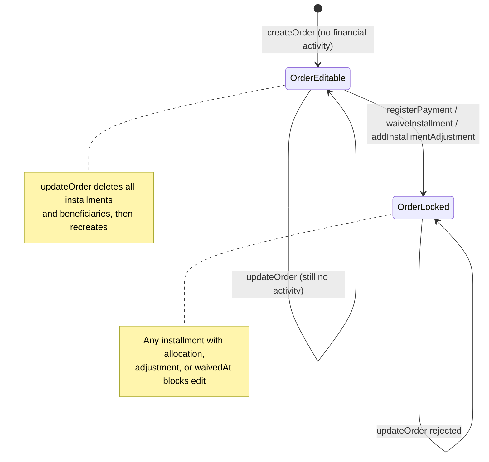
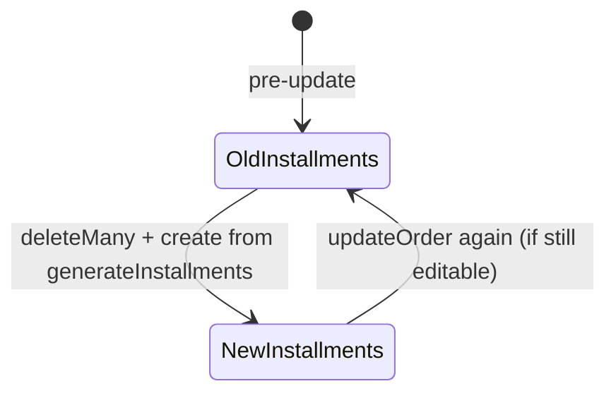
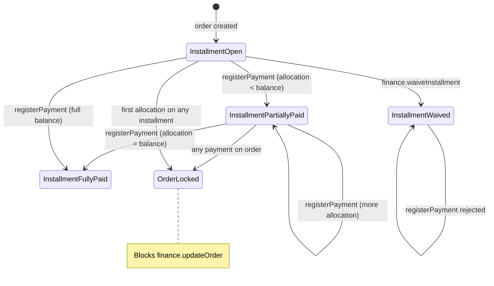
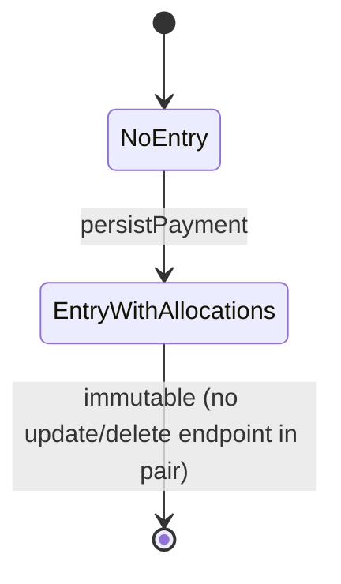

# PAIR-16 — Finance order edit and payment registration

Analysis of `finance.updateOrder` and `finance.registerPayment` only.

---

## `finance.updateOrder`

- **Type:** mutation
- **Auth:** `adminProcedure` (requires authenticated, enabled staff with role `ADMIN`; TEACHER/SECRETARY/FINANCE denied with `FORBIDDEN`, anonymous with `UNAUTHORIZED`)
- **Input schema:** `financeUpdateOrderInputSchema`
  - `orderId`: required UUID (`"Identificador de pedido invalido."`)
  - `kind`: `TUITION | ENROLLMENT_FEE | MATERIAL | OTHER`
  - `beneficiaryStudentIds`: array of UUIDs, min 1 (`"Informe ao menos um beneficiario."`)
  - `principalAmountCents`: positive integer (`"Valor principal deve ser maior que zero."`)
  - `installmentCount`: integer ≥ 1
  - `startDate`: date-only input (coerced `Date`)
  - `dueDay`: one of `5 | 10 | 15 | 20 | 25`
  - `signedOrderArtifactId`: optional UUID
  - Payer changes are **out of scope** (no `payer` field; payer is immutable after create)
- **Entities touched:**
  - `Order` (update): `kind`, `principalAmountCents`, `startDate`, `dueDay`, `signedOrderArtifactId`, `updatedById`
  - `Installment` (deleteMany by `orderId`, then create N new rows): `amountCents`, `dueDate`, audit fields
  - `OrderBeneficiary` (deleteMany by `orderId`, then create): `studentId`, audit fields

### State preconditions

- Caller is authenticated ADMIN staff.
- `Order` row with `orderId` must exist.
- Order must have **no financial activity** on any installment: no `PaymentAllocation`, no `InstallmentAdjustment`, and no installment with `waivedAt` set.
- Every `beneficiaryStudentIds` entry must reference an existing `Student`.
- Typically preceded by `finance.createOrder` (or seed) to obtain the order and initial schedule.

### Scenarios

| ID    | Scenario                                 | Given (state)                                                  | Input                                                         | Expected outcome                                                                                       | HTTP/tRPC error (if any)                                                                            | Post-state                                                                                        |
| ----- | ---------------------------------------- | -------------------------------------------------------------- | ------------------------------------------------------------- | ------------------------------------------------------------------------------------------------------ | --------------------------------------------------------------------------------------------------- | ------------------------------------------------------------------------------------------------- |
| U-S1  | Happy path — regenerate schedule         | ADMIN; order exists with installments, zero financial activity | Valid commercial fields (new principal, count, dates, dueDay) | `{ order, installments, beneficiaries }` returned; installments regenerated via `generateInstallments` | —                                                                                                   | Old installments/beneficiaries deleted; new rows match domain schedule; `Order.updatedById` set   |
| U-S2  | Happy path — change beneficiaries        | ADMIN; editable order; new student S exists                    | `beneficiaryStudentIds: [S.id]`                               | Success                                                                                                | —                                                                                                   | Old beneficiaries removed; new `OrderBeneficiary` rows created                                    |
| U-S3  | RBAC — non-ADMIN denied                  | TEACHER/SECRETARY/FINANCE caller                               | any valid input                                               | Rejected at gate                                                                                       | `FORBIDDEN` (403)                                                                                   | No DB writes                                                                                      |
| U-S4  | RBAC — anonymous denied                  | No session                                                     | any input                                                     | Rejected at gate                                                                                       | `UNAUTHORIZED` (401)                                                                                | No DB writes                                                                                      |
| U-S5  | Validation — invalid orderId UUID        | ADMIN                                                          | `orderId: "bad"`                                              | Rejected at input parse                                                                                | `BAD_REQUEST` (Zod UUID)                                                                            | No DB writes                                                                                      |
| U-S6  | Validation — empty beneficiaries         | ADMIN                                                          | `beneficiaryStudentIds: []`                                   | Rejected at input parse                                                                                | `BAD_REQUEST` (Zod min 1)                                                                           | No DB writes                                                                                      |
| U-S7  | Validation — non-positive principal      | ADMIN                                                          | `principalAmountCents: 0` or negative                         | Rejected at input parse                                                                                | `BAD_REQUEST` (Zod positive)                                                                        | No DB writes                                                                                      |
| U-S8  | Validation — invalid dueDay              | ADMIN                                                          | `dueDay: 7`                                                   | Rejected at input parse                                                                                | `BAD_REQUEST` (Zod union)                                                                           | No DB writes                                                                                      |
| U-S9  | Domain — order not found                 | ADMIN; no order for UUID                                       | valid fields + random `orderId`                               | Rejected in service                                                                                    | `NOT_FOUND`: `"Pedido nao encontrado."`                                                             | Transaction rolled back                                                                           |
| U-S10 | Domain — missing beneficiary student     | ADMIN; editable order                                          | `beneficiaryStudentIds` includes unknown UUID                 | Rejected in service                                                                                    | `NOT_FOUND`: `"Aluno nao encontrado."`                                                              | Transaction rolled back                                                                           |
| U-S11 | Domain — locked after payment allocation | ADMIN; order with ≥1 installment having `PaymentAllocation`    | valid update payload                                          | Rejected in service                                                                                    | `BAD_REQUEST`: `"Pedido bloqueado para edicao: ja possui pagamento, isencao ou ajuste registrado."` | Order unchanged                                                                                   |
| U-S12 | Domain — locked after waiver             | ADMIN; installment with `waivedAt` set                         | valid update payload                                          | Rejected in service                                                                                    | `BAD_REQUEST` (ORDER_LOCKED_MESSAGE)                                                                | Order unchanged                                                                                   |
| U-S13 | Domain — locked after adjustment         | ADMIN; installment with `InstallmentAdjustment`                | valid update payload                                          | Rejected in service                                                                                    | `BAD_REQUEST` (ORDER_LOCKED_MESSAGE)                                                                | Order unchanged                                                                                   |
| U-S14 | Edge — installment IDs rotate            | ADMIN; editable order with known installment IDs               | update with different `installmentCount`                      | Success                                                                                                | —                                                                                                   | Previous installment rows deleted; **new UUIDs**; any external references to old IDs become stale |
| U-S15 | Edge — payer immutable                   | ADMIN; editable order for payer P                              | update attempt (no payer field in schema)                     | Success only changes commercial fields                                                                 | —                                                                                                   | `Order.payerId` unchanged                                                                         |

### State transitions (flow nodes)

Installment lifecycle within update (same order id):

### Outbound edges

| Target                             | Condition                                                                 |
| ---------------------------------- | ------------------------------------------------------------------------- |
| `finance.registerPayment`          | After update, new installment IDs must be used for allocations            |
| `finance.waiveInstallment`         | Can waive installments on editable or locked orders (locks further edits) |
| `finance.addInstallmentAdjustment` | Same lock semantics as payment/waiver                                     |
| `finance.receivablesSnapshot`      | Dashboard reflects updated schedule/balances                              |
| `finance.overdueList`              | Due dates may change after regeneration                                   |

### Evidence

- `packages/api/src/receivables/router.ts` — procedure wiring, `$transaction`
- `packages/api/src/receivables/internal/orders.ts` — `updateOrder`, `assertOrderEditable`, schedule regeneration
- `packages/api/src/receivables/internal/shared.ts` — error messages, `orderLocked()`
- `packages/validators/src/finance.ts` — `financeUpdateOrderInputSchema`
- `packages/domain/src/installment-generation.ts` — `generateInstallments`
- `packages/db/prisma/schema.prisma` — `Order`, `Installment`, `OrderBeneficiary`
- `packages/api/src/trpc/init.ts` — `adminProcedure` gate
- Tests:
  - `packages/api/test/db/finance-orders.test.ts` — U-S1, U-S11, U-S12, U-S13
  - `packages/api/test/db/finance-waivers-adjustments.test.ts` — U-S11/U-S12 variants via `updateOrderFixture`

---

## `finance.registerPayment`

- **Type:** mutation
- **Auth:** `adminProcedure` (same as `updateOrder`)
- **Input schema:** `financeRegisterPaymentInputSchema`
  - `payerId`: required UUID
  - `date`: date-only input
  - `amountCents`: non-negative integer (`"Valor do pagamento nao pode ser negativo."`)
  - `method`: `PIX | CASH | TRANSFER | CARD | CHEQUE | BOLETO | OTHER`
  - `note`, `externalReference`: optional trimmed non-empty strings
  - `allocations`: array min 1 of `{ installmentId: uuid, amountCents: non-negative int }`
  - Duplicate `installmentId` entries in `allocations` are **combined** (summed) before validation
- **Entities touched:**
  - `PaymentEntry` (create): `payerId`, `date`, `amountCents`, `method`, `note`, `externalReference`, `createdById`, `updatedById`
  - `PaymentAllocation` (create, one per distinct installment): `paymentEntryId`, `installmentId`, `amountCents`, audit fields
  - `Installment` (read + row lock via `SELECT … FOR UPDATE`; no direct update)

### State preconditions

- Caller is authenticated ADMIN staff.
- `Payer` row for `payerId` must exist.
- Every referenced `Installment` must exist.
- Each installment's `order.payerId` must equal input `payerId`.
- Each installment must not be waived (`waivedAt === null`).
- Sum of allocation amounts ≤ `amountCents`.
- Each allocation amount ≤ remaining balance: `installment.amountCents + sum(adjustments) - sum(existing allocations)`.
- Installments are locked in sorted UUID order before balance checks (concurrency safety).

### Scenarios

| ID    | Scenario                                    | Given (state)                                                        | Input                                                                          | Expected outcome                                                      | HTTP/tRPC error (if any)                                           | Post-state                                                                                   |
| ----- | ------------------------------------------- | -------------------------------------------------------------------- | ------------------------------------------------------------------------------ | --------------------------------------------------------------------- | ------------------------------------------------------------------ | -------------------------------------------------------------------------------------------- |
| P-S1  | Happy path — multi-order partial allocation | ADMIN; payer P; two orders for P with open installments              | `amountCents` > sum(allocations); allocations to installments from both orders | `{ paymentEntry, allocations, unallocatedRemainderCents }`            | —                                                                  | `PaymentEntry` + `PaymentAllocation` rows persisted; remainder returned                      |
| P-S2  | Happy path — full allocation                | ADMIN; open installment balance B                                    | `amountCents: B`, single allocation B                                          | Success; `unallocatedRemainderCents: 0`                               | —                                                                  | Installment fully allocated                                                                  |
| P-S3  | Happy path — HTTP boundary                  | ADMIN; order via HTTP create                                         | valid payment body                                                             | HTTP 200 + same shape as P-S1                                         | —                                                                  | Persisted entry matches response                                                             |
| P-S4  | RBAC — non-ADMIN denied                     | TEACHER caller                                                       | any valid input                                                                | Rejected at gate                                                      | `FORBIDDEN` (403)                                                  | No DB writes                                                                                 |
| P-S5  | RBAC — anonymous denied                     | No session                                                           | any input                                                                      | Rejected at gate                                                      | `UNAUTHORIZED` (401)                                               | No DB writes                                                                                 |
| P-S6  | Validation — empty allocations              | ADMIN                                                                | `allocations: []`                                                              | Rejected at input parse                                               | `BAD_REQUEST` (Zod min 1)                                          | No DB writes                                                                                 |
| P-S7  | Validation — negative amount                | ADMIN                                                                | `amountCents: -1`                                                              | Rejected at input parse                                               | `BAD_REQUEST` (Zod nonnegative)                                    | No DB writes                                                                                 |
| P-S8  | Validation — invalid installment UUID       | ADMIN                                                                | bad `installmentId` in allocations                                             | Rejected at input parse                                               | `BAD_REQUEST` (Zod UUID)                                           | No DB writes                                                                                 |
| P-S9  | Domain — payer not found                    | ADMIN; no payer                                                      | random `payerId`                                                               | Rejected in service                                                   | `NOT_FOUND`: `"Pagador nao encontrado."`                           | Transaction rolled back                                                                      |
| P-S10 | Domain — installment not found              | ADMIN; payer exists                                                  | allocation to unknown installment UUID                                         | Rejected in service                                                   | `NOT_FOUND`: `"Parcela nao encontrada."`                           | Transaction rolled back                                                                      |
| P-S11 | Domain — payer/installment mismatch         | ADMIN; installment belongs to payer B                                | `payerId: A`, allocation to B's installment                                    | Rejected in service                                                   | `BAD_REQUEST`: `"Parcela pertence a outro pagador."`               | Transaction rolled back                                                                      |
| P-S12 | Domain — entry over-allocation              | ADMIN; open installment                                              | sum(allocations) > `amountCents`                                               | Rejected in service                                                   | `BAD_REQUEST`: `"Soma das alocacoes excede o valor do pagamento."` | Transaction rolled back                                                                      |
| P-S13 | Domain — installment over-allocation        | ADMIN; installment with prior payments and discount adjustment       | allocation > remaining balance                                                 | Rejected in service                                                   | `BAD_REQUEST`: `"Alocacao excede o saldo atual da parcela."`       | Transaction rolled back                                                                      |
| P-S14 | Domain — waived installment                 | ADMIN; installment with `waivedAt` set                               | any positive allocation                                                        | Rejected in service                                                   | `BAD_REQUEST`: `"Parcela isenta nao aceita alocacao."`             | Transaction rolled back                                                                      |
| P-S15 | Concurrency — parallel allocations          | ADMIN; installment balance B; two concurrent calls each allocating B | identical inputs, different `externalReference`                                | Exactly one succeeds; one fails P-S13                                 | `BAD_REQUEST` (INSTALLMENT_OVER_ALLOCATION_MESSAGE) on loser       | Persisted total = B (never double-spend)                                                     |
| P-S16 | Edge — duplicate installment in input       | ADMIN; open installment I                                            | two allocation rows for same `installmentId` (amounts a+b)                     | Success; combined as single allocation a+b                            | —                                                                  | One `PaymentAllocation` row per installment (DB unique on `[paymentEntryId, installmentId]`) |
| P-S17 | Edge — zero payment with zero allocations   | ADMIN                                                                | `amountCents: 0`, allocations `[{ amountCents: 0 }]`                           | Success (schema allows); no balance impact                            | —                                                                  | Entry created with zero allocations total                                                    |
| P-S18 | Edge — unallocated remainder                | ADMIN                                                                | `amountCents` > allocation sum                                                 | Success                                                               | —                                                                  | `unallocatedRemainderCents` = difference; funds not auto-applied elsewhere                   |
| P-S19 | Gap — cancelled order not checked           | ADMIN; order with `cancelledAt` set, open installment                | valid allocation                                                               | **Currently succeeds** (code loads `cancelledAt` but does not reject) | —                                                                  | Payment recorded; order edit still blocked by allocation                                     |

### State transitions (flow nodes)

Payment entry subgraph:

### Outbound edges

| Target                             | Condition                                                        |
| ---------------------------------- | ---------------------------------------------------------------- |
| `finance.updateOrder`              | **Blocked** on order after first allocation (ORDER_LOCKED)       |
| `finance.registerPayment`          | Further payments to same/other installments (if balance remains) |
| `finance.batchReconcile`           | Alternative bulk payment path for selected installments          |
| `finance.waiveInstallment`         | Remaining balance can be waived instead of paid                  |
| `finance.addInstallmentAdjustment` | Adjust balance (also locks order edits)                          |
| `finance.receivablesSnapshot`      | Paid amounts reduce open/overdue totals                          |
| `finance.overdueList`              | Paid installments may drop off overdue list                      |

### Evidence

- `packages/api/src/receivables/router.ts` — procedure wiring, `$transaction`
- `packages/api/src/receivables/internal/register-payment.ts` — validation orchestration
- `packages/api/src/receivables/internal/payment-store.ts` — `lockInstallments`, `loadInstallments`, `calculateRemainingBalanceCents`, `persistPayment`
- `packages/api/src/receivables/internal/shared.ts` — error messages
- `packages/validators/src/finance.ts` — `financeRegisterPaymentInputSchema`
- `packages/db/prisma/schema.prisma` — `PaymentEntry`, `PaymentAllocation`, `Installment`, unique on `[paymentEntryId, installmentId]`
- `packages/api/src/trpc/init.ts` — `adminProcedure` gate
- Tests:
  - `packages/api/test/db/finance-payments.test.ts` — P-S1, P-S9–P-S15
  - `packages/api/test/behavior/finance-payments-http.test.ts` — P-S3
  - `packages/api/test/db/finance-orders.test.ts` — U-S11 (payment locks update)
  - `packages/api/test/db/receivables-module.test.ts` — module integration fixture using `registerPayment`

**DB validation:** Not run in this analysis (read source + existing tests only).

---

## Cross-endpoint edges (this pair only)

| From                               | To                            | Condition                                                                     |
| ---------------------------------- | ----------------------------- | ----------------------------------------------------------------------------- |
| `finance.createOrder`              | `finance.updateOrder`         | Order must exist; edit allowed only before financial activity                 |
| `finance.updateOrder`              | `finance.registerPayment`     | New installment UUIDs from regenerated schedule are allocation targets        |
| `finance.registerPayment`          | `finance.updateOrder`         | **Blocks** — any allocation on any installment of the order sets ORDER_LOCKED |
| `finance.registerPayment`          | `finance.registerPayment`     | Same installment while balance remains; row locks prevent over-allocation     |
| `finance.updateOrder`              | `finance.receivablesSnapshot` | Schedule/balance inputs change after regeneration                             |
| `finance.registerPayment`          | `finance.receivablesSnapshot` | Paid totals and open balances change                                          |
| `finance.registerPayment`          | `finance.overdueList`         | Fully paid overdue installments may leave list                                |
| `finance.waiveInstallment`         | `finance.updateOrder`         | Waiver also locks order (same `assertOrderEditable` check)                    |
| `finance.addInstallmentAdjustment` | `finance.updateOrder`         | Adjustment also locks order                                                   |
| `finance.registerPayment`          | `finance.waiveInstallment`    | Remaining balance after partial payment can still be waived                   |
