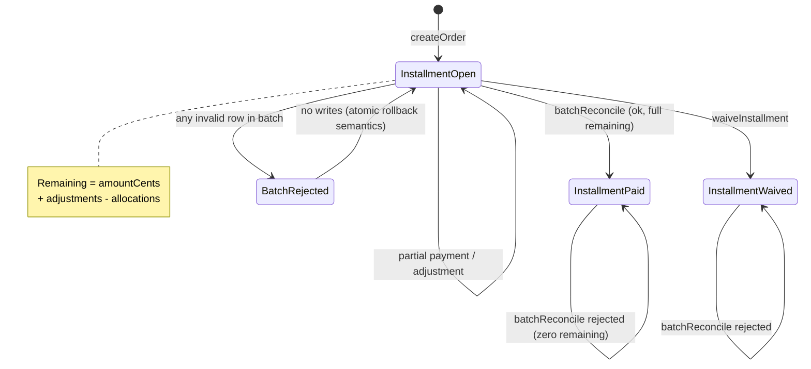
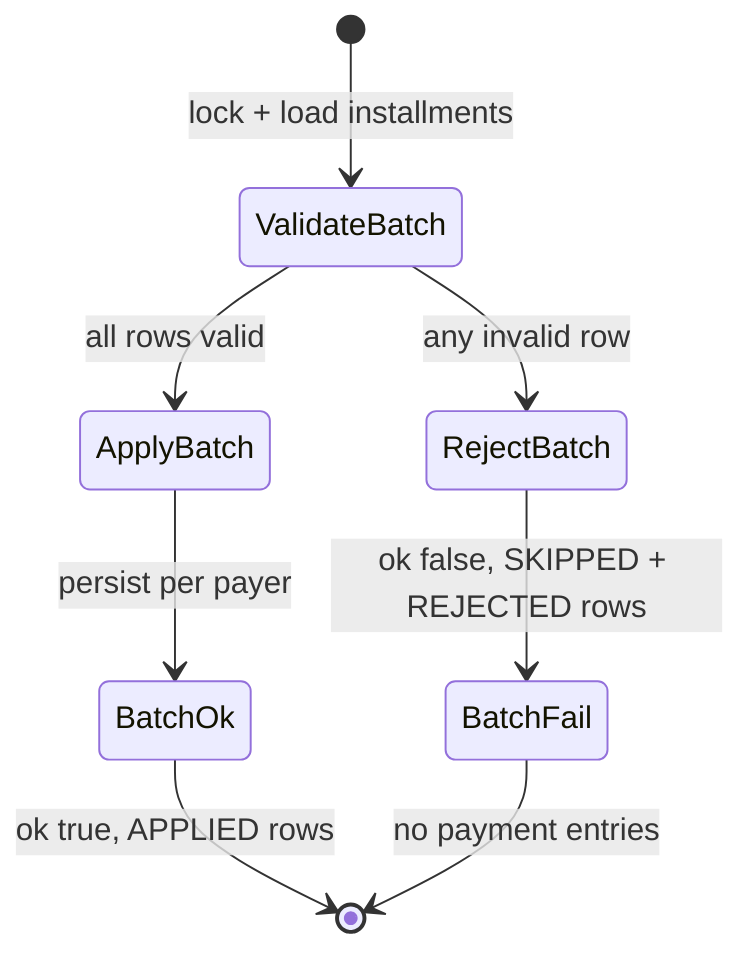
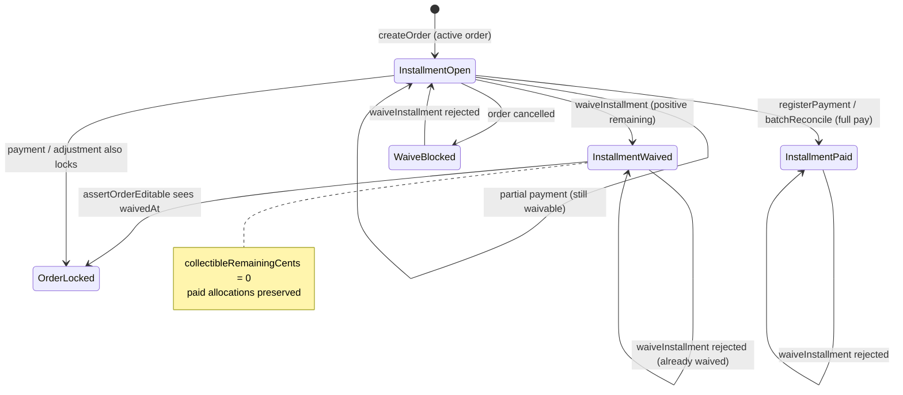
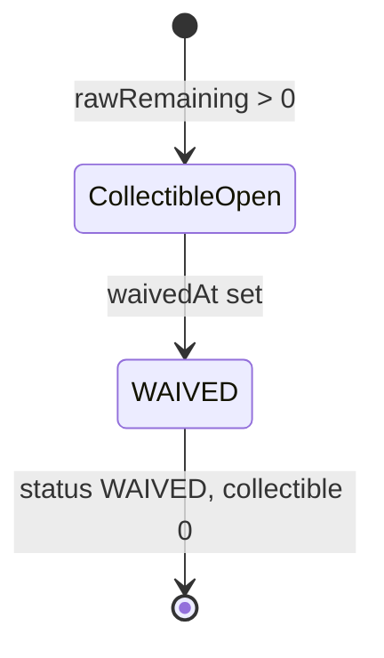

# PAIR-17 — Finance batch reconcile and installment waiver

Analysis of `finance.batchReconcile` and `finance.waiveInstallment` only.

---

## `finance.batchReconcile`

- **Type:** mutation
- **Auth:** `adminProcedure` (requires authenticated, enabled staff with role `ADMIN`; TEACHER/SECRETARY/FINANCE denied with `FORBIDDEN`, anonymous with `UNAUTHORIZED`)
- **Input schema:** `financeBatchReconcileInputSchema`
  - `date`: date-only input (coerced `Date`)
  - `method`: `PIX | CASH | TRANSFER | CARD | CHEQUE | BOLETO | OTHER`
  - `externalReference`: optional trimmed non-empty string
  - `installmentIds`: array of UUIDs, min 1 (`"Informe ao menos uma parcela."`)
  - Duplicate `installmentId` values in the array are **rejected** (not merged)
  - No `payerId` — payer is inferred per installment from `Installment.order.payerId`
- **Entities touched:**
  - `Installment` (read + `FOR UPDATE` lock): `amountCents`, `dueDate`, `waivedAt`, `order.payerId`, `order.cancelledAt`; related `InstallmentAdjustment.amountCents`, `PaymentAllocation.amountCents`
  - `PaymentEntry` (create, one per distinct payer in batch): `payerId`, `date`, `amountCents` (sum of selected installments for that payer), `method`, `externalReference`, `createdById`, `updatedById`
  - `PaymentAllocation` (create, one per selected installment): `paymentEntryId`, `installmentId`, `amountCents` (= full remaining balance), audit fields

### State preconditions

- Caller is authenticated ADMIN staff.
- Each `installmentId` must reference an existing `Installment` (soft-rejected if missing).
- Each installment must have `waivedAt === null` and positive remaining balance (`amountCents + adjustments − allocations > 0`).
- No duplicate `installmentId` in the input array.
- Typically preceded by `finance.createOrder` (or seed) to obtain installments; may follow partial payments or discount adjustments that reduce remaining balance.
- **Not enforced:** `Order.cancelledAt` — cancelled-order installments are not explicitly rejected (unlike `waiveInstallment`).

### Scenarios

| ID    | Scenario                                        | Given (state)                                                                              | Input                                                               | Expected outcome                                                                                                                                                                  | HTTP/tRPC error (if any)  | Post-state                                                                 |
| ----- | ----------------------------------------------- | ------------------------------------------------------------------------------------------ | ------------------------------------------------------------------- | --------------------------------------------------------------------------------------------------------------------------------------------------------------------------------- | ------------------------- | -------------------------------------------------------------------------- |
| B-S1  | Happy path — multi-payer full remaining         | ADMIN; two payers, each with one open installment (one partially paid + discount-adjusted) | `installmentIds: [idA, idB]`, `date`, `method`, `externalReference` | `{ ok: true }`; two `paymentEntries` (sorted by `payerId`); two `allocations` at full remaining; rows `APPLIED`                                                                   | —                         | One `PaymentEntry` per payer; allocations equal remaining balances         |
| B-S2  | Happy path — single payer multiple installments | ADMIN; one payer, order with N open installments                                           | all N installment IDs                                               | `{ ok: true }`; one `paymentEntry` with `amountCents` = sum of remainings; N `APPLIED` rows                                                                                       | —                         | Single entry, N allocations                                                |
| B-S3  | Happy path — HTTP boundary                      | ADMIN; order via HTTP `createOrder`                                                        | valid batch payload                                                 | HTTP 200; `ok: true`; persisted entry matches response                                                                                                                            | —                         | Same as B-S1 pattern                                                       |
| B-S4  | RBAC — non-ADMIN denied                         | TEACHER/SECRETARY/FINANCE caller                                                           | any valid input                                                     | Rejected at gate                                                                                                                                                                  | `FORBIDDEN` (403)         | No DB writes                                                               |
| B-S5  | RBAC — anonymous denied                         | No session                                                                                 | any input                                                           | Rejected at gate                                                                                                                                                                  | `UNAUTHORIZED` (401)      | No DB writes                                                               |
| B-S6  | Validation — empty installment list             | ADMIN                                                                                      | `installmentIds: []`                                                | Rejected at input parse                                                                                                                                                           | `BAD_REQUEST` (Zod min 1) | No DB writes                                                               |
| B-S7  | Validation — invalid installment UUID           | ADMIN                                                                                      | `installmentIds: ["bad"]`                                           | Rejected at input parse                                                                                                                                                           | `BAD_REQUEST` (Zod UUID)  | No DB writes                                                               |
| B-S8  | Validation — invalid method                     | ADMIN                                                                                      | `method: "INVALID"`                                                 | Rejected at input parse                                                                                                                                                           | `BAD_REQUEST` (Zod enum)  | No DB writes                                                               |
| B-S9  | Atomic rejection — missing installment          | ADMIN; one valid + one unknown UUID                                                        | `[validId, missingId]`                                              | `{ ok: false }`; valid row `SKIPPED` (`"Lote rejeitado por outra parcela invalida."`); invalid row `REJECTED` (`"Parcela nao encontrada."`); empty `paymentEntries`/`allocations` | — (no throw)              | Zero persisted entries/allocations                                         |
| B-S10 | Atomic rejection — duplicate selection          | ADMIN; one open installment                                                                | `[id, id]`                                                          | `{ ok: false }`; both rows `REJECTED` (`"Parcela selecionada mais de uma vez."`)                                                                                                  | —                         | No writes                                                                  |
| B-S11 | Atomic rejection — waived installment           | ADMIN; installment with `waivedAt` set                                                     | `[waivedId]`                                                        | `{ ok: false }`; row `REJECTED` (`"Parcela isenta nao aceita reconciliacao."`)                                                                                                    | —                         | No writes                                                                  |
| B-S12 | Atomic rejection — zero remaining               | ADMIN; fully paid installment (or concurrent winner paid it)                               | `[paidId]`                                                          | `{ ok: false }`; row `REJECTED` (`"Parcela nao possui saldo restante positivo."`)                                                                                                 | —                         | No new writes from loser                                                   |
| B-S13 | Concurrency — serialized reconcile              | ADMIN; one open installment; two concurrent batch calls                                    | same `installmentId`, different `externalReference`                 | Exactly one `{ ok: true }`, one `{ ok: false }` with `REJECTED`; only one allocation persisted totaling full installment amount                                                   | —                         | `FOR UPDATE` lock serializes; loser sees non-positive remaining            |
| B-S14 | Edge — partial payment before reconcile         | ADMIN; installment with existing allocation < expected                                     | `[installmentId]`                                                   | `{ ok: true }`; allocation = remaining only (not full face value)                                                                                                                 | —                         | Prior allocations preserved; new allocation closes gap                     |
| B-S15 | Edge — discount adjustment before reconcile     | ADMIN; installment with negative `InstallmentAdjustment`                                   | `[installmentId]`                                                   | `{ ok: true }`; allocation reflects adjusted expected minus paid                                                                                                                  | —                         | Same as B-S14 with adjustment in balance formula                           |
| B-S16 | Edge — cancelled order (untested)               | ADMIN; order with `cancelledAt` set; installment still has positive raw remaining          | `[installmentId]`                                                   | **Likely succeeds** — no `cancelledAt` check in `validateRow`                                                                                                                     | —                         | Payment recorded despite cancellation (behavior gap vs `waiveInstallment`) |

### State transitions (flow nodes)

Batch result envelope (per call):

### Outbound edges

| Target                        | Condition                                                               |
| ----------------------------- | ----------------------------------------------------------------------- |
| `finance.receivablesSnapshot` | Paid totals and open balances change after successful reconcile         |
| `finance.overdueList`         | Fully reconciled overdue installments may leave list                    |
| `finance.updateOrder`         | **Blocks** — allocations on any order installment set ORDER_LOCKED      |
| `finance.registerPayment`     | Alternative manual allocation path for same installments                |
| `finance.waiveInstallment`    | Remaining balance after partial reconcile can still be waived           |
| `finance.batchReconcile`      | Retry only while positive remaining; concurrent calls serialize on lock |

### Evidence

- `packages/api/src/receivables/router.ts` — procedure wiring, `$transaction`
- `packages/api/src/receivables/internal/batch-reconcile.ts` — validation, atomic reject, per-payer `persistPayment`
- `packages/api/src/receivables/internal/payment-store.ts` — `lockInstallments`, `loadInstallments`, `calculateRemainingBalanceCents`, `persistPayment`
- `packages/api/src/receivables/internal/shared.ts` — shared DB type
- `packages/validators/src/finance.ts` — `financeBatchReconcileInputSchema`
- `packages/db/prisma/schema.prisma` — `Installment`, `PaymentEntry`, `PaymentAllocation`
- `packages/api/src/trpc/init.ts` — `adminProcedure` gate
- Tests:
  - `packages/api/test/db/finance-batch-reconcile.test.ts` — B-S1, B-S9, B-S10, B-S13, B-S14/B-S15 (via discount fixture)
  - `packages/api/test/behavior/finance-batch-reconcile-http.test.ts` — B-S3
  - `packages/api/test/db/receivables-module.test.ts` — module-level batch reconcile (single payer, all installments)

**DB validation:** Not run in this analysis (read source + existing tests only).

---

## `finance.waiveInstallment`

- **Type:** mutation
- **Auth:** `adminProcedure` (same as `batchReconcile`)
- **Input schema:** `financeWaiveInstallmentInputSchema`
  - `installmentId`: required UUID (`"Identificador de parcela invalido."`)
  - `reason`: required trimmed non-empty string (`"Campo obrigatorio."`)
- **Entities touched:**
  - `Installment` (read + `FOR UPDATE` lock, then update): `waivedAt` (set to `new Date()`), `waivedReason`, `updatedById`
  - Related reads: `order.cancelledAt`, `adjustments`, `allocations` (for balance assertion and ledger derivation only)

### State preconditions

- Caller is authenticated ADMIN staff.
- `Installment` row must exist.
- Parent `Order.cancelledAt` must be `null`.
- `Installment.waivedAt` must be `null`.
- Remaining balance must be positive (`amountCents + adjustments − allocations > 0`).
- Typically preceded by `finance.createOrder`; may follow partial `registerPayment` or `batchReconcile` (forgives only the remainder).

### Scenarios

| ID    | Scenario                                | Given (state)                              | Input                                        | Expected outcome                                                                                          | HTTP/tRPC error (if any)                                               | Post-state                                                       |
| ----- | --------------------------------------- | ------------------------------------------ | -------------------------------------------- | --------------------------------------------------------------------------------------------------------- | ---------------------------------------------------------------------- | ---------------------------------------------------------------- |
| W-S1  | Happy path — full waiver                | ADMIN; open installment on active order    | `{ installmentId, reason }`                  | `{ installment: { waivedAt, waivedReason }, ledger: { status: "WAIVED", collectibleRemainingCents: 0 } }` | —                                                                      | `waivedAt`/`waivedReason`/`updatedById` persisted                |
| W-S2  | Happy path — HTTP boundary              | ADMIN; installment from HTTP `createOrder` | valid waive payload                          | HTTP 200; ledger `WAIVED`                                                                                 | —                                                                      | Same as W-S1                                                     |
| W-S3  | Happy path — partial payment then waive | ADMIN; installment with partial allocation | `{ installmentId, reason }`                  | Success; `ledger.paidAmountCents` preserved; `collectibleRemainingCents: 0`; status `WAIVED`              | —                                                                      | Prior allocations unchanged; waiver forgives remainder only      |
| W-S4  | RBAC — non-ADMIN denied                 | TEACHER/SECRETARY/FINANCE caller           | any valid input                              | Rejected at gate                                                                                          | `FORBIDDEN` (403)                                                      | No DB writes                                                     |
| W-S5  | RBAC — anonymous denied                 | No session                                 | any input                                    | Rejected at gate                                                                                          | `UNAUTHORIZED` (401)                                                   | No DB writes                                                     |
| W-S6  | Validation — invalid installmentId UUID | ADMIN                                      | `installmentId: "bad"`                       | Rejected at input parse                                                                                   | `BAD_REQUEST` (Zod UUID)                                               | No DB writes                                                     |
| W-S7  | Validation — empty reason               | ADMIN                                      | `reason: ""` or whitespace                   | Rejected at input parse                                                                                   | `BAD_REQUEST` (Zod min 1)                                              | No DB writes                                                     |
| W-S8  | Domain — installment not found          | ADMIN; no row for UUID                     | valid reason + random `installmentId`        | Rejected in service                                                                                       | `NOT_FOUND`: `"Parcela nao encontrada."`                               | Transaction rolled back                                          |
| W-S9  | Domain — already waived                 | ADMIN; `waivedAt` already set              | second waive attempt                         | Rejected in service                                                                                       | `BAD_REQUEST`: `"Parcela ja esta isenta."`                             | Unchanged                                                        |
| W-S10 | Domain — fully paid                     | ADMIN; allocations sum ≥ expected          | waive call                                   | Rejected in service                                                                                       | `BAD_REQUEST`: `"Parcela sem saldo remanescente para isentar."`        | Unchanged                                                        |
| W-S11 | Domain — cancelled order                | ADMIN; `Order.cancelledAt` set             | waive call                                   | Rejected in service                                                                                       | `BAD_REQUEST`: `"Pedido cancelado nao aceita alteracoes financeiras."` | Unchanged                                                        |
| W-S12 | Side effect — order edit lock           | ADMIN; successful waiver                   | then `finance.updateOrder` on same order     | Waiver succeeds; update fails                                                                             | `BAD_REQUEST` (ORDER_LOCKED_MESSAGE) on update                         | Order locked via `assertOrderEditable` (waivedAt on installment) |
| W-S13 | Downstream — adjustment blocked         | ADMIN; waived installment                  | `finance.addInstallmentAdjustment`           | Adjustment rejected                                                                                       | `BAD_REQUEST`: `"Parcela isenta nao aceita ajuste."`                   | Waiver stands                                                    |
| W-S14 | Downstream — batch reconcile blocked    | ADMIN; waived installment                  | `finance.batchReconcile` including waived id | `{ ok: false }`; row `REJECTED` (waived reason)                                                           | — (batch soft-fail)                                                    | No payment from batch                                            |

### State transitions (flow nodes)

Ledger status after waiver (domain):

### Outbound edges

| Target                             | Condition                                                                   |
| ---------------------------------- | --------------------------------------------------------------------------- |
| `finance.updateOrder`              | **Blocked** after waiver on any installment of the order                    |
| `finance.addInstallmentAdjustment` | **Blocked** on waived installment                                           |
| `finance.batchReconcile`           | **Blocked** — waived installment rejected in batch                          |
| `finance.registerPayment`          | **Blocked** on waived installment (`WAIVED_INSTALLMENT_ALLOCATION_MESSAGE`) |
| `finance.receivablesSnapshot`      | Waived installments contribute zero collectible balance                     |
| `finance.overdueList`              | Waived installments typically excluded from collection views                |

### Evidence

- `packages/api/src/receivables/router.ts` — procedure wiring, `$transaction`
- `packages/api/src/receivables/internal/installment-actions.ts` — `waiveInstallment`, `assertInstallmentWaivable`, ledger snapshot
- `packages/api/src/receivables/internal/payment-store.ts` — `lockInstallments`, `loadInstallments`, `calculateRemainingBalanceCents`
- `packages/api/src/receivables/internal/shared.ts` — error messages
- `packages/api/src/receivables/internal/orders.ts` — `assertOrderEditable` (order lock after waiver)
- `packages/validators/src/finance.ts` — `financeWaiveInstallmentInputSchema`
- `packages/domain/src/finance-ledger.ts` — `deriveInstallmentLedger`, status `WAIVED` precedence
- `packages/db/prisma/schema.prisma` — `Installment.waivedAt`, `Installment.waivedReason`
- `packages/api/src/trpc/init.ts` — `adminProcedure` gate
- Tests:
  - `packages/api/test/db/finance-waivers-adjustments.test.ts` — W-S1, W-S3, W-S8–W-S12, W-S13
  - `packages/api/test/behavior/finance-waivers-adjustments-http.test.ts` — W-S2
  - `packages/api/test/db/receivables-module.test.ts` — waiver in mixed receivables fixture
  - `packages/api/test/db/finance-waivers-adjustments-test-support.ts` — fixture helpers

**DB validation:** Not run in this analysis (read source + existing tests only).

---

## Cross-endpoint edges (this pair only)

| From                               | To                                 | Condition                                                           |
| ---------------------------------- | ---------------------------------- | ------------------------------------------------------------------- |
| `finance.createOrder`              | `finance.batchReconcile`           | Installments must exist with positive remaining                     |
| `finance.createOrder`              | `finance.waiveInstallment`         | Installment must exist on non-cancelled order                       |
| `finance.batchReconcile`           | `finance.waiveInstallment`         | Remaining balance after partial batch reconcile can still be waived |
| `finance.waiveInstallment`         | `finance.batchReconcile`           | **Blocks** — waived installment causes batch `ok: false`            |
| `finance.batchReconcile`           | `finance.batchReconcile`           | Second call fails when remaining ≤ 0 (B-S12/B-S13)                  |
| `finance.waiveInstallment`         | `finance.waiveInstallment`         | **Blocks** second waiver (W-S9)                                     |
| `finance.registerPayment`          | `finance.batchReconcile`           | Both create allocations; shared lock prevents over-payment          |
| `finance.batchReconcile`           | `finance.registerPayment`          | Alternative for custom amounts (batch always pays full remaining)   |
| `finance.waiveInstallment`         | `finance.registerPayment`          | **Blocks** allocation to waived installment                         |
| `finance.addInstallmentAdjustment` | `finance.batchReconcile`           | Adjustments reduce allocation amount on reconcile                   |
| `finance.waiveInstallment`         | `finance.addInstallmentAdjustment` | **Blocks** adjustments after waiver                                 |
| `finance.batchReconcile`           | `finance.updateOrder`              | Allocations lock order (same as registerPayment)                    |
| `finance.waiveInstallment`         | `finance.updateOrder`              | Waiver locks order (W-S12)                                          |
| `finance.batchReconcile`           | `finance.receivablesSnapshot`      | Successful reconcile updates aggregates                             |
| `finance.waiveInstallment`         | `finance.receivablesSnapshot`      | Waiver zeroes collectible on installment                            |
