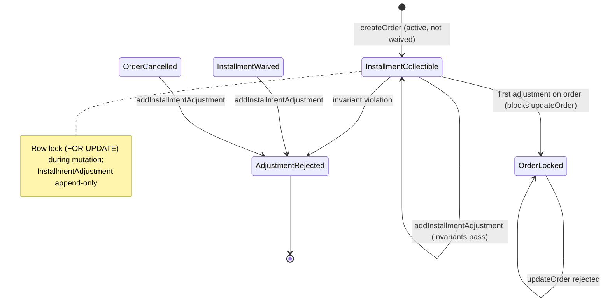
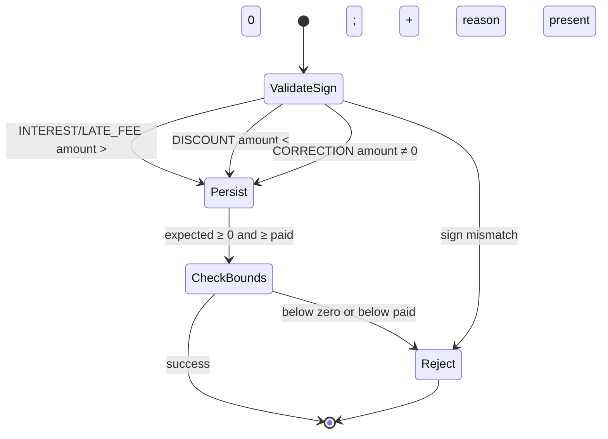
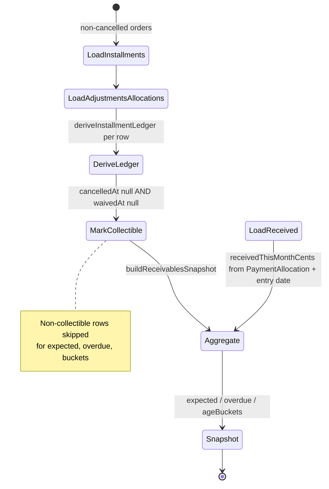
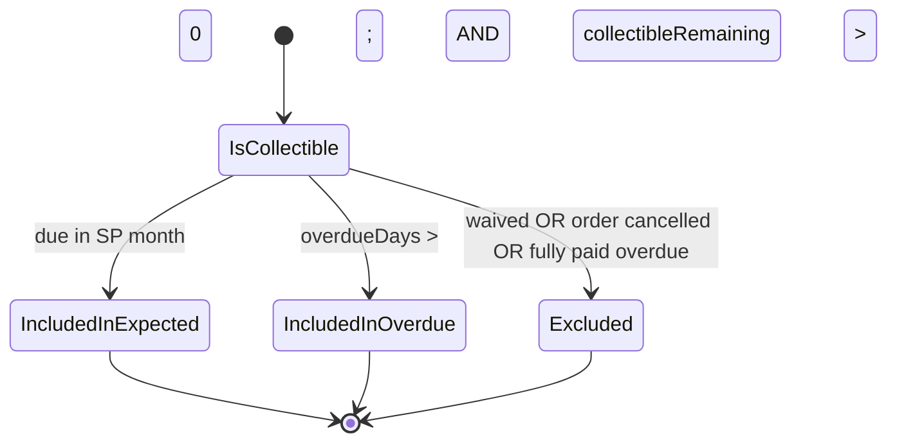

# PAIR-18 — Finance installment adjustment and receivables snapshot

Analysis of `finance.addInstallmentAdjustment` and `finance.receivablesSnapshot` only.

---

## `finance.addInstallmentAdjustment`

- **Type:** mutation
- **Auth:** `adminProcedure` (requires authenticated, enabled staff with role `ADMIN`; TEACHER/SECRETARY/FINANCE denied with `FORBIDDEN`, anonymous with `UNAUTHORIZED`)
- **Input schema:** `financeAddInstallmentAdjustmentInputSchema`
  - `installmentId`: required UUID (`"Identificador de parcela invalido."`)
  - `type`: `INTEREST | LATE_FEE | DISCOUNT | CORRECTION`
  - `amountCents`: integer (Zod `"Valor do ajuste deve ser inteiro."`)
  - `reason`: optional trimmed non-empty string (`optionalText`); **required in service** when `type === "DISCOUNT"`
  - `.strict()` — unknown keys rejected
- **Entities touched:**
  - `InstallmentAdjustment` (create): `installmentId`, `type`, `amountCents`, `reason`, `createdById`, `updatedById`
  - `Installment` (read + row lock via `SELECT … FOR UPDATE`; no column update on installment itself)

### State preconditions

- Caller is authenticated ADMIN staff.
- `Installment` row with `installmentId` must exist.
- Parent `Order` must not be cancelled (`Order.cancelledAt === null`).
- Installment must not be waived (`Installment.waivedAt === null`).
- Adjustment sign must match type: `INTEREST`/`LATE_FEE` → positive; `DISCOUNT` → negative; `CORRECTION` → non-zero (either sign).
- If `type === "DISCOUNT"`, `reason` must be present (non-null/undefined).
- Proposed adjustment must keep `currentExpectedCents ≥ 0` (base amount + existing adjustments + new adjustment).
- Proposed adjustment must keep `currentExpectedCents ≥ paidAmountCents` (sum of existing `PaymentAllocation.amountCents` on the installment).
- Typically preceded by `finance.createOrder` (or seed) to obtain the installment.

### Scenarios

| ID    | Scenario                                       | Given (state)                                       | Input                                                           | Expected outcome                                                                               | HTTP/tRPC error (if any)                                               | Post-state                                                                                                               |
| ----- | ---------------------------------------------- | --------------------------------------------------- | --------------------------------------------------------------- | ---------------------------------------------------------------------------------------------- | ---------------------------------------------------------------------- | ------------------------------------------------------------------------------------------------------------------------ |
| A-S1  | Happy path — discount                          | ADMIN; active order; collectible installment        | `type: DISCOUNT`, negative `amountCents`, `reason` set          | `{ adjustment, ledger }`; ledger status ≠ `WAIVED`; `currentExpectedCents` = base + adjustment | —                                                                      | `InstallmentAdjustment` row created; `createdById`/`updatedById` = staff; installment unchanged except downstream ledger |
| A-S2  | Happy path — interest                          | ADMIN; active installment                           | `type: INTEREST`, positive `amountCents`, no reason             | Success; `currentExpectedCents` increases                                                      | —                                                                      | Adjustment row persisted                                                                                                 |
| A-S3  | Happy path — correction (negative)             | ADMIN; active installment                           | `type: CORRECTION`, negative `amountCents`                      | Success; expected reduced                                                                      | —                                                                      | Adjustment row persisted                                                                                                 |
| A-S4  | Happy path — late fee                          | ADMIN; active installment                           | `type: LATE_FEE`, positive `amountCents`                        | Success (same sign rules as interest)                                                          | —                                                                      | Adjustment row persisted                                                                                                 |
| A-S5  | RBAC — non-ADMIN denied                        | TEACHER/SECRETARY/FINANCE caller                    | any valid input                                                 | Rejected at gate                                                                               | `FORBIDDEN` (403)                                                      | No DB writes                                                                                                             |
| A-S6  | RBAC — anonymous denied                        | No session                                          | any input                                                       | Rejected at gate                                                                               | `UNAUTHORIZED` (401)                                                   | No DB writes                                                                                                             |
| A-S7  | Validation — invalid installmentId UUID        | ADMIN                                               | `installmentId: "bad"`                                          | Rejected at input parse                                                                        | `BAD_REQUEST` (Zod UUID)                                               | No DB writes                                                                                                             |
| A-S8  | Validation — non-integer amount                | ADMIN                                               | `amountCents: 10.5`                                             | Rejected at input parse                                                                        | `BAD_REQUEST` (Zod int)                                                | No DB writes                                                                                                             |
| A-S9  | Validation — strict schema                     | ADMIN                                               | extra unknown field                                             | Rejected at input parse                                                                        | `BAD_REQUEST` (Zod strict)                                             | No DB writes                                                                                                             |
| A-S10 | Domain — installment not found                 | ADMIN; no row for UUID                              | valid fields + random `installmentId`                           | Rejected in service                                                                            | `NOT_FOUND`: `"Parcela nao encontrada."`                               | Transaction rolled back                                                                                                  |
| A-S11 | Domain — invalid sign (positive discount)      | ADMIN; active installment                           | `type: DISCOUNT`, positive `amountCents`                        | Rejected in service                                                                            | `BAD_REQUEST`: `"Sinal do ajuste invalido para o tipo informado."`     | No adjustment row                                                                                                        |
| A-S12 | Domain — invalid sign (zero interest/late fee) | ADMIN; active installment                           | `type: INTEREST` or `LATE_FEE`, `amountCents: 0`                | Rejected in service                                                                            | `BAD_REQUEST` (INVALID_ADJUSTMENT_SIGN_MESSAGE)                        | No adjustment row                                                                                                        |
| A-S13 | Domain — invalid sign (zero correction)        | ADMIN; active installment                           | `type: CORRECTION`, `amountCents: 0`                            | Rejected in service                                                                            | `BAD_REQUEST` (INVALID_ADJUSTMENT_SIGN_MESSAGE)                        | No adjustment row                                                                                                        |
| A-S14 | Domain — discount without reason               | ADMIN; active installment                           | `type: DISCOUNT`, negative amount, `reason` omitted             | Rejected in service                                                                            | `BAD_REQUEST`: `"Desconto exige motivo."`                              | No adjustment row                                                                                                        |
| A-S15 | Domain — cancelled order                       | ADMIN; order with `cancelledAt` set                 | any valid adjustment                                            | Rejected in service                                                                            | `BAD_REQUEST`: `"Pedido cancelado nao aceita alteracoes financeiras."` | No adjustment row                                                                                                        |
| A-S16 | Domain — waived installment                    | ADMIN; installment with `waivedAt` set              | any valid adjustment                                            | Rejected in service                                                                            | `BAD_REQUEST`: `"Parcela isenta nao aceita ajuste."`                   | No adjustment row                                                                                                        |
| A-S17 | Domain — expected below paid                   | ADMIN; installment with partial `PaymentAllocation` | discount large enough that expected &lt; paid                   | Rejected in service                                                                            | `BAD_REQUEST`: `"Ajuste deixaria valor esperado menor que o ja pago."` | No adjustment row                                                                                                        |
| A-S18 | Domain — expected below zero                   | ADMIN; active installment                           | large negative correction exceeding base + existing adjustments | Rejected in service                                                                            | `BAD_REQUEST`: `"Ajuste deixaria valor esperado negativo."`            | No adjustment row                                                                                                        |
| A-S19 | Side effect — order locked                     | ADMIN; editable order; adjustment succeeds          | any valid first adjustment on order                             | Success                                                                                        | —                                                                      | `finance.updateOrder` on same order rejected with ORDER_LOCKED_MESSAGE                                                   |
| A-S20 | Edge — multiple adjustments stack              | ADMIN; installment with prior adjustment            | second adjustment                                               | Success if invariants still hold                                                               | —                                                                      | Expected = base + sum(all adjustment amounts); each row append-only                                                      |
| A-S21 | Edge — does not waive                          | ADMIN; active installment                           | discount adjustment                                             | Ledger status remains collectible (not `WAIVED`)                                               | —                                                                      | `Installment.waivedAt` stays null                                                                                        |

### State transitions (flow nodes)

Adjustment type sign gate:

### Outbound edges

| Target                        | Condition                                                                                              |
| ----------------------------- | ------------------------------------------------------------------------------------------------------ |
| `finance.receivablesSnapshot` | Adjustments feed `currentExpectedCents` in derived ledger; overdue/expected totals change on next read |
| `finance.overdueList`         | Interest/late-fee on overdue installments increases `collectibleRemainingCents`                        |
| `finance.registerPayment`     | Remaining collectible balance changes after adjustment                                                 |
| `finance.updateOrder`         | **Blocked** after first adjustment on any installment of the order                                     |
| `finance.waiveInstallment`    | Still allowed on collectible installments (separate path; waiver blocks further adjustments)           |

### Evidence

- `packages/api/src/receivables/router.ts` — procedure wiring, `$transaction`
- `packages/api/src/receivables/internal/installment-actions.ts` — `addInstallmentAdjustment`, `assertInstallmentAdjustable`, sign/bounds checks
- `packages/api/src/receivables/internal/payment-store.ts` — `lockInstallments`, `loadInstallments`
- `packages/api/src/receivables/internal/shared.ts` — error messages
- `packages/api/src/receivables/internal/orders.ts` — `assertOrderEditable` (adjustment count locks order)
- `packages/validators/src/finance.ts` — `financeAddInstallmentAdjustmentInputSchema`
- `packages/domain/src/finance-ledger.ts` — `deriveInstallmentLedger` (adjustments sum into `currentExpectedCents`)
- `packages/db/prisma/schema.prisma` — `InstallmentAdjustment`, `InstallmentAdjustmentType` enum
- `packages/api/src/trpc/init.ts` — `adminProcedure` gate
- Tests:
  - `packages/api/test/db/finance-waivers-adjustments.test.ts` — A-S1, A-S2, A-S3, A-S10–A-S19
  - `packages/api/test/behavior/finance-waivers-adjustments-http.test.ts` — A-S1 HTTP path
  - `packages/api/test/db/receivables-module.test.ts` — interest adjustment in module E2E flow

**DB validation:** Not run in this analysis (read source + existing tests only).

---

## `finance.receivablesSnapshot`

- **Type:** query
- **Auth:** `adminProcedure` (same as adjustment mutation)
- **Input schema:** none (no input)
- **Entities touched:** read-only
  - `Installment` (non-cancelled orders only): `amountCents`, `dueDate`, `waivedAt`, nested `Order.cancelledAt`, payer, beneficiaries
  - `InstallmentAdjustment`: `amountCents` per installment
  - `PaymentAllocation`: `amountCents` per installment; plus allocations whose `PaymentEntry.date` falls in current São Paulo calendar month for `receivedThisMonthCents`
  - `FinanceSettings` (optional): `interestRatePctMonthly` (defaults to 1% if missing)

### State preconditions

- Caller is authenticated ADMIN staff.
- No domain preconditions — empty database returns zeroed aggregates (aside from any pre-existing global payment allocations in month).

### Scenarios

| ID    | Scenario                        | Given (state)                                                                 | Input     | Expected outcome                                                                                        | HTTP/tRPC error (if any) | Post-state                                  |
| ----- | ------------------------------- | ----------------------------------------------------------------------------- | --------- | ------------------------------------------------------------------------------------------------------- | ------------------------ | ------------------------------------------- |
| R-S1  | Happy path — dashboard totals   | ADMIN; fixture with overdue, in-month, future installments and month payments | (none)    | `ReceivablesSnapshot`: `expectedThisMonthCents`, `receivedThisMonthCents`, `overdueCents`, `ageBuckets` | —                        | No writes                                   |
| R-S2  | RBAC — non-ADMIN denied         | TEACHER/SECRETARY/FINANCE caller                                              | (none)    | Rejected at gate                                                                                        | `FORBIDDEN` (403)        | No reads beyond auth                        |
| R-S3  | RBAC — anonymous denied         | No session                                                                    | (none)    | Rejected at gate                                                                                        | `UNAUTHORIZED` (401)     | —                                           |
| R-S4  | Edge — empty / baseline delta   | ADMIN; clean finance DB                                                       | (none)    | Zeros or stable baseline; delta tests compare before/after fixture                                      | —                        | No writes                                   |
| R-S5  | Exclusion — cancelled orders    | Order with `cancelledAt` set and overdue installment                          | (none)    | Cancelled order installments **not loaded** (`where: order.cancelledAt null`)                           | —                        | No effect on totals                         |
| R-S6  | Exclusion — waived installments | Installment with `waivedAt` set                                               | (none)    | Row may load but `isCollectible: false` → skipped in aggregation                                        | —                        | No contribution to expected/overdue/buckets |
| R-S7  | Partial payment effect          | Collectible installment with partial allocation                               | (none)    | `overdueCents` uses `collectibleRemainingCents`, not full face value                                    | —                        | —                                           |
| R-S8  | Adjustment effect               | Installment with `InstallmentAdjustment` (e.g. interest on overdue)           | (none)    | `currentExpectedCents` includes adjustment sum; overdue/expected reflect higher balance                 | —                        | —                                           |
| R-S9  | In-month expected               | Collectible installment due in current São Paulo month                        | (none)    | Contributes full `ledger.currentExpectedCents` to `expectedThisMonthCents` (paid or not)                | —                        | —                                           |
| R-S10 | Age buckets                     | Overdue collectible with remaining balance                                    | (none)    | `ageBuckets.days1To7Cents` / `days8To30Cents` / `days30PlusCents` incremented per `ledger.ageBucket`    | —                        | —                                           |
| R-S11 | Received this month             | `PaymentAllocation` rows with `PaymentEntry.date` in current SP month         | (none)    | `receivedThisMonthCents` = sum of allocation amounts (not limited to loaded installments)               | —                        | —                                           |
| R-S12 | Interest rate setting           | `FinanceSettings.interestRatePctMonthly` present or absent                    | (none)    | Uses DB value or `DEFAULT_INTEREST_RATE_PCT_MONTHLY` (1) for ledger derivation                          | —                        | —                                           |
| R-S13 | HTTP path                       | ADMIN session over HTTP                                                       | GET query | Same payload shape as tRPC caller                                                                       | —                        | —                                           |

### State transitions (flow nodes)

Read path is stateless from the caller's perspective — no DB mutations. Derived aggregation pipeline:

Collectible vs aggregated:

### Outbound edges

| Target                                        | Condition                                                                         |
| --------------------------------------------- | --------------------------------------------------------------------------------- |
| `finance.overdueList`                         | Companion read; same derivation, filtered to overdue collectible rows with detail |
| Admin finance dashboard UI                    | Primary consumer of snapshot metrics (S-FIN-6)                                    |
| `finance.registerPayment`                     | Reduces overdue/remaining; increases `receivedThisMonthCents` on next snapshot    |
| `finance.addInstallmentAdjustment`            | Increases expected/overdue when adjustments raise `currentExpectedCents`          |
| `finance.waiveInstallment`                    | Removes installment from collectible aggregation                                  |
| `finance.createOrder` / `finance.updateOrder` | Adds/changes installments included in next snapshot                               |

### Evidence

- `packages/api/src/receivables/router.ts` — query wiring (no transaction)
- `packages/api/src/receivables/internal/ledger-read.ts` — `receivablesSnapshot`, `loadActiveOrderInstallments`, `loadReceivedThisMonthCents`
- `packages/api/src/receivables/internal/shared.ts` — `loadInterestRatePctMonthly`, `DEFAULT_INTEREST_RATE_PCT_MONTHLY`
- `packages/domain/src/receivables-dashboard.ts` — `buildReceivablesSnapshot`, `isDueInSaoPauloMonth`
- `packages/domain/src/finance-ledger.ts` — `deriveInstallmentLedger`
- `packages/domain/test/receivables-dashboard.test.ts` — aggregation unit tests
- `packages/api/src/trpc/init.ts` — `adminProcedure` gate
- Tests:
  - `packages/api/test/db/finance-receivables.test.ts` — R-S1, R-S5–R-S10 (via fixture helpers)
  - `packages/api/test/db/finance-receivables-test-support.ts` — fixture dates, `computeExpectedSnapshotTotals`
  - `packages/api/test/behavior/finance-receivables-http.test.ts` — R-S13
  - `packages/api/test/db/receivables-module.test.ts` — R-S8 after interest adjustment; overdue delta assertion

**DB validation:** Not run in this analysis (read source + existing tests only).

---

## Cross-endpoint edges (this pair only)

| From                               | To                                 | Condition                                                                                       |
| ---------------------------------- | ---------------------------------- | ----------------------------------------------------------------------------------------------- |
| `finance.createOrder`              | `finance.addInstallmentAdjustment` | Provides installment targets on active orders                                                   |
| `finance.addInstallmentAdjustment` | `finance.receivablesSnapshot`      | Adjustments change `currentExpectedCents`; overdue/expected/bucket totals on next read          |
| `finance.addInstallmentAdjustment` | `finance.overdueList`              | Same ledger derivation; interest on overdue rows increases remaining                            |
| `finance.addInstallmentAdjustment` | `finance.updateOrder`              | **Blocks** — adjustment count triggers `assertOrderEditable` failure                            |
| `finance.registerPayment`          | `finance.receivablesSnapshot`      | Allocations affect `receivedThisMonthCents` and reduce overdue remaining                        |
| `finance.waiveInstallment`         | `finance.addInstallmentAdjustment` | **Blocks** — waived installments reject adjustments                                             |
| `finance.waiveInstallment`         | `finance.receivablesSnapshot`      | Waived rows excluded from collectible aggregation                                               |
| `finance.receivablesSnapshot`      | `finance.overdueList`              | Snapshot aggregates; overdue list drills into row-level overdue detail (same derivation source) |
