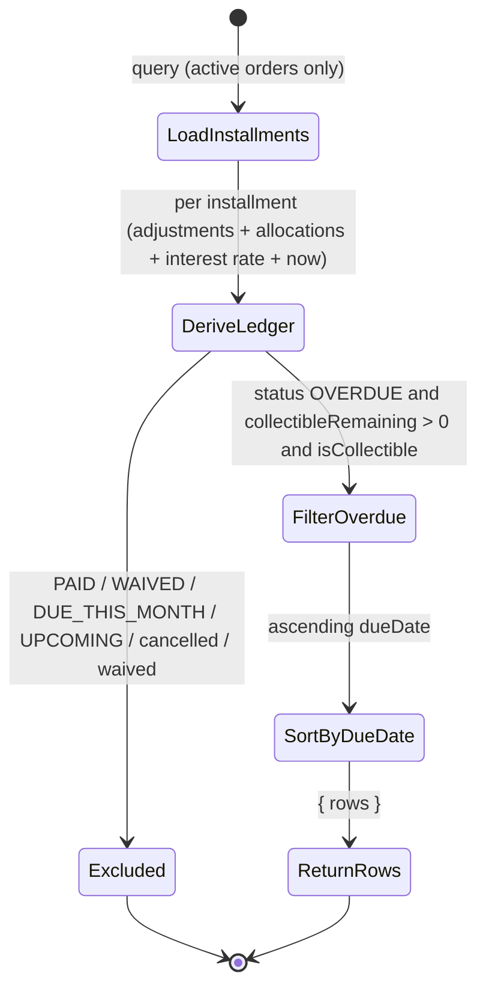
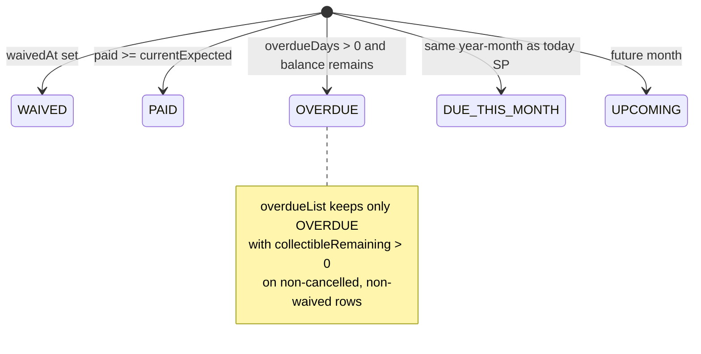
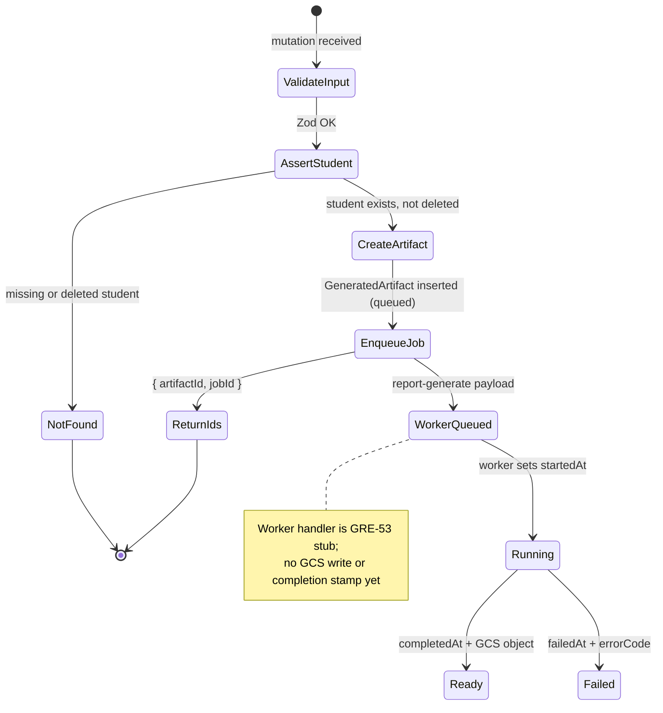
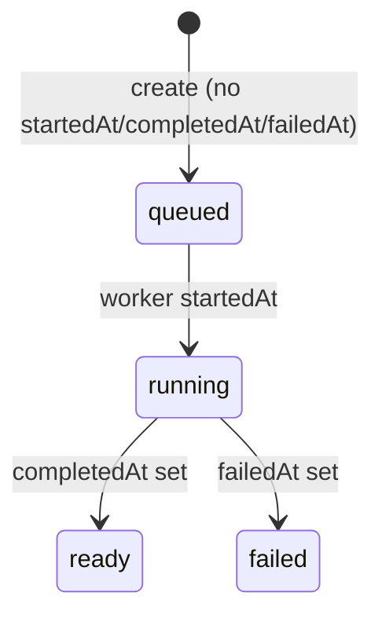

# PAIR-19 — Finance overdue list and student statement request

Analysis of `finance.overdueList` and `reports.requestStudentStatement` only.

---

## `finance.overdueList`

- **Type:** query
- **Auth:** `adminProcedure` (requires authenticated, enabled staff with role `ADMIN`; TEACHER/SECRETARY/FINANCE denied with `FORBIDDEN`, anonymous with `UNAUTHORIZED`)
- **Input schema:** none (no `.input()` on the procedure)
- **Entities touched:** read-only
  - `Installment`: `id`, `orderId`, `amountCents`, `dueDate`, `waivedAt`
  - `Order`: `cancelledAt`, `payer` (`id`, `name`), `beneficiaries` → `Student` (`id`, `fullName`, `phone`)
  - `InstallmentAdjustment`: `installmentId`, `amountCents`
  - `PaymentAllocation`: `installmentId`, `amountCents`
  - `FinanceSettings`: `interestRatePctMonthly` (singleton row; defaults to 1% if missing)

### State preconditions

- Caller is authenticated ADMIN staff.
- No specific receivables state is required; an empty database returns `{ rows: [] }`.
- Rows are derived at read time from active (non-cancelled) orders and their installments, plus related adjustments/allocations and the current interest rate.

### Scenarios

| ID    | Scenario                                      | Given (state)                                                                                         | Input  | Expected outcome                                                                                                                                                                           | HTTP/tRPC error (if any) | Post-state              |
| ----- | --------------------------------------------- | ----------------------------------------------------------------------------------------------------- | ------ | ------------------------------------------------------------------------------------------------------------------------------------------------------------------------------------------ | ------------------------ | ----------------------- |
| O-S1  | Happy path — overdue rows returned            | ADMIN; active order with past-due installment, partial payment, positive collectible balance          | (none) | `{ rows }` with matching installment; each row has `ledger.status === "OVERDUE"`, `collectibleRemainingCents > 0`, payer, beneficiaries (with `whatsAppUrl` when phone present), `dueDate` | —                        | No DB writes            |
| O-S2  | Happy path — multiple rows sorted by due date | ADMIN; multiple collectible overdue installments on different due dates                               | (none) | Rows sorted ascending by `dueDate`                                                                                                                                                         | —                        | No DB writes            |
| O-S3  | Edge — empty list                             | ADMIN; no installments or none overdue/collectible                                                    | (none) | `{ rows: [] }`                                                                                                                                                                             | —                        | No DB writes            |
| O-S4  | Edge — partially paid overdue                 | ADMIN; overdue installment with allocations < `currentExpectedCents`                                  | (none) | Row included; `ledger.status === "OVERDUE"`, `collectibleRemainingCents > 0`                                                                                                               | —                        | No DB writes            |
| O-S5  | Edge — fully paid overdue date                | ADMIN; installment past due but `paidAmountCents >= currentExpectedCents`                             | (none) | Row excluded (`ledger.status === "PAID"`)                                                                                                                                                  | —                        | No DB writes            |
| O-S6  | Edge — due this month but not overdue         | ADMIN; installment due in current São Paulo month, `overdueDays === 0`                                | (none) | Row excluded (`ledger.status === "DUE_THIS_MONTH"`)                                                                                                                                        | —                        | No DB writes            |
| O-S7  | Edge — upcoming installment                   | ADMIN; installment due in a future month                                                              | (none) | Row excluded (`ledger.status === "UPCOMING"`)                                                                                                                                              | —                        | No DB writes            |
| O-S8  | Exclusion — cancelled order                   | ADMIN; order with `cancelledAt` set and past-due installment                                          | (none) | Installment not loaded (query filters `order.cancelledAt: null`)                                                                                                                           | —                        | No DB writes            |
| O-S9  | Exclusion — waived installment                | ADMIN; active order; installment with `waivedAt` set and past due                                     | (none) | Row excluded (`isCollectible === false`)                                                                                                                                                   | —                        | No DB writes            |
| O-S10 | Edge — interest preview in ledger             | ADMIN; overdue with positive collectible balance; `FinanceSettings.interestRatePctMonthly` configured | (none) | Row includes `ledger.interestPreviewCents` and `ageBucket` derived from `overdueDays`                                                                                                      | —                        | No DB writes            |
| O-S11 | RBAC — non-ADMIN denied                       | TEACHER/SECRETARY/FINANCE caller                                                                      | (none) | Rejected at gate                                                                                                                                                                           | `FORBIDDEN` (403)        | No DB reads beyond auth |
| O-S12 | RBAC — anonymous denied                       | No session                                                                                            | (none) | Rejected at gate                                                                                                                                                                           | `UNAUTHORIZED` (401)     | No DB reads beyond auth |

Filter rule (all happy-path rows must satisfy): `isCollectible && ledger.status === "OVERDUE" && ledger.collectibleRemainingCents > 0`, where `isCollectible = order.cancelledAt === null && waivedAt === null`.

### State transitions (flow nodes)

Read-only query; no persisted state changes. Rows reflect derived installment display status at query time:

Installment display status derivation (domain, at read time):

### Outbound edges

| Target                             | Condition                                                                 |
| ---------------------------------- | ------------------------------------------------------------------------- |
| `finance.registerPayment`          | Staff chases payer from overdue row; allocates to `installmentId`         |
| `finance.waiveInstallment`         | Staff waives remaining balance on an overdue installment                  |
| `finance.addInstallmentAdjustment` | Staff applies discount/interest correction on overdue installment         |
| `reports.requestStudentStatement`  | Staff opens full history for a beneficiary student listed in a row        |
| `reports.requestOverdueCsv`        | Bulk export of same overdue population (async sibling)                    |
| `finance.receivablesSnapshot`      | Dashboard aggregate over same installment universe (different projection) |

### Evidence

- `packages/api/src/receivables/router.ts` — `adminProcedure.query`, no input
- `packages/api/src/receivables/internal/ledger-read.ts` — `overdueList`, `loadDerivedReceivablesInstallments`, filter/sort
- `packages/api/src/receivables/internal/shared.ts` — `loadInterestRatePctMonthly`, `ReceivablesDatabase`
- `packages/domain/src/finance-ledger.ts` — `deriveInstallmentLedger`, status precedence
- `packages/domain/src/receivables-dashboard.ts` — related snapshot aggregation (shared derivation)
- `packages/db/prisma/schema.prisma` — `Installment`, `Order`, `FinanceSettings`
- `packages/api/src/trpc/init.ts` — `adminProcedure` gate
- Tests:
  - `packages/api/test/db/finance-receivables.test.ts` — O-S1, O-S2, O-S8, O-S9
  - `packages/api/test/behavior/finance-receivables-http.test.ts` — O-S1 over HTTP
  - `packages/api/test/db/receivables-module.test.ts` — O-S1 via module facade
  - `packages/api/test/matrix-guardrails.test.ts` — O-S11 gate/matrix alignment
- DB validation: not run in this analysis (tests above cover behavior when Postgres is available)

---

## `reports.requestStudentStatement`

- **Type:** mutation
- **Auth:** `adminProcedure` (same ADMIN-only gate as finance router)
- **Input schema:** `requestStudentStatementInputSchema`
  - `studentId`: required UUID (`"Identificador de aluno invalido."`)
  - `.strict()` — unknown keys rejected
- **Entities touched:**
  - `GeneratedArtifact` (create): `kind = STUDENT_STATEMENT_PDF`, `requestedById`, `requestedAt`, `studentId`
  - `Student` (read): existence check `id` + `deletedAt: null`
  - Hatchet/local queue: `report-generate` workflow enqueued with `{ artifactId }`

### State preconditions

- Caller is authenticated ADMIN staff.
- `Student` row with matching `studentId` must exist and not be soft-deleted (`deletedAt === null`).
- No finance orders/installments are required; a student with zero orders still succeeds.
- `reportGenerateQueue` on context (defaults to local queue when omitted).

### Scenarios

| ID    | Scenario                               | Given (state)                       | Input                                              | Expected outcome                                                                                                                                                           | HTTP/tRPC error (if any)               | Post-state                                                                  |
| ----- | -------------------------------------- | ----------------------------------- | -------------------------------------------------- | -------------------------------------------------------------------------------------------------------------------------------------------------------------------------- | -------------------------------------- | --------------------------------------------------------------------------- |
| R-S1  | Happy path — artifact + job created    | ADMIN; active student exists        | `{ studentId }` valid UUID                         | `{ artifactId, jobId }`; `GeneratedArtifact` row with `kind = STUDENT_STATEMENT_PDF`, `requestedById = staffUser.id`, `completedAt = null`; `report-generate` job enqueued | —                                      | Artifact queued; worker stub logs artifactId (GRE-53 placeholder)           |
| R-S2  | Happy path — poll queued status        | R-S1 completed                      | `reports.getArtifact({ id: artifactId })` as ADMIN | `{ status: "queued", studentId, completedAt: null }`                                                                                                                       | —                                      | No further writes until worker runs                                         |
| R-S3  | RBAC — non-ADMIN denied                | TEACHER/SECRETARY/FINANCE caller    | valid `studentId`                                  | Rejected at gate                                                                                                                                                           | `FORBIDDEN` (403)                      | No DB writes                                                                |
| R-S4  | RBAC — anonymous denied                | No session                          | valid `studentId`                                  | Rejected at gate                                                                                                                                                           | `UNAUTHORIZED` (401)                   | No DB writes                                                                |
| R-S5  | Validation — invalid studentId UUID    | ADMIN                               | `studentId: "bad"`                                 | Rejected at input parse                                                                                                                                                    | `BAD_REQUEST` (Zod UUID)               | No DB writes                                                                |
| R-S6  | Validation — extra fields              | ADMIN                               | `{ studentId, extra: 1 }`                          | Rejected at input parse                                                                                                                                                    | `BAD_REQUEST` (Zod strict)             | No DB writes                                                                |
| R-S7  | Domain — student not found             | ADMIN; no student for UUID          | random valid UUID                                  | Rejected in service                                                                                                                                                        | `NOT_FOUND`: `"Aluno nao encontrado."` | Transaction rolled back; no artifact                                        |
| R-S8  | Domain — soft-deleted student          | ADMIN; student with `deletedAt` set | `{ studentId }`                                    | Rejected in service                                                                                                                                                        | `NOT_FOUND`: `"Aluno nao encontrado."` | Transaction rolled back                                                     |
| R-S9  | Edge — student with no finance history | ADMIN; student exists, no orders    | `{ studentId }`                                    | Success (artifact queued); PDF content TBD by worker                                                                                                                       | —                                      | Artifact created; worker generates empty/minimal statement when implemented |
| R-S10 | Edge — HTTP adapter                    | ADMIN; student seeded               | POST `reports.requestStudentStatement`             | HTTP 200; same artifact + enqueue semantics as R-S1                                                                                                                        | —                                      | Same as R-S1                                                                |

Worker completion (not exercised by current handler): artifact transitions `startedAt` → `completedAt` with GCS keys, or `failedAt` with error fields. Current stub in `process-report-generate` only logs and returns.

Per spec (§4.8 / S-FIN-7): generated PDF should include all orders and installments (including cancelled-order history as non-collectible), plus payment entries with allocations — independent of overdue-list filtering.

### State transitions (flow nodes)

Artifact lifecycle after request (observable via `reports.getArtifact`):

### Outbound edges

| Target                                    | Condition                                                                                                        |
| ----------------------------------------- | ---------------------------------------------------------------------------------------------------------------- |
| `reports.getArtifact`                     | Poll `{ artifactId }` until `status` is `ready` or `failed`                                                      |
| Hatchet `report-generate` job             | Always enqueued on success; worker builds PDF → GCS                                                              |
| `finance.registerPayment` / order history | Statement content reflects finance data staff may act on after review (indirect, via PDF — not wired in API yet) |

### Evidence

- `packages/api/src/reports/router.ts` — procedure wiring, `$transaction`, `STUDENT_STATEMENT_PDF`
- `packages/api/src/reports/request-artifact.ts` — `requestReportArtifact`, `assertStudentExists`, enqueue
- `packages/api/src/reports/errors.ts` — `reportNotFound("student")`
- `packages/api/src/reports/get-artifact.ts` — queued status read path (R-S2)
- `packages/validators/src/reports.ts` — `requestStudentStatementInputSchema`, `deriveArtifactStatus`
- `packages/job-contracts/src/index.ts` — `REPORT_GENERATE_WORKFLOW`, `enqueueReportGenerate`
- `packages/worker-handlers/src/reports/process-report-generate.ts` — stub worker (GRE-53)
- `packages/db/prisma/schema.prisma` — `GeneratedArtifact`, `Student`
- `packages/api/src/trpc/init.ts` — `adminProcedure` gate
- Tests:
  - `packages/api/test/db/reports.test.ts` — R-S1/R-S2 via `getQueuedArtifact`
  - `packages/api/test/behavior/reports-http.test.ts` — R-S10
- DB validation: not run in this analysis

---

## Cross-endpoint edges (this pair only)

| From                                          | To                                | Condition                                                                                        |
| --------------------------------------------- | --------------------------------- | ------------------------------------------------------------------------------------------------ |
| `finance.overdueList`                         | `reports.requestStudentStatement` | Staff selects a beneficiary `studentId` from an overdue row to generate full extrato             |
| `finance.overdueList`                         | `finance.registerPayment`         | Staff uses `installmentId` / payer from overdue row to record collection                         |
| `finance.overdueList`                         | `reports.requestOverdueCsv`       | Parallel bulk export of overdue receivables (same business domain, different surface)            |
| `reports.requestStudentStatement`             | `reports.getArtifact`             | Required follow-up to obtain PDF status/download after request                                   |
| `finance.registerPayment`                     | `finance.overdueList`             | Full/partial payment may remove installment from overdue rows on next read                       |
| `finance.waiveInstallment`                    | `finance.overdueList`             | Waived overdue installment disappears from list                                                  |
| `finance.createOrder` / `finance.updateOrder` | `finance.overdueList`             | New/changed schedules may add or remove overdue rows once past due                               |
| `reports.requestStudentStatement`             | `finance.overdueList`             | Statement shows full history including cancelled/non-collectible rows excluded from overdue list |
