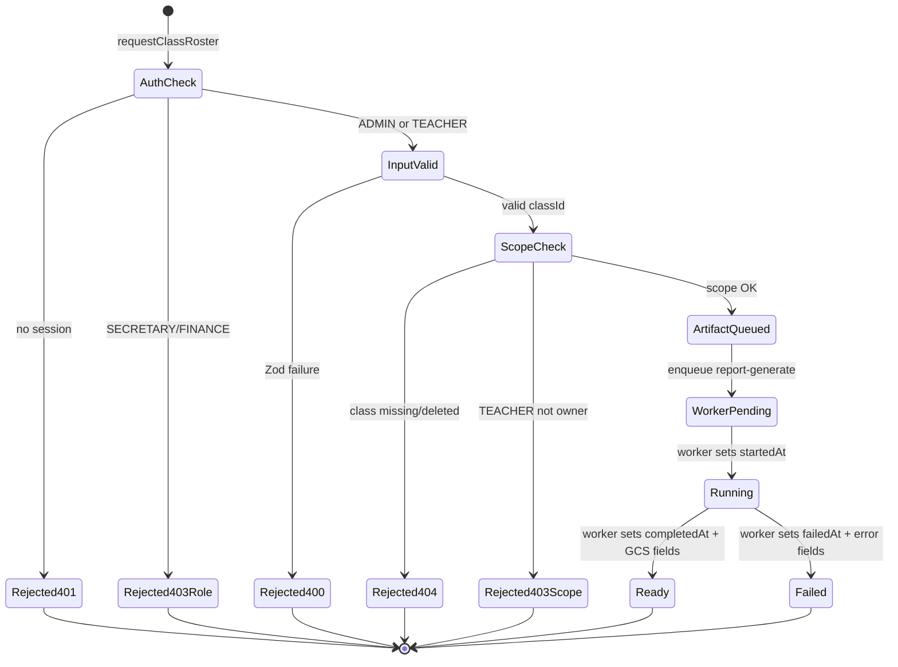
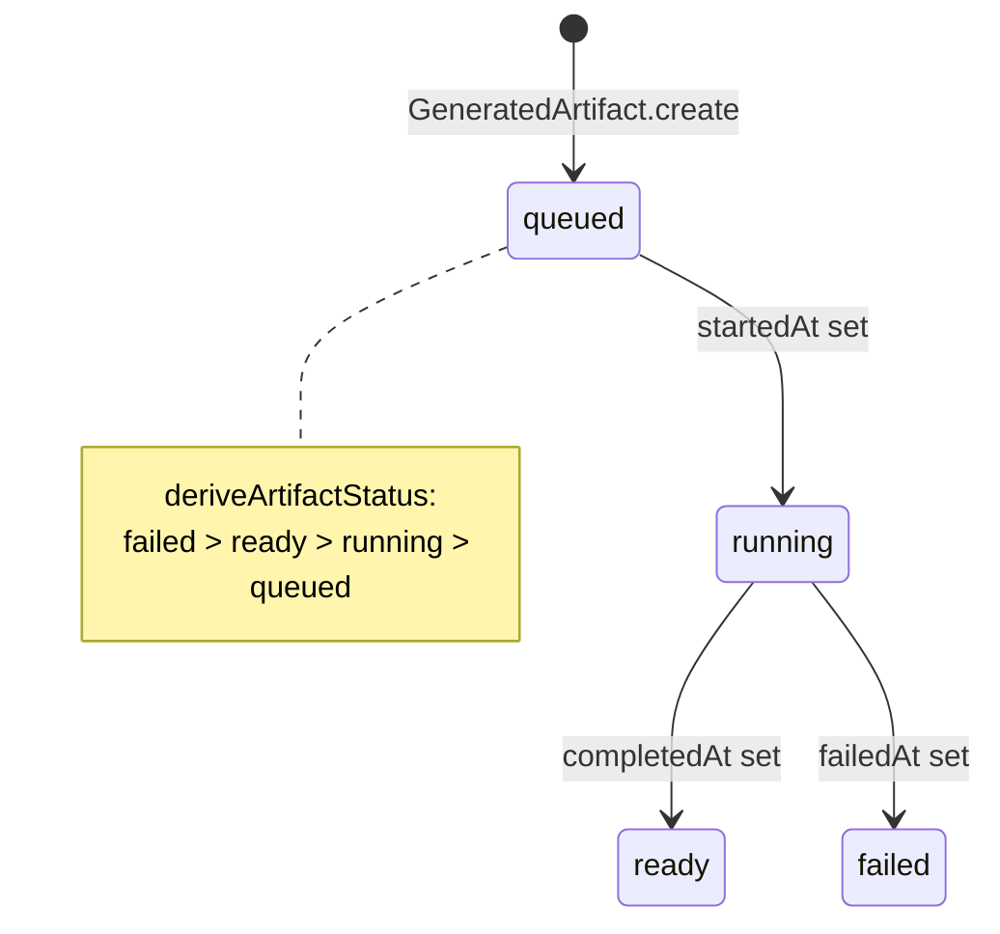
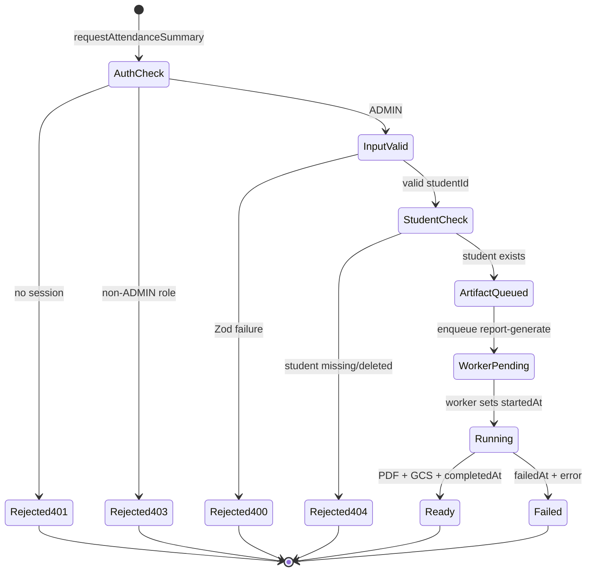
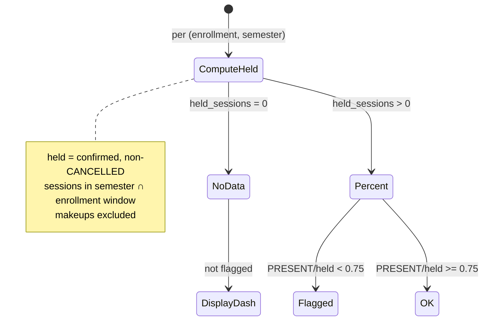

# PAIR-20 — Reports class roster and attendance summary

Analysis of `reports.requestClassRoster` and `reports.requestAttendanceSummary` only.

---

## `reports.requestClassRoster`

- **Type:** mutation
- **Auth:** `staffProcedure` (requires authenticated, enabled staff with role `ADMIN` or `TEACHER`; `SECRETARY`/`FINANCE` denied with `FORBIDDEN`, anonymous with `UNAUTHORIZED`)
- **Input schema:** `requestClassRosterInputSchema`
  - `classId`: required UUID (`"Identificador de turma invalido."`)
  - `semesterId`: optional UUID (`"Identificador de semestre invalido."`) — **accepted by Zod but not passed to the service or stored on the artifact** (implementation gap vs PRD “current semester” / explicit semester selection)
  - `.strict()` — unknown keys rejected
- **Entities touched:**
  - `Class` (read): `id`, `teacherId`, `deletedAt` — scope and existence checks
  - `GeneratedArtifact` (create): `kind` = `CLASS_ROSTER_PDF`, `requestedById`, `requestedAt`, `classId`
  - Hatchet enqueue via `report-generate` job contract (no DB row; returns `jobId`)

### State preconditions

- Caller is authenticated, enabled staff with role `ADMIN` or `TEACHER`.
- `Class` row with `classId` exists and `deletedAt IS NULL`.
- For `TEACHER`: `Class.teacherId === ctx.staffUser.id` (enforced before artifact creation).
- For `ADMIN`: any non-deleted class is allowed.
- No requirement on class `status` (`ARCHIVED` classes are still requestable), enrollment count, or session generation state at the API layer.

### Scenarios

| ID    | Scenario                        | Given (state)                                      | Input                       | Expected outcome                                         | HTTP/tRPC error (if any)               | Post-state                                                                                                                                             |
| ----- | ------------------------------- | -------------------------------------------------- | --------------------------- | -------------------------------------------------------- | -------------------------------------- | ------------------------------------------------------------------------------------------------------------------------------------------------------ |
| R-S1  | Happy path — teacher owns class | TEACHER; class exists with `teacherId = caller.id` | `{ classId }`               | `{ artifactId, jobId }`                                  | —                                      | `GeneratedArtifact` row: `kind=CLASS_ROSTER_PDF`, `classId`, `requestedById=teacher`, timestamps null except `requestedAt`; `report-generate` enqueued |
| R-S2  | Happy path — admin any class    | ADMIN; non-deleted class exists                    | `{ classId }`               | `{ artifactId, jobId }`                                  | —                                      | Same artifact shape; no teacher scope check                                                                                                            |
| R-S3  | RBAC — teacher not owner        | TEACHER; class owned by another teacher            | `{ classId }`               | Rejected in scope guard                                  | `FORBIDDEN` (403)                      | No artifact, no job                                                                                                                                    |
| R-S4  | RBAC — SECRETARY/FINANCE denied | SECRETARY or FINANCE caller                        | `{ classId }`               | Rejected at gate                                         | `FORBIDDEN` (403)                      | No DB writes                                                                                                                                           |
| R-S5  | RBAC — anonymous denied         | No session (`staffUser: null`)                     | `{ classId }`               | Rejected at gate                                         | `UNAUTHORIZED` (401)                   | No DB writes                                                                                                                                           |
| R-S6  | Validation — invalid classId    | ADMIN                                              | `{ classId: "not-a-uuid" }` | Rejected at input parse                                  | `BAD_REQUEST` (Zod UUID)               | No DB writes                                                                                                                                           |
| R-S7  | Validation — unknown field      | ADMIN                                              | `{ classId, extra: true }`  | Rejected at input parse                                  | `BAD_REQUEST` (strict)                 | No DB writes                                                                                                                                           |
| R-S8  | Domain — class not found        | ADMIN; no class for UUID                           | `{ classId: random uuid }`  | Rejected in scope/existence                              | `NOT_FOUND`: `"Turma nao encontrada."` | Transaction rolled back                                                                                                                                |
| R-S9  | Domain — soft-deleted class     | ADMIN; class with `deletedAt` set                  | `{ classId }`               | Rejected (treated as missing)                            | `NOT_FOUND`: `"Turma nao encontrada."` | No artifact                                                                                                                                            |
| R-S10 | Edge — archived class           | ADMIN; class `status=ARCHIVED`, `deletedAt=null`   | `{ classId }`               | Success (status not checked)                             | —                                      | Artifact created; worker may produce roster from historical enrollments                                                                                |
| R-S11 | Edge — empty roster             | ADMIN; class with zero enrollments                 | `{ classId }`               | Success                                                  | —                                      | Artifact queued; PDF content is worker responsibility                                                                                                  |
| R-S12 | Edge — semesterId ignored       | ADMIN; valid class + valid `semesterId`            | `{ classId, semesterId }`   | Success; `semesterId` has no effect on DB row or payload | —                                      | Artifact has only `classId`; worker must infer semester from `Class.semesterId`                                                                        |
| R-S13 | Edge — repeat requests          | ADMIN; same class                                  | two identical calls         | Both succeed independently                               | —                                      | Two artifact rows, two jobs (no deduplication)                                                                                                         |

### State transitions (flow nodes)

Artifact lifecycle (shared with all report kinds):

### Outbound edges

| Target                             | Condition                                                                         |
| ---------------------------------- | --------------------------------------------------------------------------------- |
| `reports.getArtifact`              | Poll `{ id: artifactId }`; TEACHER may read only own `CLASS_ROSTER_PDF` artifacts |
| `report-generate` (Hatchet worker) | Always enqueued with `{ artifactId }`; worker stub in GRE-53                      |
| `classes.*` / enrollment data      | Worker reads enrollments for roster PDF (not enforced at request time)            |
| GCS signed URL download            | After worker sets `storageBucket`/`storageObject` (future UI path)                |

### Evidence

- `packages/api/src/reports/router.ts` — procedure wiring, `$transaction`, scope call order
- `packages/api/src/reports/request-artifact.ts` — `requestReportArtifact`, `assertClassExists`
- `packages/api/src/reports/get-artifact.ts` — `assertClassRosterScope`, `assertArtifactAccess`
- `packages/api/src/reports/errors.ts` — `reportNotFound`, `reportForbidden`
- `packages/validators/src/reports.ts` — `requestClassRosterInputSchema`, `reportRequestResultSchema`
- `packages/api/src/trpc/init.ts` — `staffProcedure` gate
- `packages/api/src/trpc/rbac.ts` — `assertResourceScope`, TEACHER `reports: scoped`
- `packages/job-contracts/src/index.ts` — `enqueueReportGenerate`, `REPORT_GENERATE_WORKFLOW`
- `packages/db/prisma/schema.prisma` — `GeneratedArtifact`, `Class`
- `packages/worker-handlers/src/reports/process-report-generate.ts` — stub worker (no PDF yet)
- Tests:
  - `packages/api/test/db/reports.test.ts` — R-S1 (`teacherRequestsOwnedRoster`)
  - `packages/api/test/rbac.test.ts` — TEACHER `reports: scoped`
- DB validation: not run (no filtered test for denied/non-owned roster scenarios)

---

## `reports.requestAttendanceSummary`

- **Type:** mutation
- **Auth:** `adminProcedure` (requires authenticated, enabled staff with role `ADMIN` only; `TEACHER`/`SECRETARY`/`FINANCE` denied with `FORBIDDEN`, anonymous with `UNAUTHORIZED`)
- **Input schema:** `requestAttendanceSummaryInputSchema`
  - `studentId`: required UUID (`"Identificador de aluno invalido."`)
  - `semesterId`: optional UUID — **accepted by Zod but not passed to the service or stored on the artifact** (implementation gap vs PRD per-`(enrollment, semester)` scope)
  - `.strict()` — unknown keys rejected
- **Entities touched:**
  - `Student` (read): `id`, `deletedAt` — existence check
  - `GeneratedArtifact` (create): `kind` = `ATTENDANCE_SUMMARY_PDF`, `requestedById`, `requestedAt`, `studentId`
  - Hatchet enqueue via `report-generate` job contract

### State preconditions

- Caller is authenticated, enabled staff with role `ADMIN`.
- `Student` row with `studentId` exists and `deletedAt IS NULL`.
- No API-layer checks on enrollments, attendance records, semester windows, or `%` formula preconditions (all deferred to worker / future reads).

### Scenarios

| ID    | Scenario                              | Given (state)                                                   | Input                         | Expected outcome                | HTTP/tRPC error (if any)                                               | Post-state                                                                                           |
| ----- | ------------------------------------- | --------------------------------------------------------------- | ----------------------------- | ------------------------------- | ---------------------------------------------------------------------- | ---------------------------------------------------------------------------------------------------- |
| A-S1  | Happy path — admin                    | ADMIN; non-deleted student exists                               | `{ studentId }`               | `{ artifactId, jobId }`         | —                                                                      | `GeneratedArtifact`: `kind=ATTENDANCE_SUMMARY_PDF`, `studentId`, `requestedById=admin`; job enqueued |
| A-S2  | RBAC — TEACHER denied                 | TEACHER caller                                                  | `{ studentId }`               | Rejected at gate                | `FORBIDDEN` (403)                                                      | No DB writes                                                                                         |
| A-S3  | RBAC — SECRETARY/FINANCE denied       | SECRETARY or FINANCE caller                                     | `{ studentId }`               | Rejected at gate                | `FORBIDDEN` (403)                                                      | No DB writes                                                                                         |
| A-S4  | RBAC — anonymous denied               | No session                                                      | `{ studentId }`               | Rejected at gate                | `UNAUTHORIZED` (401)                                                   | No DB writes                                                                                         |
| A-S5  | Validation — invalid studentId        | ADMIN                                                           | `{ studentId: "bad" }`        | Rejected at input parse         | `BAD_REQUEST` (Zod UUID)                                               | No DB writes                                                                                         |
| A-S6  | Validation — unknown field            | ADMIN                                                           | `{ studentId, foo: 1 }`       | Rejected at input parse         | `BAD_REQUEST` (strict)                                                 | No DB writes                                                                                         |
| A-S7  | Domain — student not found            | ADMIN; no student for UUID                                      | random `studentId`            | Rejected in service             | `NOT_FOUND`: `"Aluno nao encontrado."`                                 | Transaction rolled back                                                                              |
| A-S8  | Domain — soft-deleted student         | ADMIN; student with `deletedAt` set                             | `{ studentId }`               | Rejected                        | `NOT_FOUND`: `"Aluno nao encontrado."`                                 | No artifact                                                                                          |
| A-S9  | Edge — no enrollments / no attendance | ADMIN; student with zero enrollments or zero confirmed sessions | `{ studentId }`               | Success at API layer            | —                                                                      | Artifact queued; PRD expects “— / sem dados” in PDF (worker)                                         |
| A-S10 | Edge — semesterId ignored             | ADMIN; student + valid `semesterId`                             | `{ studentId, semesterId }`   | Success; semester not persisted | —                                                                      | Artifact has only `studentId`; worker must derive semester(s)                                        |
| A-S11 | Edge — inactive student               | ADMIN; student `status=INACTIVE`, `deletedAt=null`              | `{ studentId }`               | Success (status not checked)    | —                                                                      | Artifact created                                                                                     |
| A-S12 | Edge — repeat requests                | ADMIN; same student                                             | two calls                     | Both succeed                    | —                                                                      | Two artifacts, two jobs                                                                              |
| A-S13 | getArtifact — TEACHER blocked         | TEACHER; artifact from A-S1 exists                              | `reports.getArtifact({ id })` | Rejected in access guard        | `FORBIDDEN`: `"Voce nao tem permissao para solicitar este relatorio."` | Artifact unchanged                                                                                   |

### State transitions (flow nodes)

PRD attendance formula (worker-side; not validated at request):

### Outbound edges

| Target                                         | Condition                                                             |
| ---------------------------------------------- | --------------------------------------------------------------------- |
| `reports.getArtifact`                          | ADMIN polls status; TEACHER denied for `ATTENDANCE_SUMMARY_PDF`       |
| `report-generate` (Hatchet worker)             | Always enqueued with `{ artifactId }`                                 |
| `students.*` / `attendance.*` / `enrollment.*` | Worker reads attendance aggregates (not gated at request)             |
| Student profile UI (S-REP-4)                   | Profile section shows summary; PDF download uses this mutation + poll |

### Evidence

- `packages/api/src/reports/router.ts` — `adminProcedure`, no scope helper (unlike roster)
- `packages/api/src/reports/request-artifact.ts` — `assertStudentExists`, artifact create
- `packages/api/src/reports/get-artifact.ts` — TEACHER forbidden for non-`CLASS_ROSTER_PDF` kinds
- `packages/validators/src/reports.ts` — `requestAttendanceSummaryInputSchema`
- `packages/api/src/trpc/init.ts` — `adminProcedure` gate
- `docs/MVP/PRD.md` — S-REP-4 formula, flag threshold, empty denominator
- `packages/worker-handlers/src/reports/process-report-generate.ts` — stub only
- Tests: **no dedicated db/behavior test** for this procedure (unlike roster and student statement)
- DB validation: not run

---

## Cross-endpoint edges (this pair only)

| From                                      | To                                 | Condition                                                                                  |
| ----------------------------------------- | ---------------------------------- | ------------------------------------------------------------------------------------------ |
| `reports.requestClassRoster`              | `reports.getArtifact`              | Client polls `artifactId`; TEACHER limited to own-class `CLASS_ROSTER_PDF`                 |
| `reports.requestAttendanceSummary`        | `reports.getArtifact`              | ADMIN polls; TEACHER cannot retrieve result                                                |
| `reports.requestClassRoster`              | `report-generate` job              | Always after artifact insert                                                               |
| `reports.requestAttendanceSummary`        | `report-generate` job              | Always after artifact insert                                                               |
| `classes.create` / seed                   | `reports.requestClassRoster`       | Class must exist; teacher scope ties to `Class.teacherId`                                  |
| `students.create` / import                | `reports.requestAttendanceSummary` | Student must exist                                                                         |
| `attendance.confirm` / session generation | `reports.requestAttendanceSummary` | No API precondition; PDF quality depends on confirmed sessions (PRD)                       |
| `reports.requestClassRoster`              | `reports.requestAttendanceSummary` | Independent; same student may appear on roster PDF and have separate summary PDF           |
| `reports.requestClassRoster`              | `reports.requestStudentStatement`  | Shared `requestReportArtifact` helper and artifact lifecycle; different RBAC and FK fields |
