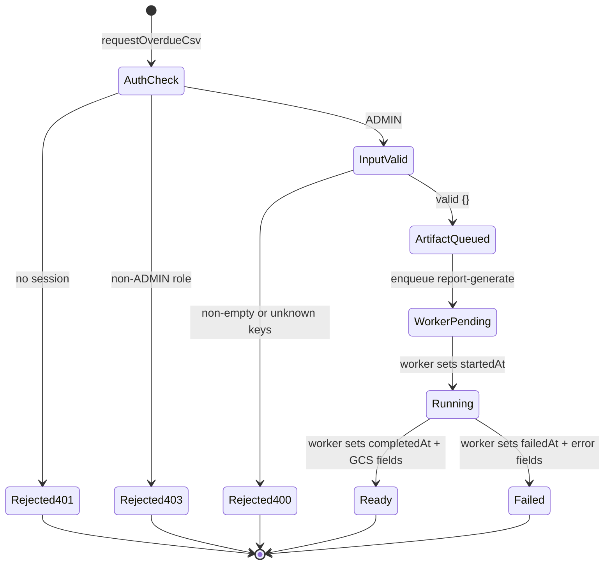
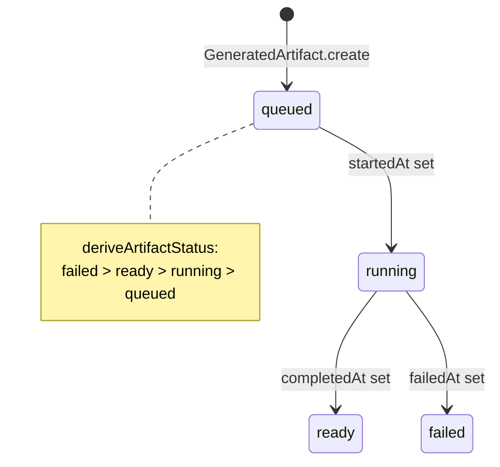
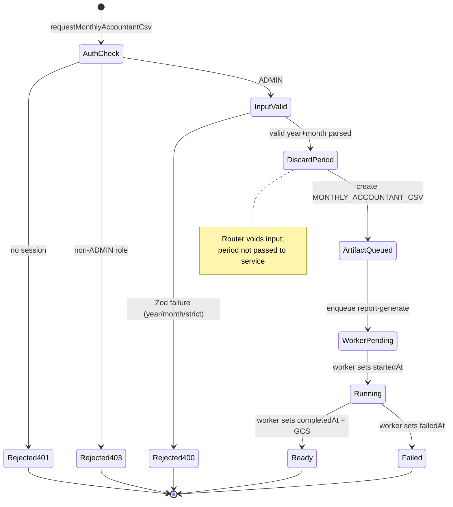

# PAIR-21 — Reports overdue and monthly accountant CSV

Analysis of `reports.requestOverdueCsv` and `reports.requestMonthlyAccountantCsv` only.

---

## `reports.requestOverdueCsv`

- **Type:** mutation
- **Auth:** `adminProcedure` (requires authenticated, enabled staff with role `ADMIN` only; `TEACHER`/`SECRETARY`/`FINANCE` denied with `FORBIDDEN`, anonymous with `UNAUTHORIZED`)
- **Input schema:** `requestOverdueCsvInputSchema`
  - Empty object `{}` only
  - `.strict()` — unknown keys rejected
- **Entities touched:**
  - `GeneratedArtifact` (create): `kind` = `OVERDUE_RECEIVABLES_CSV`, `requestedById`, `requestedAt` (no `studentId`, `classId`, or `orderId`)
  - Hatchet enqueue via `report-generate` job contract (payload `{ artifactId }` only; no DB row for the job)

### State preconditions

- Caller is authenticated, enabled staff with role `ADMIN`.
- No receivables or installment state is required at the API layer; an empty overdue population still succeeds.
- No existence checks on students, orders, or classes (unlike statement/roster/attendance report requests).
- PRD/worker expectation (not enforced at request time): CSV rows mirror `finance.overdueList` — collectible installments with derived `OVERDUE` status, excluding cancelled orders and waived installments (`docs/MVP/TECHNICAL_SPEC.md` §7.2).

### Scenarios

| ID    | Scenario                                       | Given (state)                                                                                     | Input                                     | Expected outcome                                             | HTTP/tRPC error (if any)                                               | Post-state                                                                                                                                                                 |
| ----- | ---------------------------------------------- | ------------------------------------------------------------------------------------------------- | ----------------------------------------- | ------------------------------------------------------------ | ---------------------------------------------------------------------- | -------------------------------------------------------------------------------------------------------------------------------------------------------------------------- |
| O-S1  | Happy path — artifact queued                   | ADMIN caller                                                                                      | `{}`                                      | `{ artifactId, jobId }`                                      | —                                                                      | `GeneratedArtifact`: `kind=OVERDUE_RECEIVABLES_CSV`, `requestedById=admin`, `requestedAt` set, lifecycle timestamps null; `report-generate` enqueued with `{ artifactId }` |
| O-S2  | Happy path — empty overdue universe            | ADMIN; no collectible overdue installments                                                        | `{}`                                      | `{ artifactId, jobId }`                                      | —                                                                      | Artifact created; worker should emit empty CSV (worker responsibility)                                                                                                     |
| O-S3  | Happy path — populated overdue universe        | ADMIN; active orders with collectible overdue installments (same filter as `finance.overdueList`) | `{}`                                      | `{ artifactId, jobId }`                                      | —                                                                      | Artifact queued; worker reads receivables and writes CSV to GCS                                                                                                            |
| O-S4  | RBAC — TEACHER denied                          | TEACHER caller                                                                                    | `{}`                                      | Rejected at gate                                             | `FORBIDDEN` (403)                                                      | No DB writes                                                                                                                                                               |
| O-S5  | RBAC — SECRETARY/FINANCE denied                | SECRETARY or FINANCE caller                                                                       | `{}`                                      | Rejected at gate                                             | `FORBIDDEN` (403)                                                      | No DB writes                                                                                                                                                               |
| O-S6  | RBAC — anonymous denied                        | No session (`staffUser: null`)                                                                    | `{}`                                      | Rejected at gate                                             | `UNAUTHORIZED` (401)                                                   | No DB writes                                                                                                                                                               |
| O-S7  | Validation — unknown field                     | ADMIN                                                                                             | `{ extra: true }`                         | Rejected at input parse                                      | `BAD_REQUEST` (strict)                                                 | No DB writes                                                                                                                                                               |
| O-S8  | Edge — repeat requests                         | ADMIN                                                                                             | two identical calls                       | Both succeed independently                                   | —                                                                      | Two artifact rows, two jobs (no deduplication)                                                                                                                             |
| O-S9  | Edge — cancelled/waived excluded at generation | ADMIN; mix of collectible overdue, cancelled-order, and waived installments                       | `{}`                                      | Success at API layer                                         | —                                                                      | Worker excludes non-collectible rows per §7.2 / `finance.overdueList` rules                                                                                                |
| O-S10 | getArtifact — ADMIN poll                       | ADMIN; artifact from O-S1                                                                         | `reports.getArtifact({ id: artifactId })` | `{ status: "queued", kind: "OVERDUE_RECEIVABLES_CSV", ... }` | —                                                                      | Read-only; status derived from timestamps                                                                                                                                  |
| O-S11 | getArtifact — TEACHER blocked                  | TEACHER; overdue CSV artifact exists                                                              | `reports.getArtifact({ id })`             | Rejected in access guard                                     | `FORBIDDEN`: `"Voce nao tem permissao para solicitar este relatorio."` | Artifact unchanged                                                                                                                                                         |

### State transitions (flow nodes)

Artifact lifecycle (shared with all report kinds):

### Outbound edges

| Target                                                 | Condition                                                                                   |
| ------------------------------------------------------ | ------------------------------------------------------------------------------------------- |
| `reports.getArtifact`                                  | Poll `{ id: artifactId }`; ADMIN only for `OVERDUE_RECEIVABLES_CSV` (TEACHER denied)        |
| `report-generate` (Hatchet worker)                     | Always enqueued with `{ artifactId }`; worker reads `artifact.kind` and queries receivables |
| `finance.overdueList`                                  | Parallel synchronous view of the same overdue population (UI table before/after export)     |
| `finance.registerPayment` / `finance.waiveInstallment` | Staff actions that shrink overdue population between list view and worker completion        |
| GCS signed URL download                                | After worker sets `storageBucket`/`storageObject` (future UI path)                          |

### Evidence

- `packages/api/src/reports/router.ts` — `adminProcedure`, empty input, `$transaction`
- `packages/api/src/reports/request-artifact.ts` — `requestReportArtifact` (no student/class branch for this kind)
- `packages/api/src/reports/get-artifact.ts` — `assertArtifactAccess` (ADMIN-only for non-roster kinds)
- `packages/api/src/reports/errors.ts` — `reportForbidden`
- `packages/validators/src/reports.ts` — `requestOverdueCsvInputSchema`, `reportRequestResultSchema`
- `packages/api/src/trpc/init.ts` — `adminProcedure` gate
- `packages/job-contracts/src/index.ts` — `enqueueReportGenerate`, `reportGeneratePayloadSchema` (`artifactId` only)
- `packages/db/prisma/schema.prisma` — `GeneratedArtifact`, `ArtifactKind`
- `packages/worker-handlers/src/reports/process-report-generate.ts` — stub worker (no CSV builder yet)
- `docs/MVP/PRD.md` — `S-REP-1` (columns, async via `report-generate`)
- `docs/MVP/TECHNICAL_SPEC.md` — §7.2 overdue CSV definition; cancelled-order exclusion
- Tests:
  - `packages/api/test/db/reports.test.ts` — O-S1 (`requestOverdueCsv`), O-S4 (`teacherDeniedOverdueCsv`)
- DB validation: not run

---

## `reports.requestMonthlyAccountantCsv`

- **Type:** mutation
- **Auth:** `adminProcedure` (requires authenticated, enabled staff with role `ADMIN` only; `TEACHER`/`SECRETARY`/`FINANCE` denied with `FORBIDDEN`, anonymous with `UNAUTHORIZED`)
- **Input schema:** `requestMonthlyAccountantCsvInputSchema`
  - `year`: required integer 2000–2100 (`"Ano invalido."`)
  - `month`: required integer 1–12 (`"Mes invalido."`)
  - `.strict()` — unknown keys rejected
- **Entities touched:**
  - `GeneratedArtifact` (create): `kind` = `MONTHLY_ACCOUNTANT_CSV`, `requestedById`, `requestedAt` (no period fields on the model)
  - Hatchet enqueue via `report-generate` job contract (payload `{ artifactId }` only)

### State preconditions

- Caller is authenticated, enabled staff with role `ADMIN`.
- No payment, waiver, or calendar state is required at the API layer; an empty month still succeeds at request time.
- **Implementation gap:** Router validates `year`/`month` then discards them (`void input` in `router.ts`). Neither `requestReportArtifact` nor `GeneratedArtifact` nor the job payload stores the requested period. Worker cannot know which month to close unless it infers from `requestedAt` or the schema is extended — misaligned with PRD `S-REP-2` (“month-close CSV” for a chosen month).

### Scenarios

| ID    | Scenario                          | Given (state)                                                             | Input                                      | Expected outcome                                       | HTTP/tRPC error (if any)         | Post-state                                                                                                            |
| ----- | --------------------------------- | ------------------------------------------------------------------------- | ------------------------------------------ | ------------------------------------------------------ | -------------------------------- | --------------------------------------------------------------------------------------------------------------------- |
| M-S1  | Happy path — artifact queued      | ADMIN caller                                                              | `{ year: 2026, month: 3 }`                 | `{ artifactId, jobId }`                                | —                                | `GeneratedArtifact`: `kind=MONTHLY_ACCOUNTANT_CSV`, `requestedById=admin`; job enqueued; **year/month not persisted** |
| M-S2  | Happy path — empty month          | ADMIN; no payment entries or waivers in requested month                   | `{ year, month }`                          | `{ artifactId, jobId }`                                | —                                | Artifact queued; worker should emit empty/minimal CSV                                                                 |
| M-S3  | Happy path — populated month      | ADMIN; payments with allocations and waivers in requested São Paulo month | `{ year, month }`                          | `{ artifactId, jobId }`                                | —                                | Worker should include payment entries + allocations + waivers; expenses excluded (§7.2)                               |
| M-S4  | RBAC — TEACHER denied             | TEACHER caller                                                            | `{ year: 2026, month: 1 }`                 | Rejected at gate                                       | `FORBIDDEN` (403)                | No DB writes                                                                                                          |
| M-S5  | RBAC — SECRETARY/FINANCE denied   | SECRETARY or FINANCE caller                                               | `{ year, month }`                          | Rejected at gate                                       | `FORBIDDEN` (403)                | No DB writes                                                                                                          |
| M-S6  | RBAC — anonymous denied           | No session                                                                | `{ year, month }`                          | Rejected at gate                                       | `UNAUTHORIZED` (401)             | No DB writes                                                                                                          |
| M-S7  | Validation — missing year         | ADMIN                                                                     | `{ month: 3 }`                             | Rejected at input parse                                | `BAD_REQUEST` (Zod required)     | No DB writes                                                                                                          |
| M-S8  | Validation — missing month        | ADMIN                                                                     | `{ year: 2026 }`                           | Rejected at input parse                                | `BAD_REQUEST` (Zod required)     | No DB writes                                                                                                          |
| M-S9  | Validation — month out of range   | ADMIN                                                                     | `{ year: 2026, month: 0 }` or `month: 13`  | Rejected at input parse                                | `BAD_REQUEST`: `"Mes invalido."` | No DB writes                                                                                                          |
| M-S10 | Validation — year out of range    | ADMIN                                                                     | `{ year: 1999, month: 1 }`                 | Rejected at input parse                                | `BAD_REQUEST`: `"Ano invalido."` | No DB writes                                                                                                          |
| M-S11 | Validation — non-integer month    | ADMIN                                                                     | `{ year: 2026, month: 1.5 }`               | Rejected at input parse                                | `BAD_REQUEST`: `"Mes invalido."` | No DB writes                                                                                                          |
| M-S12 | Validation — unknown field        | ADMIN                                                                     | `{ year, month, foo: 1 }`                  | Rejected at input parse                                | `BAD_REQUEST` (strict)           | No DB writes                                                                                                          |
| M-S13 | Edge — future month               | ADMIN; month after current São Paulo month                                | `{ year, month }`                          | Success at API layer                                   | —                                | Artifact queued; worker may produce empty ledger (no forward-dated payments)                                          |
| M-S14 | Edge — repeat requests same month | ADMIN                                                                     | two calls with identical `{ year, month }` | Both succeed                                           | —                                | Two artifacts; no deduplication; period still not stored                                                              |
| M-S15 | Implementation gap — period lost  | ADMIN; valid input                                                        | `{ year: 2025, month: 12 }`                | Success but period discarded                           | —                                | DB row has no `year`/`month`; job payload has only `artifactId`                                                       |
| M-S16 | getArtifact — ADMIN poll          | ADMIN; artifact from M-S1                                                 | `reports.getArtifact({ id })`              | `{ status: "queued", kind: "MONTHLY_ACCOUNTANT_CSV" }` | —                                | Read-only                                                                                                             |
| M-S17 | getArtifact — TEACHER blocked     | TEACHER; monthly CSV artifact exists                                      | `reports.getArtifact({ id })`              | Rejected                                               | `FORBIDDEN`                      | Artifact unchanged                                                                                                    |

### State transitions (flow nodes)

### Outbound edges

| Target                                                | Condition                                                                                                                          |
| ----------------------------------------------------- | ---------------------------------------------------------------------------------------------------------------------------------- |
| `reports.getArtifact`                                 | Poll `{ id: artifactId }`; ADMIN only                                                                                              |
| `report-generate` (Hatchet worker)                    | Enqueued with `{ artifactId }`; worker must load payments/allocations/waivers for target month (period source TBD given M-S15 gap) |
| `finance.registerPayment` / `finance.allocatePayment` | Source rows for payment entries in month                                                                                           |
| `finance.waiveInstallment`                            | Source rows for waivers in month                                                                                                   |
| GCS signed URL download                               | After worker completion                                                                                                            |

### Evidence

- `packages/api/src/reports/router.ts` — `void input` discards `year`/`month`
- `packages/api/src/reports/request-artifact.ts` — no period parameters on `requestReportArtifact`
- `packages/api/src/reports/get-artifact.ts` — ADMIN-only access for this kind
- `packages/validators/src/reports.ts` — `requestMonthlyAccountantCsvInputSchema`, `reportMonthSchema`
- `packages/validators/src/calendar.ts` — `calendarYearSchema` (2000–2100)
- `packages/job-contracts/src/index.ts` — payload schema (`artifactId` only)
- `packages/db/prisma/schema.prisma` — `GeneratedArtifact` (no year/month columns)
- `packages/worker-handlers/src/reports/process-report-generate.ts` — stub
- `docs/MVP/PRD.md` — `S-REP-2` (payments + waivers in month; expenses excluded)
- `docs/MVP/TECHNICAL_SPEC.md` — §7.2 monthly accountant CSV definition
- Tests: **none** for `requestMonthlyAccountantCsv` (inferred from O-S4 pattern for RBAC; no happy-path DB test)
- DB validation: not run

---

## Cross-endpoint edges (this pair only)

| From                                  | To                                    | Condition                                                                             |
| ------------------------------------- | ------------------------------------- | ------------------------------------------------------------------------------------- |
| `finance.overdueList`                 | `reports.requestOverdueCsv`           | Staff exports the same overdue population shown in the finance table (async bulk CSV) |
| `reports.requestOverdueCsv`           | `reports.getArtifact`                 | Poll artifact status until `ready` or `failed` (ADMIN only)                           |
| `reports.requestOverdueCsv`           | `report-generate`                     | Every successful request enqueues worker with `{ artifactId }`                        |
| `finance.registerPayment`             | `reports.requestOverdueCsv`           | Payment reduces overdue rows; subsequent export reflects new state                    |
| `finance.waiveInstallment`            | `reports.requestOverdueCsv`           | Waiver removes installment from collectible overdue set                               |
| `reports.requestMonthlyAccountantCsv` | `reports.getArtifact`                 | Poll monthly CSV artifact (ADMIN only)                                                |
| `reports.requestMonthlyAccountantCsv` | `report-generate`                     | Every successful request enqueues worker                                              |
| `finance.registerPayment`             | `reports.requestMonthlyAccountantCsv` | Payment entries in selected month appear in accountant CSV (worker)                   |
| `finance.waiveInstallment`            | `reports.requestMonthlyAccountantCsv` | Waivers in selected month appear in accountant CSV (worker)                           |
| `reports.requestOverdueCsv`           | `reports.requestMonthlyAccountantCsv` | Independent admin report requests; no shared artifact or ordering constraint          |
