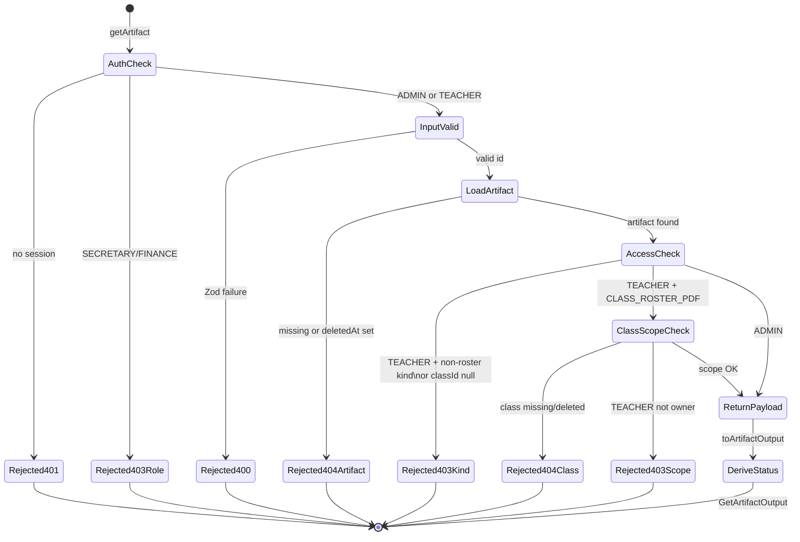
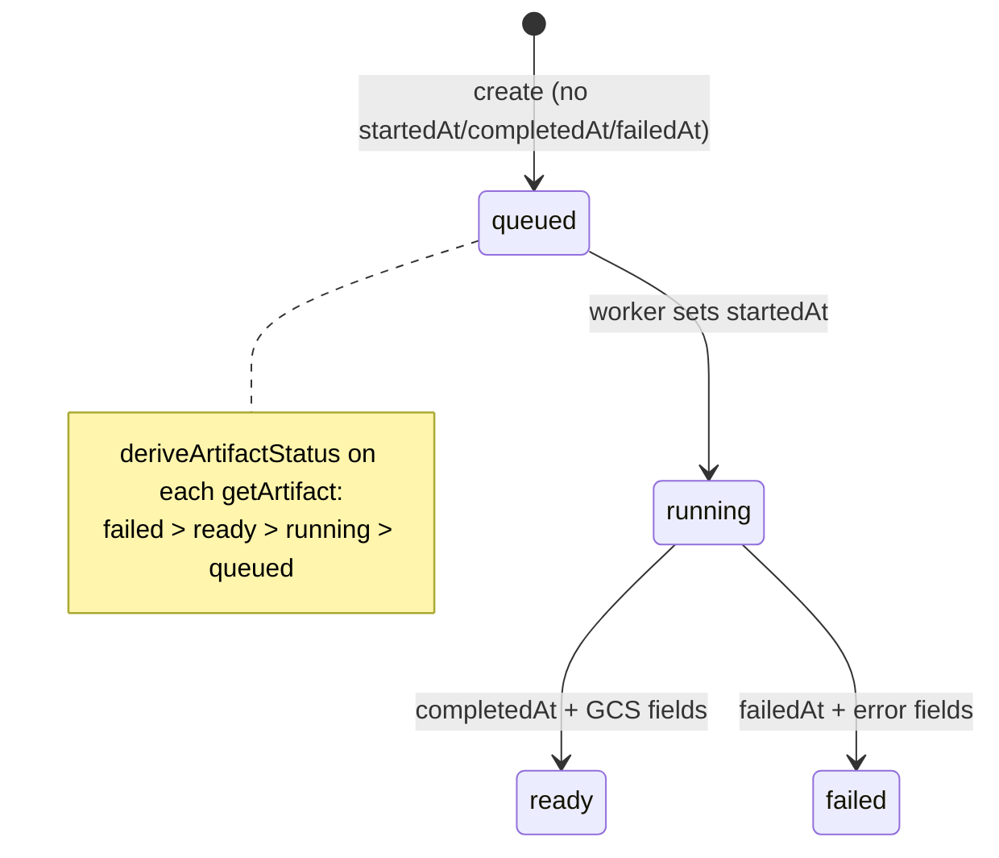
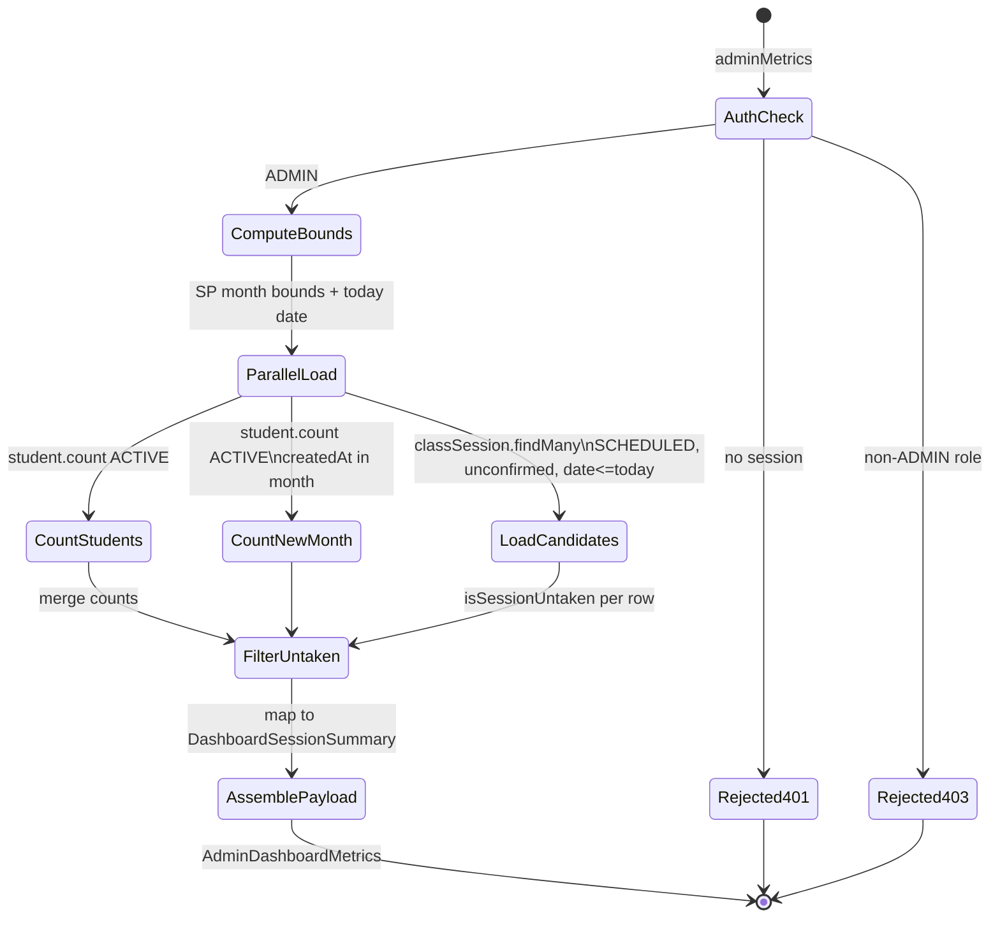
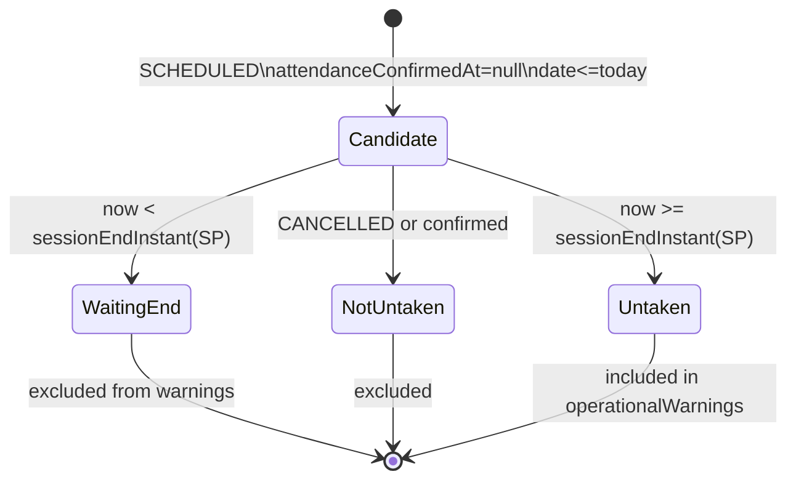

# PAIR-22 — `reports.getArtifact` + `dashboard.adminMetrics`

Poll/read path for generated report artifacts paired with the admin landing metrics query. `reports.getArtifact` is on `main`; `dashboard.adminMetrics` ships in GRE-64 / PR #41 (not yet merged to `main` at analysis time).

---

## `reports.getArtifact`

- **Type:** query
- **Auth:** `staffProcedure` (authenticated, enabled staff with role `ADMIN` or `TEACHER`; `SECRETARY`/`FINANCE` denied with `FORBIDDEN`, anonymous with `UNAUTHORIZED`)
- **Input schema:** `getArtifactInputSchema`
  - `id`: required UUID (`"Identificador de artefato invalido."`)
  - `.strict()` — unknown keys rejected
- **Entities touched:**
  - `GeneratedArtifact` (read): all output fields; filtered by `id` + `deletedAt IS NULL`
  - `Class` (read, conditional): `id`, `teacherId`, `deletedAt` — only when caller is `TEACHER` and artifact is `CLASS_ROSTER_PDF` with non-null `classId`
  - No writes

### State preconditions

- Caller is authenticated, enabled staff with role `ADMIN` or `TEACHER`.
- **Artifact exists:** `GeneratedArtifact` row for `id` with `deletedAt IS NULL`.
- **RBAC — ADMIN:** may read any non-deleted artifact kind.
- **RBAC — TEACHER:** may read only artifacts where `kind = CLASS_ROSTER_PDF` **and** `classId IS NOT NULL` **and** linked `Class` exists (`deletedAt IS NULL`) **and** `Class.teacherId === ctx.staffUser.id`.
- **RBAC — TEACHER denied for:** `STUDENT_STATEMENT_PDF`, `ATTENDANCE_SUMMARY_PDF`, `OVERDUE_RECEIVABLES_CSV`, `MONTHLY_ACCOUNTANT_CSV`, `SIGNED_ORDER_PDF`, or any artifact with `classId = null`.
- Artifact lifecycle timestamps (`startedAt`, `completedAt`, `failedAt`) may be any combination; `status` is derived at read time (failed > ready > running > queued).

### Scenarios

| ID    | Scenario                                  | Given (state)                                                                                                                                   | Input                     | Expected outcome                                                      | HTTP/tRPC error (if any)                                               | Post-state            |
| ----- | ----------------------------------------- | ----------------------------------------------------------------------------------------------------------------------------------------------- | ------------------------- | --------------------------------------------------------------------- | ---------------------------------------------------------------------- | --------------------- |
| G-S1  | Happy path — admin polls queued artifact  | ADMIN; artifact from `requestStudentStatement` exists (`completedAt = null`)                                                                    | `{ id: artifactId }`      | `{ status: "queued", studentId, completedAt: null, ... }`             | —                                                                      | Unchanged (read-only) |
| G-S2  | Happy path — admin polls ready artifact   | ADMIN; artifact with `completedAt` set + GCS fields                                                                                             | `{ id }`                  | `{ status: "ready", storageBucket, storageObject, completedAt, ... }` | —                                                                      | Unchanged             |
| G-S3  | Happy path — admin polls failed artifact  | ADMIN; artifact with `failedAt` set                                                                                                             | `{ id }`                  | `{ status: "failed", errorCode, errorMessage, failedAt }`             | —                                                                      | Unchanged             |
| G-S4  | Happy path — admin polls running artifact | ADMIN; artifact with `startedAt` set, no completion/failure                                                                                     | `{ id }`                  | `{ status: "running", startedAt, completedAt: null }`                 | —                                                                      | Unchanged             |
| G-S5  | Happy path — teacher own roster           | TEACHER; `CLASS_ROSTER_PDF` for owned class                                                                                                     | `{ id }`                  | Full artifact output                                                  | —                                                                      | Unchanged             |
| G-S6  | RBAC — teacher blocked (admin-only kinds) | TEACHER; artifact `kind ∈ { STUDENT_STATEMENT_PDF, ATTENDANCE_SUMMARY_PDF, OVERDUE_RECEIVABLES_CSV, MONTHLY_ACCOUNTANT_CSV, SIGNED_ORDER_PDF }` | `{ id }`                  | Rejected in access guard                                              | `FORBIDDEN`: `"Voce nao tem permissao para solicitar este relatorio."` | Unchanged             |
| G-S7  | RBAC — teacher not class owner            | TEACHER; `CLASS_ROSTER_PDF` for another teacher's class                                                                                         | `{ id }`                  | Rejected in scope guard                                               | `FORBIDDEN` (403) (`assertResourceScope`)                              | Unchanged             |
| G-S8  | RBAC — teacher roster with null classId   | TEACHER; `CLASS_ROSTER_PDF` with `classId = null`                                                                                               | `{ id }`                  | Rejected in access guard                                              | `FORBIDDEN`: `"Voce nao tem permissao para solicitar este relatorio."` | Unchanged             |
| G-S9  | RBAC — SECRETARY/FINANCE denied           | SECRETARY or FINANCE caller                                                                                                                     | valid `id`                | Rejected at gate                                                      | `FORBIDDEN` (403)                                                      | Unchanged             |
| G-S10 | RBAC — anonymous denied                   | No session                                                                                                                                      | valid `id`                | Rejected at gate                                                      | `UNAUTHORIZED` (401)                                                   | Unchanged             |
| G-S11 | Validation — invalid id UUID              | ADMIN                                                                                                                                           | `{ id: "bad" }`           | Rejected at input parse                                               | `BAD_REQUEST` (Zod UUID)                                               | Unchanged             |
| G-S12 | Validation — extra fields                 | ADMIN                                                                                                                                           | `{ id, extra: true }`     | Rejected at input parse                                               | `BAD_REQUEST` (strict)                                                 | Unchanged             |
| G-S13 | Domain — artifact not found               | ADMIN; no row for UUID                                                                                                                          | random valid UUID         | Rejected in service                                                   | `NOT_FOUND`: `"Artefato nao encontrado."`                              | Unchanged             |
| G-S14 | Domain — soft-deleted artifact            | ADMIN; artifact with `deletedAt` set                                                                                                            | `{ id }`                  | Rejected (treated as missing)                                         | `NOT_FOUND`: `"Artefato nao encontrado."`                              | Unchanged             |
| G-S15 | Domain — class missing for teacher roster | TEACHER; `CLASS_ROSTER_PDF` with `classId` pointing to deleted/missing class                                                                    | `{ id }`                  | Rejected in scope lookup                                              | `NOT_FOUND`: `"Turma nao encontrada."`                                 | Unchanged             |
| G-S16 | Edge — HTTP adapter                       | ADMIN; artifact from HTTP `requestStudentStatement`                                                                                             | GET `reports.getArtifact` | HTTP 200; `status: "queued"`, matching `studentId`                    | —                                                                      | Unchanged             |
| G-S17 | Edge — status precedence                  | ADMIN; artifact with both `failedAt` and `completedAt` set (data anomaly)                                                                       | `{ id }`                  | `{ status: "failed" }` (`deriveArtifactStatus` prefers failed)        | —                                                                      | Unchanged             |
| G-S18 | Edge — expired artifact metadata          | ADMIN; artifact with `expiresAt` in the past but `status: "ready"`                                                                              | `{ id }`                  | Returns stored fields; no expiry enforcement at API layer             | —                                                                      | Unchanged             |

Requires prior: any `reports.request*` mutation (or direct seed) that created the `GeneratedArtifact` row; worker may later mutate timestamps/GCS fields observable on subsequent polls.

### State transitions (flow nodes)

Read-only query — no DB mutations. Observed artifact lifecycle (written by worker, not this procedure):

Worker-side artifact lifecycle (context for repeated polls):

### Outbound edges

| Target                                | Condition                                                                                     |
| ------------------------------------- | --------------------------------------------------------------------------------------------- |
| GCS download / signed URL (future UI) | Poll until `status = "ready"`; use `storageBucket` + `storageObject`                          |
| Re-poll `reports.getArtifact`         | Client polling loop while `status ∈ { queued, running }`                                      |
| `reports.request*` mutations          | Upstream creators (`requestStudentStatement`, `requestClassRoster`, etc.) supply `artifactId` |

### Evidence

- `packages/api/src/reports/router.ts` — `staffProcedure`, `$transaction`, procedure wiring
- `packages/api/src/reports/get-artifact.ts` — `getArtifact`, `assertArtifactAccess`, `assertClassRosterScope`
- `packages/api/src/reports/artifact-output.ts` — `toArtifactOutput`, `deriveArtifactStatus`
- `packages/api/src/reports/errors.ts` — `reportNotFound`, `reportForbidden`
- `packages/validators/src/reports.ts` — `getArtifactInputSchema`, `getArtifactOutputSchema`, `deriveArtifactStatus`
- `packages/api/src/trpc/init.ts` — `staffProcedure`
- `packages/api/src/trpc/rbac.ts` — `assertResourceScope`, `ROLE_MATRIX` (`reports: scoped` for TEACHER)
- `packages/db/prisma/schema.prisma` — `GeneratedArtifact`, `Class`
- Tests:
  - `packages/api/test/db/reports.test.ts` — G-S1 (`getQueuedArtifact`)
  - `packages/api/test/behavior/reports-http.test.ts` — G-S16
- Cross-referenced scenarios (not dedicated tests): G-S6/G-S7 from PAIR-20 A-S13 logic in `assertArtifactAccess`
- DB validation: not run in this analysis

---

## `dashboard.adminMetrics`

- **Type:** query
- **Auth:** `adminProcedure` (authenticated, enabled staff with role `ADMIN` only; `TEACHER`/`SECRETARY`/`FINANCE` denied with `FORBIDDEN`, anonymous with `UNAUTHORIZED`)
- **Input schema:** none (no input; `ctx.now ?? new Date()` drives SP calendar boundaries)
- **Entities touched:**
  - `Student` (read, aggregate): `status`, `createdAt` — counts for `ACTIVE` total and `newThisMonth`
  - `ClassSession` (read): `id`, `date`, `startTime`, `endTime`, `status`, `attendanceConfirmedAt`, nested `class.id`, `class.internalCode`, `class.portalClassName`
  - No writes

### State preconditions

- Caller is authenticated, enabled staff with role `ADMIN`.
- **Active student counts:** all `Student` rows with `status = ACTIVE` (no `deletedAt` filter on count — soft-deleted students remain in table but are typically excluded by status; inactive students excluded from both counts).
- **New this month:** `ACTIVE` students whose `createdAt` falls in the current `America/Sao_Paulo` calendar month (`[monthStart, nextMonthStart)` computed from `ctx.now`).
- **Untaken session candidates:** `ClassSession` where `status = SCHEDULED`, `attendanceConfirmedAt IS NULL`, `date <= today` (today = SP date-only from `ctx.now`).
- **Untaken filter (domain):** candidates further filtered by `isSessionUntaken` — session end instant (SP) must have passed relative to `ctx.now`; cancelled and confirmed sessions never count.
- No filters on `Class.status`, `Class.deletedAt`, or `ClassSession.deletedAt` in the untaken query (archived classes and soft-deleted sessions may appear if they match SQL predicates).

### Scenarios

| ID    | Scenario                             | Given (state)                                                                            | Input                        | Expected outcome                                                                                                           | HTTP/tRPC error (if any) | Post-state            |
| ----- | ------------------------------------ | ---------------------------------------------------------------------------------------- | ---------------------------- | -------------------------------------------------------------------------------------------------------------------------- | ------------------------ | --------------------- |
| A-S1  | Happy path — student counts          | ADMIN; mix of ACTIVE/INACTIVE students with known `createdAt` in/out of current SP month | (none)                       | `{ activeStudents: { total, newThisMonth } }` matching DB counts                                                           | —                        | Unchanged (read-only) |
| A-S2  | Happy path — untaken warning         | ADMIN; `now` after a past SCHEDULED session's SP end; `attendanceConfirmedAt = null`     | (none)                       | Session appears in `operationalWarnings.untakenSessions`; `totalUntakenSessions` incremented                               | —                        | Unchanged             |
| A-S3  | Untaken — confirmed session excluded | Past session with `attendanceConfirmedAt` set                                            | (none)                       | Session omitted from warnings                                                                                              | —                        | Unchanged             |
| A-S4  | Untaken — cancelled session excluded | Past session `status = CANCELLED`                                                        | (none)                       | Omitted (SQL filter + `isSessionUntaken` returns false)                                                                    | —                        | Unchanged             |
| A-S5  | Untaken — future session excluded    | Session `date > today`                                                                   | (none)                       | Not in candidate set (`date <= today` filter)                                                                              | —                        | Unchanged             |
| A-S6  | Untaken — in-progress today session  | Today's session; `now` before SP end instant                                             | (none)                       | Excluded by `isSessionUntaken` (end not yet passed)                                                                        | —                        | Unchanged             |
| A-S7  | Untaken — ordering                   | Multiple untaken sessions                                                                | (none)                       | `untakenSessions` ordered by `date desc`, then `startTime asc` (from SQL `orderBy`)                                        | —                        | Unchanged             |
| A-S8  | Edge — empty school                  | ADMIN; no students, no sessions                                                          | (none)                       | `{ activeStudents: { total: 0, newThisMonth: 0 }, operationalWarnings: { totalUntakenSessions: 0, untakenSessions: [] } }` | —                        | Unchanged             |
| A-S9  | Edge — month boundary (SP)           | Student created at SP month start vs just before next month start                        | (none)                       | `newThisMonth` includes month-start, excludes next-month-start boundary per test fixtures                                  | —                        | Unchanged             |
| A-S10 | RBAC — TEACHER denied                | TEACHER caller                                                                           | (none)                       | Rejected at gate                                                                                                           | `FORBIDDEN` (403)        | Unchanged             |
| A-S11 | RBAC — SECRETARY/FINANCE denied      | SECRETARY or FINANCE caller                                                              | (none)                       | Rejected at gate                                                                                                           | `FORBIDDEN` (403)        | Unchanged             |
| A-S12 | RBAC — anonymous denied              | No session                                                                               | (none)                       | Rejected at gate                                                                                                           | `UNAUTHORIZED` (401)     | Unchanged             |
| A-S13 | HTTP adapter                         | ADMIN; seeded data                                                                       | GET `dashboard.adminMetrics` | HTTP 200; payload shape matches tRPC caller                                                                                | —                        | Unchanged             |
| A-S14 | Deterministic clock                  | Test caller with fixed `now` (e.g. `JULY_NOW`, `AFTER_PAST_SESSION_NOW`)                 | (none)                       | Counts and untaken set stable for injected `ctx.now`                                                                       | —                        | Unchanged             |

Requires prior: `Student` rows (enrollment pipeline) and `ClassSession` rows (session generation / seed) for non-zero metrics.

### State transitions (flow nodes)

Read-only aggregation; no DB mutations.

Untaken derivation (domain gate on SQL candidates):

### Outbound edges

| Target                      | Condition                                                                          |
| --------------------------- | ---------------------------------------------------------------------------------- |
| `attendance.sessionRoster`  | Admin drills into `untakenSessions[].sessionId` to inspect roster                  |
| `attendance.confirmSession` | Untaken session → admin/teacher attendance workflow (operational remediation)      |
| `attendance.editSession`    | If session later confirmed, drops out of future `adminMetrics` polls               |
| `students.*`                | `activeStudents.total` / `newThisMonth` may prompt enrollment review (indirect UI) |
| `dashboard.teacherHome`     | Teacher counterpart (admin cannot call); complementary landing surface             |

### Evidence

- `packages/api/src/dashboard/router.ts` (GRE-64 / PR #41) — `adminProcedure`, `ctx.now` fallback
- `packages/api/src/dashboard/data.ts` — `readAdminDashboardMetrics`, `AdminDashboardMetrics`, `DashboardSessionSummary`
- `packages/api/src/root.ts` — `dashboard: dashboardRouter` (PR branch)
- `packages/api/src/trpc/init.ts` — `adminProcedure`
- `packages/api/src/trpc/rbac.ts` — `ROLE_MATRIX`: `dashboard: full` for ADMIN, `scoped` for TEACHER (teacher uses `teacherHome`, not this procedure)
- `packages/domain/src/session-status.ts` — `isSessionUntaken`
- `packages/domain` — `saoPauloDateOnly` (month/today boundaries)
- `packages/db/prisma/schema.prisma` — `Student`, `ClassSession`, `Class`
- Tests (PR branch):
  - `packages/api/test/db/dashboard.test.ts` — A-S1 (`countActiveStudents`), A-S2 (`deriveUntakenWarnings`), A-S10 (`enforceDashboardRoles`)
  - `packages/api/test/behavior/dashboard-http.test.ts` — A-S13
  - `packages/api/test/db/dashboard-test-support.ts`
- **Implementation status:** Source on branch `josiasdev1/gre-64-dashboard-router-api-admin-metrics-teacher-home` (PR #41); not on `main` at analysis time.
- DB validation: not run in this analysis

---

## Cross-endpoint edges (this pair only)

| From                                  | To                          | Condition                                                                             |
| ------------------------------------- | --------------------------- | ------------------------------------------------------------------------------------- |
| `reports.requestStudentStatement`     | `reports.getArtifact`       | ADMIN polls `{ artifactId }` after statement request                                  |
| `reports.requestClassRoster`          | `reports.getArtifact`       | TEACHER (own class) or ADMIN polls roster artifact status                             |
| `reports.requestAttendanceSummary`    | `reports.getArtifact`       | ADMIN polls; TEACHER blocked on get (G-S6)                                            |
| `reports.requestOverdueCsv`           | `reports.getArtifact`       | ADMIN polls CSV artifact                                                              |
| `reports.requestMonthlyAccountantCsv` | `reports.getArtifact`       | ADMIN polls CSV artifact                                                              |
| `report-generate` (worker)            | `reports.getArtifact`       | Worker updates artifact timestamps/GCS fields; client re-polls until `ready`/`failed` |
| `dashboard.adminMetrics`              | `attendance.sessionRoster`  | Admin selects `operationalWarnings.untakenSessions[].sessionId`                       |
| `dashboard.adminMetrics`              | `attendance.confirmSession` | Untaken session remediation after viewing warning list                                |
| `attendance.confirmSession`           | `dashboard.adminMetrics`    | Confirmed session no longer appears as untaken on next admin poll                     |
| `classes.generateSessions`            | `dashboard.adminMetrics`    | Populates `ClassSession` rows that drive untaken warnings                             |
| `reports.getArtifact`                 | GCS download (future)       | `status = ready` → client uses storage fields (no tRPC download endpoint yet)         |
